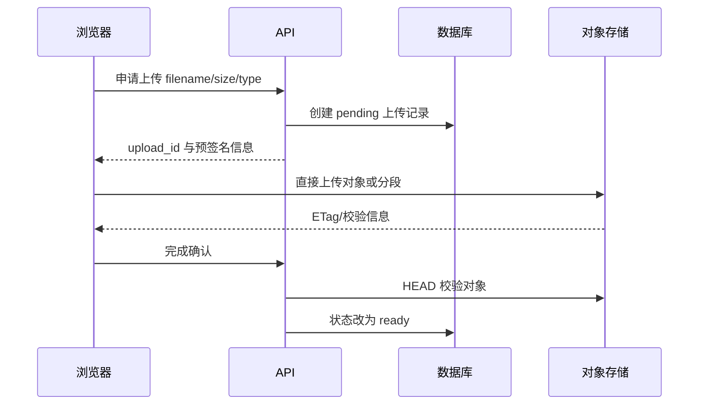
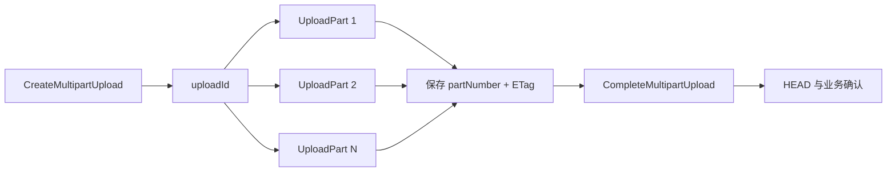

# MinIO、对象存储、Multipart 与生命周期

用户上传一个 4 GiB 文件，API 进程把完整请求先写入内存，容器很快 OOM。改成直接上传对象存储后，又出现数据库记录已经创建、对象却没有完成，以及取消上传留下大量分段的问题。

本章用兼容 S3 API 的 MinIO 解释对象、Bucket、预签名 URL 和 Multipart。目标不是背命令，而是设计一条客户端不接触永久密钥、上传可以恢复、数据库与对象可以对账的链路。

## 对象存储与文件系统有什么区别

对象由 **Bucket + Key + 内容 + 元数据** 标识。Key 看起来可以包含 `/`，但通常只是一个字符串前缀，不代表传统目录 inode。对象更新常表现为覆盖整个对象，不能像本地文件那样随意原地修改中间字节。



数据库记录业务所有者、状态和版本；对象存储保存大字节。两者没有天然分布式事务，因此要设计 pending 状态、幂等完成和孤立对象清理。

## 第一步：规划 Bucket 与对象 Key

不要直接用用户文件名作为 Key。文件名可能重复，包含特殊字符和隐私信息。可使用不可猜的稳定 ID 与版本：

```text
documents/{tenant_id}/{document_id}/source/{version_id}
documents/{tenant_id}/{document_id}/derived/{artifact_id}
models/{model_id}/{revision}/manifest.json
```

公开文章使用的是抽象命名。实际 Key 仍要考虑租户隔离、删除范围、列表效率和生命周期规则。

Bucket 拆分依据通常是权限、生命周期、复制、加密和运维边界，不是每个用户一个 Bucket。原文件、临时上传和模型制品可有不同保留策略。

对象元数据中可以保存内容类型、创建者类型和校验算法，但关键业务字段仍以数据库为事实源。用户提供的 `Content-Type` 不可信，服务端应做类型与内容验证。

## 第二步：用最小权限连接 MinIO

本地隔离环境可以启动 MinIO 并创建专用 Bucket。永久访问密钥只保存在服务端 Secret 管理中，浏览器不接触。

使用 MinIO Client `mc` 检查服务：

```bash
mc alias set course http://minio:9000 "$MINIO_ACCESS_KEY" "$MINIO_SECRET_KEY"
mc mb --ignore-existing course/documents
mc anonymous get course/documents
```

命令假设终端在能解析 `minio` 服务名的容器网络，凭证来自当前进程环境。不要把真实值写进脚本、文章或 shell 历史。`mc anonymous get` 用于查看匿名策略，不应因为开发方便就把私有文档 Bucket 公开。

服务账号策略只允许必要 Bucket、前缀和动作。上传服务不需要管理用户、删除所有 Bucket 或修改全局配置。

## 第三步：预签名 URL 怎样工作

API 使用服务端凭证生成有过期时间、限定方法、Key 和签名参数的 URL，浏览器用它直接向对象存储发送 PUT。URL 本身在有效期内相当于临时凭证，不能记录在普通日志或发送给其他用户。

申请上传时，API 应校验：用户是否有当前租户权限、文件大小上限、允许类型、对象 Key 是否由服务端生成、是否超过配额。预签名只解决临时授权，不替代这些业务规则。

浏览器上传完成后，不能只相信客户端说“成功”。API 对目标对象做 HEAD，检查大小、版本/ETag 和服务端记录的校验信息，再把 pending 改为 ready。

对象存储的 ETag 不总等同于文件 MD5，特别是 Multipart 和加密场景。若需要端到端完整性，使用明确支持的 Checksum 算法，并在上传协议中记录算法和值。

## 第四步：大文件使用 Multipart

Multipart 流程：创建上传获得 `uploadId`，并发上传带 `partNumber` 的分段，保存每段 ETag，最后按序提交完成。完成操作成功后，对象才作为完整对象可见。



客户端持久化 `uploadId`、Key、分段大小和已完成分段，刷新页面后可列出已上传分段再续传。服务端要防止用户拿自己的预签名能力写入别人的 Key。

分段并发受客户端内存、网络和对象存储连接限制。先选择稳定分段大小和有限并发，再实测；“分段越多越快”会增加请求和合并开销。

完成请求必须幂等处理。客户端因网络断开没收到成功响应时，重试前先 HEAD 或查询上传状态，不能盲目重新创建一份对象。

## 第五步：处理中间态和孤立对象

跨数据库与对象存储的典型状态：

| 数据库状态 | 对象状态 | 解释 | 修复 |
| --- | --- | --- | --- |
| pending | 无对象 | 尚未上传或已过期 | 允许续传或过期取消 |
| pending | 完整对象 | 上传完成但确认失败 | 对账后幂等标记 ready |
| ready | 完整对象 | 正常 | 提供受控读取 |
| ready | 无对象 | 数据不一致 | 告警、恢复对象或标记不可用 |
| 无记录 | 有对象 | 孤立对象 | 过宽限期后清理 |

清理任务不要看到“数据库没记录”就立即删。上传确认可能正在事务中，列表也可能受并发影响。设置宽限期，二次确认对象 Key 与业务状态，删除记录可审计且支持重跑。

未完成 Multipart 会占存储。配置生命周期规则在约定天数后 Abort incomplete multipart uploads，同时保留应用取消接口主动 Abort。生命周期是兜底，不是实时清理。

## 第六步：下载也要考虑权限与范围

公开文件可以走 CDN，私有文件通常由 API 鉴权后生成短期 GET 预签名 URL，或由受控代理流式返回。URL 有效期要与使用场景匹配，并避免被 Referer、日志和聊天工具泄露。

HTTP Range 允许客户端请求部分字节，适合视频和大文件续传。对象存储通常支持 Range，但下载代理若把完整对象先读入内存，就失去了流式优势。

文件名放在 `Content-Disposition` 时要做安全编码，避免 Header 注入。浏览器内预览不可信 HTML/SVG 等内容还要设置内容类型、下载策略和隔离域名，避免同源脚本风险。

## 第七步：版本、生命周期与删除

开启对象版本控制后，覆盖和删除可能产生新版本或 delete marker，存储空间仍会增长。生命周期需要分别处理当前版本、非当前版本和 delete marker。

模型制品与原始知识文件通常需要更严格的版本和校验；临时分段与派生缩略图可以更短保留。删除业务对象时先判断审计、合规和恢复窗口，再异步删除大对象，不能让长时间对象删除占据数据库事务。

对象存储复制提高可用性，但不替代独立备份。误删与错误生命周期也可能复制。恢复演练要验证 Bucket 策略、对象版本、加密密钥和数据库引用一起恢复。

## 第八步：观测什么

- 请求数、状态、延迟与上传/下载字节。
- 未完成 Multipart 数量、年龄和占用。
- pending 上传数量与最老年龄。
- 数据库 ready 但对象缺失、无记录孤立对象数量。
- 容量、增长速率、生命周期删除和复制延迟。
- 预签名生成与拒绝审计，但不记录完整签名 URL。

错误要区分 403 权限、404 对象不存在、409/412 条件冲突、5xx 依赖故障和客户端取消。不要对所有上传错误无限重试；完成与删除等操作需要幂等和条件请求。

## 完成一次本地实践

1. 在专用 MinIO 创建私有 Bucket 和最小权限账号。
2. 服务端生成一个短期 PUT 预签名 URL，上传小文件。
3. HEAD 验证大小和校验信息，再把模拟记录改为 ready。
4. 使用 Multipart 上传较大测试文件，中途暂停并恢复。
5. 主动 Abort 一个未完成上传，确认分段被释放。
6. 创建一条 pending + 完整对象的情况，让对账任务修复。
7. 删除本次对象、Bucket 和专用凭证，不清理其他数据。

输出时序图与对账表，标注每一步的输入、持久状态和可重试边界。若读者仍无法回答“数据库成功、对象失败怎么办”，这条上传链还没有讲清楚。
