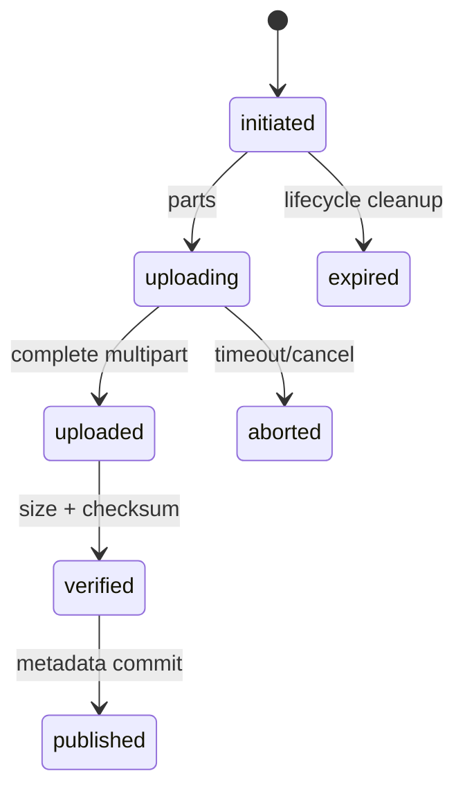

# 对象存储：模型、文档、Multipart 与生命周期

模型文件上传到对象存储后，数据库已经写了“ready”，客户端下载却拿到不完整的权重。对象存储把大文件的字节、版本和生命周期独立出来，数据库只保存可对账的元数据。上传完成、校验通过、发布可见必须是不同状态。

## 对象和元数据谁是真相

| 对象存储保存 | 数据库保存 |
| --- | --- |
| 模型权重、Tokenizer、原始文档、分片文件 | object_key、size、checksum、content_type |
| 不可变版本和 Multipart 分片 | owner、tenant_id、release_id、状态 |
| 生命周期删除标记 | 业务引用、审计和恢复记录 |

数据库里的 ready 只有在对象长度和校验值核对后才成立。对象 key 不应直接暴露租户或用户输入，访问权限通过服务端签发短期预签名 URL 或代理流式读取。

## Multipart 上传的状态机



分段上传让大模型文件可以并行传输和断点续传，但“所有分片已传”不等于对象可读。完成合并后要校验大小、哈希、模型配置和许可证，再把数据库状态切到 verified。

## MinIO/S3 语义中容易混淆的地方

ETag 在不同上传方式和服务实现下不一定等于整个文件的 MD5。需要端到端校验时，显式保存 SHA-256 或服务支持的 checksum。对象版本、删除标记和生命周期规则也会影响恢复，不能只看控制台里是否还能看到一个 key。

```bash
mc stat local/models/qwen/revision-1/model.safetensors
mc cp --attr 'Content-Type=application/octet-stream' model.safetensors local/models/qwen/revision-1/
```

命令是解释性示例，地址、凭证和校验参数需按实际 MinIO 版本配置。不要把访问密钥写进镜像或终端历史。

## 恢复时如何对账

先从数据库找出仍被发布版本引用的 object_key，再检查对象是否存在、大小和 checksum 是否一致。缺对象时应阻止模型或知识版本发布，而不是静默下载最新文件。清理任务只删除没有业务引用且超过保留期的版本，并保留审计记录。下一阶段把这些制品交给模型 Serving，开始观察一次推理请求。

## 预签名 URL 是能力票据

预签名 URL 把一段时间内、对特定对象和方法的访问能力交给客户端。它应只允许所需的 GET 或 PUT，设置短过期，key 由服务端生成，并限制 content-length、content-type 或 checksum 条件。把通配 bucket 权限直接交给前端会让租户隔离失去控制。

上传回调也不能盲信客户端说“完成”。服务端需要检查对象存在、大小、哈希和元数据，再创建或推进业务记录。对象最终可见、数据库发布、搜索索引可用之间的间隙，要用状态机而不是 sleep 来处理。

## 生命周期规则也会制造数据故障

对象生命周期若只按创建时间删除，仍被某个知识 release、回滚版本或异步任务引用的文件可能突然消失。清理前应先通过数据库引用关系判定可删，再让生命周期规则处理明确的临时上传、失败 multipart 和过期缓存。

对象存储的复制和版本功能能降低误删风险，但不是业务一致性事务。删除标记、恢复窗口和跨区域复制延迟都要进入 Runbook。真正关键的模型制品还应在发布时验证摘要，而不是假设同一个 key 永远对应同一内容。
