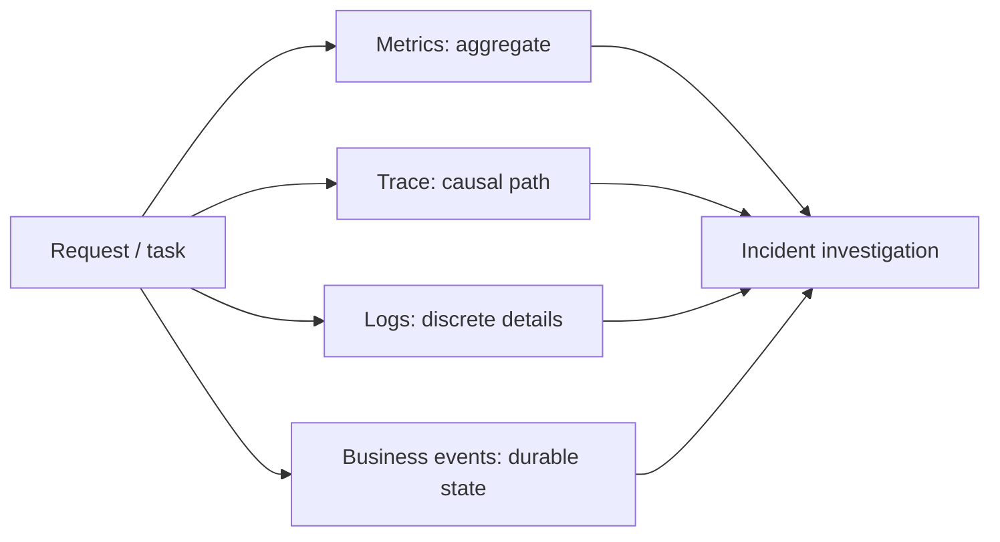

# 日志、指标与链路追踪

可观测性不是“安装日志、Prometheus 和 Trace 三套工具”，而是从系统外部信号推断内部状态，并回答可行动问题：用户是否受影响、影响多少、慢在哪一段、哪次版本引入、状态是否能恢复。信号多不等于答案好；缺少统一语义会让日志、指标和 Trace 互相矛盾。

## 先定义用户视角的 SLI

技术指标从用户承诺推导。API 的 SLI 可能是成功率和延迟；异步任务还需要在业务期限内进入正确终态；RAG/Agent 系统需要引用正确、无越权和知识新鲜度。

| 系统 | SLI | Good event 定义 |
| --- | --- | --- |
| HTTP API | availability | 合法请求在期限内得到非服务端失败结果 |
| 交互页面 | latency | 关键用户流程在目标时间完成 |
| 异步任务 | terminal correctness | 在 deadline 前到达唯一正确终态 |
| 数据管线 | freshness | 当前发布版本落后来源不超过窗口 |
| 检索/Agent | safety/quality | 无越权、引用可验证、关键评测通过 |

SLO 给出窗口内目标，错误预算连接可靠性和发布速度。不能把所有 4xx 当系统失败：参数无效与权限拒绝通常不是 availability bad event，但异常飙升仍可能表示产品/攻击问题。也不能只看 HTTP 200：业务响应 `state=failed` 或空结果错误仍是坏事件。

## 三种信号和业务事件分工



- Metrics：低成本聚合趋势、SLO、容量和告警；
- Trace：一次请求/任务跨组件的因果路径与耗时；
- Logs：离散状态、错误 cause、审计摘要和诊断上下文；
- 业务事件：持久状态、SSE 重放和恢复，不受采样影响。

Trace 可丢、日志可限流，业务终态不能只存在于遥测系统。三类遥测通过 traceId/requestId/taskId/eventId 关联，但这些关联 ID 不是权限或幂等的替代。

## 统一语义和结构化日志

日志使用稳定事件名和字段 Schema：时间、级别、服务、版本、环境、操作、结果、错误码与关联 ID。Message 给人读，字段给机器聚合。

```json
{
  "timestamp": "2026-08-04T10:00:00Z",
  "level": "error",
  "service": "example-worker",
  "serviceVersion": "artifact-digest-prefix",
  "event": "task.attempt.failed",
  "taskId": "opaque-id",
  "attempt": 3,
  "errorCode": "DEPENDENCY_UNAVAILABLE",
  "retryable": true,
  "traceId": "trace-id",
  "durationMs": 842
}
```

同一个错误只在拥有处理上下文的边界记录一次，底层通过 `%w`/cause chain 返回；层层打印会形成重复噪声。成功高频路径用指标/采样日志，状态转换、权限拒绝、重试耗尽和数据一致性异常可靠记录。

敏感字段默认拒绝：Authorization、Cookie、Token、密码、完整查询正文、文档内容、模型上下文、内部下载 URL、本地路径和数据库参数。需要主体关联时用权限受控的内部 ID 或不可逆桶化摘要，并定义保留期。脱敏要在日志调用前完成，不能依赖后端展示时遮盖。

## 指标基数是硬约束

Prometheus Label 组合会创建时间序列。userId、tenantId、documentId、原始 URL、异常 message 作为 Label 会爆炸。Label 使用有限枚举：route template、method、status class、operation、error_code、queue、version。

```text
http_server_requests_total{route="/tasks/{taskId}",method="GET",status_class="2xx"}
task_terminal_total{task_type="document_projection",state="failed",error_code="TIMEOUT"}
```

单对象诊断放日志/Trace。Histogram bucket 根据 SLO 设计；不合理 bucket 只能得到“都小于 10 秒”。平均值掩盖长尾，查看 P50/P95/P99 与请求量。Client-side quantile summary 难跨实例聚合，服务端 Histogram/Native Histogram 要按后端能力选择。

## RED、USE 与任务指标

在线服务用 RED：Rate、Errors、Duration。资源用 USE：Utilization、Saturation、Errors。异步系统还需要：队列等待、最老任务年龄、处理吞吐、重试放大、租约过期与终态分布。

队列长度为 10 可能都是刚到任务，也可能有一个卡了两天；`oldest_age_seconds` 更直接表达用户影响。Agent/文档流程按阶段记录耗时、外部模型 token/成本、检索候选和引用验证，但高基数详情进入 Trace/业务记录。

连接池关注 in-use、idle、checkout wait、timeout；CPU 除使用率还看 throttling；内存看 working set、OOM 与 GC；磁盘看水位、inode、I/O latency。只看容器 CPU 无法解释数据库锁或外部 API 限流。

## Trace：边界和状态要有意义

Span 围绕服务入口、数据库/缓存、外部 HTTP、Broker produce/consume 和关键应用阶段，不给每个小函数建 Span。名称使用低基数 route/operation，不带 ID。

```ts
await tracer.startActiveSpan('projection.build', async (span) => {
  span.setAttributes({
    'app.task.type': 'document_projection',
    'app.release.version': releaseVersion,
    'app.source.count': sourceCount
  })
  try {
    await buildProjection()
  } catch (error) {
    span.recordException(sanitizeError(error))
    span.setStatus({ code: SpanStatusCode.ERROR, message: publicErrorCode(error) })
    throw error
  } finally {
    span.end()
  }
})
```

异步消息注入 trace context，消费者提取后建立 Consumer Span；长时间排队可用 producer context parent/link并记录 queue delay。业务 taskId 仍作为受控属性/日志关联，不用每个 token delta 建 Span。

Span status 根据操作结果设置，HTTP 404 是否 Error 取决于语义；依赖 timeout、业务冲突和安全拒绝要可区分。不要把完整 SQL bind、Redis key、Prompt 或响应正文加入 Attributes/Event。

## 采样策略与错误证据

全量 Trace 成本高。Head sampling 在入口决定，简单但可能漏掉后续错误；Tail sampling 在 Collector 观察完整 Trace 后按错误、延迟和属性保留，代价是缓冲和复杂度。

常见组合：基础概率采样 + 错误/高延迟 Tail 保留 + 特定候选/调试窗口提高比例。采样决策跨服务传播，避免每层独立采样产生断裂。安全审计和业务状态不依赖 Trace 采样。

采样率本身记录配置版本。排障临时提高采样有期限和成本/隐私评估，不能无限开启生产全量 payload。

## 告警从用户影响出发

告警满足：有明确影响、负责人、Runbook、行动。错误预算 burn rate 同时使用短/长窗口，兼顾快速事故和慢性退化。单个 500、CPU 瞬时 90% 不直接叫醒值班。

```text
fast burn: 1h window consumes budget at 14.4x
slow burn: 6h window consumes budget at 6x
```

具体倍率/窗口按 SLO 和值班能力选择。告警内容包含服务、环境、版本、影响 SLI、开始时间、相关 Dashboard/Runbook 和最近发布。自动化可以暂停金丝雀扩大，但数据库恢复/删除等高风险动作需要额外控制。

告警质量有指标：触发次数、可行动率、误报、确认/恢复时间、长期静默。没有触发过的关键告警通过故障演练验证，而不是假设表达式正确。

## Dashboard 按调查路径组织

第一层展示 SLO/用户影响与版本标记；第二层按 route/operation/queue 分解；第三层展示数据库、缓存、外部模型、Broker 和资源。不要创建几十张只显示“绿色当前值”的仪表盘。

发布标记必须包含 Artifact/配置版本。错误上升时先对照发布、依赖和流量变化。每个面板说明单位、聚合窗口、数据缺失含义；“没有数据”不能自动显示为 0 成功。

## 观测系统自身会失败

SDK 使用批量、有限队列、超时和丢弃策略；Collector/Exporter 不可用不能无限阻塞业务线程。暴露 dropped spans/logs、export failures、queue utilization 和采样统计。日志文件轮转并监控磁盘，不能由 debug 日志打满宿主机。

Collector 配置也作为代码测试、版本化和候选发布。错误 processor 顺序可能在脱敏前导出数据；多租户观测后端有访问控制和保留策略。时钟同步影响跨服务顺序，业务事件使用数据库序列/版本，不只依赖 wall clock。

## 数据保留和成本治理

Metrics、Logs、Trace 的价值与成本不同。高分辨率指标短期、降采样长期；错误日志比成功 debug 保留更久但仍有限；Trace 按采样和事故保留。合规删除要求知道哪些信号含个人数据。

建立每服务遥测预算：日志字节/请求、Span/Trace、指标 series 数、Exporter 带宽。Schema review 阻止高基数字段进入。成本异常也是告警，但不能自动关闭关键安全信号。

## 一个可复现的排障路径

当“任务一直在运行”时：

1. SLI/指标确认影响范围、任务类型和版本；
2. 查业务任务状态、租约和最后事件，判断是真卡住还是推送断线；
3. 用 taskId 找日志/Trace，分解 queue delay、数据库、外部依赖和 Worker；
4. 检查连接池、Broker、模型限流和最近发布；
5. 用受控探针复现相同类别，不读取越权数据；
6. 采取恢复：租约重放、依赖降级或回滚；
7. 将根因样本匿名化加入回归与告警验证。

“看到 SSE 断开”不能直接判任务失败；持久业务状态是事实，传输信号只帮助定位展示链路。

## 验证：遥测也做契约测试

| 场景 | 断言 |
| --- | --- |
| 正常请求 | route template、版本、耗时指标存在 |
| 数据库 timeout | error code、Span status、pool 指标可区分 |
| 异步重投 | producer/consumer 关联且 attempt 独立 |
| Trace 未采样 | 业务终态和关键日志仍在 |
| Exporter 不可用 | 主业务满足延迟/可用性，drop 指标增加 |
| 敏感输入 | 日志/Span/Label 均不含原文和凭证 |
| 高基数字段尝试 | Schema/CI 门禁阻止 |
| 发布回归 | Dashboard 版本标记和 burn alert 生效 |

```ts
it('does not export credentials or document content', async () => {
  await handler(requestWithSensitiveFixture())
  const exported = telemetryExporter.serializedItems()
  expect(exported).not.toContain('example-secret-value')
  expect(exported).not.toContain('private document fixture')
  expect(exported).toContain('AUTHENTICATION_FAILED')
})
```

在隔离环境故障注入慢数据库、429、Broker 断开、Worker kill 和 Collector 不可用。检查告警真正触发、Runbook 链接可用、恢复后自动关闭。测试生成遥测存临时环境并按保留策略清理。

## 常见误区

- 工具安装完成就认为系统可观测。
- 所有 4xx 计为 availability 错误，或业务失败因 HTTP 200 被忽略。
- userId/documentId/原始 URL 成为指标 Label。
- 每层重复记录同一个异常，日志噪声淹没状态变化。
- Trace 保存完整 SQL 参数、Prompt、Cookie 和响应正文。
- 业务终态只存在于可采样 Trace/SSE。
- 告警基于单个异常或瞬时 CPU，没有用户影响和 Runbook。
- Dashboard 不标版本，无法关联发布。
- Collector 故障时 SDK 无限重试并阻塞主业务。
- 从未演练告警和遥测脱敏，只在事故时第一次使用。

## 参考资料

- [OpenTelemetry Observability Primer](https://opentelemetry.io/docs/concepts/observability-primer/)：日志、指标、Trace 和资源信号的职责。
- [OpenTelemetry Specification](https://opentelemetry.io/docs/specs/otel/)：SDK、数据模型、传播、采样和 Collector 的标准入口。
- [Prometheus Metric and Label Naming](https://prometheus.io/docs/practices/naming/)：指标命名、单位和 Label 设计。
- [Google SRE: Service Level Objectives](https://sre.google/sre-book/service-level-objectives/)：SLI、SLO 与用户影响导向。
- [OWASP Logging Cheat Sheet](https://cheatsheetseries.owasp.org/cheatsheets/Logging_Cheat_Sheet.html)：日志字段、注入、敏感数据和访问控制。
