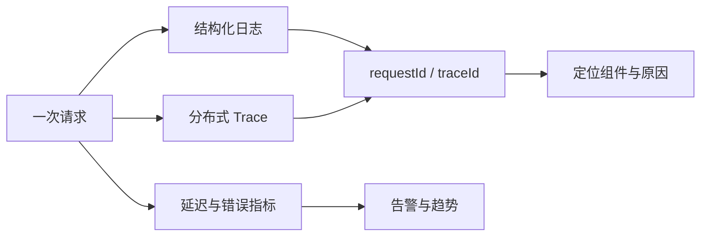

# 日志、指标与链路追踪

用户说“页面偶尔很慢”。只看一条 Nginx 日志，可能知道请求用了三秒，却不知道时间花在连接池、SQL、外部模型还是浏览器传输。可观测性就是让系统从外部信号推断内部状态。

本篇用一次慢请求串起日志、指标和 Trace。三种信号分工不同：日志解释离散事件，指标显示整体趋势，Trace 还原单次调用路径。

## 三种信号怎样配合

业务任务状态和审计事件属于可靠业务事实，不应只存在于可能采样的 Trace 中。遥测用于诊断，它的后端故障也不应阻塞主业务。

## 步骤一：先定义一次请求的关联标识

网关生成或验证 requestId，OpenTelemetry 使用 W3C Trace Context 传播 traceId。进入异步队列时，把受控追踪上下文放在消息头，消费者创建新的 Span 或 Link。taskId 与 eventId 继续关联业务状态。

结构化日志记录时间、服务、版本、操作、公共错误码、requestId 和 traceId。身份只记录受控摘要；Token、Cookie、请求正文、SQL 参数和模型完整输入不进入普通日志。

## 步骤二：用指标发现范围

RED 方法观察请求 Rate、Errors、Duration；资源层再看 CPU、内存、连接池等待、队列年龄和磁盘。直方图用于延迟分布，计数器用于累计事件，Gauge 用于当前状态。Prometheus 标签只放有限枚举，避免 userId、URL 原始参数等高基数字段。

告警对应用户影响与可行动原因。例如错误预算快速燃烧、在线队列最老任务超过目标、磁盘接近水位。单次 CPU 抖动或没有动作说明的图表不适合直接呼叫值班人员。

## 步骤三：用 Trace 分解一次慢请求

HTTP Span 下可以看到鉴权、连接池 checkout、SQL、Redis、外部 HTTP 与序列化子 Span。自动 Instrumentation 要审查是否重复建 Span、记录敏感参数或遗漏连接等待。Span 属性使用操作名、结果和稳定错误码，不保存正文。

当 P95 上升时，先从指标确定影响范围和开始时间，再抽取同版本慢 Trace，最后查看关联日志中的具体 cause。不要从单条 Trace 推断全站，也不要从全站平均值猜单请求路径。

## 步骤四：考虑采样与遥测故障

Head sampling 在请求开始决定，可能漏掉后来变慢的调用；Tail sampling 可以按错误或延迟保留，却需要 Collector 缓冲。策略应包含基础样本和错误/高延迟优先保留，并设导出队列与重试上限。

安全审计与计费事件走独立可靠通道，不因 Trace 未采样而消失。遥测后端不可用时，主服务继续运行并丢弃或有界缓冲诊断数据，同时产生可观察的 exporter 错误指标。

## 正常结果和失败结果

| 观察 | 能得到的结论 |
| --- | --- |
| P95 上升且连接池等待增加 | 容量或长事务值得排查 |
| SQL Span 慢且扫描行数增加 | 查询计划或数据分布变化 |
| Redis miss 上升 | 回源放大，继续查失效与 TTL |
| Trace 没采样 | 业务事件和错误日志仍可用 |
| Collector 故障 | 主请求不被无限阻塞 |
| 日志出现敏感测试值 | 隐私门禁失败，停止发布 |

验证包括故障注入：慢数据库、Redis 超时、队列积压、外部服务 503 和 Collector 不可用。检查 Dashboard 能区分版本、操作和错误原因，同时确认日志与 Span 中没有凭证和正文。

## 下一步

信号已经能说明候选版本是否健康。下一篇将旧版保持在线，启动候选并收集这些证据，验证通过后才切换 Nginx upstream。

## 用一次慢请求完成定位

准备一个会依次经过 Nginx、API、数据库和外部服务的隔离请求。入口生成 request ID 和 trace ID，日志记录结构化阶段与错误码，指标记录请求量、错误率和延迟分布，Trace 记录每个依赖 Span。

| 观察信号 | 回答的问题 |
| --- | --- |
| 指标 | 问题多大、从何时开始、影响哪些路由或版本 |
| Trace | 这一次请求的时间花在哪个节点 |
| 日志 | 节点为何失败、使用了哪个受控错误码 |
| 发布记录 | 异常是否与版本、配置或迁移同时发生 |

先从指标发现 `/reports` 的 P95 增长，再在相同时间窗口抽取慢 Trace。若数据库 Span 占大部分时间，继续看查询类型、连接池和锁，而不是先扩容 Web 实例；若 Trace 没有进入应用，检查代理和网络。日志中通过 trace ID关联，不记录认证头和完整业务正文。

把过程写成 Runbook：告警含影响、入口、第一张看板、查询条件、可能处置和恢复标准。再关闭遥测导出端点，确认应用主要请求仍能服务，同时独立指标报告遥测积压。可观测性是帮助理解系统的旁路能力，不能因采集器故障拖垮业务。

## 参考资料

- [OpenTelemetry](https://opentelemetry.io/docs/)
- [W3C Trace Context](https://www.w3.org/TR/trace-context/)
- [Prometheus metric types](https://prometheus.io/docs/concepts/metric_types/)
- [Google SRE: Monitoring Distributed Systems](https://sre.google/sre-book/monitoring-distributed-systems/)
