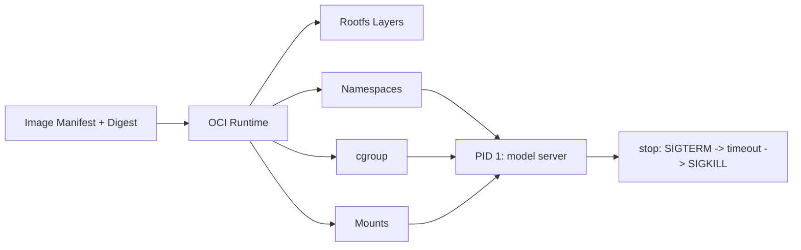

# OCI 镜像、容器隔离、cgroup 与进程生命周期

容器里的模型进程显示 Running，宿主机却访问不到端口；换成 root 后日志突然能写了，但停止容器时请求被直接截断。OCI 容器不是一层“打包”，而是 Runtime 用镜像、rootfs、Namespace、cgroup 和进程信号共同构造的一次受限运行。

## 从镜像 Digest 到容器进程



镜像是不可变内容的描述，容器是这些内容加上运行时配置的实例。Runtime 根据 OCI bundle 建立 rootfs、进程和隔离边界。镜像 Digest 能证明内容身份，却不能证明端口、用户、挂载和资源限制一定正确。

## 同一个进程怎样被 Namespace 重新看见

| Namespace | 进程看到的世界 | 故障表现 |
| --- | --- | --- |
| PID | 容器内的 1 号进程与有限进程树 | 宿主机 PID 与容器 PID 对不上 |
| Network | 独立网卡、路由、端口空间 | 容器内 curl 成功，宿主机端口未发布 |
| Mount | 独立根目录和挂载点 | 文件在宿主机存在，容器路径看不到 |
| User | 用户与能力集合 | 能读不能写，或特权端口绑定失败 |

端口发布不是“容器自动拥有宿主机端口”，而是运行时在宿主机网络和容器网络之间建立转发。挂载也不是复制文件，bind mount 的只读标志、路径所有权和安全策略会同时影响进程。

## cgroup 限制的是资源，不是应用意图

CPU quota 限制可用时间片，memory.max 限制可使用的内存，pids.max 限制进程数量。模型加载时的峰值、分词线程、日志缓冲和共享内存都可能计入限制。看到应用报“无法分配内存”时，要把容器 cgroup、宿主机压力和模型自身显存分开看。

```bash
docker inspect <container> --format '{{json .State}}'
docker top <container>
docker exec <container> sh -c 'cat /proc/1/status; cat /proc/1/cgroup'
docker stats --no-stream <container>
```

这些命令用于确认状态、进程、cgroup 和资源快照。它们不能替代持续观测，尤其不能把一次 stats 读数当成容量结论。

## PID 1 决定停止是否可靠

容器停止时，Runtime 通常先向 PID 1 发送 SIGTERM。若 PID 1 是 shell，信号可能没有转发给真正的服务；若应用没有停止钩子，连接会在超时后被强制结束。正确的做法是让业务进程成为可接收信号的 PID 1，或明确使用能转发和回收子进程的 init。

::: warning
**容易误判**

把容器内的 localhost 当成宿主机 localhost、把 root 当成权限修复、把镜像层当成持久化卷，都会让故障在重启或迁移后再次出现。下一篇将这些运行实例放进 Compose 网络，观察多个服务怎样共同启动和恢复。
:::

## 容器权限为什么经常在挂载点暴露

镜像里用 USER 10001 运行应用，并不自动让挂载进来的宿主机目录归 10001 所有。容器内看到的 UID/GID 与宿主机文件元数据、user namespace 映射和 SELinux/AppArmor 策略共同决定访问结果。开发环境里 chmod 777 能暂时掩盖问题，生产里则会放大写入和泄露范围。

更稳妥的做法是为数据目录分配明确的运行组与最小权限，挂载只读配置，单独挂载可写日志或临时目录，并在镜像构建和运行配置中记录 UID/GID。这样重建容器、换节点或升级 Runtime 后，权限边界仍可复现。

## 镜像层和运行写层为什么要分开

镜像层在构建后应该保持不可变，它适合程序、受控依赖和默认配置。模型下载缓存、上传文件、数据库数据和运行日志若写进容器可写层，会随着重建、迁移或清理消失，也难以被独立备份和审计。

把持久数据移到命名卷或外部存储后，还要定义备份与升级方式。卷能跨容器存在，不代表它自动兼容新版程序。Schema、文件格式和所有权仍要有迁移和回退策略。
