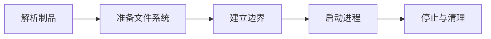

# OCI 镜像、容器隔离、cgroup 与进程生命周期

模型容器显示 Running，宿主机却访问不到 8000 端口；进入容器能看到进程，挂载目录又报 Permission denied。把这些现象分成“网络问题”“权限问题”“Docker 问题”会错过共同根因：同一个进程正同时处在独立的 network namespace、受 cgroup 限制，并通过挂载看到来自宿主机的文件所有权。容器只是把这些约束组合起来。


## 镜像、容器和进程分别是什么

| 概念 | 在这条链路中的含义 |
| --- | --- |
| OCI Image | 按 OCI Image Specification 组织的不可变层、配置和 manifest。Digest 是内容摘要；tag 只是可移动名称，不能替代可追溯版本。 |
| OCI Runtime | 根据 bundle 中的 `config.json` 创建 namespace、cgroup、挂载并启动容器进程的实现，例如 runc。它不等于镜像仓库或编排平台。 |
| rootfs | 镜像层解包并叠加后提供给进程的根文件系统视图。它改变进程看到的路径，不会自动改变宿主机文件的 UID/GID。 |
| namespace | 隔离进程看到的 PID、网络、挂载、主机名等资源视图；隔离可见性，不负责设置 CPU 和内存配额。 |
| cgroup | 把进程归组并统计、限制 CPU、内存、I/O 等资源；它限制资源，不提供完整文件系统隔离。 |

## 排障时最容易走错的岔路

| 表面现象 | 实际可能发生的事 | 下一步证据 |
| --- | --- | --- |
| 容器 Running | 只代表 PID 1 尚未退出，不代表模型加载完成或端口 ready | 检查应用就绪信号和监听状态 |
| 容器内能 curl | 可能只命中 loopback，不能证明宿主机发布和外部路由正常 | 分别测试容器地址、宿主机端口和外部入口 |
| chmod 777 后能写 | 权限边界被放大，但 UID/GID 与挂载设计仍然错误 | 固定运行身份并给目标目录最小写权限 |
| 容器突然退出 137 | 常见于 SIGKILL，包括 cgroup OOM 或强制停止，不能只看应用日志 | 检查 OOMKilled、memory.events 与 stop timeout |

::: warning 不要用重启代替诊断
恢复服务和解释故障是两个目标。紧急止损后仍要回到原始日志、指标与状态转换，避免同类问题重复出现。
:::

## 从镜像 Digest 到 PID 1 的运行链



### 解析制品：镜像客户端与 Registry

按 digest 拉取 manifest、config 与各层并校验内容。

这一动作的可观察结果是 `docker image inspect`、digest、架构与入口。处理动作应晚于取证，否则重启或重试可能覆盖最早的失败现场。

### 准备文件系统：Snapshotter

展开只读镜像层，添加容器可写层和显式挂载。

可以从这些位置确认结果：mount 信息、overlay 层、卷来源。若完全没有证据，先判断请求是否到达本阶段；若记录冲突，则对齐 request_id、实例和时间窗口。

### 建立边界：Runtime 与内核

创建 namespace、cgroup、capability 和安全策略。

这里不靠猜测，优先读取 `docker inspect`、`nsenter`、cgroup 文件。

### 启动进程：Runtime

在新边界中执行 Entrypoint，首进程成为容器 PID 1。

决定下一步前需要看到 `ps`、命令行、退出码、信号处理。

### 停止与清理：容器引擎

先发送停止信号，等待超时，再强制结束并回收临时状态。

这一动作的可观察结果是 终止日志、stop timeout、挂载与进程残留。处理动作应晚于取证，否则重启或重试可能覆盖最早的失败现场。

## 为什么容器里监听 127.0.0.1 会让端口映射失效

下面的命令读取容器配置与内部监听状态。`model-api` 是教学名称；`docker exec` 需要镜像内存在 `ss`，若没有应使用调试容器或读取 `/proc`，不能据此判断没有监听。

```bash
docker inspect model-api --format "pid={{.State.Pid}} image={{.Image}}"
docker port model-api
docker exec model-api ss -ltnp
docker inspect model-api --format "{{json .Mounts}}"
docker inspect model-api --format "memory={{.HostConfig.Memory}} cpus={{.HostConfig.NanoCpus}}"
docker stop --time 30 model-api
```

端口发布把宿主机连接转发到容器 network namespace 的目标地址。如果应用只绑定容器内的 `127.0.0.1:8000`，它只接受同一 namespace 的 loopback 连接；转发到容器网卡地址时会被拒绝。应让应用在明确风险下绑定 `0.0.0.0:8000`，再由发布规则决定外部可达范围。挂载权限则要把容器运行 UID、宿主机目录所有者、只读标记和 SELinux/AppArmor 一起核对。

## 同一个 PID 为什么在宿主机和容器里编号不同

PID namespace 改变进程看到的进程树。容器里的 PID 1 在宿主机仍有另一个真实 PID；它承担孤儿进程回收和信号语义。若 Entrypoint 是不会转发信号的 shell，容器引擎发送的 SIGTERM 可能停在 shell，业务子进程继续运行，最终被超时后的 SIGKILL 强制结束。使用 exec form Entrypoint 或最小 init 可以让信号与子进程回收路径明确。

## 网络 namespace 怎样与端口发布配合

容器拥有自己的接口、路由、loopback 和 socket 表。应用绑定 `127.0.0.1` 时只接受该 namespace 内 loopback 请求；发布宿主机端口通常把流量送往容器网卡地址，因此无法命中。应用绑定 `0.0.0.0` 解决的是容器内监听范围，宿主机是否公开仍由 publish、主机防火墙和外部代理决定。两者都要检查，不能用“容器内 curl 成功”替代。

## cgroup OOM 与主机内存还有一层边界

cgroup memory.max 限制该组可使用内存，memory.current 显示当前记账，memory.events 中的 oom/oom_kill 说明组内分配失败和进程被杀。主机仍有空闲内存时，容器也可能因为自己的上限 OOM；反过来没有显式 limit 的容器会参与整机压力。退出码 137 只说明进程收到 SIGKILL，必须结合 OOM 事件和停止操作判断来源。

## 挂载把宿主机元数据带入容器

bind mount 不会因为镜像里声明 `USER 10001` 就自动改属主。容器内 UID 10001 访问的是宿主机 inode 的权限元数据，还可能叠加 user namespace 映射、只读 mount 和 SELinux/AppArmor。镜像构建时 `chown` 的目录一旦被挂载覆盖，运行时看到的是挂载源，而不是被遮住的镜像目录。排查时必须从 Mounts、容器 UID/GID 和宿主机路径一起看。

停止容器时，先记录 PID 1 是否收到 TERM、应用是否停止准入、在途请求是否结束、卷写入是否完成；否则把 stop timeout 加长只会延迟强杀，并不会自动产生优雅退出。

## 最后回到适用范围

namespace 和 cgroup 共享宿主机内核，因此容器不是拥有独立内核的虚拟机。镜像不可变也不代表整个容器状态可恢复：写层会随重建丢失，模型缓存、数据库和上传文档必须放入明确的卷或对象存储，并有版本和备份策略。

单个容器的边界明确之后，现实中的 AI Backend 还需要数据库、Redis、Worker 和对象存储。下一篇用 Compose 观察多个容器怎样互相发现、等待就绪并保留数据。
