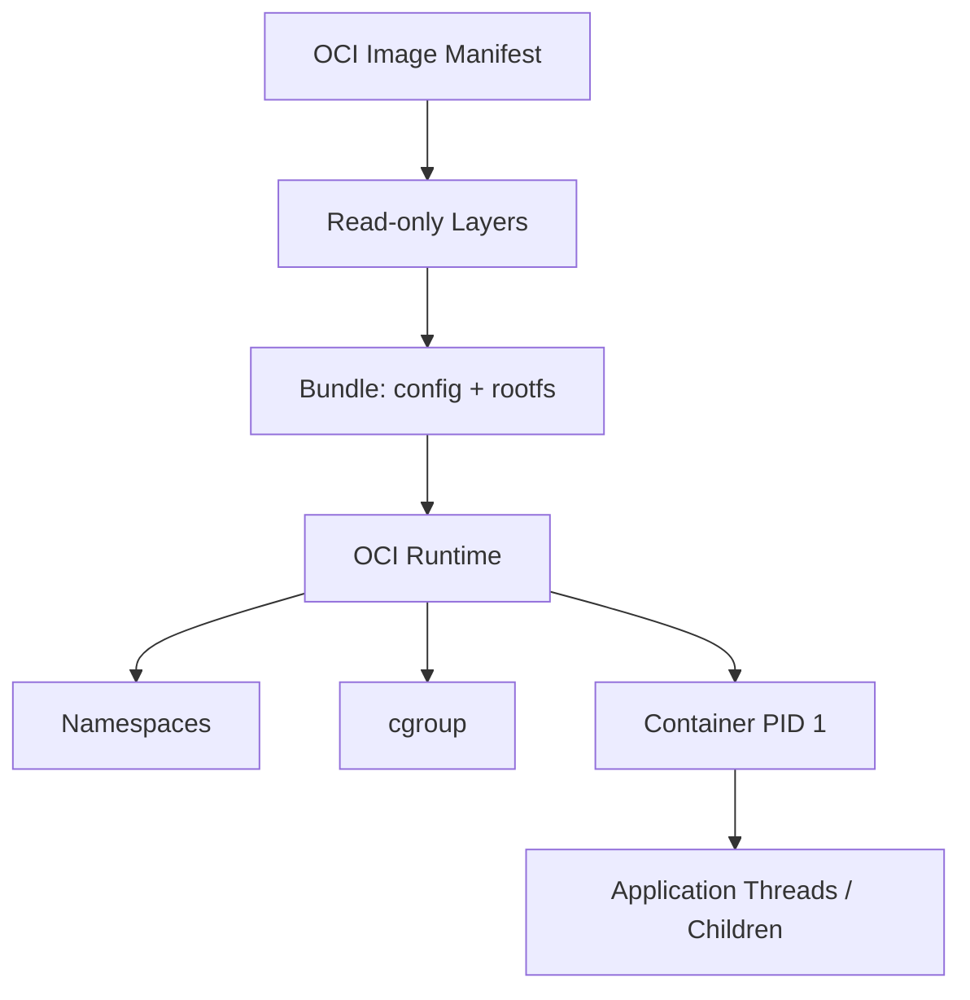

# OCI 镜像、容器隔离、cgroup 与进程生命周期

同一个模型镜像在开发机能启动，到另一台机器却提示架构不匹配；容器显示内存只有几 GB，宿主机明明还有空闲；停止容器时应用也没有执行清理。这三个现象分别落在镜像平台、cgroup 资源边界和 PID 1 信号处理，不能用“Docker 有问题”概括。

容器不是轻量虚拟机的同义词。它首先是宿主机上的进程，只是使用 Namespace 获得隔离视图，使用 cgroup 获得资源计量与限制，再叠加镜像文件系统和 Runtime 生命周期。

## 从镜像到容器进程

镜像清单描述平台、配置与 Layer；Layer 是内容寻址的只读文件变化；创建容器时，Runtime 准备 root filesystem、Namespace、cgroup 和进程参数，再启动容器的第一个进程。容器还会得到一层可写文件系统，但它通常随容器删除，不适合保存数据库、模型上传或持久任务状态。

## OCI 解决的是可交换契约

OCI Image Specification 定义镜像布局和配置，Runtime Specification 定义怎样从 Bundle 创建进程，Distribution Specification 定义 Registry 交互。Docker、containerd、CRI-O 与低层 Runtime 可以在这些契约上协作。

镜像标签只是可变名称，Digest 才指向具体内容。生产发布若只记录 `latest`，同一配置可能在不同时间拉到不同内容；应把镜像 Digest、模型 Revision 和配置版本共同写入发布记录。

多架构镜像使用 Manifest List 或 Image Index 为 `linux/amd64`、`linux/arm64` 等平台选择具体 Manifest。平台选错时，二进制可能直接无法执行。GPU 能力也不会因为镜像名称里包含 CUDA 自动出现，它仍依赖宿主机驱动、容器 Runtime 配置和设备注入。

## Namespace 隔离的是视图

PID Namespace 让容器看到自己的进程编号；Mount Namespace 提供独立挂载视图；Network Namespace 提供接口、路由和端口空间；User Namespace 可以映射容器与宿主用户。Namespace 不复制一套内核，容器进程仍共享宿主机内核。

因此，容器内看到的 `localhost` 指向自己的 Network Namespace，不是数据库容器。跨容器通信要通过同一网络中的服务名或明确地址。进程在容器内是 PID 1，在宿主机上会有另一个 PID，两种视图都可能用于排障。

## cgroup 管理资源预算

cgroup 记录和限制 CPU、内存、进程数与 I/O 等资源。内存限制不是预留量：宿主机有空闲内存，也不代表容器可以超过自己的上限。达到硬边界时，进程可能被 cgroup 范围内的 OOM 处理终止。

CPU quota 控制可使用的时间份额，cpuset 控制允许在哪些 CPU 上运行，两者语义不同。AI 服务还要区分主存与 GPU 显存；普通容器内存限制不会替代 GPU 显存管理，GPU 设备资源要由 NVIDIA Runtime 或 Kubernetes Device Plugin 暴露。

## PID 1 为什么特殊

容器停止时，Runtime 通常向 PID 1 发送 `SIGTERM`，等待宽限期，再发送 `SIGKILL`。如果入口是不会转发信号的 Shell，真正的模型服务收不到停止通知；如果 PID 1 不回收子进程，还会积累僵尸进程。

入口应使用 exec 形式让业务程序直接成为 PID 1，或使用能正确转发信号和回收子进程的 init。应用收到 `SIGTERM` 后停止接流量、取消或排空请求、刷新必要状态并退出。所有耗时步骤都要小于 Runtime 的停止宽限期。

## 挂载决定数据所有权

Bind Mount 把宿主路径直接暴露给容器，方便开发但耦合具体目录与权限。Named Volume 由容器平台管理，适合数据库等持久数据。对象存储和远程模型仓库则通过网络提供独立生命周期。

不要把持久化问题简化为“挂一个目录”。要写清数据所有者、写入用户、备份方式、升级兼容、并发访问和删除条件。模型缓存可以重建，业务数据库不能；两者应使用不同的恢复与清理策略。

## 判断容器设计是否成立

一份可审查的容器设计至少回答：镜像由哪个 Digest 标识，目标平台是什么，进程以哪个用户运行，CPU/内存/PID 上限是多少，哪些目录可写，哪些状态必须持久化，健康检查验证什么，收到停止信号后怎样结束。

容器带来的价值是可重复的运行边界，而不是让故障消失。只有把镜像、进程、Namespace、cgroup、挂载和信号逐层对应起来，后面的 Compose 与 Kubernetes 才不会变成配置背诵。
