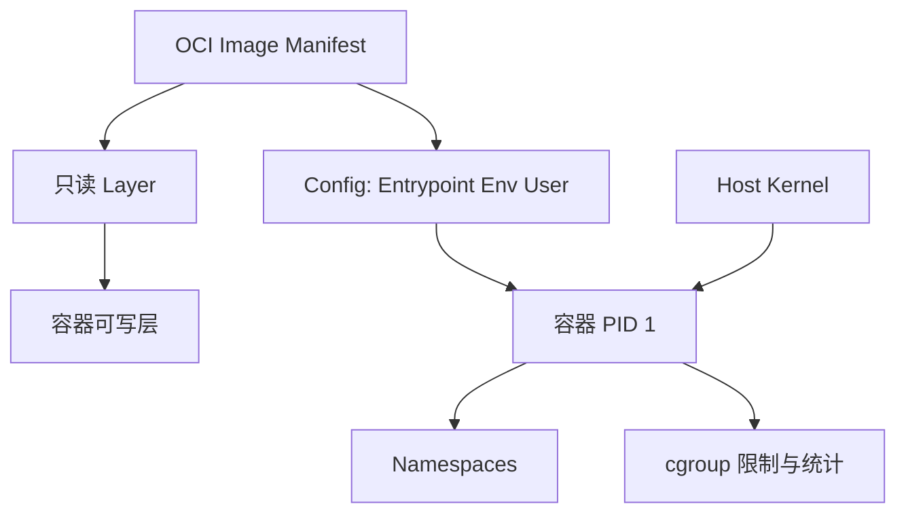

# OCI 镜像、容器、Namespace、cgroup 与信号

把 API 放进容器后，它在开发机运行正常，到了限制 512 MiB 内存的环境却被终止；执行 `docker stop` 时还要等满超时时间，最后被强制杀掉。问题不一定在 Docker，而可能是应用没有理解自己仍然是一个 Linux 进程。

本章会运行一个最小容器，检查镜像层、Namespace、cgroup、PID 1 和停止信号。完成后，你能解释“容器隔离了什么、没有隔离什么”，也能为下一章的多服务 Compose 打基础。

## 镜像和容器不是同一个东西

**镜像**是只读文件系统层、配置和元数据组成的制品。多个容器可以使用同一个镜像。

**容器**是镜像配置的一次运行：内核创建进程，为它设置 Namespace 和 cgroup，再叠加一个可写层。删除容器，可写层通常也被删除；挂载的 Volume 另有生命周期。



容器不包含独立内核。Linux 容器与宿主共享内核，所以内核漏洞、能力、设备和挂载配置仍是安全边界的一部分。

## 第一步：检查镜像究竟包含什么

选择一个固定版本的公开镜像，不用浮动 `latest`：

```bash
docker pull nginx:1.27-alpine
docker image inspect nginx:1.27-alpine
docker history --no-trunc nginx:1.27-alpine
```

`image inspect` 查看架构、入口、默认命令、环境、工作目录和层摘要；`history` 查看层的创建历史，但不应把它当成完整 SBOM。镜像内容审计还需要 SBOM 与漏洞扫描。

镜像层按内容摘要寻址。构建时每条会改变文件系统的指令可能形成新层，后续删除前一层中的 Secret 并不会让它从历史层消失。因此 Secret 不能通过 `COPY` 放进构建上下文后再删除，应使用构建时 Secret 挂载，并检查最终层。

镜像标签可以移动，Digest 才精确标识内容。生产提升同一个不可变制品时，记录 `repo@sha256:...`，不要在每台服务器重新构建“同名镜像”。

## 第二步：运行容器并检查 PID 1

```bash
docker run --name runtime-demo --rm -d \
  --read-only --tmpfs /var/cache/nginx --tmpfs /var/run \
  -p 8080:80 nginx:1.27-alpine

docker top runtime-demo -eo pid,ppid,user,stat,cmd
```

`--read-only` 把容器根文件系统设为只读，两个 `tmpfs` 为 Nginx 确实需要写入的临时目录提供内存文件系统；`-p` 把宿主 8080 映射到容器 80。示例结束后因为 `--rm` 会在停止时自动删除容器。

容器内的第一个进程是 PID 1。它负责接收停止信号，也需要回收已经退出的子进程。shell 形式入口如 `sh -c "my-server"` 可能让 shell 成为 PID 1，如果没有 `exec`，信号不一定按预期传到真正应用。

Dockerfile 优先使用 exec 形式：

```dockerfile
ENTRYPOINT ["/app/server"]
CMD ["serve", "--port", "8000"]
```

JSON 数组不会经过 shell 展开，应用直接成为 PID 1。确实需要启动脚本时，脚本最后使用 `exec "$@"` 替换 shell。会产生子进程且自身不负责回收的应用，可以使用 `--init` 加入小型 init。

## 第三步：Namespace 隔离“看见什么”

Namespace 为进程提供不同的系统视图。常见类型：

| Namespace | 隔离对象 | 容器中的表现 |
| --- | --- | --- |
| PID | 进程编号 | 容器有自己的 PID 1 |
| Mount | 挂载点 | 容器看到自己的根文件系统 |
| Network | 网卡、路由、端口 | 容器有独立网络栈 |
| UTS | 主机名 | 容器可有独立 hostname |
| IPC | 共享内存、消息队列 | 不默认与宿主共享 |
| User | UID/GID 映射 | 容器 root 可映射为宿主非 root |

从宿主查容器进程，再查看 Namespace 链接：

```bash
container_pid=$(docker inspect -f '{{.State.Pid}}' runtime-demo)
ls -l "/proc/${container_pid}/ns"
```

`container_pid` 是任务专用变量，不会覆盖系统常用环境变量。`/proc/PID/ns` 中每个链接的 inode 可用于比较两个进程是否共享 Namespace。

`--network host`、`--pid host` 等参数会放弃相应隔离。使用前要明确需求和风险，不能为了“网络连不上”就默认共享宿主命名空间。

## 第四步：cgroup 控制“能使用多少”

Namespace 管可见性，cgroup 管资源统计和限制。启动一个带资源边界的容器：

```bash
docker run --name limited-demo --rm -d \
  --memory 256m --cpus 0.5 --pids-limit 128 \
  nginx:1.27-alpine

docker inspect limited-demo --format \
  'memory={{.HostConfig.Memory}} nano_cpus={{.HostConfig.NanoCpus}} pids={{.HostConfig.PidsLimit}}'
```

`--memory` 限制内存，`--cpus 0.5` 表示配额约为一个 CPU 的一半，`--pids-limit` 限制进程/线程数量。`inspect` 输出使用字节和内部单位，要确认最终生效值，而不是只相信启动命令。

内存到达硬限制时，cgroup 内进程可能被 OOM Kill。检查：

```bash
docker inspect limited-demo --format \
  'status={{.State.Status}} oom={{.State.OOMKilled}} exit={{.State.ExitCode}}'
docker stats --no-stream limited-demo
```

`OOMKilled=true` 是比“退出码 137”更直接的容器证据。还要结合主机 cgroup 事件和应用内存 Profile 判断为什么增长。

CPU 限制常表现为 throttling，而不是进程退出。延迟上升但 CPU 百分比看似没有打满时，检查 cgroup CPU 统计。线程数也计入 PID 限制；高并发运行时创建大量线程，可能遇到 `resource temporarily unavailable`。

## 第五步：理解网络端口映射

容器内监听 `0.0.0.0:80`，并不自动对宿主开放。`-p 8080:80` 建立发布规则，客户端访问宿主 8080，由容器运行时转发到容器 80。

```bash
curl --fail-with-body http://127.0.0.1:8080/
docker port runtime-demo
docker exec runtime-demo ss -lnt
```

第一条验证宿主入口，第二条看端口映射，第三条看容器内部监听。如果镜像没有 `ss`，不要临时把排障工具装进正在运行的生产容器；可以使用调试容器加入同一 Network Namespace，或在镜像构建阶段提供受控诊断方式。

容器里的 `127.0.0.1` 指向容器自己，不是宿主，也不是另一个容器。多容器通信应使用用户定义网络和服务 DNS 名称，下一章会实操。

## 第六步：把文件分成三种生命周期

1. 镜像层：随制品发布，只读、可重建。
2. 容器可写层：随容器存在，适合临时文件，不保存唯一数据。
3. Volume 或绑定挂载：生命周期独立，用于数据库、对象或明确配置。

`--read-only` 能迫使应用说明自己需要写哪里，也减少运行时篡改面。日志优先输出 stdout/stderr 由平台收集；本地文件日志需要轮转、容量和挂载策略。

Volume 不是备份。误删、应用错误和数据损坏会一起写入 Volume，仍需要独立备份与恢复验证。

## 第七步：验证 SIGTERM 与优雅退出

先观察容器停止所需时间：

```bash
time docker stop --time 10 runtime-demo
```

Docker 先向容器 PID 1 发送配置的停止信号，等待十秒；仍未退出才发送 SIGKILL。应用应该在 SIGTERM 后：

1. readiness 变为失败，停止接新流量。
2. 取消后台循环和下游调用。
3. 在途请求与任务按 Deadline 排空。
4. Flush 日志与遥测。
5. 主进程退出并返回可解释状态。

若每次都等满十秒，检查 PID 1 是谁、应用是否监听信号、是否有无法结束的子进程。不要简单把停止超时调大来掩盖问题。

## 第八步：减少默认权限

容器 root 仍然是高权限身份。镜像中创建非 root 用户，并在 Dockerfile 用 `USER` 切换；运行时移除不需要的 Linux Capability，启用只读根文件系统与 `no-new-privileges`，只挂载必要路径。

不要把 Docker Socket 挂进普通应用容器。能访问宿主 Docker Socket 的进程通常可以控制其他容器和宿主资源，这接近宿主 root 权限。

镜像安全还包括：固定基础镜像、最小化包、生成 SBOM、扫描已知漏洞、签名并按 Digest 部署。安全扫描发现问题后仍需判断可达性和升级兼容，不是只追求零告警数字。

## 一次完整检查应得到什么

| 检查 | 命令 | 预期结论 |
| --- | --- | --- |
| 镜像身份 | `docker image inspect` | 架构、入口、Digest 明确 |
| 容器进程 | `docker top` | PID 1 是预期应用或 init |
| 资源边界 | `docker inspect` | 内存、CPU、PID 限制可核对 |
| 运行状态 | `docker stats` | 使用量未持续逼近限制 |
| 网络 | `docker port` + curl | 宿主入口映射到正确端口 |
| 文件 | inspect mounts | 唯一数据不在可写层 |
| 停止 | `docker stop` | SIGTERM 后在预算内退出 |

清理本章容器：

```bash
docker stop limited-demo
```

`runtime-demo` 若尚未停止也执行同样命令。它们使用 `--rm`，停止后自动删除。不要用无目标的 prune 命令清理来源不明的镜像、Volume 或构建缓存。

迁移练习：把自己的开发 API 做成非 root、只读根文件系统容器。列出它确实要写的目录，以 tmpfs 或 Volume 精确挂载；发送 SIGTERM 并记录 readiness 与在途请求的变化。

## 参考资料

- [Open Container Initiative specifications](https://opencontainers.org/)
- [Docker: Runtime options with Memory, CPUs, and GPUs](https://docs.docker.com/engine/containers/resource_constraints/)
- [Dockerfile ENTRYPOINT](https://docs.docker.com/reference/dockerfile/#entrypoint)
- [Linux namespaces](https://man7.org/linux/man-pages/man7/namespaces.7.html)
- [Linux cgroup v2 documentation](https://docs.kernel.org/admin-guide/cgroup-v2.html)
