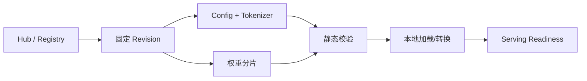

# Hugging Face、Qwen、Llama、DeepSeek 与首次开源模型部署

下载了一个名为“某模型”的目录，启动时却报 tokenizer 不匹配，或者许可证不允许当前用途。开源模型部署的第一步不是运行命令，而是确认你拿到的究竟是哪一个 Revision、哪些文件和哪些使用条件。

## 模型目录不是一个权重文件

| 文件/字段 | 它影响什么 | 缺失或错配的表现 |
| --- | --- | --- |
| config.json | 层数、隐藏维度、架构和默认 Token | 权重 shape 不匹配 |
| Tokenizer 文件 | 文本到 Token 的映射和特殊 Token | 输入长度、停止符异常 |
| 权重分片与索引 | 参数文件位置和校验 | 加载中途找不到 shard |
| generation config | 采样默认值和停止条件 | 服务行为与预期不同 |
| LICENSE / model card | 使用、再分发和安全限制 | 合规与供应链风险 |

Qwen、Llama、DeepSeek 等系列的配置字段和许可条件不同，不能只凭模型名写一套启动参数。下载时固定 revision，记录来源、摘要、文件哈希和核对日期，后续才能复现。

## 从 Revision 到可服务制品



静态校验包括文件清单、大小、哈希、配置与权重的架构一致性。加载成功仍需验证最小 Prompt、停止条件、流式事件和最大上下文行为。这个过程是制品验证，不是性能测试。

## 一个只读的本地核对片段

```python
from pathlib import Path
import json, hashlib

root = Path("./model")
config = json.loads((root / "config.json").read_text())
required = ["config.json", "tokenizer.json"]
missing = [name for name in required if not (root / name).exists()]
print({"architectures": config.get("architectures"), "missing": missing})

def sha256(path: Path):
    digest = hashlib.sha256()
    with path.open("rb") as stream:
        for block in iter(lambda: stream.read(1024 * 1024), b""):
            digest.update(block)
    return digest.hexdigest()

print(sha256(root / "config.json"))
```

输入是一个已下载的模型目录，输出是架构字段、缺失文件和配置哈希。代码不下载模型，也不验证许可证或真实 GPU 加载；它适合在制品进入 Serving 前做低风险核对。

## 名称、能力和版本要分开

公开模型名是给调用方看的稳定标识，Hub 仓库名和 Revision 是制品身份，部署实例是运行位置。把三者写进同一个字符串，会让切换和回滚变得困难。下一篇继续同一模型，解释一次输入怎样经历 Tokenize、Prefill、Decode 并变成流式输出。

## 首次加载前做一次离线兼容性核对

先在不接流量的环境读取 config 的 architectures、hidden_size、num_attention_heads 和 max_position_embeddings，再确认 Serving 引擎、dtype、量化格式和自定义代码策略是否支持。没有这一步，运行时的 Python import 或权重 shape 错误会混在 GPU 和网络日志里，定位成本更高。

若仓库要求 trust_remote_code，更要把这当成供应链决策，而不是启动参数。固定 Revision、审阅或隔离执行远端代码，并记录批准原因。模型卡里的“建议”不能替代组织对许可证、数据、网络和风险的判断。

## 模型目录的来源也需要最小权限

部署节点不应在运行时拥有任意下载任意仓库的长期凭证。更好的方式是构建或制品流程在受控环境固定 Revision、校验摘要，再把只读制品交给 Serving。这样启动失败不会被网络、权限和模型兼容性混在一起。

首次加载应限制在候选节点或隔离容器内，记录失败日志和资源状态。确认模型可用后，再决定是否扩大副本。把“模型下载成功”误当成“模型可上线”，是开源模型服务最常见的跳步。
