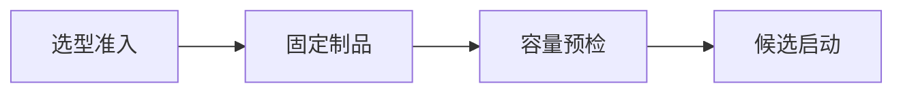

# Hugging Face、Qwen、Llama、DeepSeek 与首次开源模型部署

昨天还能启动的模型，今天重新拉取后提示 tokenizer vocabulary 不匹配。仓库名没变，`main` 分支却更新了配置和权重；本地缓存里又混有旧文件。开源模型部署的第一步不是挑一个热门名字，而是确定许可证、架构、revision、文件完整性和目标硬件是否同时成立。


<InfraFigure src="/images/ai-infra/open-model-huggingface-deployment/hero.png" alt="开源模型仓库的配置、Tokenizer 和权重分片被校验后部署的插画"
  icon="package" caption="模型名不是制品版本；真正可复现的是 revision、文件集合、许可证与运行配置。" />


## 首个开源模型部署要先跨过四道门



先看完整路径，再进入局部配置。这样即使组件名字变化，也能知道失败发生在交接之前还是之后。

### 选型准入发生时，先看 Model Owner

核对许可证、用途限制、语言、上下文和架构支持。

这里不靠猜测，优先读取 license、model card、serving support。

### 从 固定制品 留下的证据回到 Artifact Pipeline

按 commit 下载 config、Tokenizer、权重索引与分片并计算摘要。

决定下一步前需要看到 revision、manifest、sha256。

### 3. Platform 怎样完成容量预检

估算权重、KV Cache、工作区与并行需求，确认驱动和精度支持。

这一动作的可观察结果是 bytes/parameter、VRAM budget。处理动作应晚于取证，否则重启或重试可能覆盖最早的失败现场。

### 4. 候选启动：Serving 持有当前状态

离线或受控环境加载，验证最小普通/流式请求与终止行为。

可以从这些位置确认结果：load log、response schema、OOM/compat error。若完全没有证据，先判断请求是否到达本阶段；若记录冲突，则对齐 request_id、实例和时间窗口。

## Qwen、Llama、DeepSeek 这些名字为什么不足以部署

这里先暂停操作，把容易混用的概念拆开。定义的价值在于划清责任，而不是增加名词数量。

| 概念 | 在这条链路中的含义 |
| --- | --- |
| Repository ID | 模型仓库的人类可读名称，可包含多个 revision 与文件版本，不能单独保证可复现。 |
| Revision | commit hash、tag 或分支引用。部署应固定不可变 commit，而不是长期跟随可移动分支。 |
| Safetensors | 面向张量的安全序列化格式，避免 pickle 任意代码执行风险；仍需验证来源与摘要。 |
| Remote Code | 仓库提供的自定义 Python 模型代码。启用 trust_remote_code 等于执行第三方代码，必须审查并锁定 revision。 |

::: tip 判断原则
不要从产品名推断能力。把可观察输入、持久状态、失败终态和下游交接点写出来。
:::

## 别让表面现象替你下结论

| 表面现象 | 实际可能发生的事 | 下一步证据 |
| --- | --- | --- |
| 仓库名相同 | main 已移动，缓存和远端文件不再是同一集合 | 记录 commit 与完整 manifest |
| 能加载权重 | Tokenizer 或 chat template 仍可能错配，输出质量异常 | 用固定输入检查 token IDs 和模板 |
| 显存估算放得下 | 运行时还需要 KV Cache、激活和工作区 | 保留运行预算并测试目标请求形状 |
| 开启 remote code 后成功 | 执行了未审查的第三方 Python | 固定 revision、源码审查并隔离构建 |

::: warning 先保留现场
如果先重启、扩容或删除对象，最早失败可能被覆盖。先确认对象身份、版本和时间线，再决定处理动作。
:::

## 先下载到可审计目录，再让 Serving 加载

命令需要安装 `huggingface_hub` CLI 并具有仓库访问权。输入是仓库 ID 与不可变 commit；输出是本地制品目录。示例 revision 是占位符，不可直接当真实版本。

```bash
huggingface-cli download org/model \
  --revision REPLACE_WITH_COMMIT \
  --local-dir /srv/models/org-model/revision
find /srv/models/org-model/revision -maxdepth 1 -type f -print
sha256sum /srv/models/org-model/revision/*.safetensors > weights.sha256
sha256sum -c weights.sha256
```

下载成功后应检查 `config.json` 的架构、`tokenizer_config.json`、特殊 Token、权重索引和所有分片。校验摘要证明本地字节未变化，不证明许可证适用或模型安全。Qwen、Llama、DeepSeek 各系列的具体类名、许可证和上下文能力会变化，必须以目标 revision 的官方材料为准。


## 把结论限制在证据范围内

模型卡中的示例性能不能直接迁移到你的硬件、精度和引擎。首次部署只证明制品可被当前候选环境加载；生产容量、质量、安全和许可证仍要单独验收。

制品进入内存后，真正的生成过程才开始。下一篇沿一条请求拆开 Tokenize、Prefill、Decode、采样、停止和流式发送。
