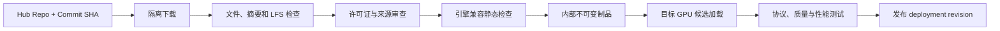

# Hugging Face 是什么？如何识别并部署一个开源模型

搜索一个开源模型名称，常会进入 Hugging Face 页面。页面上有模型介绍、文件列表、下载量和几行调用代码。初学者很容易把这个页面理解成“模型本身”，然后复制仓库名交给 Serving。真正部署时才发现权重格式不支持、Tokenizer 缺文件、许可证有限制，或者仓库更新后同名模型已经不是原来的字节。

Hugging Face 既是一家公司和开源生态，也提供 Hub、Transformers、Tokenizers、Datasets 等产品与库。AI Infra 最常接触的是 Hub 上的模型 Repository。识别一个模型要把作者命名、不可变 Revision、配置、Tokenizer、权重、代码和许可证分别核对，不能只看标题与参数量。

::: info Hugging Face Hub 的准确含义

Hugging Face Hub 是托管和分发模型、数据集与应用仓库的平台。模型仓库可以保存 Git 元数据与由 Git LFS 或 Xet 等机制管理的大文件，并提供按 Repository ID 和 Revision 下载的 API。

Hub 不保证任意上传模型安全、合法或可被你的 Serving 引擎加载。发布者信誉、文件、代码、许可证和运行兼容都需要使用者审查。

:::

## Hub、Transformers 和模型页面分别是什么

Hub 是远程仓库与协作服务。它保存版本、文件、Model Card、访问权限和下载接口。Transformers 是 Python 库，提供大量模型架构、配置和加载 API。浏览器中的模型页面只是 Hub Repository 的展示界面，会渲染 README、文件和元数据。

使用 Transformers 从 Hub 加载时，库先解析 Repository 与 Revision，把所需文件下载到本地缓存，再根据 Config 选择 Python 类并读取权重。运行计算发生在本机或部署节点，不是默认在 Hugging Face 网站服务器。Inference Endpoint 等托管服务则是另一项运行产品。

一个模型能在 Transformers 里加载，不表示 vLLM、TensorRT-LLM 或其他引擎支持。通用库可能执行模型作者提供的自定义代码，专用引擎只实现特定架构与格式。部署前查目标引擎的模型支持、量化支持和版本要求。

Hub 还托管 Dataset 和 Space，Repository ID 看起来相似。下载 API 要指定 repo type，不能把数据集仓库当模型。企业镜像或离线环境还可能使用私有 Hub、代理缓存或对象存储同步，来源链要保留原始 Revision。

模型页面上的 Widget 结果不等于本地部署结果。它可能使用托管推理、不同硬件、优化引擎或默认参数。性能、精度和最大上下文都要在自己的制品与运行时验证。

因此 Hugging Face 更像模型制品与工具的分发层，而不是一个自动替你完成部署的按钮。它提供仓库身份、版本、文件和加载生态，部署者仍要把 revision 固定下来，审查文件和许可证，选择实际引擎，并验证自己的驱动、显存与网络。比如一个页面能在线生成文本，只能证明该页面的托管环境完成了一次推理，不能证明同一仓库在本地 vLLM 上有相同的 Chat Template 或量化支持。

仓库页面上的“下载”也有明确边界。它解决了怎样获得字节，不解决这些字节是否值得信任、是否允许商业使用、是否包含远程代码以及上线后怎样回滚。部署记录至少要保留 repo id、commit hash、文件摘要和审查结论，后续出现行为变化时才能回到同一份输入。

## Repository 是什么，org/name 能证明什么

模型 Repository 是一组版本化文件与元数据，常用 `organization/model-name` 标识。前半部分是用户或组织命名空间，后半部分是仓库名。这个 ID 是可读地址，不是内容摘要，仓库所有者可以在同一地址提交新版本。

文件列表可能包含 `config.json`、Tokenizer 文件、生成配置、权重索引与多个 shard。README.md 通常作为 Model Card，`.gitattributes` 描述大文件追踪。仓库也可能只有 Adapter，需要依赖另一个基础模型；看到权重文件小不能直接判断模型参数少。

仓库名里的 `7B`、`chat`、`instruct`、`GPTQ` 或 `AWQ` 是作者命名约定，不是强制可验证字段。参数量要从架构与权重检查，聊天能力要看训练说明与模板，量化格式要看 Config 和文件。部署目录不能从名字自动推导关键参数。

Fork 与衍生模型可能保留类似名字，权重来源和许可证却变化。Model Card 应说明 base model、训练数据与方法，缺失时标为来源证据不足。平台可以允许实验下载，但不能直接进入受信生产目录。

私有或 Gated Repository 要令牌和授权。下载 Token 只给读取目标仓库的最小范围，通过 Secret 注入，不写 Dockerfile、脚本参数和日志。访问被作者撤销后，本地已合法取得的制品如何使用还要按许可证与组织政策判断。

## Revision 是什么，为什么 main 不能作为生产版本

Revision 指 Repository 的某个分支、标签、Pull Request 引用或 Commit SHA。`main` 是可移动分支，作者提交后，同一下载命令得到新 Config 或权重。标签也可能在某些流程中被移动。Commit SHA 才更接近不可变代码身份。

生产下载固定完整 Commit SHA，并在内部 Manifest 记录解析结果。Hub API 可以把分支或标签解析到 SHA，发布审批时冻结。缓存目录存在旧文件不能替代 Revision 记录，因为缓存可能混有多个仓库和提交。

Git Commit 不等于大文件内容已经验证。大文件指针解析、下载镜像和缓存损坏都可能改变实际结果。同步完成后计算每个文件 SHA-256，与内部 Manifest 一起签名。下一次部署从内部对象存储按摘要取得，减少运行节点直接访问公网。

更新模型不是把 main 重新 pull 到原目录。创建新的候选 Revision，重新执行许可证、文件、兼容、质量和性能检查，通过后更新部署指针。旧 Revision 与内部制品保留回滚，不能被清理脚本当重复缓存删除。

Revision 也要覆盖 Tokenizer 与自定义代码。只固定权重下载 URL，Config 从 main 读取，仍会形成混合版本。所有加载输入来自同一 Commit 或由发布 Manifest 明确组合。

## Config 是什么，它怎样告诉加载器构造模型

`config.json` 保存架构和超参数。常见字段包括 `model_type`、`architectures`、隐藏维度、层数、注意力头、词表大小、最大位置和 dtype 提示。Transformers 先读取 Config，选择对应 Config 与 Model 类，再按结构装载权重。

字段名随架构变化。某些模型用 grouped-query attention、rotary position scaling、mixture-of-experts 或多模态 Config。旧库看到未知 `model_type` 会报错，升级库或目标引擎前要审查依赖，不能默认开启 remote code 绕过。

最大位置字段是模型结构线索，不一定等于部署安全的最大上下文。RoPE scaling、训练长度、引擎限制和 KV Cache 显存都会影响可用长度。模型页面宣称 128K，也要用实际引擎和质量测试验证长上下文。

Config 里的 dtype 不一定是权重实际 dtype，量化仓库还会有 quantization_config。权重文件头和引擎启动日志给出更直接证据。把 BF16 Config 强制加载到不支持 BF16 的 GPU，可能转换精度或失败。

配置能被仓库作者修改，属于不可信输入。加载前限制 JSON 大小和字段，目标库解析时也要在隔离环境。内部发布系统提取关键字段到结构化模型目录，原 Config 仍作为制品保留。

## Tokenizer 是什么，为什么它必须与权重一起发布

Tokenizer 把文本转换成模型词表中的 Token ID，并把输出 ID 转回文本。它可能由 `tokenizer.json` 单文件描述，也可能使用 vocab、merges、SentencePiece model 和特殊 Token 配置。加载器根据 tokenizer_config 与文件选择实现。

模型 Embedding 矩阵按词表 ID 排列。Tokenizer 版本不匹配时，同一句文本产生另一组 ID，模型接收到错误符号；输出 ID 解码也会错。词表大小看起来相同仍不能证明映射一致，需要固定样本回归。

特殊 Token 包括 BOS、EOS、PAD 和聊天角色标记。EOS 错误会让生成不停直到长度上限，PAD 与 EOS 混用会影响批处理。Config、Tokenizer 和 generation config 中的 ID 要互相对照，Serving 最终值也要记录。

Chat Template 把 messages 转成模型训练时使用的文本格式。有的存于 tokenizer_config，有的由应用配置。基础模型和指令模型模板不同，随意套另一个模型模板会降低质量。模板包含系统、工具调用和 generation prompt 规则，也要版本化与测试。

Fast Tokenizer 可能由 Rust 实现，Slow Tokenizer 由 Python 实现，边缘空格和 Unicode 行为需要回归。usage 计数使用与 Serving 相同 Tokenizer，Gateway 自己用近似 Tokenizer 只能做准入估算，最终计费以实际结果为准。

## 权重文件是什么，bin 与 safetensors 有什么区别

权重文件保存参数张量。大型模型通常拆成多个 shard，并用 `model.safetensors.index.json` 等索引把参数名映射到文件。加载器先读索引，再按需打开 shard。少一个文件、索引引用错误或大小不符都会加载失败。

PyTorch `.bin` 常通过 pickle 相关格式加载，反序列化不可信文件可能执行代码。Safetensors 设计为只保存张量数据和安全元数据，便于内存映射，也减少任意代码风险。它不验证训练来源和模型行为，仍要 checksum 与供应链审查。

权重 dtype 决定单参数字节量。7B 参数按 2 字节粗算仅权重约 14 GB，还要加量化元数据、非量化层、运行时工作区和 KV Cache。文件大小会受 shard、压缩与格式元数据影响，不能用磁盘大小精确推断显存。

量化权重可能使用 GPTQ、AWQ、bitsandbytes、GGUF 或引擎专有格式。这些名称背后有不同布局与 Kernel。目标引擎支持某种方法，还要匹配 bits、group size、zero point 和 GPU 架构。仓库有 `.safetensors` 不表示它是普通 FP16。

Adapter 仓库通常保存 LoRA 权重和 `adapter_config.json`，其中引用 base model。部署要固定 base Revision、Adapter Revision 与合并方式。把 Adapter 当完整模型加载会缺大部分参数，动态挂载又要做租户权限与显存限制。

## Model Card 和许可证能告诉部署者什么

Model Card 是仓库 README 中的模型说明，理想内容包括用途、限制、训练数据概况、评测、Prompt 格式、许可证与引用。它是作者提供的证据，不是独立安全认证。缺失的信息不能由下载量或点赞数补上。

许可证决定能否商用、再分发、修改和提供服务。有些开放权重许可证附带用途、规模或归属要求，不等同于 OSI 开源软件许可证。组织应由法务或合规按真实使用方式审查，工程记录接受的许可证版本和义务。

训练数据声明影响隐私、版权和语言覆盖。作者未公开完整数据时，不能声称没有某类内容。部署还要做自己的安全与质量评测，尤其是目标语言、专业领域和受限行为。排行榜分数不能替代业务测试。

Model Card 中的硬件和性能数字只适用于其测试条件。Batch、输入输出长度、精度、引擎、GPU 和采样都会影响吞吐。引用数字时带条件，容量规划使用自己的候选部署测量。

模型可能有 Gated 使用条款，接受条款的账号与组织身份要记录。把下载后的权重镜像到内部存储，不会消除许可证。模型下架后，是否继续部署按条款和风险流程处理。

## trust_remote_code 是什么，为什么默认开启有风险

Transformers 对内置架构可以从库代码构造模型。仓库定义新架构时，Config 可能通过 `auto_map` 指向仓库内 Python 文件；`trust_remote_code=True` 允许下载并执行这些代码。它不是“信任模型效果”，而是允许远程仓库代码在本机 Python 权限下运行。

远程代码可以读取文件、环境变量和网络，也能在导入时执行副作用。运行节点含 Hub Token、对象存储凭证或生产网络时，风险很高。固定 Revision 只让代码不变化，不能证明代码安全。

需要自定义代码时，先在隔离、无生产凭证环境拉取固定 Revision，做代码审查、依赖扫描和运行测试。把审查后的代码作为内部源码和镜像构建输入，限制网络与文件权限。生产启动不应临时从公网执行新代码。

有时升级 Transformers 后架构已内置，可以不再 remote code。也可能目标 Serving 完全不支持自定义 Python forward，需要转换模型或选择另一引擎。开启开关不是兼容方案，它只是改变信任边界。

Tokenizer 也可能要求自定义代码，Model Card 示例里的 `trust_remote_code=True` 要逐项解释。发布审查记录哪些文件被执行、使用什么 Python 依赖与沙箱，不能只记录布尔值。

## 怎样用文件列表判断一个仓库可能属于哪类模型

先看 Repository ID、Revision 和 Model Card，再看根目录文件。`config.json` 和权重索引通常表示完整 Transformers 模型；`adapter_config.json` 加少量权重更像 Adapter；多个 `.gguf` 可能面向 llama.cpp 生态；ONNX 文件表示已导出图。一个仓库也可能同时提供多种格式。

打开 Config 读取 model_type、architectures、维度和 quantization_config。打开权重索引只看 metadata 与 shard 列表，不加载张量。Tokenizer 文件与 chat template 必须存在或能从明确 base model 取得。任何跨仓库依赖都固定 Revision。

LFS 指针文件本身只有几百字节。如果用普通下载方式得到 `version https://git-lfs...` 文本，说明没有拿到真正权重。检查实际文件大小、摘要和 `huggingface-cli` 或 SDK 的下载结果，不能把 clone 成功当制品完整。

仓库可能包含转换脚本、评测代码和训练 checkpoint，Serving 不需要全部文件。使用 allow patterns 下载明确清单，减少供应链面与磁盘。排除文件前确认加载器不会在运行时寻找它，最终 Manifest 保存实际选中集合。

下面的表把常见文件与判断连接起来。具体命名会变化，表是审查入口，不是自动分类器。

| 文件或字段 | 常见含义 | 还要核对什么 |
| --- | --- | --- |
| `config.json` | 架构与超参数 | model_type、auto_map、量化配置 |
| `tokenizer.json` / `tokenizer.model` | Tokenizer 数据 | 特殊 Token、词表和模板 |
| `*.safetensors.index.json` | 分片权重索引 | 所有 shard、总大小与摘要 |
| `adapter_config.json` | PEFT/LoRA 配置 | base model 与 Revision |
| `generation_config.json` | 生成默认值 | Serving 是否采用或覆盖 |
| README / Model Card | 用途、限制与示例 | 来源、许可证和测试条件 |

表中最容易漏的是 base model Revision。Adapter 和派生模型不完整时，内部制品 Manifest 要把整条依赖展开，不能让运行节点再按 main 动态补文件。

## 基础模型、指令模型、Embedding 与多模态模型怎样区分

基础语言模型主要学习预测下一个 Token，通常接受连续文本。它未必遵循“system/user/assistant”对话角色，也不一定会按要求结束。指令或 Chat 模型在基础权重上经过监督微调、偏好优化或其他后训练，更适合按照指令回答，并依赖特定 Chat Template。

仓库名带 instruct 是线索，Config 中的架构仍可能与基础模型相同。差异主要在权重和模板，不会由 `AutoModelForCausalLM` 类名直接证明。部署指令模型时使用作者建议模板，再用自己的多轮、系统消息、停止和工具调用样本验证。

Embedding 模型把输入映射成固定向量，常使用 `AutoModel`、Sentence Transformers 配置或专用架构。它的池化、归一化和查询/文档前缀会影响结果。把生成模型最后一层随便平均，不能自动得到与模型卡指标一致的 Embedding。RAG 索引和查询必须使用兼容版本。

Reranker 常接受查询与文档对，输出相关性分数，不是生成文本。Cross Encoder 与 Bi-Encoder 的输入和吞吐不同。模型页面 Task 标签能帮助识别，仍要查看 Config、示例与输出 shape。Serving 需要对应 API，不应该都包装成 chat completions。

多模态模型会增加视觉或音频编码器、Processor、预处理配置和特殊 Token。仓库可能包含 `preprocessor_config.json`、额外视觉权重和模板。目标引擎只支持文本主干时，即使能读取 Config 也无法执行图像路径。输入尺寸、媒体下载和解码还带来新的安全与容量边界。

Mixture-of-Experts 模型总参数量与每 Token 激活参数量不同。磁盘和显存要考虑全部或分布式权重，计算量更接近被路由到的专家。只用 active parameters 估显存会严重偏小。架构检查要读取专家数量、top-k 与引擎支持。

## Hub Token、本地缓存和离线模式怎样管理

公开仓库通常无需 Token，Gated 和 Private 仓库需要认证。Token 由 Secret 管理，下载进程只得到 read 权限和必要仓库范围。命令输出、环境转储、构建日志与 Docker Layer 都不能包含 Token。个人 Token 不应成为长期生产依赖。

huggingface_hub 使用本地缓存保存 blob、snapshot 与引用。多个 Revision 可以共享相同内容，snapshot 路径通过链接指向 blob。手工复制某个目录时要确认链接是否一起解析，容器构建上下文也可能漏掉指向缓存外的内容。内部发布更适合导出明确普通文件 Manifest。

缓存命中降低重复下载，不保证内容已经审批。实验用户下载的任意仓库可能与生产制品共用缓存根目录，加载器按 Repo ID 和 Revision 选择，权限错误会造成混用。候选部署只从内部只读制品区加载，不让生产进程扫描个人缓存。

离线模式要求所有必需 Config、Tokenizer、权重和代码已经在本地，加载时设置 `local_files_only` 或产品对应参数。它能防止运行节点临时访问公网，也会暴露遗漏依赖。发布验证应在断网候选环境启动一次，确认不会悄悄从 base model main 补文件。

缓存清理按 blob 引用和已发布 Revision 进行。直接删除 snapshot 可能留无引用 blob，直接删除 blob 又可能破坏另一个 snapshot。官方缓存工具或内部 Manifest 管理引用，当前与回滚制品独立保存。临时审查目录完成后清理，不误删共享 Hub Cache。

## 参数量、精度和上下文怎样做第一次硬件估算

未拿到 GPU 前也能做静态量级估算。仅权重字节约等于参数量乘每参数字节。7B 参数使用 FP16 或 BF16 约 14 GB，8-bit 约 7 GB，4-bit 理想值约 3.5 GB。量化还包含 scale、zero point、未量化层和格式开销，实际高于理想值。

Serving 显存不只权重。Runtime 需要 CUDA Context、Kernel 工作区、通信缓冲和 KV Cache。最大上下文与并发主要扩大 KV Cache，后续显存文章会给计算。节点还要留安全余量，不能让静态权重估算等于设备总显存。

模型参数量也不能直接推出速度。架构层数、隐藏维度、专家路由、注意力方式、量化 Kernel 和设备带宽都会影响。相同 7B 名称在长上下文与短输入下表现不同。静态估算只判断“明显装不下”和候选并行方式，吞吐需要真实压测。

CPU 主存需要容纳下载、反序列化和加载阶段的峰值。有的流程先在 CPU 形成完整权重再复制 GPU，内存接近权重一份或更多；低内存加载可以分 shard 流式处理。容器 memory limit 过小会在 GPU 尚空闲时 OOM。

磁盘空间要包含下载缓存、内部制品、本地 Serving Cache、当前和回滚版本。创建新候选时旧模型仍在，至少按共存峰值估算。Safetensors shard 下载中还会有临时文件。部署前记录 `du`、对象 Manifest 总大小和节点可用空间。

下面用一个简化计算表说明边界，数值是理想权重下限，不是硬件推荐。

| 模型参数量 | 2 字节权重下限 | 1 字节权重下限 | 0.5 字节权重下限 | 尚未包含 |
| --- | --- | --- | --- | --- |
| 7B | 约 14 GB | 约 7 GB | 约 3.5 GB | 量化元数据、KV Cache、Runtime |
| 13B | 约 26 GB | 约 13 GB | 约 6.5 GB | 同上 |
| 70B | 约 140 GB | 约 70 GB | 约 35 GB | 同上与多卡通信 |

表里 GB 使用十进制量级，GPU 工具可能显示 GiB。估算报告要写单位，候选加载看实际 allocated/reserved。4-bit 也不是把任何模型无损缩到四分之一，质量和 Kernel 支持必须独立验证。

## 模型评测、安全扫描和上线范围怎样确定

静态文件扫描先处理格式、代码、依赖和 Secret。Safetensors 读取 Header，JSON 限制大小与深度，Python 文件进入人工与自动审查。恶意权重不一定包含可执行代码，模型行为仍可能输出有害内容或记忆数据，需动态评测。

质量评测按真实任务构造固定数据集，记录 Prompt Template、采样、模型 Revision 和评分器。公开榜单可以筛选候选，不能替代中文业务、专业知识和拒答要求。评测集也要权限分层，不能把真实用户 Prompt 无授权复制进长期基准。

安全评测覆盖提示注入、越权请求、敏感信息、工具调用参数和超长输入。模型本身无法执行工具，风险来自 Agent Runtime 把输出当调用指令。上线范围可以先只开放文本回答，不因为 Model Card 写了 function calling 就直接允许高权限工具。

性能评测固定硬件、引擎、精度、并行、输入输出长度和并发。报告同时给 TTFT、TPOT、吞吐、显存、错误与取消，不只给每秒 Token 峰值。未在目标 GPU 执行的文章审查只能标静态可兼容，不能填生产数字。

上线后仍要监控输出质量与安全反馈，模型 Revision 不变时，Chat Template、RAG、采样和引擎升级也会改变结果。发布单把整套组合视为 deployment，回滚同样回到组合版本。Model Card 的限制继续展示给产品与使用者，不在上线时丢掉。

## 怎样固定 Revision 并下载可审查快照

Hugging Face Hub Python API 和 CLI 都能下载 snapshot。下面命令使用教学变量，不包含真实 Token。`revision` 应替换为审批时解析的完整 Commit SHA，下载到隔离目录后计算文件清单。

```bash
export HF_REPO_ID='org/model-name'
export HF_REVISION='REPLACE_WITH_FULL_COMMIT_SHA'

huggingface-cli download "$HF_REPO_ID" \
  --revision "$HF_REVISION" \
  --local-dir /tmp/model-review

find /tmp/model-review -type f -print0 \
  | sort -z \
  | xargs -0 sha256sum > /tmp/model-review.sha256
```

输出清单包含下载快照中的每个普通文件摘要。临时目录要限制权限，审查结束按任务要求清理。CLI 名称与参数会随 huggingface_hub 版本变化，执行前查看当前 `--help`，CI 固定工具版本。

下载完成后检查是否有 LFS 指针、符号链接逃出目录、异常大脚本和未预期格式。不要直接执行仓库代码。JSON 通过解析器读取，Safetensors 先读 Header 和张量元数据，权重真正加载留给隔离兼容测试。

静态检查还要生成机器可读报告。报告保存 Repo ID、完整 Commit、下载工具版本、文件数量、总字节、每文件摘要、Config 摘要和是否含远程代码。检查脚本读取文件，不改写仓库；发现异常时保留只读证据与错误分类，不用重新下载覆盖现场。

同一个 Commit 的上游仓库也可能因大文件后端或管理员操作出现不可用，内部制品同步成功后要验证独立可恢复。把临时目录断开 Hub 网络，重新按 Manifest 加载 Tokenizer 与 Config，确认没有隐藏下载。内部对象再复制到隔离恢复 Bucket，逐文件校验一次，才知道发布不依赖个人缓存。

来源引用要保存 Model Card 与许可证在审查时的版本。网页之后更新不会自动改变已批准结论，也不能用新页面解释旧部署。若上游发布安全公告、撤回权重或修改许可证，模型目录把受影响 Revision 标记待审查，现有流量是否停止由风险等级和组织流程决定。

## 从仓库到候选 Serving 的发布链怎样走

输入是 Repository ID 与固定 Revision。同步任务取得文件，验证来源和摘要，生成内部 Manifest。合规检查确认许可证和用途，安全检查审查代码与格式，兼容检查把架构、量化、维度和目标引擎支持矩阵对齐。

通过静态检查后，把不可变文件上传内部对象存储，发布状态仍是 verified_artifact。候选 Serving 在目标 GPU 加载，运行 Tokenizer 固定样本、最小生成、最大允许上下文边界、SSE 和取消测试。硬件步骤未执行时必须标“静态检查”，不能提前说可部署。



图中内部制品与 deployment 是两个版本。相同模型文件在不同引擎、精度和并行配置下形成不同部署。回滚记录同时保存制品 Revision 与 Runtime 配置，不能只把 Gateway 模型名切回。

候选失败时保留最早阶段证据。Config 未识别属于静态兼容，权重 shape 错属于加载，首 Token 正常但输出乱码要检查 Tokenizer 与模板，OOM 则回到显存与并行。不同错误不会用“换个模型试试”统一处理。

最终验证用目标 SDK 访问候选，确认非流式、SSE、usage、finish reason 和错误。再用自己的业务样本评质量，记录没有覆盖的能力。只有这些结果与许可证都通过，逻辑模型名才指向新 deployment；旧 revision 保留回滚和审计。

发布结束后从一个没有 Hub 缓存、没有公网权限的全新隔离节点恢复一次完整候选，确认内部 Manifest、Tokenizer、权重和审查过的代码足以独立启动。这个恢复步骤能发现个人缓存、可移动分支和遗漏 base model 依赖，不用等真实故障时才临时补文件。
