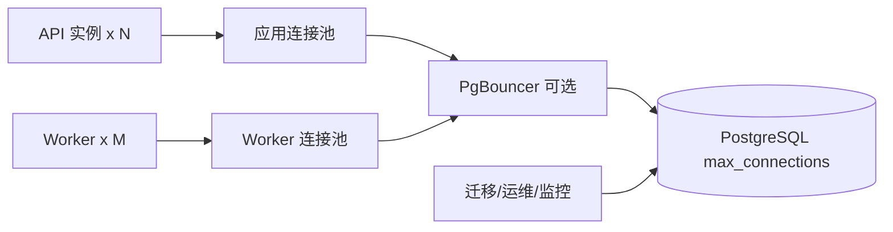

# PostgreSQL、PgBouncer、连接池、锁与慢查询

API 实例从 2 个扩到 10 个后，数据库开始间歇性报“too many clients”。团队继续提高 `max_connections`，内存压力和上下文切换反而更严重。真正的问题常常不是“连接太少”，而是每层都按自己的想象创建了连接。

本章会在隔离 PostgreSQL 环境中完成一轮运行检查：先做连接预算，再用 `pg_stat_activity` 找等待，用锁视图定位阻塞者，用 `EXPLAIN (ANALYZE, BUFFERS)` 看真实执行，最后判断是否需要 PgBouncer。示例查询只使用 PostgreSQL 系统视图，不接触业务生产库。

## 连接为什么是一种有成本的资源

PostgreSQL 传统架构为每个客户端连接创建后端进程。连接会占内存、会话状态和调度成本；SQL 不执行时，空闲连接仍然存在。



数据库连接总预算不能只分给 API。Worker、迁移、监控、备份和故障排查都需要连接，还要给超级用户或管理连接保留空间。

## 第一步：做一张连接预算表

假设有 4 个 API 实例，每个池上限 15；2 个 Worker 实例，每个上限 8：理论上限已经是 `4*15 + 2*8 = 76`。再加迁移、监控和运维连接，数据库 `max_connections=80` 就几乎没有缓冲。

| 来源 | 实例数 | 单实例池上限 | 最坏连接数 |
| --- | ---: | ---: | ---: |
| API | 4 | 15 | 60 |
| Worker | 2 | 8 | 16 |
| 迁移任务 | 1 | 2 | 2 |
| 监控与运维保留 | - | - | 10 |
| 合计 | | | 88 |

这些数只是计算示例，不是推荐配置。实际容量要用连接占用时间、数据库 CPU/内存、查询类型和压测决定。

应用池上限决定并发进入数据库的数量，也是一种背压。把上限设成 1000，只会把排队从应用移到数据库。应用还应为获取连接设置超时；等待超过请求 Deadline 时，应返回可判断错误，而不是无限挂住。

先查询当前配置：

```sql
SHOW max_connections;
SHOW superuser_reserved_connections;

SELECT datname, usename, state, count(*)
FROM pg_stat_activity
GROUP BY datname, usename, state
ORDER BY count(*) DESC;
```

第一组确认数据库上限和保留连接；第二组按数据库、用户与状态统计。`idle` 多并不自动代表泄漏，连接池本来会保留空闲连接；更重要的是数量是否超预算、是否长期不变、应用池配置是否能解释。

## 第二步：读懂 pg_stat_activity

在隔离数据库中以有权限的诊断账户运行：

```sql
SELECT pid,
       usename,
       application_name,
       client_addr,
       state,
       wait_event_type,
       wait_event,
       now() - query_start AS query_age,
       now() - xact_start AS transaction_age,
       left(query, 160) AS query_sample
FROM pg_stat_activity
WHERE datname = current_database()
ORDER BY query_start NULLS LAST;
```

字段解释：

- `application_name` 应由 API、Worker、迁移等客户端明确设置，便于归属。
- `state='active'` 表示正在执行；`idle` 表示等待下一条客户端命令。
- `idle in transaction` 表示事务已开始但当前没执行 SQL，可能长期持锁，应重点检查。
- `wait_event_type` / `wait_event` 显示在等锁、I/O、客户端还是其他资源。
- `query_age` 是当前查询持续时间；`transaction_age` 是事务持续时间，两者不同。

查询文本可能包含敏感值。公开仪表盘应归一化或只保存指纹，诊断权限也要受控。

不要看到长查询就直接 `pg_terminate_backend`。先确认 PID、应用、事务、副作用和阻塞影响；取消查询优先 `pg_cancel_backend(pid)`，终止会话是更强动作，生产使用需要变更权限和回滚判断。

## 第三步：定位谁在等锁、谁在阻塞

一个更新请求卡住，可能不是自己的 SQL 慢，而是在等另一个事务释放锁。PostgreSQL 提供 `pg_blocking_pids`：

```sql
SELECT blocked.pid AS blocked_pid,
       blocked.application_name AS blocked_app,
       now() - blocked.query_start AS blocked_for,
       blocker.pid AS blocker_pid,
       blocker.application_name AS blocker_app,
       now() - blocker.xact_start AS blocker_xact_age,
       left(blocked.query, 120) AS blocked_query,
       left(blocker.query, 120) AS blocker_query
FROM pg_stat_activity AS blocked
CROSS JOIN LATERAL unnest(pg_blocking_pids(blocked.pid)) AS p(blocker_pid)
JOIN pg_stat_activity AS blocker ON blocker.pid = p.blocker_pid;
```

输入是当前系统活动会话，输出是阻塞链。重点先处理最上游阻塞者，而不是逐个终止被阻塞请求。

常见根因：应用开启事务后做外部 HTTP；异常路径忘记回滚；批量更新一次锁太多行；两个事务以不同顺序更新资源形成死锁。PostgreSQL 会检测死锁并回滚其中一个事务，但应用仍需把错误映射为可重试或失败。

预防手段包括缩短事务、统一加锁顺序、对后台批次控制大小、设置 `lock_timeout` 和 `statement_timeout`。超时值要服从任务类型；迁移与在线请求不应共用同一预算。

## 第四步：慢查询先问“慢在哪里”

慢可能来自执行计划、磁盘读取、锁等待、连接池等待或向客户端发送大量结果。`EXPLAIN` 只解释数据库执行部分。

对隔离环境或确认安全的只读查询运行：

```sql
EXPLAIN (ANALYZE, BUFFERS, VERBOSE, FORMAT TEXT)
SELECT id, title
FROM article
WHERE workspace_id = 42 AND status = 'published'
ORDER BY updated_at DESC
LIMIT 20;
```

`ANALYZE` 会真实执行 SQL；对写语句会真的写，生产使用前必须确认或放进可回滚事务。`BUFFERS` 显示共享缓冲命中和读取，`actual time/rows/loops` 显示真实执行。

阅读顺序：

1. 从最内层节点看数据怎样产生。
2. 比较估算 `rows` 与实际 `actual rows`，差距大可能是统计信息或相关性问题。
3. 看是否出现大量扫描后过滤，只返回少数行。
4. 看排序是否使用内存或落盘。
5. 看索引条件是否与查询过滤和排序顺序匹配。

索引不是越多越好。它加速部分读取，也增加写放大、空间和维护成本。组合索引要围绕真实查询设计，并用相同数据分布验证。

`pg_stat_statements` 可以按归一化语句统计调用次数、总时间和平均时间。启用它属于数据库配置变更，应按官方文档加载扩展并评估开销。优先处理“总时间高”的高频查询和“单次时间高”的关键慢查询，而不是只盯一条偶然样本。

## 第五步：什么时候引入 PgBouncer

PgBouncer 是轻量连接池代理。它让大量客户端连接复用较少 PostgreSQL 后端连接，常见于实例多、短事务多、数据库连接成本成为瓶颈的系统。

三种池模式：

| 模式 | 后端连接归还时间 | 兼容性 |
| --- | --- | --- |
| session | 客户端断开 | 最接近直连，复用率较低 |
| transaction | 每个事务结束 | 复用率高，会话状态受限制 |
| statement | 每条语句结束 | 限制最多，事务能力受影响 |

事务池最常用，但必须理解：连续两次事务可能落到不同后端连接。依赖会话级临时表、`SET` 状态、LISTEN/NOTIFY、会话级 advisory lock 或某些 prepared statement 行为的应用，需要逐项验证。ORM 的连接初始化也不能假设会话永久绑定。

一份最小配置形状：

```ini
[databases]
app = host=postgres port=5432 dbname=app

[pgbouncer]
listen_addr = 0.0.0.0
listen_port = 6432
pool_mode = transaction
default_pool_size = 20
reserve_pool_size = 5
max_client_conn = 500
```

这是教学示例，不是生产推荐值。`max_client_conn` 还受 PgBouncer 文件描述符限制；`default_pool_size` 按用户/数据库池计算，不等同于全局后端连接数。部署前用官方配置说明计算总量。

PgBouncer 管理连接复用，不会修复慢 SQL、长事务和无限业务并发。若后端连接持续被长事务占用，代理池同样会排队。

## 第六步：把备份、复制与连接排障分开

高可用副本不是备份。副本会同步误删与逻辑损坏，备份需要独立保留并定期恢复验证。连接代理也不是故障切换器，除非额外配置和验证目标切换语义。

维护时记录：数据库版本、扩展、参数、角色、连接来源、备份恢复点和应用兼容窗口。AI 系统还可能有向量索引和知识版本，恢复后要核对关系数据与可重建投影版本是否一致。

## 完成一次安全诊断

在本地或隔离数据库：

1. 记录 `max_connections` 和所有客户端池上限，完成预算表。
2. 启动两个会话，让会话 A 更新一行但不提交，会话 B 更新同一行。
3. 用 `pg_stat_activity` 和 `pg_blocking_pids` 找到阻塞链。
4. 提交或回滚会话 A，观察 B 继续执行。
5. 对一条只读查询运行 `EXPLAIN (ANALYZE, BUFFERS)`，标出估算与实际行数。
6. 若有 PgBouncer，运行 `SHOW POOLS;`、`SHOW STATS;`，比较客户端等待与后端连接。

清理：回滚未提交事务，删除本次实验数据，停止隔离服务。不要把锁实验指向生产业务行。

## 数据库运行 Runbook

1. 先确认错误来自应用池、PgBouncer 还是 PostgreSQL。
2. 计算所有实例的最大连接总量并保留运维容量。
3. 用 `application_name` 把连接归属到 API、Worker 和迁移。
4. 关注 `idle in transaction`、长事务和等待事件。
5. 沿 `pg_blocking_pids` 找根阻塞者，操作前确认副作用。
6. 慢查询同时检查连接等待、锁、执行计划与结果量。
7. 引入 PgBouncer 前审计会话状态依赖，明确池模式。
8. 修改池或索引后在相同数据分布压测，并保留回滚配置。
9. 备份必须做隔离恢复演练，不用副本替代。
