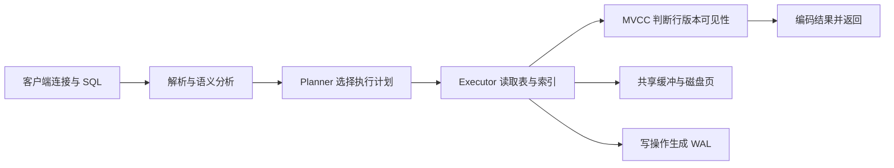

# PostgreSQL 是什么？事务、索引、JSONB、向量与连接池如何配合

知识库要保存用户、文档、切片、权限和导入状态。数据不仅要在进程重启后还存在，还要让多个 API 与 Worker 同时读写时保持约束。某个 Worker 导入失败，不能留下“文档已激活但切片只写了一半”的状态；用户没有权限的切片，也不能因为向量相似就进入回答证据。

PostgreSQL 适合承担这类权威状态。它是关系数据库管理系统，通过 SQL、事务、约束和索引管理磁盘上的数据。JSONB 可以保存结构变化较快的元数据，pgvector 扩展可以保存并检索向量。功能放在同一个数据库里不代表所有查询都自动正确，表结构、事务范围、索引和连接容量仍要逐项设计。

::: info PostgreSQL 的准确含义

PostgreSQL 是开源的对象关系数据库管理系统。客户端通过网络或 Unix Socket 连接 Server，发送 SQL，在表、索引、事务日志和后台进程共同维护的数据库中读取或修改数据。

它提供持久化和并发控制，不是无限容量的共享字典。每条查询仍会消耗连接、CPU、内存和 I/O，事务边界也必须由应用明确提交或回滚。

:::

## 表、行、列与约束怎样表达业务事实

关系表由列定义数据形状，每一行表示一个同类实体或关系。`documents` 可以保存文档身份与状态，`chunks` 保存属于文档的切片，`document_acl` 保存主体对文档的权限。把三者分表，是因为它们的生命周期、基数和约束不同，而不是为了追求表越多越规范。

主键唯一标识一行，外键约束引用对象必须存在，UNIQUE 防止业务键重复，CHECK 限制合法状态。约束在数据库内对所有写入者生效，比只在某个 FastAPI 路由中校验可靠。后台脚本和另一个服务绕过 API 时，数据库仍能拒绝非法关系。

`NOT NULL` 表示值必须存在，不等于字符串非空；时间字段使用带时区类型时仍要统一业务语义。金额和精确额度用 numeric 或整数最小单位，不用浮点。枚举状态可以用 CHECK、枚举类型或状态表，各有迁移成本，关键是数据库和应用共享同一允许集合。

表结构也不是完整业务模型。外键能保证 chunk 引用的 document 存在，不能保证调用用户有权读取它；数据库行能记录 `active`，不能自动验证对象存储中的文件确实存在。权限查询、制品校验和状态机仍要在事务与服务逻辑中连接。

DDL 修改结构也需要事务和锁。给大表直接增加带计算默认值的列、创建普通索引或修改类型，可能持有影响写入的锁。发布前用目标版本和数据规模验证，采用向前兼容迁移，不在 API 启动时让所有副本抢着改表。

## SQL 查询从连接到返回会发生什么

客户端先建立 PostgreSQL 连接，完成 TLS、认证并选择数据库。发送 SQL 后，Server 解析语法，分析表与列，重写视图或规则，再由 Planner 选择执行计划。Executor 按计划读取缓冲区、索引或磁盘页，应用过滤、连接和聚合，最后把结果编码回客户端。

同一句 SQL 的计划可能因参数、统计信息、可用索引和配置改变。Planner 估算每种方案成本，不会实际遍历所有数据再决定。统计信息陈旧时，估算行数偏差会导致选择不合适的连接顺序或扫描方式。ANALYZE 更新统计，自动维护通常会执行，仍需监控是否跟得上数据变化。

顺序扫描不一定错误。查询要返回表中大部分行时，顺序读取可能比大量随机索引访问更便宜。索引存在也不保证使用，类型转换、函数包装、低选择性和排序需求都会影响计划。优化前用 `EXPLAIN (ANALYZE, BUFFERS)` 在安全环境读取实际行数与缓冲情况。

`EXPLAIN ANALYZE` 会真正执行语句。对 UPDATE、DELETE 或昂贵查询使用前要放在隔离环境或可回滚事务，不能在生产直接尝试。只用 EXPLAIN 不执行，可以看估算计划，却没有实际时间和行数。两类证据要注明区别。

下面的图显示客户端查询在数据库内部的大致阶段。WAL 与事务会在写入路径参与，SELECT 也会按快照判断可见行。



图中索引只帮助 Executor 找候选位置，MVCC 仍判断当前事务能否看到对应行版本。WAL 记录重做信息，不能代替逻辑备份，也不会替应用回滚已经正确提交但业务含义错误的数据。

一次查询可以用 `SELECT ... WHERE tenant_id = ?` 作为例子。连接池先借出一个连接，数据库按快照判断租户行的可见版本，Planner 决定是否使用复合索引，Executor 返回结果，客户端读取完后把连接归还池。连接池只管理连接复用，不会替查询增加索引，也不会替应用补上遗漏的租户条件。把这几层混成“数据库很慢”，就无法知道该查计划、锁、连接等待还是业务 SQL。

PostgreSQL 的边界还体现在数据类型选择上。事务和约束负责业务事实，JSONB 适合结构变化但仍需要查询的字段，向量索引只提供相似度候选，最终权限和答案证据仍由应用规则判断。每种能力都有自己的索引、写入和恢复成本，不能因为它们都存进同一数据库就当作同一种数据。

## 事务是什么，BEGIN、COMMIT 与 ROLLBACK 分别改变什么

事务把一组数据库操作视为一个提交单位。BEGIN 开始显式事务，COMMIT 使修改对其他事务按隔离规则可见并确认完成，ROLLBACK 放弃当前事务未提交修改。客户端关闭或连接异常时，未提交事务会回滚，已经提交的事务不会因为 API 后续返回失败自动撤销。

原子性表示事务内修改要么提交，要么不提交；一致性依赖约束和正确业务逻辑；隔离性控制并发事务看到什么；持久性表示提交记录能够在故障恢复后重现。ACID 不是“数据库绝不会丢数据”的口号，持久级别还受同步提交、磁盘、复制与备份配置影响。

事务范围要围绕不变量。创建文档记录、写入当前版本指针和标记版本 active 如果必须同时成立，就放在同一数据库事务。把耗时模型 Embedding 调用放进事务，会长期占连接和行版本，失败时还浪费数据库资源。更稳的流程是先生成外部制品，再用短事务原子激活。

保存点 `SAVEPOINT` 允许回滚事务的一部分，但发生严重错误后客户端库可能把事务标记为 aborted，后续命令必须先 rollback。异常处理不能只捕获错误继续使用同一 Session。连接归还池前要确认事务已提交或回滚，否则下一个请求会继承脏状态。

分布式操作无法靠单个 PostgreSQL 事务覆盖对象存储、Redis 和模型服务。数据库提交成功而消息发送失败时，可用 Outbox 在同一事务写一条待发布记录，由 Worker 重试发送。外部调用已经成功但数据库提交失败，则依赖幂等键与补偿。两阶段提交并非默认答案，它增加协调与恢复成本。

## 隔离级别与锁怎样处理并发修改

Read Committed 是 PostgreSQL 常见默认隔离级别，每条语句看到该语句开始前已提交的数据。同一事务执行两次 SELECT，期间其他事务提交后，第二次可能看到不同结果。它适合许多 CRUD，但跨多条语句做“先检查再更新”时可能产生竞态。

Repeatable Read 让事务在同一快照上读取，PostgreSQL 会防止部分并发更新异常并可能要求重试。Serializable 尝试让并发结果等价于某个串行顺序，冲突时通过 serialization failure 终止其中一个事务。更高隔离不是免费锁死所有数据，应用必须实现有限重试。

行锁如 `SELECT ... FOR UPDATE` 锁住选中的行，其他事务修改时等待。锁适合保护短事务中的库存、任务领取或状态转换，不能在拿锁后调用几分钟模型。锁等待会占连接，多个事务按不同顺序锁行可能死锁，PostgreSQL 会中止一个事务解除循环。

乐观更新可以把旧版本写进 WHERE：`UPDATE ... SET version = version + 1 WHERE id = $1 AND version = $2`。受影响行为零说明期间已被修改，应用重新读取或报告冲突。它不需要先持有长锁，适合冲突较少的编辑。

数据库 Advisory Lock 是应用定义的协调锁，不自动绑定行约束。它可以防止同一文档同时导入，但 Key 设计、事务级还是 Session 级、异常释放都要明确。已有 UNIQUE 与状态条件能解决的问题，优先用声明式约束，少引入难以观察的锁。

## MVCC 是什么，为什么读取旧版本不等于复制整张表

MVCC 是 Multi-Version Concurrency Control，多版本并发控制。更新一行时，PostgreSQL 通常创建新行版本并把旧版本标记为对未来事务不再有效，而不是在原位置覆盖所有信息。不同事务根据自己的快照和事务 ID 判断哪个版本可见。

读事务因此常能在写事务进行时继续读取已提交旧版本，读写不必全部互相阻塞。它不是为每个事务复制整张表，行版本保存在表页中，共享缓冲与磁盘按需读取。可见性信息和事务状态共同决定结果。

旧行版本不会在没有读者后立刻物理消失。VACUUM 标记可重用空间并维护可见性，autovacuum 根据更新与删除量运行。长事务、长时间 idle in transaction 和复制 slot 可能阻止清理，表和索引出现膨胀，查询与备份都变慢。

`UPDATE` 频繁的任务表要关注 dead tuples、autovacuum 进度和事务年龄。只增加磁盘不能解决冻结事务 ID 的风险。API 请求结束后必须关闭事务，后台导出也要控制快照寿命。连接池里一个遗留的 idle transaction 可能让整张热点表长期无法回收。

VACUUM 与 VACUUM FULL 不同。普通 VACUUM 可与多数业务并发并复用内部空间，通常不把文件立即缩小；VACUUM FULL 重写表并需要更强锁，不能作为随手清理命令。维护动作要根据膨胀、锁与磁盘余量安排。

## 索引是什么，B-tree、GIN 与向量索引解决不同问题

索引是从列值或表达式到行位置的辅助数据结构。它用额外磁盘、内存和写入成本换取特定查询更快定位候选。表中每次 INSERT、UPDATE、DELETE 都可能维护相关索引，创建太多“可能有用”的索引会拖慢写入并增加 VACUUM 工作。

B-tree 适合等值、范围和排序，是主键与普通标量列的常见选择。联合索引的列顺序要对应过滤与排序，`(tenant_id, status, created_at)` 不等于三个独立索引。查询只按后面的列过滤时，是否有效取决于计划和数据分布。

Partial Index 只为满足条件的行建索引，比如只索引 `status='pending'` 的任务，适合活跃子集远小于历史数据。Expression Index 可以索引 `lower(email)` 等表达式，查询必须以匹配表达式使用。索引定义本身属于 schema，需要迁移、并发创建和回滚计划。

GIN 适合复合值中的成员或键，如 JSONB containment、数组和全文检索。它不是普通范围排序索引，写放大和维护特征不同。JSONB 某个稳定字段经常做精确过滤时，也可以建立表达式 B-tree，而不是给整列一个通用 GIN 后期望所有查询都快。

向量索引按距离近似或精确找相似向量，操作符类、距离度量和参数必须与查询一致。它返回相似候选，不替代 tenant、ACL、版本 active 等关系过滤。先过滤还是先向量搜索会影响召回与计划，需要用真实数据分布验证。

| 索引类型 | 典型条件 | 能改善什么 | 主要代价与边界 |
| --- | --- | --- | --- |
| B-tree | `=`、范围、排序 | 标量定位和有序扫描 | 写维护，联合列顺序敏感 |
| GIN | JSONB 包含、数组成员、全文 | 多值或键的倒排查找 | 索引较大，写成本更高 |
| Partial | 固定条件下的活跃子集 | 缩小索引与热点查询 | 查询条件必须能推出谓词 |
| HNSW | 近似向量近邻 | 较高召回的快速 ANN | 建索引内存、参数与过滤策略 |
| IVFFlat | 分桶近似向量搜索 | 数据量足够时降低搜索范围 | 需要训练/数据量与 probes 取舍 |

表格只给方向。是否使用索引要看 EXPLAIN 的计划与实际数据，尤其向量扩展版本会影响支持能力。索引命中也不能证明查询权限正确。

## JSONB 是什么，何时该用列而不是把对象全部塞进去

JSONB 以二进制分解格式保存 JSON，输入时会解析，读取时可以按键、包含关系和路径查询。它适合不同文档类型拥有少量可变元数据，比如解析器版本、页码来源和外部标签。相比 text JSON，JSONB 能使用专用操作符和索引。

经常过滤、连接、排序或有严格约束的字段更适合普通列。tenant_id、document_id、status 和 created_at 如果藏在 JSONB，外键、NOT NULL、类型和统计信息都更难维护。把整个业务对象塞进 JSONB 会让 schema 演进从数据库迁移变成散落在应用中的条件判断。

JSONB 更新一个嵌套字段仍会产生新的行版本，也可能重写较大值，不是原地修改小字节。高频计数器和任务状态放普通列更清楚。大段原文不适合存在 JSONB 元数据里，可以放 text、专门内容表或对象存储，并保存 checksum 与对象 Key。

GIN 索引支持 `@>` 等包含查询，不同 operator class 支持范围不同。表达式索引能为固定路径建立标量索引，比如 `(metadata->>'language')`。查询把数字按文本比较会得到字典序，类型转换与错误值需要处理。

JSON schema 仍要版本化。应用写入 `metadata_version`，读取时按版本解析，后台迁移逐步更新。数据库 CHECK 可以约束少量关键键，但过度复杂的 JSON 校验函数会增加写入成本。边界是把变化快的附加元数据放 JSONB，把决定关系与权限的事实放列和表。

## pgvector 是什么，向量距离怎样参与 RAG 检索

pgvector 是 PostgreSQL 扩展，增加 vector 等数据类型、距离操作符和近邻索引。Embedding 模型把文本转换成固定维度数值向量，语义相近文本通常在指定度量下距离更近。扩展让向量与文档、租户、权限和版本记录放在同一事务数据库中查询。

维度由 Embedding 模型决定，建列时要匹配。1536 维向量不能写进 768 维列。模型升级可能改变维度和向量空间，即使维度相同也不能混用距离。表应保存 embedding_model 与版本，新索引就绪后再切换当前版本。

常见距离包括 L2、内积和余弦距离。查询操作符与索引 operator class 必须一致，向量是否归一化会影响内积与余弦关系。排序方向也要正确，距离越小通常越相近；把 similarity 分数和 distance 名称混用容易颠倒阈值。

精确搜索对候选逐一计算距离，数据小时简单可靠。HNSW 和 IVFFlat 用近似索引减少搜索，换取召回、构建时间、内存和参数调节。近似结果不是错误结果，它按配置提供速度与召回折中。质量评估要有带权限的真实查询集，不能只测毫秒。

RAG 查询必须把租户、ACL、active 版本和删除状态纳入过滤。先 ANN 得到全库 Top 10 再丢掉无权限项，可能最终只剩一条；扩大 Top K 也可能泄露时序和资源。使用能够结合过滤的查询与索引设计，并验证召回，不让语义相似覆盖授权边界。

下面 SQL 建立简化文档与切片表。它展示结构字段、JSONB、vector 和外键怎样放在一起，维度用 3 只是为了手工演示，真实模型要使用其固定维度。

```sql
CREATE EXTENSION IF NOT EXISTS vector;

CREATE TABLE documents (
  id bigint GENERATED ALWAYS AS IDENTITY PRIMARY KEY,
  tenant_id bigint NOT NULL,
  title text NOT NULL,
  status text NOT NULL CHECK (status IN ('building', 'active', 'failed')),
  metadata jsonb NOT NULL DEFAULT '{}'::jsonb,
  created_at timestamptz NOT NULL DEFAULT now(),
  UNIQUE (tenant_id, id)
);

CREATE TABLE chunks (
  id bigint GENERATED ALWAYS AS IDENTITY PRIMARY KEY,
  tenant_id bigint NOT NULL,
  document_id bigint NOT NULL REFERENCES documents(id) ON DELETE CASCADE,
  ordinal integer NOT NULL CHECK (ordinal >= 0),
  content text NOT NULL,
  embedding_model text NOT NULL,
  embedding vector(3) NOT NULL,
  UNIQUE (document_id, ordinal)
);

CREATE INDEX chunks_tenant_document_idx ON chunks (tenant_id, document_id);
CREATE INDEX documents_metadata_gin_idx ON documents USING gin (metadata);
CREATE INDEX chunks_embedding_hnsw_idx
  ON chunks USING hnsw (embedding vector_cosine_ops);
```

示例用外键保证文档存在，用 tenant_id 支持权限过滤，用唯一约束防止一个文档重复 ordinal。`UNIQUE (tenant_id, id)` 在此示例不是外键目标，只强调租户字段；更严格设计可使用复合外键确保 chunk 的 tenant 与 document 一致。生产建 HNSW 要评估数据量、内存和并发创建。

## 连接与连接池是什么，为什么 PgBouncer 不能增加数据库算力

PostgreSQL 每个客户端连接会在 Server 侧占用后端进程与内存。建立连接还要完成网络、TLS、认证和会话初始化。API 每个请求新建连接会产生高开销，大量并发连接也会消耗数据库资源。应用连接池复用有限连接，让超出并发在应用内等待。

连接池大小要按所有 API 与 Worker 实例相加。十个实例每个池 30，会产生最多约三百连接，再加迁移、监控和人工连接。数据库 `max_connections` 只是硬上限，不表示同时执行三百条重查询会更快。CPU、I/O 与锁才决定实际处理能力。

PgBouncer 是独立轻量连接池代理。客户端连接到 PgBouncer，它复用较少 PostgreSQL Server 连接。Session pooling 在客户端会话期间固定后端连接，transaction pooling 只在事务期间分配，复用率更高。statement pooling 更严格，适用面有限。

Transaction pooling 会改变会话状态假设。临时表、Session 级 advisory lock、某些 prepared statement、SET 变量和 LISTEN 可能在下一事务换到另一个后端。应用与驱动必须按模式验证，不能只把端口从 PostgreSQL 改成 PgBouncer 就宣称兼容。

连接池也要防 idle in transaction。请求异常后未 rollback，连接归还池会污染下一个请求并阻止 VACUUM。池应在 checkout/checkin 验证状态，设置合理 statement_timeout、lock_timeout 和 idle_in_transaction_session_timeout。超时值按工作负载区分，迁移和后台任务不能盲用 API 短超时。

## Role、Schema 和行级安全怎样限制数据访问

PostgreSQL Role 可以拥有对象、登录并被授予权限。应用不使用超级用户连接，迁移账号、API 只读/读写账号和备份账号分开。API 需要 SELECT、INSERT、UPDATE 的表才授权，不给 DROP、CREATE EXTENSION 和修改 Role 的能力。凭证泄露后的影响由数据库权限继续限制。

Schema 是数据库内对象命名空间。`search_path` 决定未限定表名从哪里解析，如果允许不可信用户在优先 Schema 创建对象，函数或表名可能被劫持。正式 SQL 可以限定 Schema，Role 的 CREATE 权限也要收紧。Schema 便于组织，不是租户间强隔离，所有对象仍位于同一数据库故障域。

GRANT 控制表、序列和函数权限，列级权限可以进一步缩小范围。默认权限要为未来新表配置，否则迁移创建的对象可能没有预期授权或被过度开放。查看当前 Role 能连上数据库，不代表它能访问所有表；连接成功与查询授权是两个阶段。

Row Level Security，简称 RLS，可以让数据库按策略过滤或拒绝行。应用在事务内设置经过验证的 tenant context，策略把 `tenant_id` 与该值比较。RLS 能作为纵深保护，防止查询漏写 tenant 条件；上下文若由用户输入直接设置或连接池没有清理，又会把错误身份带给下一个请求。

表拥有者和某些高权限 Role 可能绕过 RLS，策略也会影响查询计划与维护任务。启用后要用不同 Role 做真实权限测试，包含 SELECT、INSERT、UPDATE、COPY 和函数。不能只看管理员查询结果。后台跨租户任务使用专门 Role，并把访问目的和范围写进审计。

数据库权限无法判断检索文本是否适合进入 Prompt，也不能阻止已授权应用把结果写到不安全日志。RLS 保护行访问，应用层还要执行文档状态、用途和字段脱敏。两层都使用同一可信主体 ID，Trace 记录策略结果而不记录敏感内容。

## WAL、复制、备份和恢复为什么是四个不同概念

WAL 是 Write-Ahead Log，数据页修改落盘前先记录可重做日志。数据库崩溃重启时，从最近一致点重放 WAL，把已提交修改恢复到一致状态。WAL 保护进程或主机异常后的数据库内部恢复，不会撤销业务执行的错误 DELETE。

流复制把 WAL 发送给 Standby，副本重放后得到接近主库的数据。默认异步复制存在延迟，主库确认提交时副本可能还没收到最新 WAL；同步复制可以等待指定副本确认，代价是提交延迟和副本故障对写入可用性的影响。读取副本也可能读到旧数据。

故障切换把某个 Standby 提升为新主。连接地址、时间线和旧主隔离必须协调，避免两个主同时接受写入。自动切换系统要有明确仲裁，应用客户端要能重新解析和建立连接。切换成功只说明服务恢复，最近写入是否完整要按复制模式核对。

备份保存可以在之后恢复的数据副本。逻辑备份导出对象与行，物理基础备份配合 WAL 可以做时间点恢复。只有备份文件存在还不够，必须校验、加密、限制访问，并定期在隔离环境恢复。备份含用户文档和权限，安全等级与主库相同。

PITR 可以恢复到误操作之前的时间点，但恢复会生成一套数据库状态，不会自动把其中几行合并回当前生产。演练要记录恢复点、耗时、应用版本和对象存储等外部系统的一致性。数据库回到上午十点，上午十点后上传的对象仍在存储，就会出现跨系统差异。

恢复目标通常用 RPO 和 RTO 表达。RPO 说明最多能接受丢失多长时间的数据，RTO 说明服务多久恢复。Session、模型元数据、计费日志和可重建向量索引可以有不同目标。把所有表一视同仁会让成本过高或保护不足，schema 与备份策略要标记数据身份。

::: warning 副本不是误删除备份

主库提交的错误更新会通过 WAL 复制到 Standby。高可用副本解决节点故障，离线备份和时间点恢复解决历史版本恢复，两者不能互相替代。

:::

## 一次 RAG 写入和查询怎样保持状态与权限

输入是一份对象存储文档。Worker 先校验 checksum，解析和切片，在数据库创建 building 版本。Embedding 在事务外批量调用，结果带模型版本写入 chunks。所有切片与权限关系完成后，用短事务把目标版本标为 active，并更新文档当前版本指针。

任何批次失败，building 版本保持不可见并记录错误，旧 active 版本继续服务。重试使用 document version 与 ordinal 唯一键，已成功批次不会重复插入。清理任务只删除明确 failed 且超过保留期的版本，对象存储制品也按引用关系清理。

查询时先根据认证主体得到 tenant 与 ACL 条件，生成查询向量，再在 active 版本的有权 chunks 中按距离排序。返回结果包含 chunk ID、document ID、距离、embedding 模型和版本。应用随后读取文本并形成证据，向量距离不能替代来源引用。

```sql
BEGIN;
SET LOCAL statement_timeout = '2s';

SELECT c.id, c.document_id, c.content,
       c.embedding <=> '[0.1,0.2,0.3]'::vector AS distance
FROM chunks AS c
JOIN documents AS d ON d.id = c.document_id
JOIN document_acl AS a ON a.document_id = d.id
WHERE c.tenant_id = 7
  AND a.principal_id = 19
  AND d.status = 'active'
ORDER BY c.embedding <=> '[0.1,0.2,0.3]'::vector
LIMIT 8;

COMMIT;
```

示例假定 `document_acl` 已存在，并用 3 维教学向量。`SET LOCAL` 只在当前事务生效，适合连接池。真实查询还要处理复合租户约束、索引可用性和召回评测，不在无权限全库结果上做应用层过滤。

一次失败推演可以从池耗尽开始。API 总耗时三秒，其中 2.8 秒在等待连接，数据库查询只用 50 毫秒。证据是 pool wait 上升、数据库活跃连接已到预算、SQL 本身计划正常。盲目加索引没有作用，应找到长事务、并发上限或池总量问题。

修复后验证连接等待下降、事务都能结束、autovacuum 不再被旧快照阻塞。再用 EXPLAIN 检查权限与向量查询，用无权限主体确认返回零行，用故意失败的导入确认旧 active 版本仍可用。PostgreSQL 提供了把这些事实放在一起提交和查询的能力，正确性仍来自明确 schema、短事务和可验证计划。

最后还要从隔离备份恢复一次相同版本的数据，确认表、扩展、权限和向量索引都能重新建立，并运行带租户权限的最小查询，恢复证据才算完整可用。
