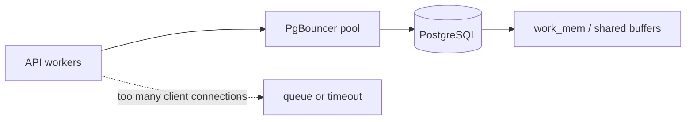

# PostgreSQL、JSONB、pgvector、索引与连接池

检索接口在低并发时正常，流量一上来却报“too many connections”；把连接池调大后，数据库内存先耗尽。PostgreSQL 不只是一个存表的地方，它同时承载租户、知识版本、Agent 状态和 Embedding，连接池、索引和事务边界必须围绕这些事实设计。

## 哪些状态应该落在数据库

| 数据 | 为什么要持久化 | 典型查询 |
| --- | --- | --- |
| 租户、权限、模型绑定 | 需要审计和事务一致性 | 按 tenant_id 查范围 |
| Knowledge Release | 发布、回滚和证据引用需要版本 | 按 release_id 过滤 |
| Agent Checkpoint | 进程重启后仍能恢复 | 按 turn_id + sequence 查 |
| Embedding | 可重建但成本高，需与文档版本对账 | 向量近邻 + ACL 条件 |

Redis 的缓存命中不能替代这些事实。尤其是 RAG，向量相似只说明表示接近，不能证明文档仍有效或属于当前租户。权限和发布状态要在 SQL 条件或事务中明确。

## 连接池为什么会放大问题



应用进程数乘以每进程连接数，才是可能打到 PgBouncer 的客户端连接总量。事务池模式下，连接只在事务期间归属请求；Session 状态、临时表和 prepared statement 的行为会不同。池越大不一定吞吐越高，数据库 CPU、锁和内存会先成为瓶颈。

## JSONB 和向量索引各自解决什么

```sql
CREATE INDEX CONCURRENTLY idx_docs_tenant_release
  ON documents (tenant_id, release_id);

CREATE INDEX CONCURRENTLY idx_chunks_embedding
  ON chunks USING hnsw (embedding vector_cosine_ops);

SELECT id, content
FROM chunks
WHERE tenant_id = $1 AND release_id = $2
ORDER BY embedding <=> $3
LIMIT 8;
```

结构稳定且经常过滤的字段适合普通索引，变化较多的附加属性可以放 JSONB，但不要把所有可查询字段塞进 JSONB 后再依赖全文扫描。向量索引负责近邻候选，SQL 的 tenant_id、release_id 和状态过滤负责范围。实际索引类型、版本和数据规模需要在目标 PostgreSQL/pgvector 上验证。

## 事务与迁移的边界

知识发布至少要让 release、chunk 和 embedding 的可见性一致。先写入新版本并校验数量，再用一个明确的状态转换把它标为 published。不要在请求处理代码里临时 ALTER TABLE；迁移要可回滚、可观测，并考虑旧应用仍在运行。

## 诊断从连接开始

遇到连接耗尽，先看应用并发、PgBouncer pool mode、等待事务、锁和数据库内存，再决定是否调整池大小。把查询耗时、事务时间和队列等待分开记录，才能知道瓶颈在客户端、池还是数据库。下一篇把不会立即完成的解析和 Embedding 工作移到队列与 Worker。

## 向量检索的 SQL 也要有执行计划

加入 HNSW 或 IVFFlat 索引后，不代表每个查询都会走它。tenant_id、release_id、状态过滤、LIMIT、统计信息和数据量会影响 Planner 的选择。上线前用 EXPLAIN (ANALYZE, BUFFERS) 在隔离数据上确认扫描路径，并比较有无过滤条件时的候选数量。

更重要的是把向量召回和最终可见性分开统计：候选数量、ACL 过滤数量、重排后数量和最终 Evidence 数量。只看向量查询耗时会遗漏权限过滤导致的空结果，也无法解释用户为什么没有得到引用。

## 事务边界决定状态是否会半成品可见

导入任务若先写 chunks、再写 release 状态，中途失败时查询面不应看到半成品。可以在事务中写入同一批元数据，或让所有记录先处于 staging，再通过单个发布指针切换可见性。关键是读路径只认清晰状态。

长事务会占用连接、阻碍 vacuum 并放大锁冲突。Embedding 批处理和大文件元数据写入需要按批次提交，同时让每批都能被幂等恢复。事务越大不一定越一致，边界应对应真正的业务原子性。
