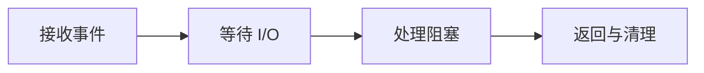

# Python AI 服务运行时：typing、asyncio、线程与多进程

一个 FastAPI 接口在单请求测试中只需 200 ms，上线并发十个请求后却全部超过两秒。代码里每个函数都写成了 `async def`，团队因此认定“异步已经做好”。剖析后发现，分词函数和同步 SDK 在事件循环线程里连续阻塞；函数签名是异步的，执行过程并没有让出控制权。


## 准备 Python 运行环境

本章示例只使用 Python 标准库。尚未安装 Python 时，从 [Python 官方下载页](https://www.python.org/downloads/)选择当前仍受支持的版本；Linux 服务器应优先使用发行版包管理器或团队统一的运行时镜像，避免让多个手工安装覆盖同一个 `python3`。

<figure class="doc-shot">
  
  <figcaption>Python 官方下载页。服务器环境优先采用团队锁定的发行版包或运行时镜像，避免手工安装覆盖系统解释器。</figcaption>
</figure>

安装后先确认解释器版本，再创建独立虚拟环境：

```bash
python3 --version
python3 -m venv .venv
source .venv/bin/activate
python -c "import asyncio, sys; print(sys.version); print(asyncio.__name__)"
```

Windows PowerShell 的激活命令是 `.venv\Scripts\Activate.ps1`。最后一条能输出 Python 版本和 `asyncio`，说明本文所需标准库可以导入；它不能证明事件循环没有被业务代码阻塞，后面的心跳示例才验证这一点。


## 用一个心跳证明事件循环是否被阻塞

这段 Python 3.11+ 代码可在本机运行。输入是一个错误的阻塞协程和一个心跳协程；预期输出中，`time.sleep` 的一秒内不会出现 heartbeat，说明整个事件循环被占住。

```python
import asyncio
import time

async def heartbeat():
    for _ in range(5):
        print("heartbeat", round(asyncio.get_running_loop().time(), 2))
        await asyncio.sleep(0.2)

async def blocking_call():
    time.sleep(1)  # 错误：占住事件循环线程

async def main():
    await asyncio.gather(heartbeat(), blocking_call())

asyncio.run(main())
```

把阻塞调用改成 `await asyncio.to_thread(time.sleep, 1)` 后，心跳应继续输出。这个结果只证明阻塞工作被移到线程，不代表线程无限可扩展，也不保证底层 SDK 可安全并发。CPU 密集分词若持续占用 Python 执行，应测量后考虑进程、原生库或单独 Worker。

## Python 服务里的并发、并行和异步有何区别

理解下面这些词时，要同时回答输入、状态和输出分别在哪里。它们不是可以互换的产品标签。

| 概念 | 在这条链路中的含义 |
| --- | --- |
| Coroutine | 可暂停并由事件循环恢复的执行对象。只有遇到真正会挂起的 `await`，其他协程才有机会运行。 |
| Event Loop | 在一个线程中调度就绪协程并监听 I/O 事件。它适合大量等待，不适合直接承载长时间 CPU 计算。 |
| Thread Pool | 把阻塞函数放到其他线程，避免卡住事件循环；它仍共享进程内存，并受库线程安全与 GIL 行为影响。 |
| Worker Process | 独立解释器和地址空间，可利用多核并隔离崩溃，但模型、连接池和缓存可能被每个进程重复创建。 |

::: tip 判断原则
遇到新术语，先问它改变了哪份状态；如果没有状态所有者，这个名词暂时不能指导排障。
:::

## 一次请求怎样在事件循环里获得执行时间



图里每个节点都要产生可观察结果；没有结果时，上一节点是否真正交付就是第一项检查。

### 接收事件：ASGI Server

socket 可读时创建请求协程并交给事件循环。

决定下一步前需要看到 active tasks、accept queue、请求开始时间。

### 等待 I/O：Coroutine

数据库或 HTTP 客户端注册等待，主动让出事件循环。

这一动作的可观察结果是 span 时长、连接池等待、timeout。处理动作应晚于取证，否则重启或重试可能覆盖最早的失败现场。

### 处理阻塞：Thread/Process Executor

同步 SDK 或 CPU 任务移出事件循环，并设置容量和取消边界。

可以从这些位置确认结果：executor queue、线程数、任务 deadline。若完全没有证据，先判断请求是否到达本阶段；若记录冲突，则对齐 request_id、实例和时间窗口。

### 返回与清理：ASGI Task

序列化响应，关闭生成器并传播客户端取消。

这里不靠猜测，优先读取 响应状态、CancelledError、资源关闭日志。

## 进程存活不等于依赖可用

| 表面现象 | 实际可能发生的事 | 下一步证据 |
| --- | --- | --- |
| async def 很多 | 协程内部仍可能调用同步 I/O 或 CPU 密集函数 | 用慢调用栈与事件循环延迟确认是否真正让出 |
| 增加 Worker 后吞吐下降 | 每个进程重复加载模型或创建过多数据库连接 | 计算进程数乘以单进程资源 |
| 客户端取消但后台仍运行 | 取消未传播到线程、子进程或上游 HTTP 请求 | 记录 deadline 与资源释放终态 |
| 线程池耗尽 | 阻塞调用进入 executor 队列，表现为接口整体排队 | 观测队列等待而非只看函数执行时间 |

::: warning 结论的边界
示例输出用于建立判断路径，不应被当成目标环境的真实结果。版本、硬件和请求形状变化后要重新验证。
:::


## 哪些结论还需要真实环境验证

GIL 不等于 Python 不能并发：I/O 等待、释放 GIL 的原生计算和多进程都有不同路径。也不能为了吞吐无限增加 Worker，因为数据库连接、内存、模型副本和上下文切换会成为新瓶颈。

明确 Python 的执行边界后，下一篇把它放进 FastAPI：从请求校验到依赖注入，再到普通响应、SSE、取消和错误契约。
