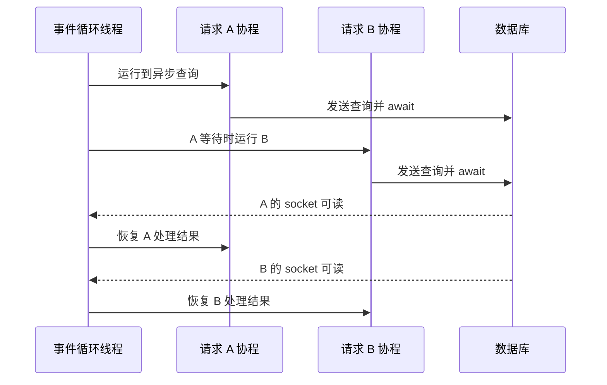

# Python 程序怎样同时处理多个任务？理解 asyncio、线程与多进程

一个 AI API 收到请求后，可能要查询数据库、访问对象存储、调用模型服务，还要解析文档或计算摘要。数据库和网络大部分时间在等待外部结果，解析和压缩则会真正占用 CPU。把所有步骤按顺序执行，等待期间 CPU 闲着；不分任务类型地全部改成异步，CPU 计算又可能卡住整个服务。

Python 提供协程、线程和进程三种常见并发手段。它们不是速度从低到高的三个档位，而是三种状态与调度边界。协程由事件循环在一个线程里协作切换，线程由操作系统调度并共享进程内存，进程有独立地址空间并能在多个 CPU 核上真正同时执行 Python 代码。选择之前先拆清任务究竟在等待什么。

::: info 并发与并行

并发表示多个任务在同一时间段内都在推进，执行片段可以交错。并行表示两个或更多任务在同一时刻真正使用不同计算资源执行。

单线程事件循环可以并发处理许多网络连接，但同一时刻只运行一段 Python 代码。多个进程分布到多个 CPU 核时，才可能并行执行多个纯 Python 计算。

:::

## 任务运行时，CPU 执行与外部等待有什么区别

Python 语句需要 CPU 执行。把 JSON 转成对象、切分文本、排序和运行纯 Python 循环，都在消耗 CPU 时间。一次数据库查询还包含另一种状态：程序把请求写入 socket 后，数据库在另一进程甚至另一机器处理，当前 Python 任务只能等响应数据到达。

阻塞调用会让当前执行单元停在原地。普通 `socket.recv()` 在没有数据时阻塞当前线程，`time.sleep()` 也让当前线程等待计时器。若这个线程正是事件循环线程，其他协程即使已经可以运行也拿不到执行机会。阻塞不等于 CPU 忙，它只是调度单元无法继续做别的工作。

非阻塞 I/O 在暂时无法读写时立即返回，由事件循环登记关注的 socket 事件。任务主动挂起，线程去运行其他就绪任务；操作系统通知 socket 可读后，事件循环再恢复原协程。等待并没有消失，只是等待期间线程有机会推进其他连接。

CPU 密集任务没有自然等待点。一个纯 Python 循环连续运行五秒，改成 `async def` 并不会自动切换，因为函数体没有执行能让出控制权的 `await`。在循环里机械插入大量 `await asyncio.sleep(0)` 会增加调度开销，也不能获得多核并行。此类工作更适合进程池、原生库或独立 Worker。

AI 服务还会遇到设备等待。调用 CUDA Kernel 后，CPU 可能等待 GPU 结果，也可能由异步运行时继续提交工作。GPU 并行不等于 Python 请求处理自动并发，Serving 引擎通常有自己的调度器。API 层要按客户端库实际阻塞方式接入，不能看到 GPU 就忽略事件循环。

## 并发是什么，它为什么不等于同时执行

并发关注任务生命周期重叠。任务 A 发出 HTTP 请求后等待，任务 B 可以在这段时间解析自己的响应；随后 A 的数据回来，调度器再让 A 继续。两者都在一秒内推进，即使 CPU 只有一个核，也构成并发。

并发主要提高等待型工作的资源利用率与吞吐。五十个请求各等待数据库一百毫秒，逐个执行至少花五秒；如果数据库和连接池允许多条查询同时进行，程序可以让多个等待区间重叠。真实耗时还受连接池大小、数据库并发能力、网络和调度开销限制，不会简单缩短五十倍。

并发会引入共享状态问题。两个任务同时修改同一个字典、余额或文件，执行顺序可能变化。协程也有竞态：任务读取旧值后在 `await` 处让出，另一个任务修改值，第一个任务恢复后覆盖新结果。单线程不能自动保证跨 `await` 的读改写原子性。

限制并发与开启并发同样重要。客户端同时发出一万条模型请求，后端只有十个可用连接或两个 GPU 调度槽，未受限的任务会堆在内存。信号量、连接池和有界队列把准入限制写清楚，超出时等待或拒绝，而不是让系统在未知位置 OOM。

并发的边界由最窄资源决定。数据库连接池为 20，即使事件循环管理上千连接，同时执行的数据库事务仍只有约 20 个；线程池 32 个 worker，也只能同时运行 32 个阻塞函数。容量评估要统计排队时间和执行时间，不能只看 API 进程里存在多少 Task。

例如一个问答接口同时做三件事：从对象存储下载文件、查询 PostgreSQL、执行本地 Tokenizer。前两项主要等待网络，协程可以让等待重叠；Tokenizer 如果在长文本上消耗大量 CPU，就应放入受限线程池或进程池，并为池设置队列上限。把三项都写成 `async def` 并不会把 CPU 计算变成并行，反而可能让事件循环在一段同步代码上停住。

::: info 阅读并发代码的入口

看到 `await` 时，先问它等待的是什么以及谁拥有取消权；看到线程池或进程池时，再问任务提交是否有界、异常怎样回传、进程是否会复制模型内存。这个判断比只数协程数量更接近服务的真实容量。

:::

## 并行是什么，什么时候多核才真的有帮助

并行要求多个执行单元在同一时刻工作。四核 CPU 可以同时运行多个进程，GPU 则用大量计算单元处理规则的数据并行工作。并行适合可以拆分、计算量足够大且合并成本可控的任务。任务很小时，序列化、进程调度和数据传输可能比计算本身更贵。

CPython 的默认构建有 Global Interpreter Lock，简称 GIL。一个进程内通常只有一个线程能在某一时刻执行 Python 字节码，所以两个线程运行纯 Python 循环很难获得双核加速。GIL 会在阻塞 I/O 周围释放，许多 NumPy、压缩或加密原生扩展也会在计算时释放，因此线程是否能并行取决于代码实际进入的实现。

Python 已有可选的 free-threaded 构建方向，但具体版本、依赖兼容和性能特征需要单独验证。部署使用普通 CPython 时，不应因为听说“Python 没有 GIL 了”就改掉进程模型。用 `sys._is_gil_enabled()` 等版本相关能力前也要核对运行时，文章示例按常见默认构建讨论。

多进程绕开单个进程的 GIL，因为每个进程有自己的解释器与锁。代价是参数和结果通常需要序列化，经管道或共享内存传递；每个进程还会复制一部分内存。把几十 GB 模型在每个 API 进程各加载一次，内存和显存都可能迅速耗尽。

并行还受算法依赖限制。一段文本的多个独立文件可以分给不同进程，单个压缩流或严格顺序状态机却难以任意切开。先确认数据能怎样分块、结果怎样合并、失败怎样重试，再决定 worker 数量。`os.cpu_count()` 只给硬件线索，不是最佳并行度答案。

## 事件循环是什么，它怎样知道哪个任务可以继续

事件循环是一段持续运行的调度程序。它维护就绪回调、定时器和 I/O 关注集合。协程等待 socket 时，事件循环把文件描述符注册给操作系统的 I/O 多路复用机制；内核报告可读或可写后，对应任务进入就绪队列，循环在合适时刻恢复它。

事件循环通常运行在一个线程中。它每次执行一段回调或协程，直到这段代码返回、完成或遇到会挂起的 `await`。因此回调必须尽快把控制权还给循环。同步 DNS、同步 HTTP 客户端、`time.sleep()` 和长纯 Python 计算都可能让所有并发连接一起停住。

`asyncio.run(main())` 会创建事件循环、运行主协程并在结束时清理异步生成器和默认执行器。已有事件循环的环境中不能随意再次调用它，Jupyter、ASGI Server 和测试框架往往已经拥有循环。库函数通常暴露 `async def` 让调用者 await，不在内部擅自启动新循环。

事件循环不是任务队列服务。进程崩溃时，内存中的 Task 会丢失；任务没有 ACK、跨进程持久化和死信语义。几十毫秒到几秒的请求内并发很适合 asyncio，几小时文档导入或可重试批处理应交给消息队列与 Worker，并把状态写到持久存储。

调试事件循环要观察 loop lag，也就是定时回调比预期晚了多久。CPU 看起来不高但 loop lag 很大，可能有一个同步调用长时间占用线程，也可能容器 CPU quota 造成节流。只统计 HTTP 平均延迟，无法区分外部等待和循环自身被卡住。

下面的图显示三个请求如何在一个事件循环线程里交错。横向不是精确时间比例，等待数据库的片段不占用 Python CPU。



图里 A 和 B 没有同时执行 Python 代码，却把两段数据库等待重叠了。如果 A 在恢复后执行五秒同步解析，B 的 socket 即使早已可读也要继续等，这就是事件循环被阻塞。

## 协程是什么，async 与 await 分别改变了什么

协程是一种可以挂起并在之后恢复的执行状态。调用普通函数会立即执行函数体，调用 `async def` 函数通常先得到 coroutine 对象；只有 await、创建 Task 或交给事件循环，它才开始推进。忘记 await 常见结果是运行警告和根本没有执行的操作。

`await` 只能用于可等待对象，它表达当前协程在这里等待结果，并允许事件循环运行其他就绪工作。await 不保证一定发生切换，有些操作已有结果会立即继续。它也不把同步函数自动变成非阻塞，把 `requests.get()` 写在 async 函数里仍会阻塞线程。

Task 是事件循环调度的协程包装。`asyncio.create_task()` 让协程与当前代码并发推进，调用者必须保存引用、等待结果并处理异常。随手创建 Task 后不管，异常可能到循环关闭才报告，调用请求也无法知道后台操作是否成功。

结构化并发让子任务生命周期受父任务控制。Python 的 `asyncio.TaskGroup` 会等待组内任务，某个任务失败时取消兄弟任务，并把异常聚合给调用者。它比散落的 `create_task` 更容易保证请求结束时没有遗留任务。取消仍是协作式的，协程要在 await 点响应 `CancelledError`，并在 `finally` 中释放资源。

超时也会触发取消。`asyncio.timeout()` 限定代码块等待时间，超时后不能假设远端工作已经停止。HTTP 客户端关闭连接可能把取消传到上游，也可能只丢弃本地响应。涉及计费、写入或 GPU 推理时，要设计请求 ID、幂等与服务端取消接口。

## 线程是什么，为什么它适合包住部分同步 I/O

线程是操作系统调度的执行单元，同一进程的线程共享地址空间、文件描述符和大部分运行状态。一个线程修改对象，另一个线程可以看到；这种共享让传递数据便宜，也要求锁或其他同步手段保护不变量。线程崩溃通常不会像进程退出那样隔离整个地址空间错误。

同步数据库驱动、文件库或旧 SDK 没有异步接口时，可以把阻塞调用放进线程池，让事件循环线程继续服务其他协程。`asyncio.to_thread(func, ...)` 使用默认线程执行器并返回可等待结果。它适合有限的阻塞 I/O，不会让纯 Python CPU 循环获得稳定多核加速。

线程池容量必须有上限。每个请求同时向池提交十个阻塞调用，高峰时任务会在线程池队列里等待。队列通常占内存，等待时间又被误记为外部 API 慢。应记录线程池排队与执行时长，按下游并发能力限制提交数量。

线程取消很有限。等待 `to_thread` 的协程被取消，不代表底层同步函数能在任意位置停止；线程可能继续运行到函数返回。执行带副作用的写操作时，要让函数自身支持超时和幂等，不能把 asyncio 取消当成强制杀线程。

共享上下文也需要注意。`contextvars` 可在异步 Task 之间承载请求 ID，`to_thread` 会按其 API 传播当前 Context，但手工线程池与第三方库行为要验证。数据库 Session、事件循环对象和非线程安全客户端不能因为可访问就跨线程共用。

## 进程是什么，它怎样换来隔离与多核执行

进程拥有独立虚拟地址空间和 Python 解释器。进程之间默认不能直接读取普通对象，需要通过管道、队列、socket、共享内存或外部存储通信。一个进程内存损坏或强制退出，其他进程可以继续运行，但正在处理的任务需要上层重新分配。

`concurrent.futures.ProcessPoolExecutor` 可以把可序列化函数和参数发送给 Worker 进程。它适合耗时足够长的纯 Python 计算，比如独立文档解析、特征预处理或压缩。闭包、打开的数据库连接和许多运行时对象不能可靠 pickle，应传递小而明确的数据标识，让 Worker 自己建立资源。

进程启动方式会影响行为。Linux 的 fork 可以继承父进程内存页，macOS 和 Windows 常用 spawn，新进程会重新导入模块。缺少 `if __name__ == "__main__":` 保护时，spawn 可能递归创建进程。已经初始化线程、CUDA Context 或事件循环后再 fork 也可能产生不安全状态，框架通常有自己的 worker 启动规则。

模型服务尤其要小心进程复制。CPU 上只读页可能通过 copy-on-write 暂时共享，GPU Context 和显存权重却不能按普通对象理解。多个 Uvicorn worker 每个初始化一份模型，很可能造成显存 OOM。大型模型通常由独立 Serving 进程管理，API 多进程通过网络调用它。

进程池也不是可靠消息队列。API 进程重启时，池内任务和结果可能丢失；长任务需要进度、重试、取消和审计时，使用专门 Worker 系统更合适。进程池解决本机计算调度，不提供跨主机持久任务语义。

## 连接池、线程池和进程池为什么都需要排队边界

池是一组可复用的有限资源。数据库连接池保存已建立连接，线程池保存可接任务的线程，进程池保存 Worker 进程。它们减少反复创建资源的成本，也把并发限制集中到一个位置。池满后，新任务不会获得更多资源，而是进入等待、立即失败或在超时后返回。

数据库允许一百个连接，不表示每个 API 进程都应配置一百。四个进程各建一百连接，理论上会产生四百条连接，已经超过数据库边界。线程池和进程池也会在每个 API 进程各自创建。部署参数必须乘以副本数和 Worker 数计算，不能只看单进程配置。

排队需要有界。许多执行器限制 Worker 数，却允许任务队列无限增长。上游持续提交后，进程内存保存大量参数和 Future，用户看到的超时发生在任务真正开始以前。准入层可以用 Semaphore 限制同时提交数，用有界 Queue 明确等待容量，超出时返回可识别的过载错误。

池等待时间与执行时间要分开记录。数据库查询总耗时一秒，其中九百毫秒在等连接，优化 SQL 只影响剩下一百毫秒；进程任务总耗时五秒，其中四秒在队列，增加单个算法速度也救不了当前并发。指标至少需要 in_use、queue_depth、queue_wait 和 execution_duration。

超时后还要处理队列里的任务。调用方已经返回 504，Future 可能仍未开始或正在执行。未开始任务可以尝试取消，已经进入同步线程或进程函数的任务未必能安全中断。带副作用的工作要用任务 ID 和幂等记录，让迟到结果不能覆盖更新状态。

## Lock、Semaphore 和 Queue 分别保护什么

Lock 保证同一时刻只有一个执行者进入临界区。协程用 `asyncio.Lock` 保护同一事件循环里的共享状态，线程用 `threading.Lock` 保护线程共享对象，进程则需要进程安全同步原语或外部存储事务。三种 Lock 不能互换，`asyncio.Lock` 也不能保护另一个进程中的数据。

临界区应尽量短。持有异步 Lock 时发出一个可能等待十秒的网络请求，会让所有需要同一锁的任务排队。更危险的是获取多个锁顺序不一致，任务 A 拿锁 1 等锁 2，任务 B 拿锁 2 等锁 1，形成死锁。数据库中的余额和配额应由事务与约束维护，不能依赖单个 API 进程里的 Python Lock。

Semaphore 保存可用许可数量，适合限制同类操作的并发数。模型上游允许每个租户最多四条流，可以在发请求前获取许可，结束或失败后在 `finally` 释放。许可限制本进程时，多个副本仍各有四条；需要全局租户限制就要由 Gateway 或共享原子状态实现。

Queue 在生产者和消费者之间传递项目，并把等待显式化。`asyncio.Queue(maxsize=100)` 满时，生产者 await，形成背压；消费者完成一项后调用 `task_done`。进程退出会丢失内存 Queue，要求重试和恢复的后台任务应该写消息队列。内存 Queue 适合一个请求或一个进程生命周期内的短管道。

| 工具 | 调度范围 | 适合解决的问题 | 不能保证什么 |
| --- | --- | --- | --- |
| `asyncio.Lock` | 单事件循环 | 协程共享内存的短临界区 | 跨进程数据一致性 |
| `threading.Lock` | 单进程多线程 | 线程共享对象互斥 | 数据库多副本事务 |
| `Semaphore` | 取决于实现实例 | 限制有限资源并发 | 自动提供公平与全局限流 |
| 有界 `Queue` | 单运行时或专门 IPC | 传递工作并形成背压 | 进程崩溃后的持久恢复 |

表中工具都在控制本地执行顺序。权限、计费和任务状态若跨 API 副本共享，要放进数据库、Redis 原子操作或消息系统的协议中。选择同步原语前先画出状态位于哪个进程，很多锁无效问题来自锁和数据根本不在同一个作用域。

## ASGI Server 的 Worker 数怎样影响事件循环和模型内存

FastAPI 常由 Uvicorn 或兼容 ASGI Server 运行。一个普通 Worker 进程通常拥有一个事件循环，可以在同一进程并发处理许多 I/O 请求。把 `--workers 4` 设置为四，会启动四个进程、四个事件循环以及四份进程内全局状态。请求由监听 socket 分配到不同进程。

增加 Worker 能利用多个 CPU 核，也能降低单进程崩溃的影响。它不会把单条请求自动拆到四个进程执行。每个进程还会分别创建数据库连接池、线程池、缓存和指标缓冲。容量配置必须按总副本数计算，优雅停止时每个进程也要各自完成在途请求。

在 API 进程里加载大型模型时，Worker 数尤其敏感。四个 Worker 可能各自初始化一份权重和 CUDA Context，显存直接不够。更常见的结构是让无状态 API Worker 负责鉴权、验证和网络调用，由独立 vLLM 等 Serving 进程独占或受控共享 GPU。API 增加 Worker 不会复制 Serving 权重。

预加载和 fork 有时能让 CPU 只读内存页通过 copy-on-write 共享，但模块导入后启动的线程、连接和 CUDA 状态可能不适合 fork。不要仅为省内存开启预加载，先读 Server 与库的进程模型说明，再用实际常驻内存和请求验证。macOS 本地的 spawn 行为也不能代表 Linux 生产 fork 的全部细节。

Worker 被编排系统停止时，入口要先停止送新流量，Server 再等待在途 Task。后台 `create_task` 若不属于请求结构或没有退出钩子，进程可能在宽限到期后强制结束。每个长操作要么由请求等待，要么写入可靠队列并交出任务所有权，不能只把协程引用留在进程内。

## 怎样检测事件循环真的被同步代码卡住

可以让一个轻量监控协程定期 sleep，再比较实际醒来时间与预期时间。它不定位具体函数，但能证明事件循环没有按时获得执行机会。下面代码与业务放在同一循环，输出超过阈值时再结合性能剖析、慢回调日志和请求时间线找阻塞点。

```python
import asyncio
import time


async def watch_loop_lag(interval: float = 0.1) -> None:
    expected = time.perf_counter() + interval
    while True:
        await asyncio.sleep(interval)
        now = time.perf_counter()
        lag = now - expected
        if lag > 0.05:
            print(f"event_loop_lag_seconds={lag:.3f}")
        expected = now + interval


async def accidental_block() -> None:
    time.sleep(0.4)


async def main() -> None:
    watcher = asyncio.create_task(watch_loop_lag())
    await asyncio.sleep(0.2)
    await accidental_block()
    await asyncio.sleep(0.2)
    watcher.cancel()
    await asyncio.gather(watcher, return_exceptions=True)


asyncio.run(main())
```

程序会报告大约 0.3 秒以上的 lag，精确值随调度变化。`accidental_block` 虽然声明为 async，内部 `time.sleep` 仍占住事件循环线程。把它改成 `await asyncio.sleep(0.4)` 后，监控协程能够按期运行，通常不会再输出同等级 lag。

生产中不能只靠打印。loop lag 应作为直方图或事件上报，并带进程实例。若所有实例同时升高，检查 CPU quota、节点压力和共同依赖；只有一个实例升高，则更像特定请求触发同步代码。采样剖析器要在隔离环境评估开销，不能为了定位偶发阻塞长期开启高频全量堆栈。

## 用同一段程序比较顺序、协程、线程和进程

下面程序只用 Python 标准库。异步部分用 `sleep` 模拟三次外部 I/O 等待，线程部分把同步 sleep 移出事件循环，进程部分计算多个整数区间的平方和。模拟等待不能代表真实数据库性能，但能稳定显示调度顺序。

```python
import asyncio
import time
from concurrent.futures import ProcessPoolExecutor


async def fake_io(name: str, seconds: float) -> str:
    await asyncio.sleep(seconds)
    return f"{name} finished"


def blocking_sdk(seconds: float) -> str:
    time.sleep(seconds)
    return "blocking sdk finished"


def square_sum(start: int, stop: int) -> int:
    return sum(number * number for number in range(start, stop))


async def main() -> None:
    started = time.perf_counter()
    io_results = await asyncio.gather(
        fake_io("db", 0.3),
        fake_io("redis", 0.2),
        asyncio.to_thread(blocking_sdk, 0.25),
    )
    print(io_results)
    print(f"io elapsed: {time.perf_counter() - started:.2f}s")

    loop = asyncio.get_running_loop()
    with ProcessPoolExecutor(max_workers=2) as pool:
        cpu_results = await asyncio.gather(
            loop.run_in_executor(pool, square_sum, 0, 1_000_000),
            loop.run_in_executor(pool, square_sum, 1_000_000, 2_000_000),
        )
    print(f"cpu result: {sum(cpu_results)}")


if __name__ == "__main__":
    asyncio.run(main())
```

三项 I/O 的总耗时应接近最慢的 0.3 秒，加上少量调度开销，而不是 0.75 秒相加。精确输出受机器负载影响，断言不应写死到百分之一秒。`blocking_sdk` 在另一个线程 sleep，所以事件循环还能推进两个协程。

平方和拆成两个进程执行，结果合并回主进程。这个规模未必比单进程更快，因为创建进程和序列化也要时间。把进程池放在每个请求内部只是为了展示生命周期，长期服务通常在启动阶段创建受控执行器并复用，或把计算发给独立 Worker。

## 一次 AI 请求怎样选择执行方式并验证失败

假设输入是一份文档和一个问题。API 先异步读取对象存储元数据，同时查询用户权限；两者互不依赖，可以放进 TaskGroup 并发等待。权限拒绝时取消其他请求，不继续下载正文。输入通过后，再把不支持异步的短文件读取放进有界线程池。

文档解析如果是轻量原生库且会释放 GIL，可以先测线程池；纯 Python 解析持续占用 CPU，则提交给进程 Worker。解析结果写数据库要回到异步客户端，并在事务中保存状态。模型调用是网络 I/O，由异步 HTTP 客户端发出，流式响应逐块回传，不在 API 进程执行模型计算。

状态会依次从 received、authorized、parsing、calling_model 进入 completed。任何阶段失败都记录请求 ID、执行方式、排队时间、执行时间和异常类别。超时发生在 parsing 时，不能只返回 504，还要知道进程任务是否能取消或其结果会被丢弃；模型阶段客户端断开，则把取消送到 Serving。

事件循环被错误的同步解析阻塞时，会出现多条无关请求同时延迟，loop lag 上升，单个进程 CPU 接近一核。把计算移到线程却没有改善多核吞吐，说明它可能受默认 GIL 影响；移到进程后 CPU 分散到多核，但内存和序列化增加。证据决定选择，不按“异步更快”这样的口号修改。

验证完成要同时看输出与资源释放：正常请求返回答案，权限失败没有下载正文，解析异常留下可重试状态，客户端取消后没有孤立 Task，服务停止时线程池与进程池都在宽限内结束。协程、线程和进程各自适合一类边界，混合使用时最重要的是让任务所有者、取消方式和结果去向保持明确。
