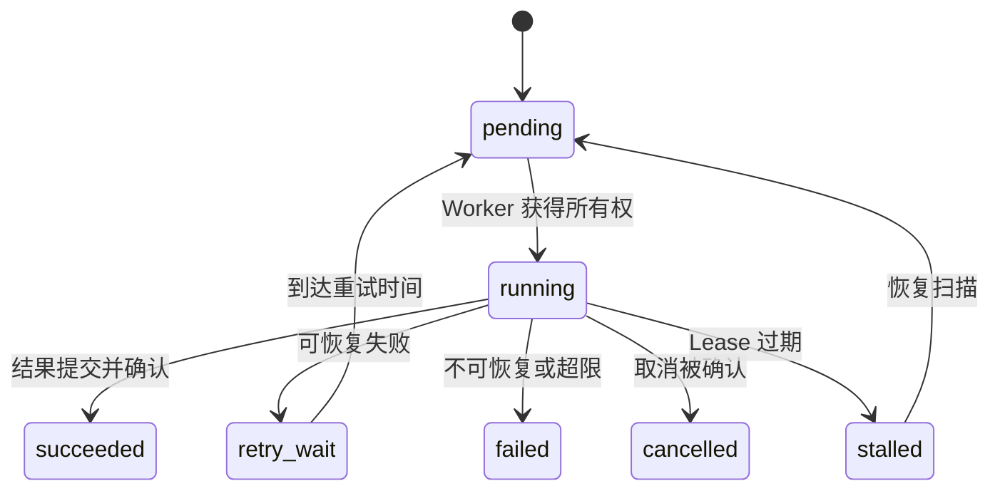

# 消息队列与 Worker：不要让文档解析堵住在线 Agent

用户问一个简单问题，却在队列里等了十分钟。原因是同一批 Worker 正在处理大文件 OCR，每个任务占用大量 CPU 和内存，在线 Agent 的短任务只能排在后面。队列能解耦生产者和消费者，却不会自动提供隔离、公平性和正确的资源配置。

任务平面要根据延迟目标、资源类型、失败语义和顺序要求拆分。在线延续任务、文档解析、Embedding、评测和清理拥有不同的并发、Prefetch、重试与停止方式。

## 从任务状态而不是 Broker 消息开始

Broker 消息负责通知“有任务可执行”，数据库任务记录负责回答当前终态、幂等键、尝试次数、所有者和结果位置。只有消息而没有持久状态，API 很难告诉用户任务在哪里，也无法判断重复投递是否已产生副作用。

## RabbitMQ、Kafka 和 Redis 解决的侧重点不同

RabbitMQ 以队列、Exchange、Routing Key 与消费者确认为中心，适合后台命令和细粒度路由。Kafka 以分区追加日志、Offset、消费组和保留为中心，适合可重放事件流和高吞吐顺序处理。Redis List/Stream 或任务框架可以支持较轻量场景，但仍要理解确认、可见性、持久化和淘汰边界。

选型不能只看吞吐宣传。要回答消息是否需要长期重放、顺序保证到什么范围、消费者怎样扩缩、失败消息放哪里、运维团队能否恢复，以及业务是否已经有可靠幂等状态。

## ACK 时机决定重复与丢失

先 ACK 再执行，Worker 崩溃可能丢任务；执行并提交结果后 ACK，Worker 可能在副作用成功但 ACK 前崩溃，于是消息会再次投递。大多数可靠队列提供的是至少一次投递，应用必须接受重复并用幂等键处理。

幂等不是简单查询“任务是否存在”。要为外部副作用定义唯一操作键，在数据库用唯一约束抢占执行权，记录未知结果，并让重试读取已有结果。发送邮件、调用无幂等 API 或模型计费请求时，需要更谨慎的状态和人工处置路径。

## Prefetch、并发和资源所有权

Prefetch 决定消费者提前持有多少未确认消息。数值过大会让慢 Worker 囤积任务，破坏公平性；过小可能浪费吞吐。Worker 并发也不能只按 CPU 核数：OCR 看 CPU/内存，Embedding 看批量和供应商配额，GPU 推理看显存和调度槽，数据库任务看连接池。

为每类队列记录单任务峰值资源、平均与尾延迟、允许并发、下游配额和最大年龄。扩 Worker 前先确认瓶颈不在共享数据库、对象存储或模型服务，否则扩容只会增加争用。

## 重试必须有限且可解释

网络连接失败、限流和短时不可用可能适合指数退避与随机抖动；Schema 错误、权限拒绝、文件损坏和模型不支持通常不会因为等待而恢复。把所有异常统一重试会制造队列风暴并掩盖永久失败。

每次尝试记录错误类别、下次时间和剩余 Deadline。达到上限后进入死信或人工队列，不要无限循环。消费者修复后可按任务 ID 重放，重放仍经过同一幂等门禁。

## Lease 与停滞恢复

长任务不能只用 `running=true` 表示所有权。Worker 启动时写入 owner 与 Lease 到期时间，执行期间续租；只有持有当前租约的 Worker 可以提交进度和终态。失去 Lease 的旧 Worker 必须停止写入，必要时由资源端的 fencing token 拒绝旧所有者。

恢复扫描器只处理超过租约且仍为运行态的任务。它要先确认 Worker 心跳、外部副作用和当前版本，再决定重入队、标为未知还是人工处理，不能把所有超时任务简单复制一份。

## 停机先停止取新任务

发布或缩容时，Worker 先取消消费或把实例标为 draining，再等待在途任务结束、续租或安全回退。宽限期结束前仍未完成的任务，应保持可恢复状态并由其他 Worker 接管。直接结束进程可能让大量任务同时等待 Lease 过期。

一个合格任务平面能从指标看出队列深度、最老任务年龄、执行时间、重试率、死信数、活跃 Lease 和各资源池利用率。它的目标不是“消息最终消失”，而是每个任务都有唯一可解释终态，在线流量不会被离线工作拖垮。
