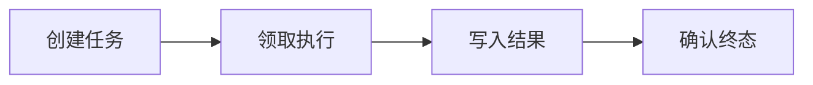

# 消息队列与 Worker：拆分在线推理和离线任务

用户上传文档后 API 立刻返回任务 ID，几分钟后数据库里却出现两份切片；另一个任务长期停在 running，重启 Worker 也没有恢复。队列只负责传递工作，不会自动提供 exactly-once。只要 ack 可能丢、Worker 可能崩溃，重复执行和租约过期就必须成为业务状态。


<InfraFigure src="/images/ai-infra/queue-worker-plane/hero.png" alt="任务从 API 进入队列，被 Worker 领取、续租、重试并写入终态的插画"
  icon="queue" caption="队列把接收请求与执行任务分开，可靠性取决于状态机而不是“异步”二字。" />


## 用条件更新阻止两个 Worker 同时拥有任务

SQL 展示数据库侧的租约获取。输入是 task_id、worker_id 和新的租约截止时间；只有 queued 或过期 running 任务能被领取。返回空行意味着当前 Worker 没有所有权。

```sql
UPDATE tasks
SET status = 'running',
    worker_id = $2,
    lease_until = $3,
    attempt = attempt + 1
WHERE id = $1
  AND (status = 'queued'
       OR (status = 'running' AND lease_until < now()))
RETURNING id, attempt, lease_until;
```

这个更新让“谁拥有任务”成为数据库可验证事实，但仍需 Worker 定期续租，并在提交结果前确认租约未丢失。解析产物要用 `(document_digest, pipeline_version)` 等唯一键防重，不能只靠消息 ID，因为重放可能使用新消息。

## 任务消息和业务任务为什么不是同一个东西

理解下面这些词时，要同时回答输入、状态和输出分别在哪里。它们不是可以互换的产品标签。

| 概念 | 在这条链路中的含义 |
| --- | --- |
| Message | 队列里的传输单元，包含 task_id 与最小路由信息。它可被重复投递，不能作为唯一业务事实。 |
| Ack | Consumer 告诉 Broker 某次投递已处理到可确认阶段。过早 ack 会丢任务，过晚 ack 会增加重复。 |
| Lease/Visibility Timeout | Worker 获得一段处理权；超时未续租时任务可被其他 Worker 领取，用来恢复崩溃。 |
| Idempotency | 同一业务操作执行多次仍产生同一个可接受终态，通常依赖唯一键、版本和条件更新。 |

::: tip 判断原则
遇到新术语，先问它改变了哪份状态；如果没有状态所有者，这个名词暂时不能指导排障。
:::

## 一次文档导入任务怎样走到可恢复终态



图里每个节点都要产生可观察结果；没有结果时，上一节点是否真正交付就是第一项检查。

### 从 创建任务 留下的证据回到 API/Database

事务内生成 task_id 和 queued 记录，再通过 outbox 或可靠发布进入队列。

决定下一步前需要看到 唯一 task_id、outbox 状态。

### 2. Worker 怎样完成领取执行

获取消息并条件更新为 running，记录 attempt 与 lease_until。

这一动作的可观察结果是 worker_id、attempt、租约。处理动作应晚于取证，否则重启或重试可能覆盖最早的失败现场。

### 3. 写入结果：Worker/Storage 持有当前状态

按内容摘要和目标知识版本幂等写入中间结果。

可以从这些位置确认结果：唯一约束、阶段 checkpoint。若完全没有证据，先判断请求是否到达本阶段；若记录冲突，则对齐 request_id、实例和时间窗口。

### 确认终态发生时，先看 Worker/Broker

事务提交后 ack；失败按分类重试或进入 dead letter。

这里不靠猜测，优先读取 succeeded/failed、ack、retry_at。

## 同一个症状，下一步证据可能完全不同

| 表面现象 | 实际可能发生的事 | 下一步证据 |
| --- | --- | --- |
| 任务执行两次 | ack 丢失或租约到期后被重新投递，是至少一次系统的正常可能性 | 检查幂等键和 attempt，不只查 Broker |
| 一直 running | Worker 崩溃且没有租约回收，状态失去所有者 | 看 lease_until 与 worker heartbeat |
| 无限重试 | 确定性输入错误被当成瞬时依赖故障 | 按错误类型设置最大次数和 dead letter |
| 队列很短仍然慢 | Worker 内部资源池、对象存储或数据库可能排队 | 沿任务 span 观察每个阶段等待 |

::: warning 结论的边界
示例输出用于建立判断路径，不应被当成目标环境的真实结果。版本、硬件和请求形状变化后要重新验证。
:::


## 哪些结论还需要真实环境验证

任务取消也需要状态机：API 写入 cancel_requested，Worker 在安全点检查并停止后写 cancelled。直接删除队列消息无法取消已被领取的工作。优先级队列要防止低优先级永久饥饿，重试必须带退避和抖动。

Worker 处理的模型和文档通常比数据库行大得多。下一篇转向对象存储，解释 bucket、object key、ETag、multipart 和不可变制品怎样协作。
