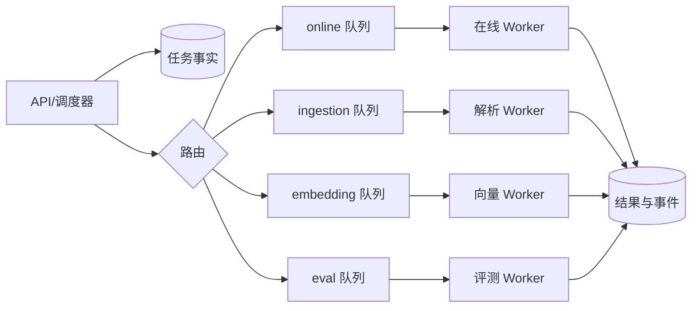
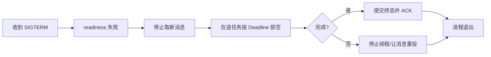

# RabbitMQ、Kafka 与 Worker 任务平面

在线问答通常几秒内要返回首个事件，文档 OCR 可能运行数分钟，Embedding 批任务消耗模型配额，离线评测又可能一次产生大量请求。如果四类工作进入同一队列、共享同一组 Worker，长任务会把在线任务压在后面。

本章把消息系统当成“任务平面”来设计：先选 RabbitMQ 或 Kafka，再拆队列、设置并发与 Prefetch，观察队列年龄，最后完成安全停机。业务幂等和任务状态已在后端课程讲过，本章关注平台怎样运行这些 Worker。

## 先分清消息、任务与结果

Broker 消息是一次投递载体；数据库任务记录是可查询的业务事实；结果可能写数据库、对象存储或事件表。



消息只传稳定任务 ID、版本和追踪信息，不塞大文件、完整文档或访问密钥。Worker 领取后从事实源读取当前状态，重复消息也走同一幂等路径。

## RabbitMQ 与 Kafka 怎样选择

两者都能传消息，但抽象不同。

| 维度 | RabbitMQ | Kafka |
| --- | --- | --- |
| 核心模型 | Exchange 路由到 Queue，消费者 ACK | 分区追加日志，消费者组维护 Offset |
| 典型任务 | 工作队列、复杂路由、单条重试 | 事件流、重放、多个独立消费者 |
| 顺序 | 单队列可观察，多个消费者完成仍可能乱序 | 分区内记录顺序稳定 |
| 重放 | 消息 ACK 后通常离开队列 | 保留期内可重置 Offset 重放 |
| 背压观察 | Ready/Unacked、队列年龄 | Consumer Lag、处理时间 |

“需要消息队列”不等于必须同时用两者。一次性后台任务常用 RabbitMQ 更直接；需要多个团队独立消费、按时间保留和重放的领域事件适合 Kafka。选择还要结合现有运维能力。

Kafka 的分区顺序不是全局顺序；增加分区可提高并行度，但同一业务 Key 要用稳定分区键。RabbitMQ 一个 Queue 多消费者时，消息投递顺序与业务完成顺序也不是一回事。

## 第一步：按资源和延迟目标拆队列

不要按代码模块随意拆，而按工作负载拆：

| 队列 | 延迟目标 | 资源 | 并发限制依据 | 失败处理 |
| --- | --- | --- | --- | --- |
| online | 首事件快 | 数据库、模型 API | 准入槽、供应商配额 | 短 Deadline，有限重试 |
| ingestion | 分钟级 | CPU、磁盘、OCR | CPU/内存 | 可分阶段恢复 |
| embedding | 吞吐优先 | 模型/GPU/API | 批大小、显存、配额 | 批次幂等、限速 |
| eval | 离线 | 模型与数据库 | 成本预算 | 固定版本，可暂停 |

拆队列后也要拆 Worker 进程或资源池，否则它们仍会争夺相同 CPU、连接池和模型槽位。Kubernetes 可用独立 Deployment；Compose 可用同一镜像、不同启动命令和并发参数。

优先级队列只能缓解短期竞争，不能替代资源隔离。高优先级流量持续满载时，低优先级任务可能永远饿死，需要配额或保留容量。

## 第二步：Prefetch 决定消息停在哪里

RabbitMQ Worker 一次预取太多消息，这些消息会进入 `unacked` 并被某个 Worker 持有，其他空闲 Worker 拿不到。对耗时差异大的任务，Prefetch 通常应接近单 Worker 并发数，再用实测调整。

观察：

```bash
rabbitmq-diagnostics -q ping
rabbitmqctl list_queues name messages_ready messages_unacknowledged consumers
```

`messages_ready` 等待投递，`messages_unacknowledged` 已发给消费者但未 ACK。Ready 很高说明生产快于消费或消费者不足；Unacked 很高可能是 Prefetch 过大、处理慢或消费者卡住。

不要只看数量。100 个十分钟任务比 1 万个 10ms 任务更严重。应在消息元数据或任务事实中记录创建时间，计算最老任务年龄和排队延迟。

Kafka 看消费者组：

```bash
kafka-consumer-groups.sh \
  --bootstrap-server kafka:9092 \
  --describe --group embedding-workers
```

关注每个分区 `CURRENT-OFFSET`、`LOG-END-OFFSET` 和 `LAG`。Lag 增长说明消费赶不上生产，但还要乘以每条处理时间并看最老事件年龄。流量为零时 Lag 不变不代表消费者健康。

命令中的服务名是假设在同一容器网络运行。替换为隔离环境实际地址，不把凭证写进 shell 历史或文章。

## 第三步：并发上限服从最紧资源

Worker 并发不是 CPU 核数的简单倍数。文档解析受 CPU/内存，数据库任务受连接池，模型调用受配额，GPU 推理受显存和批处理调度。

一个实例并发 16、运行 10 个实例，最坏会产生 160 个数据库或模型调用。容量表要从全局算，而不是只看单 Pod。

并发控制分三层：

1. 队列/消费者并发：同时领取多少任务。
2. 单任务内部并发：一个任务同时处理多少页或批次。
3. 下游准入：数据库连接、模型槽和外部限流。

三层相乘可能放大。外层 16 个任务、每个开 20 个协程，就产生 320 个下游调用。单任务内部并发也要受共享 Semaphore 或平台准入限制。

## 第四步：重试与死信不要制造热循环

暂时性超时可以重试，格式不支持、权限拒绝和参数错误不应重试。重试需要指数退避、抖动、最大次数和总 Deadline。

RabbitMQ 可使用延迟队列/TTL + Dead Letter Exchange 把消息放回重试路径；Kafka 常用重试 Topic 或把重试时间写到外部调度。无论实现如何，都要保留原任务 ID、尝试次数和最终错误类型。

DLQ 不是垃圾桶。进入后要有：数量与年龄告警、查看权限、重放前修复、重放幂等验证、不可恢复消息的归档或清理策略。把消息无限重放会重复消耗资源。

## 第五步：Worker 所有权与 ACK 顺序

至少一次投递意味着重复执行是正常输入。Worker 开始前用数据库条件更新领取任务，写入 owner 与 lease；执行中续租；完成时只有当前 owner 能提交。

典型顺序：

1. 收到消息，读取数据库任务。
2. 若已终态，直接 ACK。
3. 原子领取；失败说明已有 owner，结束或延后。
4. 执行阶段并持久化可恢复进度。
5. 原子写唯一终态。
6. ACK 消息。

第 5 步后、第 6 步前崩溃会重投，但新 Worker 看到终态后 ACK，不重复副作用。若业务需要数据库提交与发出下一条消息原子化，应明确引入 Outbox；Broker ACK 本身不能跨数据库事务。

## 第六步：停机先停止取新任务

滚动发布时直接杀 Worker，会增加重投和重复处理。安全排空过程：



不同框架对“停止消费”和 warm shutdown 的命令不同，必须在当前版本文档和隔离环境验证。容器 `terminationGracePeriodSeconds` 要大于应用排空预算，还要为进程退出留余量。

超长任务不适合只靠延长停机时间。把任务拆成可持久化阶段，或使用租约让新 Worker 从明确边界恢复。

## 第七步：任务平面的核心指标

| 类别 | 指标 | 能回答的问题 |
| --- | --- | --- |
| 到达 | 每队列生产速率 | 工作从哪里进入 |
| 排队 | Ready/Lag、最老年龄 | 是否赶不上、用户等多久 |
| 执行 | 在途数、阶段耗时 | 哪类任务占资源 |
| 结果 | 成功、失败、取消、重试 | 任务最终怎样结束 |
| 所有权 | 租约冲突、过期恢复 | 是否有重复执行或停滞 |
| 资源 | CPU、内存、连接、GPU、模型槽 | 应扩 Worker 还是下游 |

队列长度告警要结合到达率和任务年龄。发布批任务时长度上升可能预期，在线队列最老年龄超过 SLO 则应快速响应。

## 完成一张资源平面设计

为一个知识 Agent 画四队列图，并填写：生产者、任务 ID、Broker、消费者镜像、启动命令、并发、Prefetch、CPU/内存、数据库池、模型配额、Deadline、重试、DLQ、停机方式和核心指标。

然后做三次隔离验证：

1. 向 ingestion 放入慢任务，同时向 online 放短任务，短任务不应等待慢任务资源。
2. 在任务执行中终止一个 Worker，确认消息重新可见且只有一个有效终态。
3. 让模型依赖暂时失败，观察有限退避，而不是每秒热重试。

清理测试队列、匿名任务记录和专用 Worker；不要删除共享 Broker 的未知 Queue、Topic 或消息。

## 参考资料

- [RabbitMQ Consumer Prefetch](https://www.rabbitmq.com/docs/consumer-prefetch)
- [RabbitMQ Consumers](https://www.rabbitmq.com/docs/consumers)
- [Apache Kafka Consumer Configs](https://kafka.apache.org/documentation/#consumerconfigs)
- [Apache Kafka Design](https://kafka.apache.org/documentation/#design)
- [Celery Workers Guide](https://docs.celeryq.dev/en/stable/userguide/workers.html)

