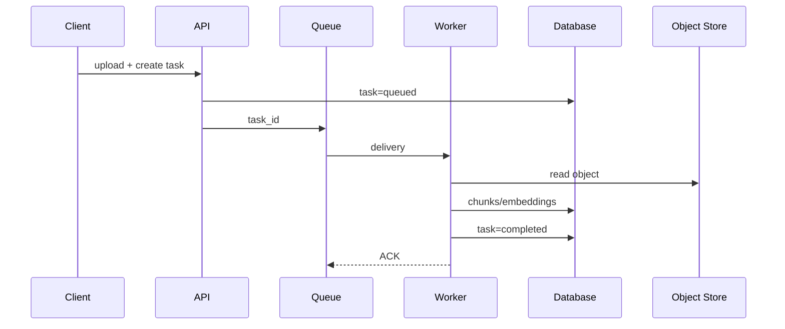

# 消息队列与 Worker：拆分在线推理和离线任务

用户上传文档后，接口应立即返回任务 ID；如果 API 进程把解析、Embedding 和对象写入都同步做完，超时只是迟早的事。队列把在线响应与后台工作分开，但它也引入了重复投递、租约、顺序和幂等问题。

## 一项文档任务怎样流动



任务状态的事实在数据库，队列只负责唤醒 Worker。ACK 前如果进程退出，消息可能再次投递；因此每个副作用都要以 task_id、chunk_id 或 idempotency_key 做幂等。

## 至少一次投递意味着什么

| 阶段 | 可能重试的原因 | 需要的保护 |
| --- | --- | --- |
| 对象读取 | 网络断开、临时 5xx | 校验 ETag/长度，重试可退避 |
| 切片写入 | Worker 在事务提交后崩溃 | 唯一键 task_id + chunk_no |
| Embedding | 批次部分成功 | 记录模型版本和输入哈希 |
| 任务状态 | 旧 Worker 晚到覆盖新状态 | 状态转换检查版本或租约 |

“消息只消费一次”通常不是现实保证。更可靠的目标是副作用至多生效一次，消息可以多次到达。任务状态要区分 queued、running、retrying、failed、completed 和 cancelled，不能用一个布尔值掩盖恢复路径。

## Worker 的租约和取消

Worker 领取任务时写入 lease_until，并定期续租。续租失败后停止写入，避免两个 Worker 同时处理。取消任务不是删除消息，而是写入取消状态，Worker 在文档分页、Embedding 批次和提交前检查取消标记。

```python
async def process(task):
    for batch in batches(task):
        await ensure_lease(task.id)
        if await is_cancelled(task.id):
            return "cancelled"
        vectors = await embed(batch)
        await save_idempotent(task.id, batch.number, vectors)
    await mark_completed(task.id)
```

示例的输入是可分页任务，输出是 completed 或 cancelled。ensure_lease 和 save_idempotent 不是装饰品，它们定义了 Worker 是否仍有权产生副作用。真实队列的 ACK、可见性超时和重试策略要按所用产品核对。

## 在线推理和离线任务不共用同一预算

模型聊天请求需要低首 Token 延迟，文档解析可以排队几分钟。把两者放在同一 Worker 池会让离线大任务挤占在线资源。按队列、优先级、并发和 GPU/CPU 资源拆分，并给每个队列设最大年龄与丢弃策略。下一篇处理任务依赖的模型和文档对象，说明为什么对象存储要有版本和校验。

## 重试要区分暂时失败和确定失败

对象存储短暂 503、数据库连接瞬断可以退避重试；文档格式不支持、模型版本不存在、权限被撤销通常是确定失败，重复执行只会浪费资源。Worker 应记录 error_code、可重试性、attempt 和下次执行时间，而不是把所有异常重新塞回队列。

Dead-letter 队列也不是终点。它保留失败消息和上下文，供人工或修复任务重新判定。重投前先修复输入、配置或代码，并保持原有幂等键，避免“修复后重放”变成第二次副作用。

## 顺序需求要显式声明

同一文档的解析、切片、Embedding 和发布通常有先后依赖，但不同文档可以并行。若队列只保证大致投递顺序，Worker 不能假设后一条消息一定看得到前一条的写入。状态机或依赖图应检查前置状态，而不是依赖消息抵达顺序。

需要严格顺序的实体可使用按文档键分区、单写者或版本号；全局严格顺序的代价通常很高，也会降低吞吐。先把顺序缩到真正需要的一小段，平台才不会被无谓串行化。
