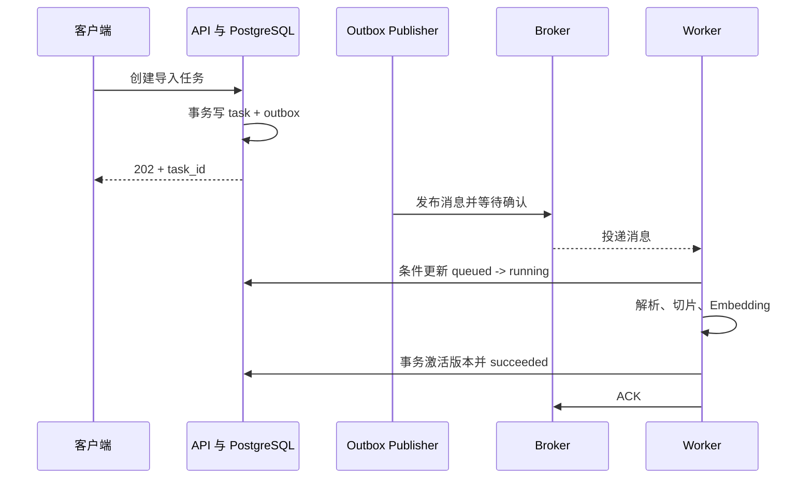

# 消息队列是什么？后台任务怎样可靠地执行、重试和结束

上传一份两百页文档后，解析、OCR、切片、Embedding 和索引可能需要几分钟。让 HTTP 请求一直等待，会占用连接，也让浏览器断开与任务执行绑在一起。更合适的做法是 API 先保存任务状态，把一条消息交给后台 Worker，然后返回 task ID，让客户端查询进度。

消息队列连接了提交者与执行者，但它不会自动让任务可靠。消息什么时候算已接收，Worker 在哪里确认，失败后是否重投，重复执行怎样避免，超过重试次数后由谁处理，都需要明确协议。只要其中一处状态只存在进程内存，崩溃就可能造成丢失或重复。

::: info 消息队列的准确含义

消息队列是让生产者提交消息、让消费者异步接收并处理消息的中间系统。它在两端速度不一致时保存待处理数据，并通过确认、重投、保留或消费位置表达交付状态。

消息队列传递的是工作描述或事件，不应成为大文件本体的唯一存储。文档和模型放对象存储，消息携带受控对象 Key、版本和校验信息。

:::

## 消息、任务和业务状态有什么区别

消息是中间件保存和传递的数据单元，通常包含类型、ID、时间、版本和负载。任务是系统希望完成的一项工作，比如“解析文档版本 17”。业务状态存在数据库中，记录 queued、running、succeeded 或 failed。三者相关但不是同一个对象。

队列中的消息可能因重试出现多次，数据库任务仍应只有一个逻辑身份。消费者收到消息后用 task_id 查询当前状态，已 succeeded 就直接确认，仍 queued 才尝试领取。把完整任务状态只写在消息里，管理端无法稳定查询，也难以处理取消和人工重试。

消息负载要小而稳定。上传文档的二进制放对象存储，消息保存 bucket、object key、checksum 和文档版本。Worker 读取前重新校验对象身份，不能相信消息中的任意路径。大消息会占 Broker 内存、网络与复制，重试时还要反复传输。

消息 schema 需要版本。生产者升级后，新字段可以用默认值保持旧消费者兼容；删除或改变语义则要先升级消费者。消息已经在队列中时，代码发布不会自动迁移旧负载。消费者遇到未知版本应进入明确失败，而不是按错误格式继续写数据。

业务事实和消息投递跨两个系统。API 提交数据库事务后进程崩溃，消息可能没发；先发消息再提交数据库，Worker 可能找不到任务。Outbox Pattern 在同一数据库事务中写任务和 outbox 事件，由发布器可靠发送，再标记已发布，解决这个交接窗口。

可以用“文档版本 17 的导入”来区分三者：消息只携带 task_id、document_id 和 revision，任务表记录当前 queued 或 running，文档表记录原始对象已经 verified 还是仍在 staging。Worker 重启后重新收到消息，先查任务状态，再决定继续、跳过还是进入人工检查。消息负责让工作被看见，数据库负责让结果可查询，任何一边都不能单独替代另一边。

这个区分也限制了成功的含义。Broker 返回 publish confirm，只能证明消息按 Broker 的持久化语义被接受；它不证明 Worker 已执行，也不证明向量索引已经发布。最终成功要由业务状态和可验证的产物共同表示，管理端显示的进度才不会提前跳到完成。

## 生产者是什么，发送成功到底证明了什么

生产者创建并发送消息。API、定时任务和数据库 Outbox Publisher 都可以是生产者。发送前要生成稳定 message_id 与 task_id，选择目标队列或主题，序列化 payload，并设置持久、优先级或延迟等属性。生产者身份应有最小发布权限。

客户端 `publish()` 返回不一定表示 Broker 已持久保存。某些库只把字节写进本地 socket 缓冲，连接随后断开时消息状态不明。可靠发布要使用产品提供的 Publisher Confirm、事务或等价确认，确认语义还取决于复制与持久配置。

发送超时也是不确定结果。Broker 可能已接受，确认包在网络中丢失；生产者重试会出现重复消息。因此每次重试沿用同一个 message_id，消费者以业务幂等处理重复，不能每次生成新 ID 假装是新任务。

生产者要处理背压。Broker 磁盘不足、队列达到长度限制或连接流控时，发送会变慢或失败。API 不应该无限把消息暂存在进程内存。Outbox 可以让 HTTP 请求先确认数据库已接收，再由发布器按速度重试，管理端显示 queued_for_publish 而不是谎报已在队列。

路由 Key 和分区 Key 决定消息去哪里。文档类型可以路由给 OCR 或纯文本 Worker，同一 document_id 作为分区 Key 可以保留相关事件顺序。Key 选择不当会形成热点，一个大租户压在单分区；随机 Key 能均衡，却失去局部顺序。

## 消费者和 Worker 分别是什么

消费者是从 Broker 接收消息并参与确认协议的客户端角色，Worker 是运行消费者并执行业务代码的进程或容器。一个 Worker 可以有多个消费者并发槽，一个消费者也可以把任务交给内部线程或进程池。需要知道 ACK 由哪一层发出，不能在业务真正完成前提前确认。

消费者连接 Broker，订阅队列或分区。Broker 根据产品规则推送或由客户端拉取消息。预取数量控制一个消费者同时持有多少未确认消息。预取过大时，慢 Worker 手里堆了很多任务，其他 Worker 空闲；过小则网络往返与调度利用率不足。

Worker 收到任务后先校验 schema、租户和对象身份，再原子领取数据库任务。领取可以用状态条件 UPDATE 或行锁，确保两个重复消费者只有一个进入 running。然后执行外部步骤，定期保存阶段与心跳。进程重启后，恢复器根据租约判断 running 是否已失去所有者。

Worker 并发数受 CPU、内存、数据库连接、外部 API 额度和 GPU 槽共同限制。一个 OCR 进程占两 GB 内存，十六并发可能先 OOM；Embedding API 只允许八并发，继续从队列取也只是增加在途。预取、内部池与资源限额要形成一致上限。

Worker 停止时先暂停领取新消息，再等待当前任务到可恢复点，最后关闭消费者连接。编排宽限要大于正常清理时间。强制退出前未 ACK 的消息会被重投是理想情况，仍要用实际 Broker 与客户端验证。

## ACK 是什么，为什么确认太早和太晚都可能出错

ACK 是消费者告诉 Broker 某条消息已经按协议处理完成。确认后 Broker 可以从队列删除、推进消费位置或把它视为不再需要重投。ACK 的准确作用由 RabbitMQ、Kafka、Redis Stream 等产品决定，不能用一个词推断所有实现相同。

若消费者收到消息立即 ACK，再开始解析，进程中途崩溃时 Broker 认为任务结束，不会重投，任务丢失。若业务提交数据库成功后，在 ACK 前连接断开，Broker 会重投，任务重复。可靠系统通常接受至少一次交付，并用幂等消化第二种重复。

Negative ACK 或 reject 表示本次未成功，Broker 可以重回队列或丢弃/死信。对立即重试无意义的错误，不应直接 requeue 形成高速循环。格式损坏、权限拒绝和对象 checksum 不匹配属于永久错误；网络超时和临时限流可能重试，但要延迟。

Kafka 常通过提交 offset 表示某分区消息已消费到哪里，不是逐条删除。自动提交 offset 可能在业务完成前推进，手工提交则要处理批次中部分成功。RabbitMQ 的 delivery tag 属于 channel，不能跨连接确认。Redis Stream 的 XACK 只移出 Pending，不自动删除 Stream 记录。

ACK 与数据库提交无法靠普通调用成为一个跨系统原子操作。最常用设计是业务结果带幂等键提交数据库，然后 ACK；重复消息再次到达时查询到已完成并快速 ACK。exactly-once 宣称必须说明范围，某个 Broker 内的事务语义不等于对象存储和模型 API 都恰好执行一次。

## 重试是什么，退避和随机抖动怎样减少故障放大

重试是在失败后再次尝试同一逻辑工作。只有失败可能暂时消失，且操作可以重复或有幂等保护时才适合。参数校验失败、文件格式不支持和租户无权限不会因等待十秒变好，应直接失败。429、连接超时和临时 503 可以按限制重试。

立即无限重试会形成忙循环，故障依赖刚恢复就再次被流量压垮。指数退避让等待时间按 1、2、4、8 秒增长，并设置最大值；随机抖动让多个 Worker 不在同一毫秒醒来。服务端提供 Retry-After 时，在产品允许范围内尊重它。

重试次数不能只放进 Worker 内存。消息 Header、任务尝试表或重试队列记录 attempt、last_error、next_run_at 和 first_failed_at。进程重启后仍知道已经试过几次。重新发布消息时沿用 task_id，并生成 attempt_id 区分每次执行证据。

重试有总时间预算。用户要求十分钟内导入完成，任务已经等待九分半，继续五次长退避没有意义。Deadline 从创建时间计算，不因重新入队刷新。超过 Deadline 进入 failed 或 expired，并按业务选择人工恢复。

下游调用也有自己的重试。HTTP Client 重试三次，Worker 外层再重试五次，总调用可能达到十五次。每层要登记次数，通常由最了解幂等与预算的业务层控制。代理、SDK 与队列默认值也要核对，避免隐藏乘法。

## 幂等是什么，怎样让重复消息得到同一业务结果

幂等表示同一个逻辑操作执行一次或多次，最终业务状态与一次执行一致。它不要求每次都完全不运行，也不表示没有额外日志和网络成本。创建文档如果每次生成新 ID 就不幂等，按固定 task_id 插入并用唯一约束则能识别重复。

数据库是常见幂等边界。`task_id` 建唯一索引，Worker 用条件更新从 queued 切到 running；写切片使用 `(document_version_id, ordinal)` 唯一约束；激活版本只允许从 building 进入 active。重复执行命中已有行时，比较请求摘要，确认是同一输入后复用结果。

外部 API 也需要幂等键。对象存储写入可以使用内容地址或固定版本 Key，模型 Batch API 若支持 idempotency key 就传 task ID。对不支持幂等的第三方副作用操作，先写本地意图与状态，调用后记录外部 ID，并准备人工对账和补偿。

锁不是幂等。分布式锁可以减少同时执行，锁到期、网络分区或 Worker 暂停后仍可能有两个执行者。最终数据库唯一约束和状态机才决定谁能提交。锁用于降低重复成本，不能作为唯一正确性来源。

结果缓存也不等于幂等记录。缓存被驱逐后重复消息又会执行，权威幂等状态应按任务保留期持久保存。删除旧记录前确认消息保留、审计和客户端重试窗口都已结束。

## 死信是什么，它为什么不是失败消息垃圾桶

死信是无法按正常消费流程继续处理的消息。它可能达到最大重试次数、过期、被消费者拒绝不再入队，或因队列策略转移。Dead Letter Queue 保存这些消息供分析、修复和受控重放，不是把故障从告警中消失掉。

死信记录需要包含原 message_id、task_id、schema 版本、失败类别、尝试次数、首次与最后失败时间，以及脱敏负载引用。完整文档内容不复制进死信，仍通过对象 Key 找到。Secret、Authorization 和用户 Prompt 不进入 Header 或管理界面。

进入死信后，数据库任务状态也要变成 failed 或 needs_review。只把消息移到 DLQ，管理端仍显示 running，会让用户无限等待。状态更新和死信动作可能跨系统失败，恢复器要能发现 DLQ 有消息但任务未结束，或任务 failed 但消息仍在正常队列。

重放前先修复根因和消费者版本，再筛选明确消息集合。整队重放会重新冲击下游，也可能重复已人工处理任务。重放生成新的 attempt_id，保留原 task_id 和死信证据；处理成功后标记 resolved，不直接删除所有历史。

DLQ 长度为零不是健康的充分条件。消息可能在正常队列无限重试或提前 ACK 丢失。需要同时观察 ready、in-flight、oldest age、retry rate、pending、dead-letter 和数据库任务状态分布。

## 队列、发布订阅和日志型系统有什么区别

工作队列通常希望一条任务由一个消费者实例处理，多个 Worker 竞争领取来扩展吞吐。发布订阅希望同一事件交给多个订阅者，比如文档激活后，审计、通知和搜索索引都各自处理。一个订阅者成功不代表另一个成功。

日志型消息系统按分区保存有序记录，消费者通过 offset 读取并能在保留期内重放。Kafka 常用于事件流和大吞吐，队列删除语义与 RabbitMQ 不同。Redis Stream 也保留记录并有消费者组，但集群、保留和生态特征不同。

顺序通常只在队列、分区或同一 Key 范围保证。多个并发消费者会改变全局完成顺序。文档 version 2 和 version 3 同时导入时，后完成的旧版本不能覆盖 current pointer，数据库状态转换要比较版本。依赖消息绝不能只靠“发送顺序应该一样”。

优先级队列让小型交互任务先处理，但低优先级任务可能饥饿。把所有任务放一个队列还会让长 OCR 阻塞短元数据刷新。按资源类型拆队列和 Worker 池，分别设并发与配额，更容易控制；拆得过细又增加运维和跨队列协调。

定时任务和延迟任务可以由 Broker 延迟机制、单独重试队列或数据库 next_run_at 调度。具体产品对延迟长度、消息数量和持久化的支持不同。数月后的业务预约通常应有数据库权威记录，队列只负责接近执行时间的投递。

## 取消、租约和心跳怎样结束一项正在运行的任务

排队中的任务容易取消。API 在数据库把 queued 改为 canceled，消费者以后收到消息时读取状态并直接 ACK。Broker 中的消息不一定需要立刻物理删除，只要权威状态让它不再执行。尝试按消息位置删除会依赖产品内部顺序，也可能误删重试版本。

running 任务只能协作取消。API 把 cancel_requested_at 写入数据库，Worker 在解析页、批量 Embedding 和写入阶段之间检查。正在调用外部模型时，还要调用其取消接口或关闭受支持的请求。强制杀进程会让当前步骤停下，却无法保证第三方副作用停止。

租约说明某个 Worker 在一段时间内拥有任务执行权。领取时设置 owner 和 lease_until，Worker 周期续约并写 heartbeat。恢复器只在租约过期后允许另一个 Worker 接管，避免网络短抖动马上产生双执行。租约时间要大于正常心跳间隔和暂停抖动，又不能让崩溃任务长期无人恢复。

旧 Worker 可能在租约过期后恢复运行。每次领取生成 fencing token 或单调 attempt 号，提交结果时数据库检查当前 owner 与 token。旧执行者即使完成，也无法覆盖新 attempt 的状态。仅依赖“心跳应该已经停了”不能防止暂停恢复后的迟到写入。

取消后的结果策略要明确。若版本尚未激活，可以保留 failed/canceled building 数据供短期诊断后清理；若已经进入原子激活事务，取消可能太晚，只能把任务视为成功并另建删除操作。状态机需要 `cancel_requested` 与最终 `canceled`，不能点击取消就立即对用户宣称所有计算已经结束。

## 消息安全、租户边界和大负载怎样处理

Broker 凭证按生产和消费权限拆分。API 只能向指定 Exchange 或 Topic 发布，OCR Worker 只读自己的队列，管理与清理权限不交给业务容器。TLS 保护网络传输，证书与主机名验证不能关闭。管理控制台限制内网与强认证，因为它能查看消息元数据并改变队列。

消费者不能把消息当成可信内部输入。生产凭证可能泄露，旧服务也可能发送错误 schema。Worker 校验类型、版本、字段长度、tenant 与对象 Key，再从数据库读取权威任务。消息给出 tenant 7，但数据库 task 属于 tenant 9 时，应拒绝并告警，不能以消息覆盖数据库。

消息中不放 API Key、数据库密码、完整 Prompt 和原文件。需要临时下载权限时，由 Worker 用自身身份请求短时预签名 URL，或使用对象存储最小权限凭证。死信、重试 Header、Trace 和 Broker 备份都会复制消息，敏感数据一旦进入就很难彻底删除。

大文件放对象存储，消息保存不可变版本 Key 和 checksum。Worker 下载前检查对象大小上限和媒体类型，下载后再算摘要。预签名 URL 有时会在任务真正执行前过期，长期排队消息更适合保存对象身份而不是短期 URL。

多租户公平不能只靠一个 FIFO。大租户持续发送长任务，会占满 Worker。可以按租户设准入配额、每租户并发和加权调度，或者拆共享与专用队列。无论策略是什么，数据库任务状态必须记录为何等待，区分 Broker backlog、租户限流和资源不足。

## 队列容量和观测指标怎样说明系统是否跟得上

到达率是单位时间新任务数，完成率是 Worker 完成任务数。长期到达率大于完成率，队列一定增长。短峰值可以靠缓冲吸收，持续过载则要增加有效处理能力、降低输入或改变任务成本。只增加队列长度会推迟失败，并让用户等待更久。

队列长度不能单独表示延迟。十个两小时任务和一万个十毫秒任务的长度差异很大。oldest_message_age 更能说明最坏等待，按任务类型的 queue_wait 与 execution_time 能估算容量。运行中的 in-flight 也要计入，不然大预取会让队列看似清空。

Little's Law 在稳定系统中给出平均在系统任务数 L、到达率 λ 和平均停留时间 W 的关系：`L = λ × W`。每秒到达 2 个任务，平均从创建到结束 30 秒，系统平均约有 60 个任务，包含排队和执行。它是检查量级的工具，不替代分位数与不同任务类型分析。

重试会增加内部到达率。外部每秒 2 个任务，平均每项执行 1.5 次，Worker 实际每秒要处理约 3 次尝试。监控 retry_rate、attempts_per_task 和失败类别，避免把重试流量误判为用户增长。DLQ 增速与最长未处理时间要有告警和负责人。

Broker 指标、Worker 指标与业务任务表需要按 task_id 或聚合标签对齐。Broker 显示 ACK 只说明消息协议结束，数据库 succeeded 才说明业务状态；任务 succeeded 还要验证输出制品存在并可读。三层出现冲突时，恢复器和人工流程都要有明确处理顺序。

| 观察到的现象 | 目前能确认的事实 | 下一步证据 |
| --- | --- | --- |
| ready 持续增长 | 新工作快于领取或消费者不可用 | 到达率、消费者连接、租户准入 |
| ready 下降但 in-flight 很高 | 消息已分配给消费者 | 预取、执行时间、Worker 内存 |
| redelivered 增长 | 消息在确认前失去消费者或被拒绝 | 退出日志、ACK 时机、连接状态 |
| 数据库 running 长期不变 | 任务未写最终状态 | lease、heartbeat、当前 owner、Broker Pending |
| DLQ 增长 | 消息按策略停止正常重试 | 错误分类、schema 版本、下游状态 |
| 队列为空但用户仍等待 | Broker 没有待取消息 | 是否提前 ACK、任务表与 Outbox 状态 |

最后一行是最危险的误判。队列空可以是处理完成，也可以是消息没发布、被提前确认或路由到错误队列。每项监控都要和状态所有者一起解释。

## 队列拓扑、保留和升级怎样安全变化

Queue、Exchange、Topic、Subscription 和 Consumer Group 通常由声明创建。某些属性创建后不能原地修改，名称相同但 durable、参数或类型不一致会让启动失败。基础设施变更要版本化新名字，双写或转发旧消息，确认排空后再删除旧对象。

保留策略决定消息能存多久、队列多大和超过边界如何处理。过期可以死信、丢弃或阻止新发布，各产品行为不同。任务 Deadline 与 Broker TTL 要协调，TTL 先到会让数据库仍 queued 却永远没消息；恢复器要能找到这种差异。

消费者滚动升级时，新旧版本会同时处理。消息 schema 先做到向后兼容，再发布生产者新字段，最后移除旧读取路径。若处理逻辑结果不同，按任务版本路由或在数据库记录 handler_version，不能让同一任务重试时悄悄换算法而无证据。

Broker 升级与故障切换要在隔离环境演练未确认消息、Publisher Confirm 和消费位置。连接重建后是否重复投递、顺序是否变化、客户端是否自动恢复订阅，都用实际版本验证。库文档中的默认重连不代表业务幂等已经完成。

删除队列前确认 ready、in-flight、DLQ、消费者和数据库未结束任务都为预期，保存审计后按明确名称处理。批量清理未知队列可能删除唯一任务副本。稳定系统也只保留有用途的旧拓扑，避免恢复时消息路由到无人消费的历史名称。

## 一条文档导入任务怎样从 HTTP 进入 Worker

客户端上传对象后请求创建导入任务。API 在一个 PostgreSQL 事务中验证权限、创建 task queued 记录，并写 outbox `document.import.requested`。事务提交后返回 202 与 task_id。此时任务已被系统接收，但可能还在 outbox，不能显示 Worker 已开始。

Outbox Publisher 读取未发布记录，发送持久消息并等待 Broker confirm，随后标记 published。消费者收到后按 task_id 原子领取任务，状态改 running 并记录 worker_id、lease_until 与 attempt。Worker 校验对象 checksum，依次解析、切片、Embedding、写入 building 版本。

所有切片完成后，短数据库事务激活新版本并把任务标 succeeded。事务提交成功后消费者 ACK。客户端轮询 task_id 得到结果引用。Worker 日志、数据库状态和队列消息使用同一 task_id，Trace 可再用 attempt_id 区分重试。



这张图中 API 返回发生在 Broker 发布之前，这是 Outbox 的设计边界。管理端应显示 queued，而不是宣称已投递。ACK 在业务提交之后，所以连接断开会导致重复投递，但幂等状态会把已 succeeded 任务快速确认。

## 任务 Envelope 和状态表怎样写

下面 JSON 是消息 Envelope 示例。它只引用对象和业务身份，不携带文件正文。`payload_version` 让消费者选择解析器，`created_at` 与 deadline 用绝对时间，避免每次重试刷新预算。

```json
{
  "message_id": "msg_01JEXAMPLE",
  "task_id": "task_01JEXAMPLE",
  "type": "document.import.requested",
  "payload_version": 2,
  "tenant_id": 7,
  "document_version_id": 113,
  "object": {
    "bucket": "documents",
    "key": "tenant-7/doc-42/version-3/source.pdf",
    "sha256": "REPLACE_WITH_REAL_DIGEST"
  },
  "created_at": "2026-08-18T08:00:00Z",
  "deadline_at": "2026-08-18T08:20:00Z",
  "attempt": 1
}
```

message_id 在一次投递重试中保持稳定还是每次发布生成新值，要由协议定义；task_id 必须稳定指向逻辑工作。对象 Key 从已验证数据库状态生成，Worker 仍核对 tenant 与 checksum。时间使用 UTC，消费者比较 Server 当前时间并允许受控时钟误差。

任务表至少保存 state、attempt、lease、last_error、result_ref、created_at、started_at 与 finished_at。状态转换用条件 UPDATE，`WHERE id=? AND state='queued'` 受影响一行才领取成功。错误保存分类与摘要，不把完整文档文本写进 last_error。

## Worker 崩溃时怎样证明任务会恢复

故障推演输入一条已投递消息。Worker 把任务改为 running，完成解析后进程被终止，尚未 ACK。Broker 检测连接关闭，把未确认消息重新可见；另一个 Worker 收到同一 task_id，发现旧 lease 过期后领取新 attempt，从持久检查点继续或重新执行幂等步骤。

如果消息已经 ACK 但数据库仍 running，说明确认过早，Broker 不会重投。恢复扫描器可以发现 lease 过期并从数据库重新发布，但这只是补偿，协议应修正为提交成功后 ACK。若数据库 succeeded 而 ACK 丢失，重复消息会看到完成状态并直接 ACK，不再生成第二版本。

重试达到上限后，消费者把错误分类为 permanent 或 exhausted，消息进入 DLQ，任务变 failed。管理端显示可理解原因与是否允许人工重试。人工修复后创建新 attempt，不能把原失败日志覆盖掉。

验证要同时查询队列、任务表和制品。正常路径只有一个 active 版本；重复消息没有重复 chunk；进程崩溃后任务最终结束；永久错误进入 DLQ；客户端取消只改变允许取消阶段的任务。队列长度下降不代表任务正确完成，数据库状态与输出校验才是最终结果。

## 机制复核：消息队列是什么？后台任务怎样可靠地执行、重试和结束
基础设施文章最终要回答资源从哪里来、由谁调度、失败如何回收。把模型、GPU、网络、队列、制品和数据的生命周期画成一条链，分别记录容量单位、版本身份、健康信号和所有权。单一利用率或一次成功启动不能证明系统可用。

落地验证分成离线配置检查、隔离环境运行和候选发布回归。至少覆盖资源不足、进程重启、重复任务、网络抖动和旧版本并存，并保留命令输出、指标时间窗和回滚点。生产环境只运行已构建产物，构建和压力实验放在独立环境。

性能数字需要说明硬件、输入规模、并发模型和测量口径。观察到长尾或成本异常时，先定位排队、计算、传输、存储和重试分别占用的时间，再决定扩容、限流、批处理或降级。
