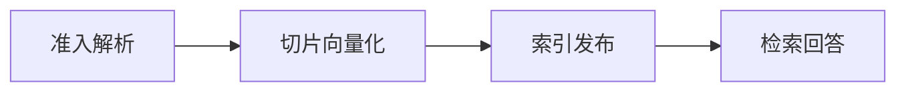

# RAG Infra：从文档发布到带证据回答

检索结果与问题高度相关，回答却引用了另一个租户的内部文档。向量库没有“越权”，因为查询根本没有带租户过滤；重排器只看相似度，又把错误结果排到了第一位。RAG 的正确性不止是召回率，首先是文档能否进入、属于谁、哪个版本已发布，以及证据是否可回到原文。


## 为什么 RAG 不是“切片后存向量”

| 概念 | 在这条链路中的含义 |
| --- | --- |
| Ingestion Plane | 离线接收文档、解析、切片、Embedding、建索引和发布知识版本的处理链。 |
| Query Plane | 在线改写查询、带范围检索、重排、组装上下文并生成引用的链路。 |
| Chunk | 带来源位置、文档版本和 ACL 的文本单元，不只是若干字符。 |
| Embedding | 把文本映射到向量空间以便相似搜索；不同模型/版本的向量通常不能混用。 |
| Evidence | 用户可见且可定位到文档版本和片段的依据，不等同检索器返回的任意文本。 |

## 排障时最容易走错的岔路

| 表面现象 | 实际可能发生的事 | 下一步证据 |
| --- | --- | --- |
| 检索到正确文档 | 片段可能来自旧版本、撤回状态或错误权限 | 核对 manifest、ACL 和发布指针 |
| 相似度很高 | 文本相似不等于回答问题或支持结论 | 重排并验证证据覆盖 |
| 没有结果 | 不能回退到全租户或公开未知范围 | 安全返回无证据并记录范围 |
| 重建索引 | 半成品若直接覆盖在线索引会产生混合版本 | staging 完整后原子切换 |

::: warning 不要用重启代替诊断
恢复服务和解释故障是两个目标。紧急止损后仍要回到原始日志、指标与状态转换，避免同类问题重复出现。
:::

## 一份文档怎样从上传走到可引用



### 准入解析：Ingestion Worker

校验文件、租户与权限，解析版面并保留页码/区块位置。

这一动作的可观察结果是 document digest、parser version、parse errors。处理动作应晚于取证，否则重启或重试可能覆盖最早的失败现场。

### 切片向量化：Chunker/Embedding

按语义和结构切片，批量生成带模型版本的向量。

可以从这些位置确认结果：chunk IDs、embedding model、failed batch。若完全没有证据，先判断请求是否到达本阶段；若记录冲突，则对齐 request_id、实例和时间窗口。

### 索引发布：Knowledge Control Plane

在 staging 构建完整版本，校验计数后原子发布。

这里不靠猜测，优先读取 knowledge_version、manifest、published。

### 检索回答：Retriever/Reranker/LLM

先按租户版本过滤，再相似检索、重排和引用。

决定下一步前需要看到 filters、scores、citation spans。

## 把权限过滤放到召回之前

伪代码强调顺序，不绑定特定向量库。输入是主体可见范围、已发布知识版本和 query vector；输出只包含可见候选。

```python
scope = {
    "tenant_id": principal.tenant_id,
    "knowledge_version": published_version,
    "allowed_collection_ids": principal.collection_ids,
}
candidates = vector_store.search(
    query_vector, filters=scope, limit=50
)
ranked = reranker.rank(query, candidates)[:8]
assert all(item.tenant_id == principal.tenant_id for item in ranked)
```

先全局搜索再在应用层过滤可能泄露得分、元数据，也可能让正确租户结果在 top-k 前就被挤掉。生产代码不能只靠 assert，应在存储查询、Repository 和返回边界重复执行确定性范围约束。引用要包含 document_id、version 和位置，不能只返回模型编造的标题。


## 最后回到适用范围

RAG 不能保证模型只使用证据，生成层仍需引用约束和回答评测。Embedding、切片和重排版本变化会使旧索引不可直接比较；所有质量结论要固定数据集与知识版本。

请求现在跨过网关、Agent、RAG 和 Serving。下一篇把这些阶段连接成 Trace、Metric、Log、质量信号与 SLO。
