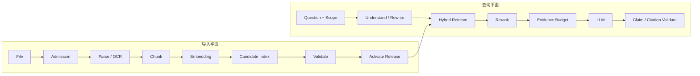

# RAG Infra：检索到相似文本不等于回答有证据

向量查询返回了五个高分片段，答案仍然引用错误版本。相似度排序只回答“哪些向量靠近查询”，没有自动保证租户权限、知识 Release、时间、文档状态和 Claim 支持。RAG Infra 必须把导入平面与查询平面共同设计。

导入平面把不可信文件变成可发布知识版本；查询平面把用户问题变成受范围约束的 Evidence，再让模型生成并验证引用。两条平面通过不可变 Release 连接。

## RAG 双平面

导入失败不会改变当前 Active Release。查询开始时固定 Release ID 与 Scope，后续所有召回、缓存和引用都使用同一快照。这样新知识构建到一半时，在线请求仍看到完整旧版本。

## 文件准入与解析

上传前限制大小、类型、协议和租户配额；上传后核对 MIME 与 Magic、压缩比、校验和和安全扫描。外部 URL 还要防止 SSRF、重定向到内网和超大响应。文件内容始终是不可信数据，不能因为进入知识库就变成系统指令。

解析输出不仅是纯文本，还应保留页码、标题层级、表格单元、图片/OCR 区域和源对象位置。解析器版本、错误和质量统计写入任务状态，便于重建与比较。

## Chunk 是检索单元

固定字符切片简单，但可能切断标题与段落；按文档结构切片保留语义，长度仍需受 Token 上限控制；语义切片依赖模型和阈值，必须有评测。Overlap 可以保留边界上下文，也会产生重复候选和存储成本。

每个 Chunk 拥有稳定 ID、内容哈希、文档/版本、顺序、定位信息、权限和解析器版本。Chunk 文本变化后产生新版本，不在原向量上静默覆盖。

## Embedding 与向量写入

Embedding 把文本映射到固定维度向量。距离含义由模型和算子共同定义；更换模型或归一化方式后，旧向量通常不能直接混用。批处理要遵守单批 Token、速率和请求大小限制。

部分批次失败时只重试失败范围。写入使用 Release、Chunk ID 与 Embedding Model 组成幂等键。候选版本完成后对账预期 Chunk、成功向量和失败数量，不能因为大部分成功就激活残缺索引。

## 向量库与索引

pgvector 能把关系过滤、事务和向量放在 PostgreSQL；专用向量库提供不同扩展与运维模型。选型要看权限过滤、数据规模、写入模式、索引、备份、团队能力和迁移成本，而不是只比较名称。

精确扫描提供召回基线，HNSW、IVFFlat 等近似索引以资源换速度。每次调参用固定标注集比较 Recall@K、MRR/nDCG、延迟、内存和过滤结果。索引快但漏掉关键证据，不能称为优化成功。

## Query Understanding 与混合检索

用户问题可能包含实体、时间、否定和多个目标。改写可以生成更适合搜索的表达，但不能改变租户、时间和否定条件。问题分解产生有依赖的子查询，并受总预算与停止条件限制。

向量检索擅长语义相近，关键词/BM25 对精确术语、ID 和错误码更稳定，结构化查询适合实体和状态。混合检索先在同一 Scope 与 Release 下产生候选，再用 RRF 或受控分数组合去重。

## Rerank 与 Evidence

Reranker 对查询与候选做更精细相关性判断，成本高于初召回，因此只处理有限候选。相关性仍不等于可支持 Claim。系统把最终片段转换为 Evidence：包含来源、定位、版本、权限、原文和选择原因。

上下文装配按 Token Budget 选择 Evidence，保留回答需要的多样来源并避免重复。模型输出拆成 Claim，每个事实 Claim 绑定支持它的 Evidence。找不到证据时缩小结论或拒答，不让语言流畅替代事实。

## 缓存与权限

查询改写、Embedding、候选和最终回答都可以缓存，但 Cache Key 必须包含租户 Scope、知识 Release、模型/Prompt 版本和查询规范化。命中后仍要确认权限与版本有效。撤权或 Release 切换需要可控失效。

跨租户共享 Embedding 模型不意味着可以共享候选结果。缓存错误命中会绕过数据库过滤，是比未命中更严重的问题。

## 质量和运行指标

导入侧观察各阶段成功率、年龄、Chunk/向量对账、孤立对象和 Release 时间；查询侧观察 Recall、排序、Evidence 覆盖、引用有效、拒答、延迟和成本。Trace 应能从答案引用回到 Chunk、文档、对象与 Release。

安全测试加入恶意文档、越权实体、撤回知识和提示注入。质量测试加入无答案、冲突版本、多跳和精确术语。只有数据完整、权限不越界、证据可追溯且检索指标通过，候选知识版本才可发布。

RAG Infra 的最终产物不是向量数据库，而是一条可重建、可评测、可发布和可拒答的证据供应链。
