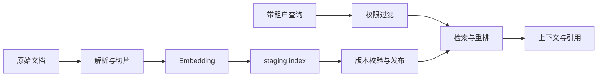
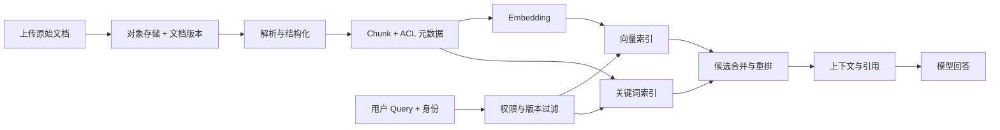

# RAG Infra 是什么？文档怎样变成可检索且有权限的知识

RAG 常被画成“问题变向量，向量库找文档，模型回答”三步图。真实系统还要处理上传文件是否完整、同一文档多次更新、PDF 解析失败、Chunk 属于谁、权限是否在检索前生效、向量模型升级、删除后旧缓存是否仍能命中，以及回答中的引用能不能回到原文。任何一层缺少身份和状态，最终答案都可能引用错误或越权内容。

RAG Infra 是支撑文档进入检索系统并安全返回证据的一组基础设施。它包括对象存储、导入队列、解析器、切片、Embedding 服务、向量与关键词索引、元数据数据库、权限过滤、重排、缓存、观测和删除流程。模型生成只是最后消费者，知识是否可靠主要由前面的数据链决定。

::: info RAG Infra 的准确含义

RAG Infra 是为检索增强生成提供数据导入、索引、查询、权限、版本、引用和生命周期管理的工程系统。它把原始文档转换成可搜索的 Chunk，并在查询时只返回当前主体有权访问、版本有效且能追溯来源的证据。

RAG Infra 不等于向量数据库。向量索引只负责一种相似搜索，原始文件、解析状态、ACL、关键词检索、重排、引用和删除通常由其他组件共同完成。

:::

## 文档、版本、Chunk 和向量分别是什么

文档是用户理解的知识对象，例如一份手册、网页或表格。文档 ID 在更新中保持稳定，版本 ID 指向某次具体内容。原始文件保存在对象存储，元数据数据库记录 Hash、MIME、大小、租户、来源、状态和当前版本。

Chunk 是从一个文档版本切出的可检索片段。它有稳定的 chunk ID、文档版本、页码或段落位置、文本、标题路径、语言和权限标签。Chunk 不是原始文件，删除原文件或更新版本后，旧 Chunk 需要进入失效流程。

Embedding 是把 Chunk 文本转换成向量的模型输出。向量必须记录 embedding model、revision、dimension 和预处理版本。同一文本用不同模型得到的向量不能直接放进同一索引空间比较，升级需要新索引或明确迁移。

索引项把向量、关键词字段和元数据连接到 chunk ID。检索结果返回 chunk ID 和分数，再从权威元数据读取当前版本与 ACL。把完整权限只复制进向量库而没有同步机制，更新后容易出现陈旧授权。

这四层身份解决追溯问题。用户点击引用时，从 answer citation 找到 chunk，再找到 document version、原始对象和位置。若只有一段文本和一个随机向量 ID，无法证明来源，也无法精确删除。

RAG Infra 是把原始文档变成受版本和权限约束的检索证据的工程系统。它同时有离线导入平面和在线查询平面：导入平面负责解析、切片、Embedding、索引和发布，查询平面负责在用户范围内检索、重排、组装上下文并返回引用。它与“把文本塞进向量库”的脚本区别在于，RAG Infra 必须能重建、下线、审计和解释每个结果。

例如同一份制度文档发布了 revision 5，Worker 生成 Chunk 和向量后先写入 staging index，完成数量、摘要、Embedding revision 和 ACL 校验才把版本指针切为 published。查询请求带 tenant 和 knowledge snapshot，只能读取该快照内的已发布 Chunk。相似度高但权限不符的结果要在检索阶段丢弃，不能等模型生成后再补一句“请忽略”。

RAG 还要区分召回与证据。向量分数只表示嵌入空间中的接近程度，关键词匹配提供另一种信号，重排器按查询与候选的关系重新排序，引用则把候选映射回文档位置。每一步都有自己的失败边界，索引健康不等于回答有依据，回答流畅也不等于权限正确。

图中导入和查询在发布指针处连接。staging index 出错不会进入在线查询，查询也不能绕过租户过滤直接读取向量结果。做故障演练时，分别制造解析失败、Embedding 版本不匹配、权限拒绝和索引未发布，才能验证系统不会把半成品当知识。

## 上传、对象存储和导入任务怎样建立原始事实

上传先创建 document 和 upload session，客户端分片传输到临时对象。服务校验大小、MIME、扩展名、Hash 和恶意内容，再原子发布成不可变版本。客户端提供的文件名只作为显示字段，不直接组成对象存储路径。

对象存储保存原文件，数据库保存元数据和状态。成功写对象但数据库事务失败时，临时对象由清理任务回收；数据库写成 ready 但对象不存在是更严重的一致性错误，应在发布前用 Head 和 Hash 检查阻止。

导入任务通过可靠队列异步执行，消息只携带 document version ID。Worker 读取当前状态，幂等地从 uploaded 转成 parsing，重复消息不会创建第二套 Chunk。每个阶段写 attempt、开始和结束时间、错误类别与产物数量。

文件可能包含密码保护、损坏结构、宏、超大页面和嵌入对象。解析前限制大小、页数、解压比例和时间，沙箱隔离解析器。失败状态保留原文件和错误摘要，管理员可以重试新解析器版本，不把堆栈返回普通用户。

原始事实以对象 Hash 和版本为准。用户上传同一内容可以去重存储，但权限与文档 ID 仍分开；一个租户删除引用，不能删除另一个租户仍在使用的底层对象。

## 解析器怎样把不同文件变成结构化文本

PDF、DOCX、HTML、Markdown、图片和表格需要不同解析器。解析输出不是一串纯文本，还应有页、标题层级、段落、列表、表格、代码块和坐标等结构。切片和引用依赖这些结构，扁平化过早会丢失来源位置。

扫描 PDF 没有文本层，需要 OCR。OCR 输出有识别置信度、版面顺序和语言，不能和原生文本使用同样质量假设。双栏页面可能顺序错，表格可能被拆散，页眉页脚会重复进入每个 Chunk。解析评测要包含这些样本。

HTML 解析要去导航、脚本、Cookie 提示和重复模板，保留正文标题与链接。网页抓取还要记录最终 URL、抓取时间、ETag 和许可。动态页面或登录内容不能绕过权限抓取。

解析器版本写入文档版本的处理元数据。升级解析器可能让 Chunk 边界和内容改变，需要重建索引。不能在不改版本的情况下悄悄重跑并覆盖旧 Chunk，否则已有回答无法重现。

解析输出先通过结构校验：页数、字符数、空页比例、编码、语言和异常重复。解析成功只表示产物可读，不保证语义正确。固定文档集与人工抽查提供质量证据。

## 切片为什么影响召回、引用和上下文成本

切片把长文档分成模型和检索可处理的片段。Chunk 太小，语义和上下文被拆开；太大，相似分数被无关内容稀释，放进 Prompt 又消耗大量 Token。边界应优先遵循标题、段落、列表和表格，而不是只按固定字符数硬切。

Overlap 可以保留跨边界上下文，但会重复内容和向量，检索结果可能返回相邻重复 Chunk。重排或合并阶段要去重。Overlap 大小取决于文档结构和查询，不存在一个对所有文件都最优的数字。

代码与表格需要专门策略。代码块应保留函数或类边界，表格要把表头与行关联，不能让一行数值失去列名。图像说明需要 OCR 或多模态解析，并保留页码和图注。切片器把结构元数据写进 Chunk。

Chunk ID 可以由文档版本、位置和内容 Hash 生成。位置变化时 ID 变化，内容完全相同可用于去重。更新文档后只重算变化 Chunk 是优化，前提是引用和权限仍然正确；首次实现可以整版本重建，状态更简单。

切片质量通过真实问题评测。看答案是否需要跨两个 Chunk、引用是否完整、Top K 是否重复、Prompt 是否超预算。只统计平均字符数无法证明检索效果。

## Embedding 模型怎样进入索引契约

Embedding 模型把文本映射到固定维度向量，让语义相近文本在某种距离度量下靠近。模型、Pooling、归一化、前缀指令和 Token 截断都会影响向量。Query 与 Document 可能需要不同前缀，不能只调用同一接口不看模型说明。

索引元数据记录模型 ID、Revision、维度、距离度量和预处理版本。向量库集合或列与这些字段绑定。把 768 维和 1024 维放同一列会直接失败，把同维度的不同模型混放则可能静默返回无意义结果。

长 Chunk 超过 Embedding 模型上限时必须有策略：在切片阶段限制、截断并记录、或分段汇总。静默截断尾部会让引用包含模型从未编码的内容。Embedding 失败的 Chunk 不能把文档整体标成 ready。

批量 Embedding 提高吞吐，但要控制请求大小、超时和重试。服务返回向量数量必须与输入 Chunk 一一对应，使用 chunk ID 而不是数组位置关联。部分失败写明确状态，只重试失败项。

Embedding 升级需要双写或重建。新索引建立完成并通过召回评测后，查询路由切换；旧索引保留回滚窗口。不能在同一集合逐条覆盖，让查询在迁移期间混合两个空间。

## 向量检索、关键词检索和混合检索有什么区别

向量检索按语义相似度找近邻，适合问法和文档措辞不一致的情况。关键词检索按词项和统计相关性，擅长型号、错误码、人名和精确术语。两者都返回候选，不负责最终回答，也不自动保证权限。

ANN 索引用近似方法换取速度和容量，参数影响召回和延迟。索引构建、更新和删除有自己的状态，数据库行存在不代表向量已经可查。精确搜索适合小规模基线和评测，用于确认 ANN 的召回损失。

混合检索分别得到向量和关键词结果，再用分数归一化、倒数排名融合或学习排序合并。不同检索器分数不可直接相加，配置要固定并评测。精确错误码查询可以提高关键词权重，自然语言问题提高向量权重。

Top K 是送入后续重排的候选数，不是最终 Prompt Chunk 数。K 太小漏召回，太大增加重排和权限开销。结果要去重、合并相邻片段，并保留每个来源的原始分数与选择原因。

检索边界包括时间、语言、文档类型和版本。用户问“当前政策”时，查询只选当前有效版本；历史审计可能允许旧版本。把时间语义交给模型猜，会让过期文档混进回答。

## 权限过滤为什么必须在检索阶段生效

用户只能看到有权限的文档。ACL 可以来自租户、项目、用户、组、角色和文档标签。查询开始时，从当前身份计算允许范围，作为结构化过滤条件传给关键词和向量检索。先全库检索再在 Prompt 前过滤，可能在分数、缓存、日志或错误中泄露存在性。

权限的权威来源通常在数据库或权限服务。索引中复制 tenant 和可见标签用于过滤，但要有同步版本。ACL 更新后，查询缓存和索引元数据必须失效；延迟窗口要有明确上限。高风险系统可以在返回结果前再次向权威服务校验。

组权限会变化。一个用户退出项目，旧 session 或结果缓存不能继续返回文档。缓存 Key 包含权限版本或可见范围 Hash，不只包含查询文本。管理员权限也不能默认绕过数据区域和审计。

共享 Chunk 去重要谨慎。同一公开文本被多个租户引用，可以共享底层向量，但检索结果必须通过各自文档引用判断权限。删除一个租户文档不能让另一个租户失去向量，也不能保留一个已经没有任何授权引用的孤儿结果。

权限测试使用两个租户和同名文档，查询相同问题，断言结果只来自各自范围。指定一个无权限 document ID 时，应安全拒绝或返回无结果，不能回退到全库相似文档。

## 重排、上下文组装和引用怎样连接

检索召回较宽候选后，重排模型或规则根据 query 与 Chunk 重新评分。Cross-Encoder 更准确但成本高，规则可以加入标题、时间、权限和文档优先级。重排输出仍保留 chunk ID 和原始分数，方便解释。

上下文组装选择最终 Chunk，去重相邻片段，控制每文档最大占比和总 Token。重要标题、页码和来源 URI 用结构化格式传给模型。不能让一个大文档占满全部窗口，也不能截断到引用内容与传给模型的文本不一致。

引用 ID 由 Runtime 分配，模型只能引用给定 ID。回答结束后校验引用是否存在、是否属于当前可见结果、引用文本是否支持相邻断言。模型编造一个 URL 时，不把它当真实来源。

模型回答与检索证据分开存储。评测可以判断检索没找到、重排没选中、上下文丢失或模型没有使用证据。只看最终答案，无法定位哪层需要修复。

低置信或无结果时，Runtime 返回“没有在指定范围找到证据”，而不是扩大到全库。这个安全失败是权限和可靠性的一部分。用户可以调整范围或上传资料，但系统不越界补答案。

## 更新、删除和重建索引怎样保持一致

文档更新创建新版本，旧版本保持历史或进入 superseded。新版本完成解析、Chunk、Embedding 和索引后，原子切换 current version；查询在切换前仍使用完整旧版本，不能读到一半新 Chunk 一半旧 Chunk。

删除先写 tombstone，查询立即按文档状态过滤，再异步删除向量、关键词条目、Chunk、缓存和原始对象。物理删除失败可以重试，但逻辑不可见要先完成。审计保留最小删除事件，不保留正文。

重建索引用新的 index version。后台扫描当前有效 Chunk，生成新向量或新结构，校验数量、Hash、权限和召回，再切查询别名。旧索引保留回滚窗口，确认无请求后清理。

队列重复和乱序需要版本检查。旧版本 Embedding 任务迟到时，发现 document current revision 已改变，只写历史结果或直接丢弃，不能覆盖新索引。每个任务带 document version、pipeline version 和 attempt。

一致性检查定期比较数据库有效 Chunk 数、向量索引数、关键词索引数和孤儿项。数量相等仍要抽样 Hash 与 ACL。发现孤儿时先隔离查询，再按权威数据库修复。

## RAG 可观测性怎样关联质量与运行状态

导入指标记录上传、解析、切片、Embedding、索引成功率、延迟、重试和每文档产物数。查询指标记录权限过滤、向量/关键词召回、重排、最终 Chunk、Token、回答引用和无结果率。两条链通过 document version 和 chunk ID 连接。

Trace 不默认记录原文和 query，使用 Hash、长度、模型版本和受控采样。Log 包含阶段、attempt、错误、文件类型和租户，不把对象存储签名 URL、Secret 和完整文本写入。高基数 chunk ID 只在调试采样中使用。

质量指标至少拆检索与生成。Recall@K 或标注命中判断证据有没有被召回，重排指标判断顺序，引用准确率判断回答是否使用证据，最终任务指标判断答案。一个总“RAG 准确率”无法指导修复。

运行告警与数据告警分开。Embedding 服务 5xx 是运行问题，某解析器对表格字符数异常下降是数据质量，越权结果是安全事件。后者需要立即阻断相关索引或租户，不只是增加重试。

所有指标带 pipeline version、embedding revision、index version 和 query policy。升级后对比必须在同一评测集和权限范围，不能把索引重建期间的空结果混进长期趋势。

## 一条 RAG 数据链怎样画出来

下面的图把写入链和查询链放在一起。图的作用是说明两条链通过版本、Chunk 和 ACL 汇合，模型只在末端消费证据。

这张图里对象存储是原始事实，数据库中的文档版本和 ACL 是查询边界，两个索引只保存可重建数据。删除从数据库状态开始，查询立即过滤，再清理下游。图中任何一个产物没有 version，更新和回滚都会失去依据。

## 元数据表和索引记录需要哪些字段

Document 表保存稳定文档 ID、tenant、owner、来源、当前版本和逻辑状态。DocumentVersion 表保存对象 URI、Hash、MIME、大小、创建者、解析版本和状态。Chunk 表保存 version ID、顺序、标题路径、页码、文本 Hash、语言、ACL 引用和切片版本。

Embedding 记录保存 chunk ID、embedding model revision、dimension、向量索引版本和状态。向量本身可以在 pgvector 或专用数据库，数据库行保留外部 vector ID。Keyword Index 也记录 index version，避免查询在重建时混合旧新词项。

Query Log 不必保存完整问题，可以保存 query ID、tenant、权限版本、文本 Hash、检索器版本、候选和最终引用的受控记录。Answer 保存最终文本或引用时，要按产品数据政策决定保留。账务和运行指标只需要 Token 与延迟，不需要原文。

状态字段使用有限枚举和条件更新。解析 Worker 只能把 uploaded 改为 parsing，再到 parsed 或 failed；Embedding Worker 只能处理 parsed Chunk。重复消息读取终态后退出。用一列自由字符串记录“差不多完成”，无法做自动恢复。

外键和唯一约束保护基本一致性，例如同一 version 的 chunk order 唯一，同一 chunk 与 embedding revision 只有一条当前记录。跨索引系统无法靠数据库外键保证，使用 Outbox、幂等任务和定期对账。删除顺序从逻辑状态开始，再异步清理外部产物。

## 查询缓存怎样避免越权和陈旧结果

缓存可以保存 Embedding、检索候选、重排结果或最终回答。每一层的 Key 都要包含影响结果的版本。Query Embedding Key 包含 embedding revision 和规范化文本；检索 Key 包含 tenant、权限版本、index version、过滤条件和 query Hash。

只用 query 文本做缓存会导致两个租户命中同一结果。即使最终回答再过滤，候选 ID 和命中日志已经泄露。权限范围相同的用户可以共享缓存，但需要由确定性 scope hash 证明，而不是比较显示角色名。

文档更新、ACL 变化、索引切换和模型升级都要让相关缓存失效。最简单方式是版本进入 Key，让旧缓存自然过期。主动删除可以加快释放，但不依赖遍历所有旧 Key 才保证正确性。

最终回答缓存还要考虑采样、系统提示、模型 Revision 和引用。引用文档删除后，缓存答案即使文本仍正确，也不能继续返回旧来源。返回前可重新校验引用当前可见性，高敏场景不缓存最终答案。

缓存指标记录命中、版本、范围和失效原因，不记录完整 query。高命中并不自动代表质量好，可能只是重复错误。评测同时比较冷缓存与热缓存，确保缓存只改变延迟，不改变权限和结果身份。

## RAG 评测怎样分别检查导入、检索和回答

导入评测使用固定 PDF、网页、表格、扫描件和损坏文件。断言页数、标题层级、Chunk、表格字段、错误状态和重试。解析器升级后比较结构差异，不只看“任务成功”。敏感文件测试确认日志和临时目录清理。

检索评测为每个问题标注允许范围和相关 Chunk。计算 Recall@K、MRR 或业务命中，同时测试错误码、精确名称和语义改写。两个租户使用相似文档，断言越权 Chunk 永远不进入候选。向量、关键词和混合结果分别保存。

重排与上下文评测检查最终选择是否去重、是否覆盖必要段落、Token 是否超预算、引用位置是否准确。回答评测检查每个可验证断言是否有来源，模型是否在无结果时安全拒答。最终分数不能掩盖权限失败，越权用例是一票否决。

生命周期评测上传 v1、建立索引、更新 v2、切 current、删除文档，再查询每个时间点。断言查询只看到一个完整版本，删除后缓存和索引不再返回，后台外部产物最终清理。队列重复与乱序通过版本检查不会复活旧数据。

真实服务评测还要记录延迟、Embedding 批量、索引构建、查询 p95 和成本。测试数据使用隔离租户和可公开样本，结束后删除对象、数据库、索引和缓存，并查询残留为零。没有实际执行时只保留用例设计，不填写召回率。

## 一份检索请求怎样完整经过权限和索引

输入是租户 A 的用户问题“部署服务为什么没有 Endpoint”，允许范围只有项目 A 的三份文档。Runtime 计算 ACL Filter 和当前 document version，分别执行关键词和向量检索，得到候选 chunk ID，合并后重排，最终选择两个 Chunk 并分配引用 ID。

状态记录 query ID、权限版本、embedding revision、index version、候选数、过滤数和最终引用。模型只收到两个 Chunk 的文本、标题和页码，生成回答并引用 `[S1]`、`[S2]`。Runtime 校验引用都属于当前结果，再返回用户。

现在数据库里还有租户 B 的同名故障文档，内容更相似。由于过滤条件在检索阶段生效，它不会进入候选、缓存或 Trace。若误删过滤，评测应检测到 B 的 chunk ID，立即失败并阻断发布，而不是在生成后把引用文本遮掉。

文档 A 更新后创建 v2。v2 完成解析、Embedding 和索引前，查询继续用完整 v1；切换 current 后新查询只用 v2，旧缓存因版本键失效。删除文档时先 tombstone，下一次查询无结果，后台再清理向量和对象。

验证包括上传 Hash、解析页数、Chunk 数、索引版本、权限过滤、引用定位、更新切换和删除后零结果。当前文档没有运行真实解析器、Embedding 服务或向量库，示例只证明状态与验证设计，具体召回和性能要在隔离数据集执行。

恢复测试还要模拟 Embedding 服务在一批 Chunk 中途失败。已成功项保留可识别状态，失败项重试后数量与输入一致，不重复创建向量；查询在整个文档版本 ready 之前不把半套索引暴露给用户。Worker 重启后从 version 和 attempt 继续，而不是重新上传原文件。

如果对象存储存在原文件、数据库却没有对应版本，清理任务把它列为临时孤儿并按保留期删除；如果数据库引用对象但 Head 失败，文档状态变为 blocked 并停止索引。两种不一致不能都用“重新跑一次导入”掩盖。

查询侧也要模拟索引切换失败。新 index version 构建完成但抽样 ACL 校验失败时，查询别名继续指向旧索引，新版本保持 blocked；修复后重建并重新评测，而不是手工改状态。旧索引只在新版本通过召回、权限和删除测试后清理，回滚窗口内仍能按同一 document version 复现历史请求。
