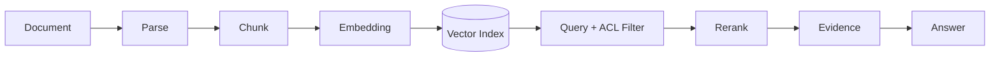

# RAG Infra：从文档发布到带证据回答

RAG 检索到了内容，回答却引用了另一个租户刚发布的文档。向量相似度没有出错，错的是知识版本和权限没有进入检索条件。RAG Infra 是一条从文档发布到 Evidence 的数据链，检索器只负责候选，最终可见性和证据归属仍由平台决定。

## 文档如何成为可引用知识

原始文档、解析结果、Chunk、Embedding 和发布版本都要有 ID。Chunk 记录 source_document、release_id、tenant_id、位置和 checksum，Embedding 记录模型版本。这样一个引用可以回到具体文档和版本，而不是只保存一段文本。

## 检索的顺序决定安全边界

| 步骤 | 输入/状态 | 必须保留 |
| --- | --- | --- |
| 查询改写 | 用户问题、租户、语言 | 原始问题和改写版本 |
| 候选召回 | 向量/关键词、发布版本 | 候选 ID 与分数 |
| 权限过滤 | tenant、ACL、有效期 | 过滤原因和规则版本 |
| 重排 | 候选内容和查询 | 模型版本、排序分数 |
| 证据编排 | 最终片段和位置 | 引用 ID、页码、截断信息 |

把 ACL 过滤放在向量近邻之后仍可能暴露候选数量、分数或缓存命中。安全要求高时，让权限条件进入索引查询，并在最终 Evidence 生成前再次检查。

## 切片不是按固定字符数切开

段落、标题、表格和代码的边界影响检索可用性。切片过大，召回精度下降且上下文成本增加；切片过小，定义与条件被拆散。用重叠、父子 Chunk、表格结构和文档层级保留语义，同时为超限、重复、孤立和空内容设置质量门禁。

## 发布和回滚

新版本先写入索引并完成数量、重复、Embedding 和权限检查，再把 release 状态从 staging 改成 published。查询只读取一个明确的 published release，回滚是切换指针，不是删除新数据。缓存 key 要包含 release_id 和权限范围。

## 错误证据比没有证据更危险

::: warning
**容易误判**

高相似度不代表事实正确、最新或有权限。答案必须把 Evidence ID 交给可观测和审计链，无法找到满足范围的证据时应拒答或说明不足。下一篇把这条请求链变成 Trace、Metric、Log 和质量信号。
:::

## Evidence 需要能回到原文的位置

最终给模型的片段应带 evidence_id、document_id、release_id、页面或行区间、chunk hash 和检索/重排分数。前端引用、用户纠错、过期文档回收和离线评测都依赖这些定位信息。只保存一段拼接后的 prompt，之后无法证明它来自哪里。

当文档重新解析或切片算法变化时，旧 Evidence 仍要能说明当时引用的版本。新的 release 可以生成新的 chunk_id，不必篡改旧记录。版本不可变、查询指针可切换，是 RAG 回滚比“重新建库”可靠的原因。

## 检索质量需要在发布后继续观察

离线评测能检查一组已知问题，但线上文档会变化，用户问法也会变化。可以采样匿名化的查询特征、空结果、引用点击/纠错和人工标注，按知识 release、语言和租户范围观察变化。

质量下降先回看解析、切片、Embedding、过滤、重排还是上下文预算，不能直接替换一个“更强模型”。每个环节都保留版本后，回归才有可比较的候选。
