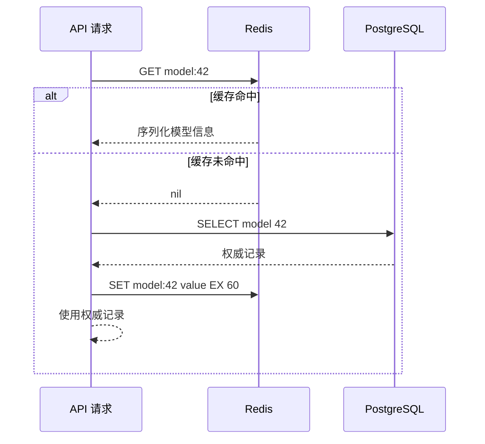

# Redis 是什么？缓存、Session、限流与队列该怎样选择

AI API 常需要快速读取会话状态、限制调用频率、缓存模型目录，还可能把后台任务暂存在队列中。这些需求都能在 Redis 找到相应命令，但它们的数据寿命和一致性并不相同。缓存丢失可以回源，Session 丢失会让用户重新登录，限流状态丢失会短暂放宽配额，任务丢失则可能让工作永远不执行。

Redis 的价值来自内存访问、丰富数据结构和原子命令。它不是“比数据库快的数据库”这个模糊替代品。每个用途都要先回答权威数据在哪里、Key 何时删除、多个命令是否需要原子化、进程重启后能否恢复，以及 Redis 不可用时业务应失败还是降级。

::: info Redis 的准确含义

Redis 是网络化的内存数据结构服务器。客户端通过 Redis 协议操作 String、Hash、List、Set、Sorted Set、Stream 等结构，服务器可以配置快照或追加日志把部分状态写入磁盘。

内存是主要工作集，不表示数据一定临时；启用持久化也不表示零丢失。数据可靠性取决于复制、持久化、故障切换、确认时机和业务恢复设计。

:::

## Redis 客户端发出命令后，服务器怎样处理

应用先解析 Redis 地址，与 Server 建立 TCP 连接并完成可选 TLS 和认证。客户端把命令编码成 RESP 消息，Server 解析命令、读取或修改内存结构，再编码结果返回。连接池会复用连接，避免每次请求都重新握手。连接池耗尽时，请求可能在客户端排队，还没有进入 Redis。

Redis 核心命令执行通常由主线程按顺序处理，因此单条命令不会与另一条命令在中途交错。现代 Redis 可以让部分网络 I/O、持久化和后台释放由其他线程或进程完成，不能把它简单描述成整个软件永远只有一条线程。对业务最重要的结论是单条命令原子，不是任意多条客户端命令自动成为事务。

先 `GET quota`，在应用里减一，再 `SET quota` 需要三步。两个客户端可同时读到旧值并覆盖结果，顺序执行的每条命令也救不了跨命令竞态。可以使用自带原子语义的 `DECR`、带条件的 `SET`、事务与 WATCH，或 Lua/Functions 把判断和修改放进服务器一次执行。

长时间运行的 Lua 脚本会阻塞其他命令，`KEYS *` 扫描大库也可能带来延迟。原子不等于可以塞入任意复杂逻辑。脚本要短、输入 Key 明确、时间复杂度可评估；遍历使用增量 SCAN，仍要知道 SCAN 期间数据可能变化。

下面的图从 API 到 Redis，再到权威数据库。缓存命中时不查询数据库，缓存未命中才回源并回填。箭头不是数据复制保证，回填失败时数据库仍然是权威来源。



图中的 GET 与 SET 各自原子，整个 cache-aside 过程不是事务。读取数据库后到回填 Redis 前，记录可能又更新。版本号、失效通知和可接受陈旧窗口决定是否需要更严格方案，不能从图中推出缓存与数据库永远一致。

## Redis 数据结构是什么，选择结构要看哪些操作

Redis Key 是二进制安全字符串，Value 并非只有普通字符串。数据类型决定可用命令和复杂度。String 可以保存文本、数字或序列化字节；Hash 把一个对象拆成 field/value；List 保持插入顺序；Set 保存不重复成员；Sorted Set 为每个成员关联 score；Stream 保存带 ID 的追加记录。

String 适合缓存完整 JSON、计数器和分布式锁的随机令牌。`INCR`、`DECR` 是原子数字操作。大 JSON 每次修改一个字段都要重写完整值，Hash 则能用 HSET 改单字段。Hash 不是关系表，没有外键与跨对象查询，字段演进和序列化仍由应用管理。

Set 适合成员关系，比如某租户允许的模型 ID；Sorted Set 适合按分数排序或时间窗口记录请求时间。List 的 LPUSH/BRPOP 可以做简单工作队列，但消息弹出后如果消费者崩溃，任务已经不在原 List。需要 ACK、重投和消费者组时，Stream 或专门消息系统更合适。

结构选择还要考虑基数与删除。为每个请求创建永不过期 Key 会持续占内存，单个集合有数百万成员也会让某些命令阻塞。Key 命名应包含用途、租户范围和版本，比如 `cache:model:v3:{tenant}:{id}`，避免不同功能碰撞。花括号还有 Cluster hash slot 语义，只有确有跨 Key 原子需求时再设计同 slot。

序列化格式是隐含合同。JSON 易排查但类型表达有限，MessagePack 等二进制格式更紧凑却需要工具。直接 pickle 不适合不可信数据，反序列化可执行代码。Value 要带 schema 版本，部署新旧应用并存时，读取端能识别旧格式或安全回源。

| 需求 | 更自然的数据结构 | 关键命令 | 主要边界 |
| --- | --- | --- | --- |
| 缓存完整模型元数据 | String | GET、SET EX | 陈旧、穿透与序列化版本 |
| 保存会话字段 | Hash | HGET、HSET、EXPIRE | 整个 Key 的过期与并发修改 |
| 去重成员 | Set | SADD、SISMEMBER | 无顺序，成员过多占内存 |
| 滑动窗口限流 | Sorted Set | ZADD、ZREMRANGEBYSCORE、ZCARD | 多命令需原子脚本 |
| 简单临时队列 | List | LPUSH、BRPOP | 弹出后缺少 ACK |
| 可确认事件流 | Stream | XADD、XREADGROUP、XACK | Pending 与裁剪需治理 |

表格按操作选择结构，而不是按“都能存 JSON”选择。相同业务也可能由不同结构实现，最终要把故障语义、内存和命令复杂度放在一起比较。

## TTL 是什么，过期、删除与驱逐有什么区别

TTL 是 Time To Live，表示 Key 距离过期还有多久。`EXPIRE key 60` 设置秒级过期，`PEXPIRE` 用毫秒，`SET key value EX 60` 能在一次命令中写值并设置 TTL。TTL 到零后 Key 在逻辑上过期，读命令不应再返回旧值。

Redis 使用惰性过期和主动过期相结合。访问一个已过期 Key 时会删除它，后台也会周期抽样清理。物理内存释放可能晚于 TTL 到点，监控里短暂仍占空间不表示读取还能命中。大批 Key 同一秒过期会造成回源峰值，可以在业务允许范围内加入随机抖动。

修改 Key 的某些命令会保留 TTL，某些会清除或替换 Key，具体行为必须查命令文档并测试。先 SET 再 EXPIRE 有进程崩溃窗口，可能留下永不过期 Key；组合 SET EX 或 Lua 能缩小边界。`TTL` 返回 -1 表示存在但无过期，-2 表示 Key 不存在，两种状态不能混为一个 miss。

过期是按时间删除，驱逐是达到 `maxmemory` 后按策略释放 Key。allkeys-lru、volatile-ttl 等策略选择候选范围和近似规则。缓存实例可以接受驱逐，保存 Session 或任务的实例若使用会驱逐关键 Key 的策略，内存压力会变成业务状态丢失。不同可靠性用途最好拆实例或至少做明确内存与告警边界。

显式 DEL 立即移除逻辑 Key，UNLINK 把实际内存回收交给后台，适合大对象以减少阻塞。删除缓存只是失效动作，删除 Session 是用户状态变化，删除队列消息则可能丢任务。同一条命令的业务后果不同，权限与审计也应不同。

## 缓存是什么，cache-aside 怎样处理一致性

缓存保存可从权威来源重新获得的数据副本，用更小延迟或更低下游压力换取一定陈旧与复杂度。模型目录、权限摘要和不常变化配置可以缓存，余额最终账本、任务唯一状态和无法重建的上传文件不应只放缓存。能否删除后重建，是判断缓存身份的直接方法。

Cache-aside 由应用先读缓存，未命中再读数据库并回填。写入时常见做法是先提交数据库，再删除缓存。删除失败会让旧值继续存在到 TTL；先删缓存再写数据库，则另一个请求可能在写入前回填旧值。两种都不是强一致事务，需要根据陈旧窗口、版本号和失效重试设计。

缓存穿透指大量请求查询本来不存在的对象，每次都访问数据库。可以短时间缓存“未找到”，但权限与创建操作要避免把负结果保存太久。缓存击穿是一个热点 Key 过期后并发回源，可以用单飞、互斥或提前刷新；缓存雪崩是大量 Key 集中过期或 Redis 故障，需抖动 TTL、限流和数据库保护。

单飞只让一个调用回源，其他调用等待结果。锁要有随机唯一值与到期时间，释放时比较持有者，不能用简单 DEL 删除别人续租后的锁。即使锁实现正确，回源超时后仍要决定返回旧值、错误还是降级。分布式锁不是缓存一致性的万能补丁。

缓存命中率也不能单独判断效果。高命中但 Value 很大可能拖慢网络，低命中却挡住最昂贵查询也可能很值。至少观察命中、miss、回源耗时、序列化时间、Value 大小、驱逐和数据库负载，并按 Key 用途而不是完整 Key 打标签。

## Session 是什么，为什么它不是普通缓存条目

Session 把一段客户端交互映射到服务端状态。浏览器通常只保存随机 Session ID 的 Cookie，服务端用 ID 读取用户身份、过期时间和安全属性。多个 API 实例共享 Redis Session 后，请求落到任意实例都能读取同一登录状态，不必依赖负载均衡粘性。

Session ID 必须足够随机，Cookie 应设置 Secure、HttpOnly 和合适 SameSite。Redis Key 不直接使用可猜用户名，日志不记录完整 Session ID。用户登出、密码变更或账号禁用时要主动撤销相关 Session，不能只等 TTL。

Session 的空闲过期和绝对过期是两种时间。每次访问延长 TTL 可以实现空闲过期，但会让长期活跃 Session 永不结束；另存创建时间并限制绝对寿命可以补上边界。刷新 TTL 与读取状态之间也有竞态，封装成一次原子操作能避免已经撤销的 Session 被错误续期。

Redis 故障时，Session 业务通常选择安全失败，要求重新认证或暂时拒绝，而不是把所有请求当成已登录。若允许离线验证签名 Token，则撤销和权限更新语义不同，不能继续把它称为同一种 Session 模型。JWT 与服务端 Session 的区别在于状态验证位置，不是一个永远优于另一个。

Session 是否可以丢失取决于产品。普通登录态丢失让用户重新登录，管理端高风险操作还需要二次认证。若 Session 是关键状态，应使用复制、持久化和受控故障切换，并测试主节点故障时最近写入是否可能丢失。它不该与可随意清空的缓存共用无保护实例。

## 限流是什么，固定窗口与令牌桶怎样改变结果

限流控制某个身份在一段时间内允许的请求、Token 或并发量。它保护下游容量，也执行租户套餐。限流 Key 必须绑定可信主体，不能只按可伪造 Header 或共享 NAT IP。请求数、输入 Token、输出 Token 和同时流式连接是不同资源，需要分别计量。

固定窗口可以用 `INCR` 加 TTL：每分钟一个 Key，计数超过阈值就拒绝。实现简单，但窗口边界附近可以在几秒内通过接近两倍额度。`INCR` 与首次设置 TTL 需要原子化，否则进程在两步之间退出会留下永久计数器。

滑动窗口日志把每次请求时间放入 Sorted Set，先删除窗口外成员，再加入当前请求并计数。它更接近任意连续时间窗，内存随请求数增加。删除、加入、计数和设置过期应在 Lua 中一次完成，否则并发请求会看到中间状态。

令牌桶按时间补充令牌，请求消耗令牌。它允许受控突发，并用桶容量限制最大突发。实现要保存上次更新时间和剩余令牌，使用 Redis Server 时间或一致时间来源，避免客户端时钟漂移。浮点、取整和重试是否重复扣令牌都要测试。

并发限流与速率限流不同。SSE 每秒请求数不高，却可能长期占用连接和 GPU slot。准入时原子增加 active，正常完成、失败和取消都要减少；进程崩溃会漏减，需要带租约的成员集合与定期回收，不能只维护一个永不修正的整数。

下面的 Lua 示例实现简化固定窗口。它出现是为了展示“计数和首次设置 TTL”必须同一次执行，生产还要加入 Key 版本、错误处理和 Cluster slot 设计。

```lua
local current = redis.call('INCR', KEYS[1])
if current == 1 then
  redis.call('PEXPIRE', KEYS[1], ARGV[1])
end
local allowed = current <= tonumber(ARGV[2])
return {allowed and 1 or 0, current, redis.call('PTTL', KEYS[1])}
```

返回值包含是否允许、当前计数和剩余 TTL。客户端收到超限结果可返回 429 与受控 Retry-After。脚本执行原子不代表多区域 Redis、数据库套餐变更和已发出的模型请求自动一致，限流决定与计费结算仍是不同状态。

## Redis 做队列时，List 和 Stream 的失败语义有什么不同

List 用 LPUSH 写任务，BRPOP 阻塞等待并弹出任务。消费者拿到元素后，原 List 已经删除它。如果消费者在处理完成前崩溃，没有 ACK 记录让其他消费者知道这项工作未完成。可以用 BLMOVE 把消息原子移到 processing List，处理成功再删除，超时扫描器负责重投。

Stream 的每条记录有 ID，Consumer Group 让多个消费者分摊消息。XREADGROUP 交付后，消息进入 Pending Entries List，消费者处理成功调用 XACK。消费者崩溃时，其他消费者可以检查 idle 并 claim 超时消息。ACK 发生在业务提交前还是后，决定可能丢失还是重复。

至少一次投递意味着消息可能重复，Worker 必须幂等。任务 ID 在数据库加唯一约束，处理前检查状态，结果写入与状态转换放在事务中。不能因为 Redis 命令原子就认为跨 Redis 与 PostgreSQL 的工作恰好一次。Outbox、幂等表或补偿任务用于连接两个系统。

Stream 不会自动无限保存所有消息而不占内存。XTRIM 可按长度或 ID 裁剪，但仍在 Pending 的消息和审计要求要考虑。消费者组中的僵尸消费者、长期 Pending、重试次数和毒消息需要监控。超过重试阈值的任务转入死信或失败表，保留输入摘要与错误证据。

高可靠、跨地域、长保留和大消息场景可能更适合 Kafka、RabbitMQ 或云队列。Redis Stream 很适合已有 Redis 体系中的中等规模事件与任务，但选择依据是投递、保留和恢复语义，不是少部署一个组件。模型文件和大文档只在消息中传对象 Key，不把大字节塞进队列。

## Pipeline、事务和 Lua 分别改变了什么

普通客户端发一条命令，等待响应，再发下一条，网络往返会成为大量小操作的主要成本。Pipeline 让客户端连续发送多条命令，之后批量读取响应。服务器仍按顺序执行命令，其他客户端的命令可以在 Pipeline 中间穿插。Pipeline 提高网络效率，不提供事务隔离。

MULTI/EXEC 把多条命令排队，在 EXEC 时连续执行，中间不会插入其他客户端命令。Redis 事务没有传统数据库那样的自动回滚：命令排队语法错误会影响执行，某条运行时类型错误也不会撤销已成功的其他命令。业务必须在提交前校验输入，并正确处理每一项返回结果。

WATCH 提供乐观并发控制。客户端监视 Key，读取并计算后发 MULTI/EXEC；如果 Key 在期间被修改，EXEC 不执行并返回冲突，客户端重新读取再尝试。高竞争热点会反复冲突，重试要有限并加入退避。WATCH 连接不能在池中途被其他请求复用，否则监视状态会错位。

Lua 脚本和 Redis Functions 把判断与修改放在服务器端原子执行，省去多次往返和 WATCH 重试。脚本执行期间阻塞其他核心命令，因此不能做外部网络访问或长循环。脚本访问的 Key 应通过 KEYS 参数声明，Redis Cluster 才能判断 slot，动态拼出任意 Key 会破坏分片兼容。

选择可以从目标出发：只想减少网络往返用 Pipeline；需要一组命令不被穿插用 MULTI/EXEC；读取旧值后条件更新可用 WATCH；需要短小的服务端读改写用 Lua。跨 PostgreSQL 与 Redis 的原子提交不在这些机制范围内，仍要用数据库事务、Outbox 或补偿。

## 内存上限、淘汰策略和大 Key 怎样影响延迟

Redis 的数据、内部结构、连接缓冲、复制缓冲和持久化开销都占内存。`used_memory` 是分配器视角的重要指标，进程 RSS 还包含碎片和操作系统页。容器 cgroup 限制小于 Redis `maxmemory` 加后台峰值时，Redis 可能在自身淘汰策略介入前先被 OOM Kill。

设置 `maxmemory` 后，写入达到边界会按 policy 淘汰，或在 noeviction 下返回 OOM 错误。allkeys 类策略能从所有 Key 选候选，volatile 类只处理设置 TTL 的 Key。如果关键 Session 没 TTL 而缓存有 TTL，volatile 策略可能暂时保护 Session；这仍不是可靠隔离，缓存持续增长最终会让写入失败。

大 Key 指 Value 含大量字节或成员。读取大 String 会占网络和客户端内存，删除大集合可能阻塞，单次 SMEMBERS 会把全部成员返回。热 Key 则是访问频率极高，可能让单个 Redis shard 和网络成为热点。两者要用不同方法处理：大对象拆分或放对象存储，热读可做客户端缓存、分片副本或重新设计访问。

诊断不能在繁忙生产实例无界扫描。`SCAN` 是增量迭代，可能返回重复项且不提供一致快照；`MEMORY USAGE` 查看已知 Key 估算占用；`SLOWLOG` 记录超过阈值的命令执行时间，不含客户端排队和网络。命令延迟正常但 API 慢，还要检查连接池与网络 RTT。

碎片率、evicted_keys、expired_keys、keyspace_hits、keyspace_misses、blocked_clients、connected_clients 和命令延迟应一起观察。命中率突然下降可能是部署改了 Key 版本，也可能是淘汰；blocked clients 增加可能来自阻塞队列等待，也可能命令执行卡住。指标必须按实例角色解释。

## 连接池、超时和背压怎样保护 Redis 与 API

每条应用连接在 Redis 和客户端都占资源。异步客户端池设置最大连接数后，超过请求会等待连接或失败。池无限扩张会把 API 突发直接传给 Redis，达到文件描述符或内存上限；池太小则应用端排队。最大值要结合 API 进程数、实例副本和 Redis `maxclients` 计算。

连接超时、命令超时和池等待超时是三个边界。DNS 或 TCP 无法建立触发连接超时，命令已经发出但没结果触发 socket/command timeout，池中没有可用连接则是 pool timeout。日志只写 Redis timeout 会丢失故障阶段，重试策略也会因此出错。

读命令超时后重试通常较安全，写命令超时可能已经在 Server 执行。比如 INCR 已成功但响应丢失，重试会再次增加。限流、任务和幂等状态要使用请求标识或能容忍重复的协议，不能因为客户端抛 TimeoutError 就假定未写入。

健康检查不应每秒创建新连接再执行复杂脚本。连接池自身要暴露 in-use 与 waiters，Redis 探针可以用受控 PING 或读取角色，业务 readiness 则根据用途决定。缓存不可用时可以降级，Session 实例不可用时可能需要拒绝；不要让同一个通用依赖检查决定所有 API 是否 ready。

API 的并发上限应早于 Redis 池耗尽。高峰时先按租户限流和有界队列控制，再让有限连接执行命令。连接池是最后一道资源边界，不是流量治理工具。大量请求都排在池内会占据 HTTP 连接，入口最终一起超时。

## ACL、TLS 与 Key 命名为什么不能构成完整租户隔离

Redis ACL 可以为用户限制允许命令和可访问的 Key pattern。缓存应用无需 FLUSHALL、CONFIG 或管理命令，Worker 也可以只访问任务前缀。客户端使用独立用户与轮换凭证，不能让所有服务共享管理员密码。ACL 修改要先验证新连接，再撤销旧凭证。

TLS 保护客户端到 Redis 的传输，防止网络中明文暴露凭证和数据。服务端证书验证、主机名和 CA 要正确配置，关闭验证会失去身份保证。内部网络不是天然可信，跨节点和多租户环境更需要传输加密；同机 Unix Socket 则有另一套文件权限边界。

Key 前缀帮助组织和授权，但不是可靠的多租户数据隔离。应用若把 tenant ID 从请求体直接拼进 Key，攻击者可以尝试访问其他租户。租户身份应来自已验证 Principal，仓储层统一构造 Key。SCAN 和监控输出也可能泄露其他租户标识，需要限制权限和脱敏。

Redis 的逻辑 DB 通过数字区分 Key 空间，却共享同一进程、内存和故障域，Cluster 还通常只支持 DB 0。它适合有限环境整理，不是安全租户。高风险租户、关键 Session 与可丢缓存应按实例或集群隔离，分别设置备份、淘汰和访问策略。

Lua 脚本、模块和管理命令扩大执行能力，只给受控运维或专用服务。应用日志禁止打印连接 URL，因为 URL 常含密码。备份、RDB、AOF 和诊断快照也包含真实数据，访问与保留期限应按数据本身管理，不能因文件位于缓存服务器就降低标准。

## 持久化、复制和故障切换分别保护什么

RDB 按时间生成数据快照，恢复快且文件紧凑，故障时可能丢失最近一次快照后的写入。AOF 记录写命令，按 fsync 策略在性能和丢失窗口之间取舍。两者可以组合，具体重写、启动加载和版本行为需按 Redis 版本核对。

复制把主节点写入异步传播到副本，常见确认发生在主节点内存修改后。主节点突然故障而最新写入尚未到副本，故障切换可能丢失已向客户端确认的数据。`WAIT` 可以等待副本确认数量，却仍不等于跨机器持久磁盘的强一致事务。

Sentinel 负责监控与选择新主，Cluster 还把 Key 空间分片到多个主节点。客户端必须支持拓扑变化和重连。故障切换期间，连接错误、只读错误和重定向都可能出现；重试写命令前仍要判断幂等。

备份与复制不同。误 DEL 会复制到副本，程序写坏格式也会快速传播。需要可恢复关键状态时，保留离线备份并实际恢复到隔离实例。缓存实例通常只需回源重建，Session、限流和 Stream 的恢复目标则分别评估。

内存、磁盘和复制延迟要一起看。RDB fork 与 copy-on-write 会增加瞬时内存，AOF 重写也消耗 I/O。容器 memory limit 太紧时，持久化阶段可能 OOM。容量规划不能只用当前 `used_memory`，还要留后台操作与碎片空间。

## 用命令完成一次缓存、TTL 与故障验证

下面命令在隔离 Redis 中写一个 60 秒模型缓存，读取类型、TTL 和内存占用，再模拟删除。不要在来源不明的生产 Key 上执行 DEL，也不要用 `KEYS *` 收集真实用户数据。

```bash
redis-cli SET 'cache:model:v3:tenant-demo:42' '{"id":42,"name":"demo"}' EX 60
redis-cli TYPE 'cache:model:v3:tenant-demo:42'
redis-cli TTL 'cache:model:v3:tenant-demo:42'
redis-cli GET 'cache:model:v3:tenant-demo:42'
redis-cli UNLINK 'cache:model:v3:tenant-demo:42'
redis-cli TTL 'cache:model:v3:tenant-demo:42'
```

预期 TYPE 为 string，第一次 TTL 在 0 到 60 之间，GET 返回 JSON，UNLINK 返回 1，最后 TTL 为 -2。TTL 的具体秒数不能写死，因为命令执行已经消耗时间。删除后应用应回源 PostgreSQL 并按新 TTL 回填，用户仍得到同一权威模型记录。

完整失败推演从 Redis 连接超时开始。请求输入为模型 ID 42，客户端连接池等待到内部 Deadline，缓存阶段记录 cache_error。若模型目录允许回源，API 在受控并发下查询 PostgreSQL，返回结果但暂不强求回填；若是 Session 校验，则安全拒绝，不把缓存降级策略复用到身份状态。

Redis 恢复后，缓存请求重新回填，Session 只能恢复持久化中仍存在的状态，Stream Consumer 检查 Pending 并重投超时任务。验证包括缓存命中率恢复、数据库回源峰值下降、无永久限流 Key、Pending 不持续增长。相同 Redis 故障对四种用途产生不同处理，这正是部署前必须划分状态身份的原因。
