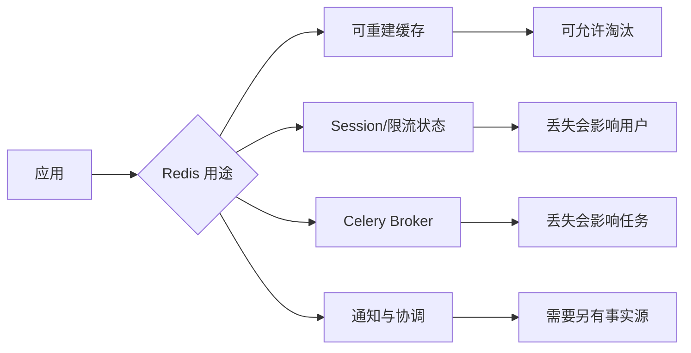

# Redis 缓存、Broker、TTL、淘汰与持久化

Redis 内存从 40% 涨到 95%，有人建议“设置一个淘汰策略就行”。这句话对纯缓存也许勉强成立，对同时承担 Session、任务 Broker 和取消通知的实例却可能直接造成业务数据丢失。

本章先按用途给 Key 分类，再用 `INFO`、`MEMORY`、`TTL` 和慢日志定位增长，最后选择 `maxmemory`、淘汰、RDB/AOF 与高可用边界。所有破坏性实验只在隔离实例执行。

## 同一个 Redis 命令，业务语义可能完全不同



Redis 是内存数据结构服务，不自动知道哪类 Key 可以丢。运维策略必须从用途开始，而不是从参数开始。

建议至少按实例或明确命名空间隔离缓存与 Broker。仅使用不同逻辑 DB 不能隔离内存上限、CPU、持久化和故障域。

## 第一步：确认连接的是哪一个实例

在隔离或已授权的 Redis 运行：

```bash
redis-cli INFO server
redis-cli INFO clients
redis-cli INFO memory
redis-cli INFO stats
redis-cli INFO keyspace
```

先记录地址、版本、运行模式、角色和 uptime，再看：

| 指标 | 意义 | 异常方向 |
| --- | --- | --- |
| `connected_clients` | 当前客户端数 | 是否接近 `maxclients` |
| `blocked_clients` | 等待阻塞命令的客户端 | 队列或阻塞读是否积压 |
| `used_memory` | Redis 分配的数据内存 | 当前数据与内部结构占用 |
| `used_memory_rss` | 操作系统看到的 RSS | 与 used_memory 差距过大需分析碎片 |
| `mem_fragmentation_ratio` | RSS/分配内存的一个线索 | 需结合绝对值与分配器判断 |
| `evicted_keys` | 因 maxmemory 被淘汰的 Key | 非缓存实例出现要警惕 |
| `expired_keys` | TTL 到期删除 | 观察过期工作量，不代表异常 |
| `instantaneous_ops_per_sec` | 当前命令速率 | 结合延迟和业务流量 |

`INFO` 是快照。一次正常不代表没有尖峰，应由监控按时间采集。不要把完整命令参数和敏感 Key 放进公开监控标签。

## 第二步：Key 为什么增长

先看 Key 数和 TTL 分布。`INFO keyspace` 会给每个逻辑 DB 的 `keys`、`expires` 和平均 TTL。若 Key 数持续增大而带过期 Key 比例很低，可能是业务忘记设置 TTL。

抽样扫描使用 `SCAN`，不要在线上用 `KEYS *` 阻塞整个事件循环：

```bash
redis-cli --scan --pattern 'cache:article:*' | head -n 20
redis-cli TTL 'cache:article:42'
redis-cli TYPE 'cache:article:42'
redis-cli MEMORY USAGE 'cache:article:42' SAMPLES 5
```

`TTL` 返回正数是剩余秒数，`-1` 表示存在但没有过期，`-2` 表示 Key 不存在。`MEMORY USAGE` 是估算内存占用，复杂容器可用 `SAMPLES` 控制抽样。

需要统计 Key 模式时，离线脚本用 SCAN 分批遍历并限制速率。Key 名可能包含用户或业务标识，结果要脱敏保存。工具自带的 `--bigkeys`、`--memkeys` 也会扫描全库，繁忙实例使用前评估开销。

常见增长原因：TTL 漏设；随机后缀让缓存永不复用；大 Hash/List 没有裁剪；任务结果无限保留；缓存版本切换后旧前缀未清理；过期时间集中导致周期性压力。

## 第三步：理解 maxmemory 与淘汰策略

查看当前配置：

```bash
redis-cli CONFIG GET maxmemory
redis-cli CONFIG GET maxmemory-policy
```

常见策略：

| 策略 | 候选 Key | 适用判断 |
| --- | --- | --- |
| `noeviction` | 不淘汰，写入报错 | 数据不可随意丢的实例 |
| `allkeys-lru` | 所有 Key，近似最近最少使用 | 纯缓存，访问热度有意义 |
| `allkeys-lfu` | 所有 Key，近似低频 | 纯缓存，频率比最近性更重要 |
| `volatile-ttl` | 仅有 TTL，优先剩余时间短 | 所有可淘汰 Key 都正确设置 TTL |
| `volatile-lru/lfu` | 仅有 TTL | 混合数据风险仍需谨慎 |

近似 LRU/LFU 不保证精确全局排序。`maxmemory=0` 在 64 位系统通常表示无显式上限，但容器可能仍有 cgroup 内存限制；Redis 没来得及执行淘汰前，进程可能先被 OOM Kill。

给纯缓存设置上限时，要给复制缓冲、AOF 重写、客户端输出缓冲和内存碎片留空间，不能把 cgroup 限制全部交给数据。通过隔离压测观察达到上限时的命中率、淘汰率与延迟。

Broker 或关键 Session 不应依赖“被淘汰后也没关系”的策略。最直接的办法是独立实例、独立容量和匹配的持久化。

## 第四步：TTL 是一致性策略的一部分

TTL 不是只为省内存。缓存 TTL 决定旧数据最多自然保留多久，也影响缓存雪崩和数据库回源。

设置时加入有限随机抖动，可以避免大量 Key 同一秒到期。抖动范围要记录，不要让关键配置过期时间变得不可解释。

Cache-Aside 更新常用“数据库提交后删除缓存”。删除失败时有陈旧窗口，因此还要有 TTL、重试失效或可靠事件。对于不存在结果，可以使用短负缓存抵挡穿透，但创建新对象后要使负缓存失效。

缓存击穿是热点 Key 到期后大量请求同时回源。可以用请求合并、短互斥或提前刷新，但锁本身需要超时和所有权，不要用一个永不过期的 `SETNX` 把故障变成永久阻塞。

## 第五步：RDB 与 AOF 各自保护什么

**RDB** 在某个时间点生成数据快照。文件紧凑、恢复快，但两次快照之间的变化可能丢失。`BGSAVE` fork 子进程，写时复制会增加内存压力。

**AOF** 记录写命令。`appendfsync everysec` 常在性能与潜在一秒数据损失之间取舍；AOF 重写也会产生额外 I/O 和内存压力。

两者都不是异地备份，也不能阻止逻辑误删。高可用副本会复制错误命令。需要恢复能力时，复制 RDB/AOF 到独立存储，记录版本与配置，并真正启动隔离实例验证加载。

对于纯缓存，可能选择不持久化并依靠数据库重建；对于任务 Broker，要理解 Celery/RQ 等框架的消息确认、可见性超时和 Redis 持久化组合；对于唯一业务事实，优先放在事务数据库，不让 Redis 成为无法审计的唯一来源。

## 第六步：复制与故障切换不是零丢失保证

Redis 复制通常是异步的。主节点确认写入后、从节点尚未收到时主节点故障，提升从节点可能丢失已确认写。Sentinel 帮助监控和故障转移，Cluster 提供分片和一定可用性，它们不改变异步复制的基本边界。

应用要明确能否接受这个窗口。缓存可以，任务状态或分布式锁可能需要数据库事实、幂等执行和恢复扫描兜底。

分布式锁不能只写 `SET key value NX PX timeout` 就结束。释放时要原子检查 value 仍属于自己，临界区超过 TTL 要处理续约或 fencing token，网络分区下还要分析安全要求。很多业务用数据库条件更新和唯一约束更直接。

## 第七步：慢命令与大响应怎样排查

```bash
redis-cli SLOWLOG LEN
redis-cli SLOWLOG GET 20
redis-cli LATENCY DOCTOR
```

Slow Log 记录命令在 Redis 线程内的执行时间，不包括网络传输和客户端排队。大响应即使命令执行快，也会占用网络和客户端输出缓冲。

避免在大集合上执行无边界 `LRANGE 0 -1`、`HGETALL` 或复杂 Lua。使用分页、限制集合大小、把重计算移出请求热路径。Lua 脚本在执行期间会阻塞其他命令，必须短小、有界并在相同数据规模验证。

客户端也要看连接池等待、超时与重连风暴。Redis 单次命令很快，但连接池耗尽仍会让 API 变慢。

## 做一次隔离的内存与淘汰实验

启动专用开发实例，限制为较小内存并使用纯缓存策略；写入带 TTL 的模拟值，观察 `used_memory`、`evicted_keys` 和命中率。然后切回 `noeviction`，观察写入在到达上限后明确报错。

不要对共享或生产实例执行填满内存的实验。结束后删除专用容器和 Volume，只清理本次创建的明确目标。

## Redis 运行检查表

1. 这个实例承担缓存、Session、Broker 还是协调？是否混用？
2. 版本、角色、持久化和高可用模式是什么？
3. `used_memory`、RSS、cgroup 限制和 `maxmemory` 是否留出缓冲？
4. Key 数、带 TTL 比例和大 Key 模式能否解释？
5. 淘汰策略是否只会删除可重建数据？
6. RDB/AOF 的数据损失窗口和恢复时间是否验证过？
7. 慢命令、大响应、客户端连接池和输出缓冲是否观测？
8. 主从切换时可接受多少已确认写丢失？业务如何兜底？
9. 缓存不可用时，数据库是否有准入保护，避免雪崩？

下一章会把 RabbitMQ、Kafka 和 Worker 作为独立任务平面来运行，进一步区分“消息通知”和“业务任务事实”。
