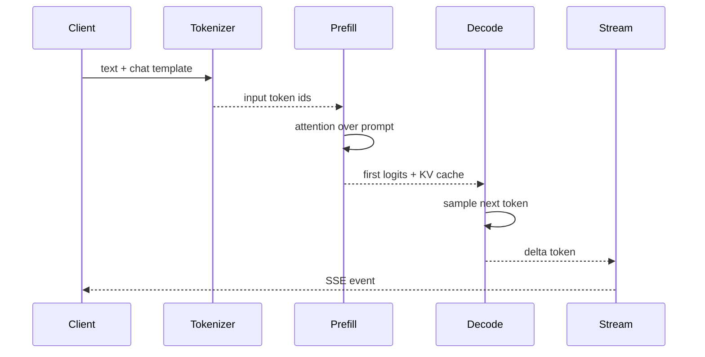

# Tokenize、Prefill、Decode 与流式推理生命周期

用户点击发送后，首个 Token 迟迟不来；一旦开始输出，后续 Token 却很快。这里至少包含两个不同阶段：输入被一次性处理的 Prefill，以及逐 Token 生成的 Decode。把两者混成“推理耗时”，就无法解释 TTFT 和 TPOT。

## 从文本到第一个 Token

Tokenize 把文本变成整数序列，Chat Template 决定角色和特殊 Token。Prefill 一次处理输入并建立 KV Cache，首 Token 还要经过调度和采样。Decode 每次只追加一个或一小段 Token，并复用已有 KV。

## TTFT、TPOT 和总时长怎样拆

| 指标 | 包含的阶段 | 容易被误读成 |
| --- | --- | --- |
| TTFT | 排队 + Tokenize + Prefill + 首事件 | 模型纯计算时间 |
| TPOT | Decode 相邻 Token 的间隔 | 完整请求平均延迟 |
| 端到端 | 首 Token 到最后 Token、传输和收尾 | 只由 GPU 决定 |
| 输出长度 | 停止条件前生成的 Token 数 | 字符数 |

输入越长，Prefill 通常越重；输出越长，Decode 时间和 KV 占用越大。流式传输还受代理缓冲和客户端消费速度影响。测量时至少记录 prompt token、output token、首事件时间和最后事件时间。

## 采样决定“何时停止”

Temperature、top_p、top_k 等参数改变候选选择，stop token、最大新 Token 和上下文上限决定生成边界。服务端要把实际生效的参数写进 usage 或 trace，不能只记录客户端传入值，因为策略层可能做了上限和默认值覆盖。

## 流式异常不是普通 HTTP 异常

在首个事件发出前，服务端仍可返回 HTTP 4xx/5xx；发出事件后，状态码已经确定，中途失败通常通过 error 事件、连接关闭和服务端终态表达。客户端必须避免把断线当成正常完成，也不能自动重试一个可能已经计费的请求。下一篇进入多请求调度，解释为什么 Continuous Batching 需要管理 KV Block。

## 上下文窗口是一个服务边界

最大上下文不是单纯的模型常数。服务需要为系统提示、工具定义、RAG Evidence、用户输入和预计输出共同预留空间。若只在引擎报错后才发现超限，客户端已经等待了排队和 Tokenize 时间。

入口应计算或估算 Token，保留输出预算，并在截断时明确说明删掉了什么。RAG 的 Evidence 编排要按 token budget 选择片段，不是把召回结果全部拼进去。这个预算同时影响 Prefill、KV Cache、TTFT 和成本。

## 停止条件会改变用户可见的结果

模型看到 eos、命中 stop 序列、达到 max_new_tokens、被客户端取消或超过 deadline，都会停止生成，但含义不同。前两者通常是正常完成，长度上限表示被截断，取消和超时则需要在终态中保留原因。

对于流式协议，服务端还要处理 stop 序列跨 Token 边界的情况，不能把半个停止符泄露给客户端后再删除。实现细节依赖 tokenizer 和引擎，接口契约至少要让调用方知道 finish_reason 来自哪一类边界。
