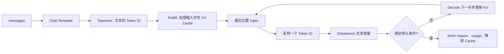

# 大模型怎样生成一个 Token？从分词、Prefill 到 Decode

聊天接口接收的是文本，模型内部处理的却不是“问题”或“句子”这些语言概念。应用先按照模板拼接消息，再由 Tokenizer 把文本变成整数 ID。模型读取这串 ID，计算下一个位置上每个候选 Token 的分数，从中选择一个，把它接到输入末尾，然后重复相同过程。

这条链看起来只是“预测下一个词”，实际还包含两种不同计算。Prefill 一次处理已有输入并建立注意力缓存，Decode 随后逐步生成新 Token。采样把分数变成一个具体选择，停止规则决定是否继续，Detokenize 才把 ID 重新拼回可显示文本。每一步都可能影响速度、输出和失败原因。

::: info Token 的准确含义

Token 是某个 Tokenizer 词表中的离散符号，模型用整数 Token ID 表示它。一个 Token 可能对应一个汉字、单词片段、空格、标点、字节序列或特殊控制符。

Token 不是固定的字数或词数。不同模型使用不同 Tokenizer，同一段文本会被切成不同数量与不同 ID，计费和上下文长度必须使用目标模型的 Tokenizer。

:::

## 模型为什么要先把文本变成 Token

神经网络接收固定形状的数字张量，不能直接对 Unicode 字符串做矩阵运算。Tokenizer 建立一个有限词表，把无限可能的文本表示成词表 ID 序列。模型的输入 Embedding 表按 ID 查出向量，输出层也为词表中每个 ID 计算分数。

如果按完整单词建词表，未见过的新词、拼写变化和多语言会让词表无限增长；如果只按单个字符，序列又会变长。BPE、Unigram 和字节级方法在词表大小与序列长度之间折中，把常见片段合成较大 Token，把罕见内容拆成更小片段。

中文常见字有时独立成 Token，词组也可能被合并；英文 Token 往往把前导空格与词片段放在一起。代码中的缩进、换行和符号同样占 Token。不能用“一个中文约等于一个 Token、一个英文单词约两个 Token”作为精确校验，只能做很粗的容量预估。

特殊 Token 不一定对应可见文本。BOS 表示序列开始，EOS 表示结束，聊天模板还可能加入 system、user、assistant 边界。它们让模型知道角色和生成位置。错误的特殊 Token 会让模型续写用户内容、提前停止或永远不生成 EOS。

Token ID 只在特定词表中有意义。模型 A 的 ID 42 与模型 B 的 ID 42 通常不是同一文本。存储 Token 化结果时必须带 Tokenizer Revision；长期缓存跨模型复用会造成错误输入。

例如，把一句话“天气不错”变成 Token 时，Tokenizer 先按自己的词表查找最长或概率最高的片段，再输出一串整数 ID；这些 ID 只是模型词表里的索引，模型通过 Embedding 表把它们转换成向量。不同 revision 可能把同一句话切成不同数量的片段，后面的上下文长度、费用和推理耗时都会随之改变。

Token 的边界与网络分块也不是一回事。一个 Token 可能被拆成多个 UTF-8 字节，服务器为了流式传输也可能把一个词的文本分成多次 SSE 事件。调试时要分别记录原始文本、Token ID、解码文本和传输事件，不能用浏览器看到的块数反推模型实际生成了多少 Token。

## Tokenizer 是什么，它怎样切分未知文本

Tokenizer 是文本与 Token ID 序列之间的转换组件。它包含规范化、预切分、子词模型、词表、特殊 Token 和解码规则。调用 `encode` 得到 ID，调用 `decode` 把 ID 序列恢复为文本。严格来说，规范化可能让恢复文本与原始字节不完全相同。

规范化可以处理 Unicode 形式、大小写或空白，具体行为由模型训练时的 Tokenizer 决定。Cased 模型保留大小写，Uncased 模型可能统一小写。应用不能在 Tokenizer 前擅自改空格和标点，否则输入分布与训练不同。

子词算法先在预切分片段中查找词表组合。常见片段用一个 ID，罕见字符串被拆成多个更小单元。字节回退能表示任意 Unicode 字节，避免真正 unknown Token，却可能让一个少见字符占多个 Token。

Fast Tokenizer 常由 Rust 库执行，Slow Tokenizer 由 Python 规则实现。两者应该遵循同一词表与配置，边缘 Unicode、截断和 Added Token 行为仍要回归。Serving 与 Gateway 使用不同实现时，准入计数可能有少量差异，最终 usage 以实际 Serving 为准。

下面是一个抽象示例，不对应任何真实词表。它用于说明 Token 边界不等于人类分词，ID 数值本身没有可读语义。

| 原始片段 | 可能的 Token 文本 | 教学 ID |
| --- | --- | --- |
| `你好` | `你`、`好` | 310、927 |
| ` inference` | ` infer`、`ence` | 4812、663 |
| 换行 | `\n` | 13 |
| 罕见符号 | 若干字节 Token | 244、162、... |
| assistant 边界 | 特殊 Token | 128006 |

表中的结果不能用于真实请求。想知道目标模型的边界，必须加载它固定 Revision 的 Tokenizer 实际 encode，并同时查看 token 字符串和 ID。

## Chat Template 怎样把多条消息变成一条模型序列

Chat API 接收 messages 数组，每项有 role 与 content。自回归模型通常只接收一条 Token 序列，因此 Chat Template 把 system、user、assistant 消息拼成训练时使用的格式，并在末尾加入“现在开始生成 assistant”所需标记。

不同模型模板差异很大。有的使用特殊角色 Token，有的使用带标题文本，有的在每轮末尾加入 EOS。把 A 模型模板套给 B 模型，JSON 请求仍能通过，模型却可能忽略 system、混淆角色或把结束标记输出为正文。

模板还要处理工具调用、多模态占位、空 system 和多轮历史。工具结果可能使用独立 role，图像会展开成一串视觉 Token 占位。Serving 宣称 OpenAI 兼容，不表示它能自动推导所有模型的正确模板。

模板渲染后才能准确计算输入 Token。应用先按字符限制再拼模板，可能漏掉角色标记的开销；模板中重复系统指令也会增加上下文。准入应对最终 Prompt Tokenize，再检查输入加最大输出是否超过部署上限。

Prompt 日志不能因为“只是模板结果”就全量保存，里面仍有用户内容和系统 Secret。调试时记录模板 Revision、Token 数、角色数和脱敏摘要，必要样本进入受控数据集。

## Embedding 层怎样把整数 ID 变成向量

模型词表大小假设为 50,000，隐藏维度为 4,096，输入 Embedding 可以看成一张 50,000 行、4,096 列的参数表。每个 Token ID 选择其中一行，得到代表该符号的初始向量。序列有 900 个 Token，就得到形状近似 `[900, 4096]` 的矩阵。

这个 Embedding 与 RAG 用的句向量不是同一概念。输入 Embedding 是生成模型内部的可训练参数，每个 Token 一行；RAG Embedding 把整段文本压成一个用于相似搜索的向量。名称相同源于都把离散对象映射到连续空间，输入、输出和用途不同。

只有 Token 身份不足以表达顺序。Transformer 还要注入位置信息，常见实现使用旋转位置编码或其他位置机制。第一个“模型”和第十个“模型”拥有同一词表 ID，却在注意力计算中带不同位置。

Batch 中序列长度不同时，短序列可能 Padding，或引擎用 packed/ragged 表示减少无效计算。Attention Mask 阻止 Padding 和未来位置被错误读取。Mask 配错会让模型看见未来 Token 或把填充当正文。

Embedding 查表的输出只是第一层输入。每层 Transformer 会继续变换向量，逐步混合上下文信息。不能把某一行 Embedding 直接解释成这个词的完整含义，模型语义分布在多层参数和上下文计算中。

## Transformer 层怎样让当前位置读取前文

每层通常包含注意力与前馈网络。注意力把每个位置的隐藏向量投影为 Query、Key 和 Value。当前位置的 Query 与允许看到的 Key 计算相似分数，归一化后加权汇总 Value，从前文提取与当前计算相关的信息。

自回归生成使用因果 Mask。位置 i 只能关注自身及之前位置，不能读取后面的真实答案。训练时可以并行计算整个已知序列，因为 Mask 保证每个位置只用前文；推理时未来 Token 不存在，必须生成一个再继续下一步。

多头注意力把隐藏维度拆成多个头，让不同投影学习不同关系。Grouped Query Attention 让多个 Query 头共享较少的 Key/Value 头，减少 KV Cache。具体头数来自 Config，不能从参数量名字推导。

前馈网络对每个位置独立执行较大的非线性变换，通常包含两次主要矩阵乘。注意力负责位置间信息交换，前馈层处理每个位置的特征。残差连接和归一化帮助深层网络稳定传播。

经过所有层后，最后位置隐藏向量通过输出投影得到词表大小的 logits。logit 是未归一化分数，不是概率，也不是模型说法的置信度。Softmax 可以把它转成概率分布，采样规则再选择具体下一个 ID。

## 训练时为什么能并行计算，推理时却要逐步 Decode

训练样本已经包含完整目标文本。假设序列是“今天天气很好”，训练程序知道每个位置右侧的真实 Token，可以把整串向右错一位作为标签。模型在因果 Mask 下同时计算各位置对下一个 Token 的分布，再与真实标签计算损失。

这种做法常被称为 Teacher Forcing。位置三计算时使用数据中的真实前缀，不需要等模型先生成位置一和位置二，因此一条训练序列的多个位置可以在同一次前向中并行。因果 Mask 仍阻止位置读取未来答案，训练没有破坏自回归条件。

推理没有真实未来 Token。第一个输出可能是“北”，也可能是“上”，第二步的输入必须包含刚才实际选择的结果。两条分支的后续概率不同，普通自回归模型不能提前确定。Decode 才表现为一次选择一个 Token 的循环。

训练还会执行反向传播，保存激活、计算梯度和更新参数；推理只做前向并保留 KV Cache。训练显存里有梯度、优化器状态和更多激活，推理显存主要是权重、Cache 和工作区。二者看到同一 Transformer 架构，运行状态却不同。

模型训练损失低也不保证长程自由生成正确。训练每步看到真实前缀，推理会看到自己先前的错误，一个偏差可能继续传播。采样、Prompt、RAG 和后训练共同影响最终表现，Serving 只能准确执行既定模型。

## Batch、序列长度和隐藏维度怎样形成张量形状

假设一次 Prefill 有 4 条请求，统一或打包后最大长度 512，隐藏维度 4096。主隐藏状态可抽象为 `[4, 512, 4096]`。这里 4 是 Batch，512 是 Token 位置，4096 是每个位置的向量宽度。实际引擎可能把有效 Token 压成二维表示。

Query、Key、Value 会进一步按注意力头拆分。若有 32 个 Query 头、每头维度 128，Query 形状可以理解为 `[batch, heads, sequence, head_dim]`。Grouped Query Attention 的 KV 头可能只有 8，KV Cache 因此比 32 个 KV 头更小。

Prefill 同时处理许多位置，矩阵较大，更容易利用 GPU 并行；Decode 每条活跃序列只有一个新位置，形状近似 `[batch, 1, hidden]`，需要增大活跃 Batch 才能提高利用率。两阶段的 Kernel 与性能不能用同一个平均值解释。

Padding 到 512 不表示四条都真的有 512 Token。Attention Mask 会屏蔽无效位置，但部分算子仍可能付出 Padding 成本。Continuous Batching 和 packed input 尝试按真实 Token 组织计算，调度预算因此常写成 batched tokens 而不是固定请求数。

形状还决定内存峰值和编译缓存。突然出现比 Warmup 更长的序列，可能触发新 Kernel 路径、额外工作区或 CUDA Graph 不命中。性能测试要覆盖长度分布，不只用固定 128 Token 请求。

## usage 怎样统计，为什么字符数和 SSE 块数都不可靠

Prompt usage 对应用 Chat Template 后的最终输入 ID 计数，包含角色边界、系统消息和特殊 Token。用户只看到一百个汉字，模板后可能多出若干控制 Token；RAG 拼入的证据与工具定义也属于模型输入成本。

Completion usage 是实际生成并计入协议的输出 Token 数。EOS 是否计入、被 stop string 截去的 Token 怎样处理，要按引擎与 API 合同固定。客户端取消时，已经在引擎执行但尚未发送的 Token 是否结算属于计费策略，不能由字符串长度推断。

SSE 一块可能包含零个、一个或多个 Token。增量 Detokenizer 会等完整 UTF-8，代理也能合并网络块。按 `data:` 行数量计费会错。非流式文本再次 encode 也可能因规范化、特殊 Token 和停止处理得出不同数量。

最可信来源是执行生成的 Serving，因为它拥有输入 ID、采样步和结束状态。Gateway 对 max_tokens 做预授权，完成后用 Serving usage 结算。usage 消息与业务账本用 request_id 幂等关联，响应丢失时不能重复扣费。

usage 指标还用于容量分析。分开记录 prompt 与 completion 分布，才能知道负载偏 Prefill 还是 Decode。只看总 Token/s 会把一次 30K 输入和三万步输出当成同类工作，GPU 与用户体验却完全不同。

## Prefill 是什么，为什么输入越长首 Token 越慢

Prefill 是推理的输入处理阶段。引擎把完整 Prompt Token 序列送入模型，在所有 Transformer 层计算隐藏状态，并为每层每个输入位置保存 Key 与 Value。最后一个位置的输出用于得到第一个待生成 Token 的分布。

Prefill 可以对输入位置做大量并行矩阵运算，GPU 往往有较高利用率。输入长度增加时，线性层工作量随 Token 增长，普通全注意力还要处理位置间关系，计算与显存访问都会增加。具体复杂度会受 FlashAttention、滑动窗口等实现改变。

首 Token 之前要完成排队、Tokenize、Prefill 和首次采样，所以 TTFT 对输入长度敏感。用户发送很长历史，即使只要一个字，也要先处理整个历史。Prefix Cache 命中可以复用相同前缀的部分状态，前缀必须在 Token、模型和位置上完全兼容。

Prefill 产生的 KV Cache 是之后 Decode 避免重算前文的关键。它保存每层每个历史 Token 的 Key/Value，不保存所有中间激活。训练为反向传播保留更多激活，推理只需继续生成所需状态。

Chunked Prefill 可以把超长输入拆成多个调度片段，给其他 Decode 请求穿插机会。它改变调度与延迟，不改变模型最终应看到的序列。实现是否数值一致和如何计量要由引擎验证。

## KV Cache 为什么能让 Decode 不必重算全部历史

生成第一个 Token 后，序列从 N 个 Token 变成 N+1。新位置的 Query 要与所有历史 Key 计算注意力，但历史位置的 Key/Value 已经在 Prefill 算过。KV Cache 保存它们，Decode 只计算新 Token 在每一层的 Key、Value 和其他变换。

没有缓存时，每生成一步都重跑整个增长序列，重复工作越来越多。使用缓存后，每步仍要读取越来越长的历史 Key/Value，但不重算历史层输出。长上下文 Decode 常受内存带宽和 Cache 容量影响。

KV Cache 属于具体请求或可复用前缀，包含模型内部状态。它不是聊天消息数据库，也不能在任意模型 Revision 之间迁移。请求完成、取消或抢占后，引擎释放或重用块；释放遗漏会让显存逐渐耗尽。

Cache 精度可以与权重精度不同，低精度 KV 减少显存与带宽，可能影响质量。模型层数、KV 头数、头维度、序列长度、Batch 与每元素字节共同决定大小。下一篇会结合 Continuous Batching 计算。

Prefix Cache 保存公共 Token 前缀的 KV 供多个请求复用。只有系统 Prompt 文本看起来相同还不够，Chat Template、特殊 Token、Adapter、位置和模型必须相同。租户私有前缀也要隔离，不能让缓存命中成为跨租户数据侧信道。

## Decode 是什么，为什么输出 Token 要一个接一个生成

Decode 从 Prefill 得到的首个分布选择 Token，把它作为新输入位置，再执行一轮模型得到下一个分布。自回归依赖意味着第二个输出取决于第一个实际选择，不能一次知道未来所有 Token。每轮通常为每个活跃序列处理一个新位置。

Decode 的矩阵形状比 Prefill 小，单请求很难占满 GPU。Serving 把多个请求的 Decode 步合成 Batch，才有更好利用率。请求完成后退出，新的请求可以加入，这就是后续 Continuous Batching 的基础。

每轮还要读取模型权重和历史 KV Cache。权重很大而每轮 Token 少，计算可能受内存带宽限制。量化权重减少搬运，专用 Kernel 减少开销，效果取决于 GPU 与 Batch。

Decode 延迟通常用 Token 间隔或 TPOT 描述。用户看到的是文本片段，不一定每个 Token 一个事件，Detokenizer 和网络可能合并。引擎 TPOT 与浏览器文字出现间隔应分别测量。

投机解码可以由小 Draft 模型一次提出多个候选，再由目标模型验证，试图在保持目标分布的条件下每轮接受多个 Token。它增加模型、缓存和调度复杂度，不改变基础自回归语义，也不是所有任务都能加速。

## Logits、概率和采样分别是什么

最后隐藏状态投影后得到一个长度等于词表大小的 logits 向量。某个 logit 较大表示在当前模型与上下文下相对更偏好对应 Token。Softmax 对全部 logits 归一化，得到和为一的概率分布。

Greedy Decoding 每次选择最高概率 Token，结果在确定计算与并列处理下较稳定。它不等于“最正确答案”，只是局部每步选最高。早期一个选择会改变后续上下文，局部最优不保证整段最好。

随机采样按概率抽取，能产生多样输出。随机种子可以提高复现，但不同硬件、Kernel、并行和批处理顺序可能仍有数值差异。线上重试不能假定相同 seed 必然得到完全相同文本。

Temperature 用一个正数缩放 logits。低温让分布更尖，偏向高分 Token；高温让分布更平。温度为零通常被实现为 Greedy 或特殊路径，数学上不是直接除以零。API 要按目标引擎定义处理。

Top-k 只保留分数最高的 k 个候选，Top-p 保留累计概率达到阈值的最小候选集合，再归一化采样。两者可以组合，也会与 repetition penalty、presence penalty 等 logits processor 交互。参数顺序和实现差异会改变结果。

下面用一个四候选教学分布说明筛选的作用，不对应真实模型。

| 候选 Token | 原始概率 | Top-k=2 后 | 可能结果 |
| --- | --- | --- | --- |
| `北京` | 0.50 | 保留并重新归一化 | 高概率被选 |
| `上海` | 0.30 | 保留并重新归一化 | 仍可能被选 |
| `今天` | 0.15 | 移除 | 本轮不会被选 |
| `。` | 0.05 | 移除 | 本轮不会被选 |

Top-k 后前两个候选的相对概率重新归一化为 0.625 与 0.375。筛选减少候选集合，不验证事实正确性。模型可能在两个城市中都没有证据，RAG 和业务校验仍要负责真实性。

## 停止条件是什么，EOS、长度与 Stop String 怎样配合

EOS Token 是模型词表中的结束符。采样得到 EOS 后，引擎通常结束序列，并把 finish reason 标为 stop。模型是否容易生成 EOS 与训练模板有关，错误模板可能让它一直续写到长度上限。

最大输出 Token 限制生成步数，输入与输出总和还要小于模型上下文。达到输出或上下文上限时，finish reason 常为 length。客户端应知道答案可能被截断，不能把连接正常结束当内容完整。

Stop Token ID 是直接按生成 ID 匹配，Stop String 则要在解码文本中查找字符串。一个字符串可能跨多个 Token，检测需要保留尾部文本；停止串本身是否包含在输出由 API 规定。Unicode 与字节 Token 让简单逐块 contains 容易出错。

工具调用或结构化输出还可能在解析到完整 JSON 后停止，属于应用层条件。解析器不能看到一个右括号就断定完整，要维护字符串、转义和嵌套状态。模型生成无效结构时，重试和修复策略也要有上限。

客户端取消、Deadline、内容策略和设备错误也会终止请求。它们不是模型自然停止，要使用 canceled、timeout、content_filter 或 error 等可区分原因。usage 记录实际执行 Token，计费和重试按结束类型处理。

## Detokenize 怎样把 Token ID 变回可显示文本

Detokenize 根据 Tokenizer 规则把 ID 序列还原为字符串。子词 Token 可能带前导空格，字节级 Token 可能只含一个 UTF-8 字符的部分字节。单独 decode 一个 Token 可能得到替换符或空字符串，增量解码器要保留未完成字节。

因此 SSE 不保证每个生成 Token 都产生一个可见字符。引擎可以等待形成合法文本片段后再发送，usage 的 completion_tokens 仍按 ID 数计。客户端不能用收到多少事件或字符串长度计算 Token。

Tokenizer 的 cleanup 选项可能合并空格或调整标点。非流式一次 decode 与逐 Token 增量 decode 必须做一致性测试，尤其代码、Markdown 和多语言。流式合并结果应与非流式文本一致，结束标记不进入正文。

输出 Token ID 可以用于调试和 logprobs，但它们仍可能泄露内容。日志默认只保存数量、时间和受控摘要。显示层还要防止模型输出被当 HTML 执行，转义属于前端安全，不由 Detokenizer 完成。

工具调用的文本可能需要 JSON parser，普通回答则直接展示。Detokenize 只恢复字符，不判断语义和权限。模型生成一个看似函数名的字符串，只有 Agent Runtime 按 schema 验证后才能成为工具调用。

## 一次完整生成怎样按顺序发生

输入 messages 经 Chat Template 形成文本，Tokenizer 得到 900 个 ID。服务检查 900 加允许输出 128 不超过 4096，并建立 request_id。排队结束后，Prefill 对 900 个位置计算并写 KV Cache，最后位置 logits 经过采样得到首个输出 ID。

首个 ID 加入序列，增量 Detokenizer 形成文本，API 发送首个 SSE。Decode 只计算这个新位置，读取 901 个历史位置的 KV，得到第二个分布。循环持续，每步更新 Cache、usage 与停止状态。

第 37 个输出 Token 命中 EOS。引擎把 finish reason 设为 stop，释放请求 KV Cache，API 发送最终 chunk 和 `[DONE]`。Gateway 收到可信 usage：prompt 900、completion 37、total 937，并按业务规则记账。

图中循环每次依赖上一轮实际选择，因此普通自回归 Decode 逐步生成。网络可以晚些发送文本，但不能跳过模型的依赖顺序。Prefill 只在输入阶段执行一次，后续请求调度可能把别人的 Prefill 插入，不改变这个请求自身状态顺序。

## 失败发生时怎样定位到分词、Prefill、Decode 或停止

输入刚到就报上下文超限，证据是模板后 Token 数加 max output 超过部署边界，修复要减少历史、检索片段或输出预算。用字符数判断会出现同样字符数有时通过、有时失败，因为 Tokenizer 边界不同。

TTFT 随 Prompt 长度显著增长，队列时间正常，问题更可能在 Tokenize 或 Prefill。分别记录 tokenizer duration 与 prefill duration，确认是否 CPU 分词慢、长输入计算还是 Cache miss。增加 Decode Batch 不会直接缩短单请求 Prefill。

首 Token 快但后续一顿一顿，查看 TPOT、调度抢占、KV Cache 读取和代理发送。Engine Token 间隔正常而浏览器成批出现，回到 SSE 缓冲；Engine 本身间隔变长，才查 Batch、设备和 Cache。

输出达到 max_tokens 且没有完成句，finish reason length 证明长度边界触发。模型一直输出角色标记或不结束，检查 Chat Template、EOS ID 与 Tokenizer Revision。乱码则对照权重词表大小、Tokenizer 文件和增量 UTF-8 处理。

客户端断开后 GPU 仍忙，检查取消是否从 HTTP 到 Scheduler，序列是否移除，KV block 是否释放。只在访问日志看到 499 不代表引擎已经停止。修复后用同一 request_id 对齐入口、Serving 和设备指标，确认 canceled 状态与资源变化。

一次 Token 生成包含可观测的输入 ID、Prefill、Decode 步、采样参数、停止原因和 usage。掌握这些状态后，长 Prompt、首 Token 慢、输出截断与乱码不再是同一个“模型慢或模型坏”的模糊问题。

验证还应把同一请求分别跑成非流式和流式，合并后的文本、finish reason 与 usage 应一致；再固定模型、Tokenizer、模板、采样参数和 seed 重跑，记录仍可能存在的数值差异。只有这些输入版本都保存下来，某个 Token 为什么出现才有可复查的上下文。

这套回归还要包含中文、英文、代码、Emoji、罕见字符和跨 Token 的停止串，才能覆盖 Tokenizer 与增量解码的真实边界。失败样本保存 Token ID 与受控文本，不记录未经授权的用户原始内容。
