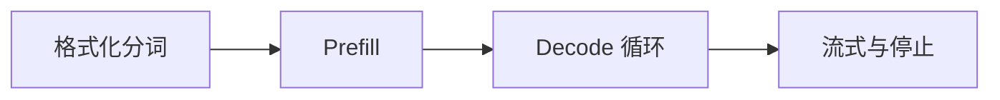

# Tokenize、Prefill、Decode 与流式推理生命周期

两个请求都要生成 100 个 Token：短问题很快出现首字，长文摘要却等了十几秒，但开始输出后速度接近。差异不是“模型突然变慢”，而是长输入先经过更重的 Prefill；流式只改变 Token 何时被客户端看见，不会减少模型必须完成的计算。


## 用时间线区分排队、Prefill 和 Decode

这组时间戳是解释性记录。输入 4096 个 prompt token，生成 4 个 token；输出展示首 Token 之前和之后的不同阶段，不代表任何真实模型性能。

```text
accepted      0 ms
scheduled    40 ms   # queue = 40 ms
prefill_end 420 ms   # prefill = 380 ms
token_1     440 ms   # TTFT = 440 ms
token_2     470 ms
token_3     501 ms
token_4     532 ms   # TPOT about 31 ms (illustrative only)
```

TTFT 包含入口、排队、分词、Prefill 和首轮 Decode，不能仅凭一个总数判断 GPU。TPOT 要在明确的输出区间和统计口径下计算；把最后总耗时除以总 Token 会混入 TTFT。客户端若晚看到 token_1，还要比较 Serving 写出与代理到达时间。

## 模型怎样把文本变成一串可发送事件

理解下面这些词时，要同时回答输入、状态和输出分别在哪里。它们不是可以互换的产品标签。

| 概念 | 在这条链路中的含义 |
| --- | --- |
| Tokenizer | 按词表与规则把文本转换成 token IDs，并处理特殊 Token 与 chat template；Token 不等于汉字或英文单词。 |
| Prefill | 一次处理全部输入 Token，计算各层表示并建立输入部分 KV Cache，通常决定长上下文 TTFT。 |
| Decode | 使用已有 KV Cache 反复预测下一个 Token，每轮输出一个位置并扩展缓存。 |
| Sampling | 把 logits 经温度、top-p 等规则选择 token ID；确定性和随机性来自策略，不是流式协议。 |

::: tip 判断原则
遇到新术语，先问它改变了哪份状态；如果没有状态所有者，这个名词暂时不能指导排障。
:::

## 从 messages 到 finish_reason 的完整生命周期



图里每个节点都要产生可观察结果；没有结果时，上一节点是否真正交付就是第一项检查。

### 格式化分词：Tokenizer

应用 chat template，编码文本并检查最大上下文。

决定下一步前需要看到 prompt_tokens、token IDs、truncation。

### Prefill：Model Executor

并行处理输入矩阵并为每层写入 K/V。

这一动作的可观察结果是 prefill tokens、TTFT 分解、KV bytes。处理动作应晚于取证，否则重启或重试可能覆盖最早的失败现场。

### Decode 循环：Scheduler/Model

选中活跃请求，执行下一 Token 前向计算和采样。

可以从这些位置确认结果：decode step、batch size、TPOT。若完全没有证据，先判断请求是否到达本阶段；若记录冲突，则对齐 request_id、实例和时间窗口。

### 流式与停止：Output Processor

增量解码文本，判断 EOS、stop、length 或 cancel。

这里不靠猜测，优先读取 delta、finish_reason、usage。

## 首 Token 变慢不一定是模型变大

| 表面现象 | 实际可能发生的事 | 下一步证据 |
| --- | --- | --- |
| stream=true | 只要求服务增量发送，不代表并行生成多个 Token | 观察首事件与后续事件时间 |
| 长输入 TTFT 高 | 可能是 Prefill 计算，也可能先在队列等待 | 分别记录 scheduled 与 prefill_end |
| 输出提前结束 | 可能命中 EOS、stop、长度上限、内容策略或取消 | 检查 finish_reason 与 token IDs |
| 乱码或重复字符 | 增量解码边界、Tokenizer revision 或字节 Token 处理错误 | 比较完整 token IDs 与一次性 decode |

::: warning 结论的边界
示例输出用于建立判断路径，不应被当成目标环境的真实结果。版本、硬件和请求形状变化后要重新验证。
:::


## 哪些结论还需要真实环境验证

公式级 FLOPs 估算只能描述理论工作量，实际延迟还受 Kernel、带宽、批次、量化和调度影响。本章时间线用于说明口径，不声称在真实 GPU 上实测。

单请求生命周期清楚后，Serving 还要同时处理长短不一的请求。下一篇解释 Continuous Batching、PagedAttention、KV Block 和 Prefix Cache 如何改变吞吐与公平性。
