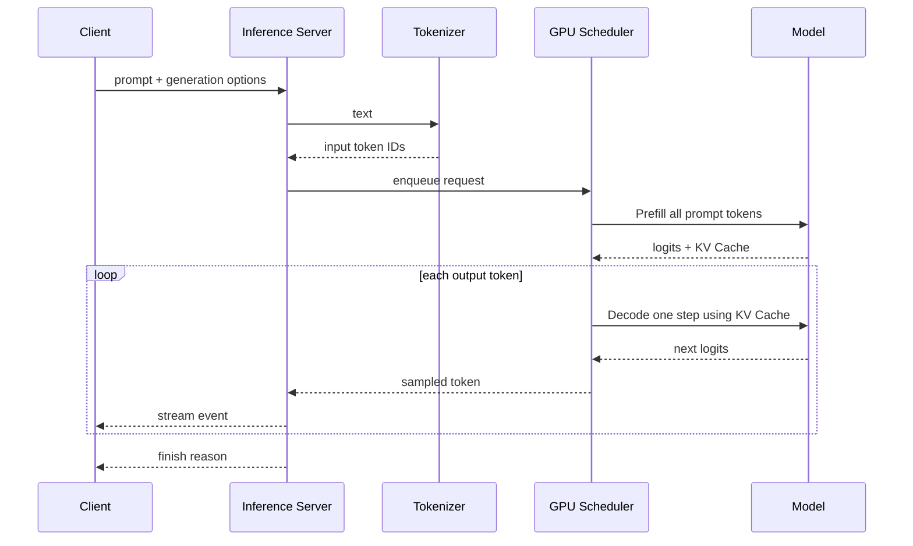

# Tokenize、Prefill、Decode 与流式推理生命周期

用户点击发送后，首个 Token 很久才出现；首 Token 出现后，后续文字却很快。另一种情况是首 Token 很快，长回答越生成越慢。要排查这些现象，必须知道一次 Transformer 推理请求每个阶段在做什么。

本文不讲模型训练算法，沿一条只读文本生成请求画时序：Tokenizer 把文本变成 ID，Prefill 处理已有上下文，Decode 逐个生成，采样决定下一个 Token，最后通过流式协议返回。TTFT 和 TPOT 的定义也会在对应阶段说明。

## 一次请求的五个阶段

GPU 计算通常会以批次调度，但自回归生成的逻辑仍是“每一步依据已有 Token 产生下一个 Token”。流式输出把生成的 Token 尽快送给客户端，不意味着模型一次并行生成完整句子。

## 第一步：Tokenize 决定真正的输入长度

文本先经过与模型匹配的 Tokenizer。它可能把一个词拆成多个子词 Token，也会由 Chat Template 把 system/user/assistant 消息拼成模型训练时的格式。

输入长度由 Token 数决定，不是 JavaScript 字符数或 UTF-8 字节数。它影响上下文窗口、Prefill 计算量、KV Cache 和费用。服务端应在入队前统计 Token 数，拒绝或裁剪超过预算的请求。

Tokenize 也可能在 CPU 上执行。如果批量很大、词表处理慢或线程不足，GPU 会等待输入。观察 Tokenize duration 与 GPU queue wait，不能只看 GPU 利用率。

## 第二步：Prefill 为什么决定 TTFT

Prefill 一次处理 prompt 中已有的 Token，构建每层的 Key/Value Cache，并计算下一个 Token 所需的 logits。输入越长，Prefill 计算与显存读写通常越重。

**TTFT（Time To First Token）**通常从服务接受请求或开始排队到首个输出 Token 的时间。不同系统可能把排队或网络时间算入或排除，因此指标定义必须固定。TTFT 受以下因素共同影响：

- 请求在调度器中的排队时间。
- 输入 Token 数和模型层数。
- GPU 批次中其他请求的形状。
- Tokenize、模板处理与网络等待。
- KV Cache 分配和 Prefix Cache 命中。

首 Token 慢不一定是模型计算慢。把队列时间、Tokenize、Prefill 和首事件发送分别做 Span 或时间戳，才有定位价值。

## 第三步：Decode 为什么逐 Token 运行

生成第一个 Token 后，下一步输入通常只需要新增的 Token；历史上下文通过 KV Cache 复用。每一步产生 logits，经过温度、Top-k、Top-p、停止词等采样规则选择下一个 Token。

**TPOT（Time Per Output Token）**可指首 Token 后生成每个 Token 的平均时间；有的系统使用 ITL（Inter-Token Latency）表示相邻 Token 间延迟。不要混用名称，报告要写清起止点和是否包含网络发送。

输出长度越长，Decode 步数越多。并发请求共享调度器时，每一步还要考虑批处理和显存带宽；一条长请求可能拉高其他请求的 ITL。

停止条件包括 EOS Token、用户提供的 stop sequence、达到 `max_tokens`、Deadline、取消或模型错误。服务必须返回明确 `finish_reason`，客户端才能区分自然结束与被截断。

## 第四步：流式响应的边界

服务器常用 SSE 或 HTTP Chunked 把 Token 事件逐步发送。每个事件至少需要序号、增量文本或 Token、usage（若可计算）和终态原因；具体格式由 API 契约决定。

客户端断开后，服务器应收到取消并停止后续 Decode。代理需要关闭缓冲并设置合适的读写超时；否则模型已经生成，用户却一次性收到全部内容。

流式发送本身也可能背压。慢消费者导致发送缓冲积压时，服务要限制每连接缓冲、暂停读取或取消任务，不能无限在内存里保存未发送 Token。

## 第五步：把请求阶段变成可观测时间线

为每次请求记录稳定关联 ID 与以下时间点：收到请求、Tokenize 完成、进入队列、开始 Prefill、首 Token、每 Token/批次、终态、连接关闭。指标只聚合这些时间，不记录完整提示词。

一条诊断表：

| 现象 | 可能阶段 | 先观察 |
| --- | --- | --- |
| TTFT 整体上升 | 排队/Prefill/Tokenize | queue wait、输入 Token、Prefill duration |
| TTFT 正常，TPOT 变慢 | Decode/调度/显存 | 输出长度、ITL、批次、KV Cache |
| 服务器生成了但客户端晚收到 | 代理/发送缓冲 | SSE flush、proxy buffering、客户端读取 |
| 长上下文 OOM | KV Cache/序列上限 | prompt tokens、并发和显存 |
| 取消后 GPU 仍忙 | 取消传播或不可中断内核 | cancel timestamp、下游请求和进程 |

这张表只给出假设方向；结论要由同一次 Trace、日志和 GPU 指标证明。

## 第六步：一个可控的生命周期练习

准备固定的短 prompt、中等 prompt、长 prompt，设置相同输出上限，依次执行：

1. 单请求非流式，记录总耗时和 usage。
2. 单请求流式，记录首事件和终态。
3. 固定 prompt 增加并发，记录 TTFT、TPOT、队列和显存。
4. 固定并发增加输入长度，观察 Prefill 与 OOM 边界。
5. 客户端在首 Token 后断开，确认生成是否取消。

不把测试数据中的一次最快值当基准。记录模型 revision、Tokenizer、推理引擎、GPU、输入/输出 Token 分布和采样参数；没有这些上下文的数字不可迁移。

## 适用范围与下一章

本章解释自回归 Transformer 服务的常见生命周期。Embedding、分类或图像模型不一定有同样的 Decode/流式阶段。下一章会在这个生命周期上加入 Continuous Batching、KV Cache 和 Prefix Cache，解释调度器怎样让不同长度的请求共享 GPU。
