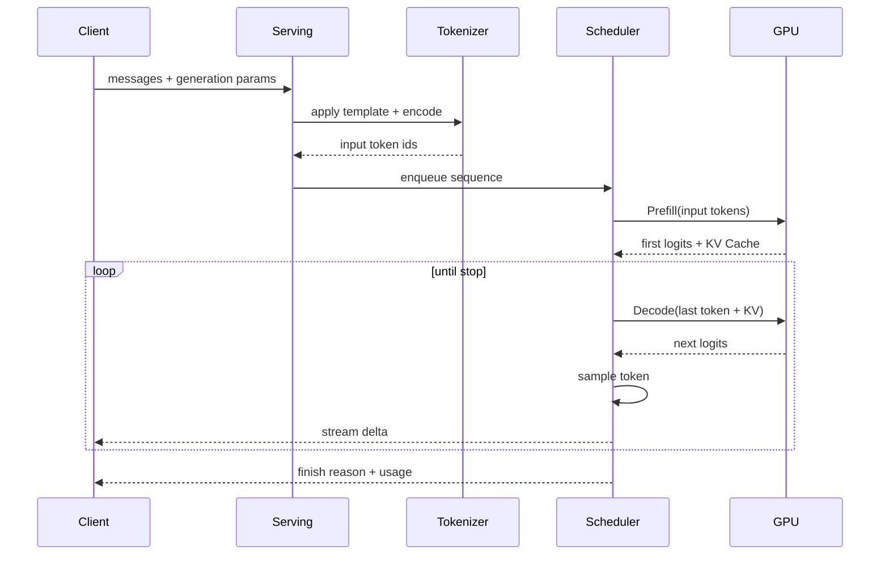

# Tokenize、Prefill、Decode 与流式推理生命周期

Transformer 推理把输入文本先 Tokenize 成 ID，再用 Prefill 处理整段上下文并建立 KV Cache，随后在 Decode 阶段逐步预测新 Token，最后通过流式协议交给客户端。它位于请求排队与答案传输之间。这几个阶段消耗的计算和内存不同，因此首 Token 等待与后续生成速度要分开观察。

同一个模型，短问题很快出现首 Token，放入长文档后首 Token 等待明显增加；一旦开始输出，后续速度却差不多。新增耗时主要落在 Tokenize、排队或 Prefill，不能只看总耗时调参。

推理生命周期把一次请求拆成可观察阶段。每一阶段都有输入、状态、输出和失败方式，TTFT 与 TPOT 也由不同阶段组成。

## 完整时序

协议层先把消息应用 Chat Template，Tokenizer 再把文本转换为整数 ID。调度器决定何时进入 Batch。Prefill 并行处理全部输入位置并建立每层 KV Cache；Decode 每轮基于已有 Cache 产生下一个 Token 的 Logits；采样器按参数选出 Token，直到停止条件成立。

## Tokenize 改变的不只是计费

Tokenizer 包含词表、预处理和特殊 Token。相同字符在不同 Tokenizer 下可能得到不同长度。Chat Template 还会插入角色、分隔符和结束标记，因此真正输入量不是用户文本的简单字符数。

输入过长应在进入 GPU 前被确定性拒绝或裁剪。裁剪必须知道系统指令、当前问题、历史、工具结果和 RAG 证据的优先级，不能从字符串末尾盲目截断。Tokenizer Revision 与模型 Revision 不匹配，会让 Token ID 语义错误。

## Prefill 为什么影响首 Token

Prefill 对全部输入 Token 做前向计算。输入越长，计算和内存访问通常越多；请求在队列中等待、Batch 组成和 Prefix Cache 命中也会影响首 Token。Prefill 输出第一轮 Logits，并为每层保存 Key/Value，后续 Decode 才无需重复计算完整历史。

TTFT 大致覆盖入口、校验、Tokenize、排队、Prefill、第一次采样和首事件传输。只看到 TTFT 高，不能立即归因 GPU；需要拆出 queue time、prefill time 和 transport time。

## Decode 为什么逐 Token 进行

自回归模型的下一个 Token 依赖已经生成的 Token，所以 Decode 存在串行依赖。一个请求不能一次产生全部未来 Token，流式输出也不改变这条依赖。引擎可以把许多请求的单步 Decode 组成 Batch，提高设备利用率。

Decode 每一步读取模型权重和 KV Cache，计算量与访存模式不同于 Prefill。TPOT 观察相邻可见 Token 的时间，受到 Batch 大小、活动序列、Cache、采样和传输影响。Token/s 要说明是单请求、实例总输出还是输入输出合计。

## 采样决定下一 Token 与终止

Greedy 选择最高概率 Token；Temperature 调整分布尖锐程度；Top-p 在累计概率集合中采样。参数支持取决于模型和引擎，确定性也会受并行 Kernel、版本和硬件影响，不能把固定 Seed 当作绝对复现保证。

停止条件包括生成 EOS、命中 Stop、达到最大输出、内容策略拒绝、客户端取消、Deadline 或执行错误。Finish Reason 应保留这些差异。达到长度上限不是正常完成，调用方可能需要提示答案被截断。

## KV Cache 是运行状态

每层 Attention 需要过去 Token 的 Key 与 Value。Cache 大小随层数、KV Head、Head Dimension、数据类型、序列长度和活动请求增加。模型权重固定时，长上下文和高并发仍可能让显存耗尽。

请求结束或取消后必须释放对应 Cache Block。Prefix Cache 可以复用相同前缀的计算，但命中要匹配模型、Tokenizer、模板和 Token 序列，并考虑租户敏感内容边界。

## 怎样定位生命周期问题

| 现象 | 首查阶段 | 需要的证据 |
| --- | --- | --- |
| 首 Token 慢 | 排队、Tokenize、Prefill | queue、input tokens、prefill time |
| 首 Token 快但后续慢 | Decode、Batch、传输 | TPOT、active sequences、event gap |
| 长上下文 OOM | Prefill、KV Cache | input length、Cache block、显存账本 |
| 客户端断开仍占 GPU | 取消传播与调度器 | disconnect、sequence state、block release |
| 输出不停或截断 | Template、Stop、max tokens | token ids、finish reason、参数 |

总时间只告诉你用户等了多久，阶段指标才告诉你改哪里。理解生命周期之后，Continuous Batching 和 PagedAttention 就不再是抽象优化名词，而是调度这些阶段与状态的方法。
