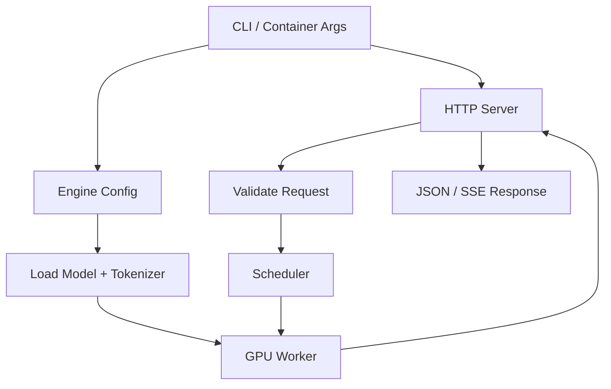

# vLLM 服务、OpenAI 兼容接口与故障定位

容器日志显示 HTTP Server 已启动，调用模型列表也成功，第一次 Chat 请求却返回“模型不存在”。常见原因是客户端使用仓库名称，服务对外暴露的是另一个 served model name。接口、模型制品、引擎参数和部署标识必须在同一契约中对齐。

vLLM 提供面向大模型推理的 Engine 与 OpenAI-compatible Server，核心能力包括调度、PagedAttention、Continuous Batching、并行执行和流式输出。启动与故障路径可以从配置和协议验证，当前无 NVIDIA GPU 的环境不能证明真实部署结果。

## 从进程启动到请求完成



CLI 或容器参数同时配置 HTTP 与 Engine。模型加载前要解析 Config、Tokenizer、权重、数据类型和并行方式。HTTP 可监听不代表 Worker 已 ready；部署探针必须等待目标模型可以通过受控请求。

## 启动参数是一组相互约束的选择

下面命令只展示参数语义，模型 ID、Revision、镜像版本、显存比例和并行度必须按目标环境替换。执行前应核对官方 vLLM 文档与目标版本，因为参数和模型支持会演进。

```bash
# 示例用于解释配置，不代表已在当前机器执行。
vllm serve org/model-name \
  --revision replace-with-commit \
  --served-model-name internal-chat \
  --dtype auto \
  --max-model-len 8192 \
  --gpu-memory-utilization 0.90 \
  --tensor-parallel-size 1 \
  --host 0.0.0.0 \
  --port 8000
```

位置参数选择模型仓库；`--revision` 固定来源；`--served-model-name` 定义客户端模型名；`--dtype` 选择运行精度但仍受模型与硬件支持约束；`--max-model-len` 限制上下文；显存比例给 Engine 划预算而非创造额外显存；Tensor Parallel 数量必须与可见 GPU 和拓扑匹配。

生产还要固定 vLLM 容器 Digest、驱动条件、Tokenizer Revision、缓存目录、API 鉴权、日志和停止预算。不要只保存一条 Shell 历史。

## OpenAI 兼容需要能力矩阵

vLLM 的兼容 Server 支持常见模型列表、Completions、Chat Completions 等接口，但具体参数、工具调用、结构化输出、多模态和模型架构支持取决于版本与模型。客户端能连接不代表所有 OpenAI 字段都具有相同语义。

网关应声明支持端点和字段，对不支持能力明确拒绝，并用契约测试固定响应。官方 OpenAI API 与 vLLM 都在演进，不能把某一版本行为写成永久标准。

## 普通与流式请求怎么观察

普通请求得到完整 JSON 后才能看到 Choice 与 Usage；流式请求通过 SSE 接收增量 Chunk，并以兼容终止信号结束。观察时记录 request ID、模型、输入/输出 Token、排队、TTFT、TPOT、Finish Reason 与最终 Usage。

客户端断开应触发请求取消，调度器移除序列并释放 KV Block。若入口代理缓冲，vLLM 已经输出但客户端仍看不到，应从上游事件时间和入口发送时间区分问题。

## 模型加载失败分层定位

| 阶段 | 常见问题 | 需要的证据 |
| --- | --- | --- |
| 制品 | Revision 不存在、权限、分片缺失 | 仓库、提交、文件清单、校验 |
| 配置 | 架构不支持、Tokenizer/Template 不匹配 | Config、版本、模型卡、引擎支持表 |
| Runtime | Driver/CUDA/Kernel 不兼容 | Driver、容器 Runtime、启动日志 |
| 容量 | 权重或工作区 OOM | 模型参数、dtype、显存账本 |
| 并行 | GPU 数量、Rank、拓扑错误 | 可见设备、并行参数、Worker 日志 |

修复顺序是先确认错误阶段，再改变最小变量。遇到 OOM 就降低 `gpu-memory-utilization` 可能适得其反，因为可用于 KV Cache 的空间更少；模型加载 OOM 与高并发 KV OOM 需要不同处理。

## 运行期故障和过载

输入超限应在准入阶段返回确定性错误。队列持续增长说明到达率超过服务能力，应限制并发、快速拒绝、扩实例或调整请求上限。频繁抢占、TPOT 上升与显存接近预算要结合请求长度分布判断。

Worker 崩溃、NCCL 错误和节点不可用属于执行故障。编排平台可以重建实例，但上层还要知道请求是否开始、是否产生部分输出和用量，避免自动重试造成重复副作用。

## 发布和回滚

新 vLLM 或模型版本先作为候选实例加载，验证模型列表、普通与流式请求、长度拒绝、取消、显存与 Eval，再逐步接流量。旧实例在候选稳定前保持可用。回滚要恢复模型、Tokenizer、模板、引擎和启动参数整组版本。

吞吐结论必须来自目标模型、GPU、vLLM 版本和真实请求分布。当前只能形成可复现配置、能力矩阵、故障证据表和候选验证记录。
