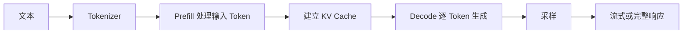

# vLLM 推理服务：从模型制品到 OpenAI 兼容接口

如果业务代码已经通过 OpenAI 风格的接口调用模型，那么把后端地址换成自托管服务，看起来只改一个 Base URL。真正困难的部分在服务端：模型文件能否被正确加载，显存够不够，长请求怎样占用 KV Cache，并发增加后首 Token 为什么变慢，客户端断开后请求是否停止。

本篇会完成一个独立实验：在一台兼容 NVIDIA GPU 的 Linux 主机上启动 vLLM，调用模型列表、普通生成和流式生成接口，再建立第一份容量与故障观察表。

> 本篇基于 vLLM、NVIDIA 和 Hugging Face 官方资料设计，是独立学习实验，不代表任何私有项目已经部署了 vLLM、GPU 集群或 Kubernetes。文中不提供未经目标硬件实测的吞吐数字。

## 开始前，先确认实验边界

你需要一台具备兼容 NVIDIA GPU 的 Linux 环境，并已经正确安装驱动。若使用容器，还需要 NVIDIA Container Toolkit。Mac 的 Docker Desktop 不能把 Apple GPU 当成 CUDA GPU 提供给这个实验。

至少准备四项信息：

| 信息 | 示例含义 | 为什么需要 |
| --- | --- | --- |
| GPU 型号与显存 | 由 `nvidia-smi` 获取 | 判断模型和 KV Cache 是否可能放下 |
| Driver 版本 | 宿主机驱动 | 决定可兼容的 CUDA Runtime 范围 |
| 模型标识与版本 | 仓库 ID + revision | 保证制品可重复获取 |
| 模型许可与访问条件 | 公开或需授权 | 确认是否允许下载和部署 |

先运行：

```bash
nvidia-smi
docker info --format '{{json .Runtimes}}'
```

第一条命令读取宿主机 GPU 状态，第二条读取 Docker Runtime 配置；第一条输出 GPU、Driver、显存占用和进程，第二条列出 Docker 可用 Runtime。使用容器时，应能看到 NVIDIA Runtime 相关能力。命令成功只证明宿主机识别设备，还没有证明某个模型一定能加载；任一命令失败时，先记录完整输出并停止后续启动。

## 一次生成在 GPU 里经历什么

理解推理过程，后面才知道各项指标为什么变化。



### Tokenize：文本先变成 Token ID

Tokenizer 按模型词表和规则切分文本，输出模型能读取的整数序列。字符数不等于 Token 数，不同模型的 Tokenizer 结果也可能不同。服务的上下文上限、显存估算和费用记录都应基于 Token，而不是字符串长度。

### Prefill：一次处理已有输入

Prefill 会处理提示词中的全部输入 Token，并为后续生成建立注意力所需状态。输入越长，Prefill 通常越重。用户感受到的首 Token 延迟（TTFT）还包括排队、Tokenize、调度、Prefill 和网络传输，不能把它全部归因于模型计算。

### Decode：逐步生成新 Token

生成阶段每一步产生一个或一小段 Token，并复用 KV Cache 避免重复计算全部历史。逐 Token 延迟常用 TPOT 观察。输出越长，请求占用调度和 KV Cache 的时间越久。

### KV Cache：用显存换重复计算

KV Cache 保存注意力层的 Key/Value 状态。它会随并发请求、上下文长度和生成长度增加。模型刚加载时显存够用，不代表高并发长上下文也够用。

## 模型制品不是一个文件

从模型仓库获得的通常是一组制品：配置、权重分片、Tokenizer、特殊 Token、Chat Template 和生成配置。部署记录不应只写一个模糊模型名。

建议建立如下清单：

```text
model_id: <公开模型仓库标识>
revision: <固定提交或版本>
tokenizer_revision: <与模型匹配的版本>
dtype_or_quantization: <实际加载格式>
served_model_name: demo-model
artifact_checksum: <下载后计算>
license_review: passed / pending
```

这段不是 vLLM 配置，而是部署台账。`revision` 固定获取内容；`served_model_name` 是业务调用时使用的稳定名称；校验和帮助发现文件损坏或非预期漂移。需要执行远程自定义代码的模型要格外谨慎，不要在没有审查来源时随意启用 `--trust-remote-code`。

## 第一步：用容器启动一个最小服务

官方提供原生安装和容器方式。这里选择容器，是为了明确隔离 Python 依赖，并把 GPU、缓存目录和端口暴露写出来。

先声明实验变量，避免在后续命令中重复长字符串：

```bash
export MODEL_ID='<选择与显存兼容的公开模型>'
export MODEL_REVISION='<固定版本或提交>'
export SERVED_MODEL_NAME='demo-model'
```

模型大小必须按实际硬件选择。不要因为示例命令能复制，就默认任意模型可以放进当前显存。还要确认模型架构受当前 vLLM 版本支持。

启动服务：

```bash
docker run --rm --gpus all \
  --name vllm-lab \
  -p 127.0.0.1:8000:8000 \
  -v "$HOME/.cache/huggingface:/root/.cache/huggingface" \
  vllm/vllm-openai:<固定版本> \
  --model "$MODEL_ID" \
  --revision "$MODEL_REVISION" \
  --served-model-name "$SERVED_MODEL_NAME" \
  --dtype auto
```

按职责拆开解释：

- `--gpus all` 把宿主机可见 GPU 提供给容器；多租户环境应进一步限制设备范围。
- `127.0.0.1:8000:8000` 只监听本机，避免实验接口直接暴露公网。
- 缓存挂载让容器重建后复用已下载制品；它也意味着宿主机要管理容量、权限和完整性。
- 镜像使用固定版本，避免同一命令在不同日期拉到不同实现。
- `--model` 与 `--revision` 固定权重来源，`--served-model-name` 给客户端一个稳定名称。
- `--dtype auto` 由 vLLM 结合模型配置选择数据类型；是否适合目标 GPU仍需从启动日志确认。

首次启动要下载并加载模型，时间取决于文件大小、网络、磁盘和 GPU。不要把“容器已经 running”当作服务就绪。持续看日志，直到模型加载完成并且 API 能响应：

```bash
docker logs -f vllm-lab
curl -sS http://127.0.0.1:8000/v1/models
```

第一条命令持续读取容器 stderr，第二条命令在服务端口发起 GET；当模型加载和路由注册完成后，预期 JSON 的 `data` 列表中出现 `demo-model`。若接口连接失败，先看容器是否退出；若返回模型不存在，再核对服务名称、模型加载日志和请求参数。容器处于 Running 但没有该模型，只说明进程活着，不能当作 readiness 通过。

## 第二步：先发一个非流式请求

先用短输入和短输出验证最小链路。不同模型的 Chat Template 支持情况不同；模型仓库应提供对应说明。

```bash
curl -sS http://127.0.0.1:8000/v1/chat/completions \
  -H 'Content-Type: application/json' \
  -d '{
    "model": "demo-model",
    "messages": [{"role": "user", "content": "用两句话解释什么是反向代理"}],
    "temperature": 0,
    "max_tokens": 80
  }'
```

命令的输入由模型名、消息、采样参数和最大输出长度组成，输出是一个 JSON 响应，重点观察 `choices[0].message.content`、`finish_reason` 和 `usage`。`temperature: 0` 用于减少这次功能验证的随机性，不表示所有模型和后端都能做到字节级完全确定。`max_tokens` 保护实验不要无限生成，它不包含输入 Token。HTTP 非 200 时先看服务日志和模型名；返回截断时检查 `finish_reason`，不要把短答案误判成推理服务故障。

成功响应至少检查：HTTP 状态、返回模型、结束原因、文本和用量字段。输入是短消息和固定的 `max_tokens`，输出应包含可解析的 JSON、模型名和 `choices`；只看“有一段文字”会漏掉模型路由错误、长度截断和 Token 统计异常。若 HTTP 返回 5xx，先查服务日志；若响应成功但 `choices` 为空，检查请求体和当前引擎的 Chat Template。

## 第三步：观察流式响应

流式接口通常用 Server-Sent Events 返回增量内容。请求体增加 `stream: true`：

```bash
curl -N http://127.0.0.1:8000/v1/chat/completions \
  -H 'Content-Type: application/json' \
  -d '{
    "model": "demo-model",
    "messages": [{"role": "user", "content": "列出排查 HTTP 502 的三个步骤"}],
    "temperature": 0,
    "max_tokens": 120,
    "stream": true
  }'
```

`curl -N` 关闭客户端输出缓冲，让事件到达后立即显示。服务会返回多条 `data:` 事件，结束时发送终止标记。客户端应按事件协议解析增量，而不是假设每个网络数据包恰好包含一个完整 JSON。

在另一个终端观察 `nvidia-smi` 和服务日志。记录请求开始时间、首个内容事件时间、结束时间、输入/输出 Token 与显存变化。单次手工记录不是性能结论，但能建立后续压测需要的字段。

## 第四步：理解四个常用容量参数

不要一次修改十个参数。每次只改变一个变量，保持模型、硬件和请求集不变。

### `--max-model-len`：限制可接收的序列长度

它影响允许的上下文范围，也会影响 KV Cache 规划。值越大不代表效果越好；业务只需要较短上下文时，盲目追求模型标称最大长度会扩大资源压力。具体默认行为随模型与 vLLM 版本变化，应查看当前版本参数文档和启动日志。

### `--gpu-memory-utilization`：控制执行器可使用的 GPU 内存比例

这个比例为模型执行器预留显存空间，但宿主机上可能还有显示进程、监控、其他模型或框架占用显存。提高它可能增加 KV Cache 空间，也会减少安全余量。发生 OOM 时先确认实际占用和请求形态，不要只机械降低或提高数值。

### `--max-num-seqs`：限制一次迭代处理的序列数

更高并发可能提高吞吐，也可能加剧 KV Cache 竞争和单请求等待。是否合适取决于输入长度、输出长度、SLO 和显存，不能从别人的 GPU 型号直接抄参数。

### `--max-num-batched-tokens`：限制调度迭代中的 Token 数

它影响 Prefill 与 Decode 的调度空间。调整时同时观察 TTFT、TPOT、吞吐、队列和显存。只优化 Token/s，可能让交互请求首 Token 变慢。

把实验记录成表格：

| 实验编号 | 参数变化 | 输入分布 | 并发 | TTFT | TPOT | Token/s | 峰值显存 | 错误/抢占 |
| --- | --- | --- | ---: | ---: | ---: | ---: | ---: | --- |
| A | 基线配置 | 固定请求集 | 实测 | 实测 | 实测 | 实测 | 实测 | 记录 |
| B | 只改一个参数 | 同一请求集 | 同 A | 实测 | 实测 | 实测 | 实测 | 记录 |

表里故意不填数字，因为它们必须来自你的模型、GPU、vLLM 版本和请求分布。拿公开基准替代自己的容量数据，会把错误假设带进生产配置。

## 第五步：区分 TTFT、TPOT 和吞吐

三个指标分别回答不同问题：

- **TTFT（Time to First Token）**：从发出请求到收到首个 Token。包含排队和 Prefill，直接影响“有没有开始回答”的感受。
- **TPOT（Time per Output Token）**：首 Token 之后生成每个输出 Token 的平均时间，反映持续生成速度。
- **Token throughput**：单位时间内整个服务处理的 Token 数，适合衡量系统吞吐。

提高批处理可能让总吞吐上升，同时增加某些请求的排队时间。交互式聊天通常更关心 TTFT 和尾延迟；离线批量任务可以接受更长等待来换吞吐。容量决策应先写 SLO，再调整引擎。

## 第六步：做一次可控的并发实验

准备固定请求集，覆盖短输入、长输入、短输出和长输出。每轮实验保持请求内容与采样参数一致，逐步增加并发，不要一开始就把服务压到失去响应。

观察顺序：

1. 服务成功率和结束原因是否正常。
2. TTFT 的中位数和尾部是否增长。
3. TPOT 是否明显变化。
4. 等待请求数量和正在运行数量。
5. GPU 利用率、显存和服务日志中的抢占/OOM。
6. 客户端取消后，请求是否仍持续占用资源。

当错误率或延迟越过预先写下的边界，就停止增加并发。压测目标是找到安全运行区间，不是把服务打崩后只留下一个最大 QPS。

## 常见故障怎样定位

### 容器看不到 GPU

先回到宿主机执行 `nvidia-smi`。宿主机失败，优先修 Driver；宿主机成功而容器失败，检查 NVIDIA Container Toolkit、Docker Runtime 配置和设备授权。不要在模型参数里寻找设备不可见问题。

### 模型加载时 OOM

这通常发生在权重、运行时工作区等基础占用已经超过可用显存。检查模型规模、精度/量化格式、并行方式和同卡其他进程。此时降低请求并发未必有用，因为请求还没开始。

### 启动成功，长请求才 OOM

重点看上下文长度、并发、KV Cache 和显存余量。用短请求成功不能证明长上下文容量。先用可复现请求逐步增加长度或并发，并记录拐点。

### 首 Token 很慢，但 Decode 正常

检查排队、长输入 Prefill、模型冷启动、Prefix Cache 命中情况和网关缓冲。若代理缓冲了 SSE，服务端可能已经产生 Token，客户端仍迟迟看不到；需要同时看服务事件时间和客户端到达时间。

### 返回 400 或模型不支持 Chat

查看响应中的结构化错误，核对 `model` 是否等于服务暴露名称、请求字段是否受当前版本支持、模型是否具有可用 Chat Template。OpenAI 兼容描述的是接口形状，不代表每个 OpenAI 专有参数都被任意模型完整支持。

### 下载慢或制品不完整

核对磁盘空间、网络、访问令牌、revision 和缓存目录权限。下载完成后记录文件版本与校验和。不要把来源不明的权重挂载进具有其他敏感文件权限的容器。

## 放到网关后，还要补什么

实验只监听 `127.0.0.1`。进入共享环境后，应由模型网关或反向代理承担认证、TLS、配额、请求大小限制、可信请求头和访问日志。vLLM 服务不应因为提供了兼容接口就直接暴露公网。

还要补齐：

- 健康探测区分“进程活着”“模型已加载”“低成本请求可用”。
- 发布新模型前完成制品校验、预热和候选请求。
- 设置入口准入，防止超长请求或突发并发耗尽 KV Cache。
- 客户端断开时把取消信号传到推理服务，并验证资源释放。
- 记录模型版本、Tokenizer、引擎版本、硬件和容量实验结果。
- 把模型响应内容按隐私要求裁剪或脱敏，不默认完整写日志。
- 保留旧服务和模型制品，切流失败时只恢复流量指针。

OpenAI 兼容接口降低了客户端迁移成本，但模型能力、Tokenizer、上下文、采样行为和错误语义仍可能不同。切换模型需要契约测试和质量评测，不能只检查 HTTP 200。

## 一份可以直接使用的实验记录

```text
实验目标：验证固定模型能启动、流式输出，并确定初始安全并发范围
环境：GPU / Driver / 容器 Runtime / vLLM 版本
制品：模型 ID / revision / tokenizer / dtype / checksum
请求集：输入 Token 分布 / 输出上限 / 采样参数
观测：成功率 / TTFT / TPOT / Token 吞吐 / 峰值显存 / 队列
变量：每轮只修改一个引擎参数或并发值
停止条件：错误、OOM、延迟 SLO 或取消失效
结论：适用范围、未知项、下次实验
```

这份记录是本篇最重要的产物。它让“这个参数感觉快一点”变成可复核实验，也避免把其他机器上的参数当成当前部署答案。

## 学完后的实践任务

1. 固定模型 revision 和 vLLM 镜像版本，记录制品清单。
2. 分别完成模型列表、非流式和流式请求。
3. 用同一请求测量 TTFT 与总时长，确认流式事件没有被代理缓冲。
4. 准备四类固定输入，逐级提高并发并记录显存与延迟。
5. 中途终止一个长生成请求，观察服务端是否停止处理。
6. 只修改一个容量参数，重复相同请求集并比较。
7. 写下当前硬件上没有验证的内容，不把未知项包装成结论。

下一篇可以继续深入 Continuous Batching 与 KV Cache。到那时，我们会从调度器视角解释不同长度的请求为什么能共享一次迭代，以及吞吐、公平性和延迟如何互相影响。
