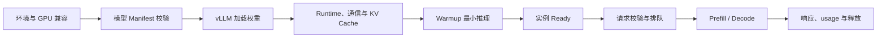

# vLLM 是什么？怎样启动、调用并诊断一个模型服务

上一章讲了 Continuous Batching、KV Cache 与 PagedAttention，这些机制需要一个真实引擎实现，才能把模型权重变成高并发服务。vLLM 是常见的开源推理与 Serving 项目。它能加载支持的模型，调度 Prefill 与 Decode，并提供 OpenAI 兼容 HTTP 接口。

安装成功和端口监听只证明 Python 包与 API 进程启动。模型是否支持、权重是否完整、GPU 是否可见、显存是否够、Chat Template 是否正确，以及流式请求能否取消，都要继续验证。本文给出的是命令与证据路径；没有目标 NVIDIA GPU 的环境只执行静态检查，不填写虚构吞吐。

::: info vLLM 的准确含义

vLLM 是面向大模型推理的开源引擎和 Serving 系统。它实现模型执行、调度、KV Cache 管理、并行与 API Server，并提供 OpenAI 兼容等调用方式。

vLLM 不等于 OpenAI API 本身，也不是 GPU 驱动。它依赖可用的 Python、PyTorch/CUDA 或其他受支持后端、模型制品与硬件。

:::

## vLLM Engine、Scheduler 与 API Server 分别做什么

Engine 负责把 Token 张量送进模型，执行 Prefill 和 Decode，并返回采样结果。它加载权重、管理设备执行器和 KV Cache。多 GPU 时还建立并行 Worker 与通信组。Engine 知道模型结构与 Token 状态，不拥有外部租户余额。

Scheduler 管理 waiting 与 running Sequence，根据 Batched Token、Cache Block 和策略选择下一轮工作。请求结束或取消后，它回收 Cache。调度参数改变 TTFT、TPOT、吞吐和并发，不直接改变模型权重。

API Server 监听 HTTP，解析 OpenAI 风格请求，加载 Tokenizer 与 Chat Template，提交 Engine 请求，再把增量转换为 SSE 或完整 JSON。API 能正常返回 `/v1/models`，不保证一次模型推理已经通过；这两个路径的资源深度不同。

具体 vLLM 版本可能采用单进程、多进程或独立 Engine Core 架构，命令行和内部类也会演进。运维不应硬编码内部进程名推断健康，而要读取目标版本文档、实际进程树和公开指标。与普通 HTTP 服务相比，vLLM 的就绪还要包含模型和调度器已经接管设备，端口监听只是其中一项证据。

Gateway 可以放在 vLLM 前处理外部 API Key、模型别名、租户限流与计费。vLLM 自带的 API Key 选项可保护一个简单入口，但不替代多租户权限、套餐和全局路由。

这三个组件可以用一次请求来区分：API Server 接收 `/v1/chat/completions`，把消息按 Chat Template 转成 Token；Scheduler 判断当前 Cache Block 是否足够并选择 Prefill 或 Decode；

Engine 在 GPU 上执行 Kernel，产生下一个 Token，再由 API Server 编码成 JSON 或 SSE。

请求取消后，API Server 负责把取消传给 Engine，Scheduler 释放序列，Engine 结束相关 GPU 工作。

任何一层没有完成，客户端看到的“连接关闭”都不能证明显存已经回收。

vLLM 与通用 Web 框架的差别也在这里。

它针对语言模型的批处理、KV Cache 和采样做了专门管理，不能因为接口看起来像 FastAPI 就把它当普通 CRUD 服务。

模型版本、Tokenizer、设备并行和调度参数共同决定实际行为，外部 Gateway 仍需负责身份、预算和审计。## 安装之前需要确认哪些硬件和软件条件

先确定部署后端和目标 GPU。常见 NVIDIA 路径依赖受支持驱动、CUDA 兼容的 vLLM/PyTorch 构建和匹配 GPU 架构。版本组合不匹配时，可能安装失败，也可能启动到 Kernel 才报错。不能用“nvidia-smi 有输出”替代完整兼容检查。

`nvidia-smi` 读取驱动看到的设备与进程，容器内还需要把设备和驱动库映射进来。`CUDA_VISIBLE_DEVICES` 会改变进程看到的逻辑设备编号。Kubernetes 中 GPU Resource 与 Runtime 配置也要正确，后续章节会展开。

CPU 主存、磁盘和网络同样影响。模型需要先下载到本地 Cache，加载可能在 CPU 暂存张量。磁盘不足会留下半下载文件，内存限制过小会在权重复制前 OOM。多卡通信还依赖 PCIe、NVLink 或网络。

Python 环境应独立并固定依赖。直接在系统 Python 升级 vLLM 可能改变 PyTorch、NCCL 与其他应用。使用 uv、venv 或容器镜像，记录 lockfile、镜像 digest 和 `vllm --version`。安装命令按目标官方指南选择，不能从另一 CUDA 版本照抄 wheel 地址。

下面命令只读取环境，不启动模型。输出需保存到候选报告，公开时去掉主机名与内部路径。

```bash
python --version
python -c 'import torch; print(torch.__version__, torch.version.cuda, torch.cuda.is_available())'
python -c 'import torch; print(torch.cuda.device_count())'
nvidia-smi --query-gpu=index,name,uuid,memory.total,driver_version --format=csv
vllm --version
```

`torch.cuda.is_available()` 为 false 时，先修复 Runtime、驱动或安装构建，不继续加载大型 CUDA 模型。设备数与计划 tensor parallel 不一致也应在启动前失败。支持其他后端时使用对应官方检查，不把 NVIDIA 命令当通用前提。
## 模型来源、Revision 与 Chat Template 怎样准备

vLLM 可以按 Hugging Face Repository ID 或本地路径加载模型，具体来源能力随版本变化。生产使用固定 Revision 或内部不可变目录，不让运行节点每次从 `main` 拉取。Manifest 保存 Config、Tokenizer、权重和摘要。

目标模型必须在 vLLM 支持列表或架构实现范围内。Transformers 能加载不代表 vLLM 已实现高效 Kernel。量化仓库还要匹配 AWQ、GPTQ 等格式与硬件。自定义 remote code 只有经过审查才允许相应选项。

Chat Completion 需要 Chat Template。模型 Tokenizer 自带模板时，vLLM 可以使用；缺失时需要显式提供经过验证的模板。Completion 接口接纯 Prompt，不依赖角色模板。两种接口成功不能互相证明。

模型名有加载来源名与 API 暴露名。`--served-model-name` 一类参数可以让外部请求使用稳定别名，具体名称按版本检查。Gateway 还可以再做逻辑映射。日志和 usage 要同时记录外部名与 deployment revision。

加载前在隔离环境用 Tokenizer 编码固定样本，检查 EOS、词表和模板结果。模型文件逐项校验，不把 vLLM 下载成功当供应链审批。节点本地 Cache 只是加速副本，损坏时能从内部对象恢复。
## `vllm serve` 启动命令中的参数分别控制什么

现代 vLLM 常使用 `vllm serve MODEL` 启动 OpenAI 兼容 Server。最小命令仍会采用许多默认值，包括 dtype、最大上下文、内存比例和监听地址。生产先把关键边界显式化，再通过 `vllm serve --help` 与目标版本官方文档核对参数。

```bash
vllm serve /models/knowledge-chat/revision-42 \
  --host 127.0.0.1 \
  --port 8000 \
  --served-model-name knowledge-chat \
  --dtype bfloat16 \
  --max-model-len 8192 \
  --tensor-parallel-size 2 \
  --gpu-memory-utilization 0.90 \
  --api-key REPLACE_WITH_SECRET
```

模型路径指向已验证不可变目录；host 绑定回环适合同机代理，容器内若由另一个容器访问通常要监听容器接口，并由网络控制暴露。API Key 不应写真实命令历史，示例占位在部署中改为 Secret 注入或前置 Gateway 身份。

dtype 控制加载/计算选择，模型与 GPU 不支持 BF16 时可能失败或需要 FP16。最大模型长度约束输入与输出总长度，也影响潜在 Cache。张量并行 2 要有两张目标 GPU 并建立通信，显存利用比例给引擎规划 Cache Pool，0.90 不是 OOM 保证。

参数组合属于 deployment identity。相同权重用单卡 FP16 与双卡 BF16 不是同一运行版本。发布记录保存完整展开命令、环境和设备，不只保存 Shell 脚本名。
## 启动日志怎样区分下载、加载、初始化与就绪

进程启动先解析参数和 Config，可能下载 Hub 文件或读取本地 Cache。随后构造模型、加载 shard、分配 GPU、初始化并行通信与 KV Cache，可能运行 Profile、编译或 Warmup。不同版本日志文字不同，阶段顺序可以从时间与资源变化确认。

下载阶段错误常有 HTTP 状态、认证、Revision 或磁盘证据。加载阶段错误包含架构、shape、dtype 和 OOM。通信阶段会显示 rank、NCCL 与 rendezvous。API 开始监听不一定发生在所有步骤之后，要以公开 readiness 和最小推理为准。

加载时 `nvidia-smi` 显存逐步增加，CPU 内存和磁盘读取也会变化。显存达到预期而进程长时间无进展，可能在编译、通信或 Warmup，不能只凭占用说模型 ready。采集各 rank 最早错误，某个 Worker 退出会让其他 rank 等待。

启动超时由编排 startup probe 管理，给大型模型足够时间。Liveness 不应在正常加载期间反复重启。Readiness 只在 Engine 接受并完成最小请求后通过。探针接口与版本需要实际确认，不能用固定路径猜。

启动失败后保留模型 Revision、命令、vLLM/PyTorch/驱动、GPU UUID、文件摘要和最早异常。先按阶段修复，不在一次尝试中同时升级驱动、模型与引擎，否则无法知道原因。
## OpenAI 兼容接口怎样调用，兼容到什么范围

服务 ready 后，`GET /v1/models` 可查看暴露模型，`POST /v1/chat/completions` 接消息，`POST /v1/completions` 接文本 Prompt。实际接口与支持字段按版本和模型能力核对。Embeddings 或多模态不是每个生成模型都支持。

```bash
curl -sS http://127.0.0.1:8000/v1/models \
  -H 'Authorization: Bearer REPLACE_WITH_SECRET'

curl -sS http://127.0.0.1:8000/v1/chat/completions \
  -H 'Authorization: Bearer REPLACE_WITH_SECRET' \
  -H 'Content-Type: application/json' \
  --data '{
    "model": "knowledge-chat",
    "messages": [{"role": "user", "content": "用一句话解释 KV Cache"}],
    "temperature": 0,
    "max_tokens": 64,
    "stream": false
  }'
```

成功响应应包含 model、choices、finish_reason 与 usage。`/v1/models` 成功只证明 API 目录可用，第二个请求才经过 Tokenizer、Scheduler 与 Engine。教学 Prompt 不应用于质量结论，最小调用只检查协议和模型能执行。

OpenAI SDK 可把 base URL 指向服务。兼容范围受 vLLM 版本、模型模板和参数支持影响，未知字段可能拒绝或忽略。合同测试固定 SDK 版本，覆盖错误结构、stop、seed、logprobs、tools 等实际需要能力。

Serving API Key 是简单共享密钥时，不提供每租户模型权限与额度。正式外部入口通过 Gateway 生成内部身份，vLLM 只接受受控网络调用。访问日志不记录 Authorization 和完整 Prompt。
## SSE 流式响应怎样验证首 Token 与完成标记

设置 `stream=true` 后，API 使用 `text/event-stream` 发送 chunk。客户端 `curl -N` 关闭自身输出缓冲，Nginx 也要关闭代理缓冲。每块 delta 可能包含一个或多个可见片段，不等于一个 Token。

```bash
curl -N --no-buffer http://127.0.0.1:8000/v1/chat/completions \
  -H 'Authorization: Bearer REPLACE_WITH_SECRET' \
  -H 'Content-Type: application/json' \
  --data '{
    "model": "knowledge-chat",
    "messages": [{"role": "user", "content": "列出两个诊断步骤"}],
    "max_tokens": 80,
    "stream": true
  }'
```

记录请求发送、响应头、第一条非空 delta 与 `[DONE]` 时间。vLLM 内部指标可给 Engine TTFT，curl 给入口观测时间，两者差值包含 API、网络与代理。输出一次性出现时，先比对直接端口与代理入口。

正常结束要有 finish_reason 和完成标记。达到 max_tokens 常为 length，EOS 或 stop 为 stop。中途设备错误可能在 200 响应后断开，客户端不能把 EOF 当成功。应用层记录是否看到完成标记。

流式连接关闭后验证 request 从 running 中移除、KV Cache 释放。只看到 curl 退出不说明 Engine 取消。构造长输出，主动 Ctrl-C 或客户端 Deadline，按 request ID 对齐访问日志、Scheduler 与 GPU 状态。
## Readiness、Liveness 与模型目录怎样分别检查

Liveness 只回答 API/Engine 控制路径是否存活，Readiness 回答实例能否接收该模型流量，模型目录列出暴露名称。不同 vLLM 版本公开健康端点可能变化，启动时从官方 Server 文档和实际 OpenAPI/路由确认。

最小 Readiness 可以由外层 Sidecar 或发布器调用模型列表再做一次低成本生成。探针本身不能每秒生成大量 Token，也不能使用用户 Prompt。结果缓存短时间，失败要区分 API 不通、模型未加载和推理错误。

多模型或 LoRA 动态能力时，Server ready 不表示每个 Adapter ready。Gateway 路由前查询受控模型目录，部署记录映射外部名到 base Revision 与 Adapter。请求指定未知 model 应得到明确 404 类错误，不在所有实例重试。

进程 ready 后还要检查所有 tensor parallel rank。只由 rank 0 HTTP 回应会掩盖通信 Worker 死亡。运行时 collective 错误应让实例 not ready 并退出重建，不继续返回大量 500。

停止时先从路由移除实例，等待队列与 running 序列归零，再给进程 SIGTERM。停止宽限覆盖最长允许请求或应用有取消策略。直接 SIGKILL 会丢完成事件和 usage。
## vLLM 的调度和 Cache 参数怎样影响并发

vLLM 版本中常见参数包含最大模型长度、最大序列数、最大 Batched Tokens、Block/Cache dtype、Prefix Caching 和 Chunked Prefill。参数名与默认值会变化，本文不把某一版默认当永久事实。每次升级先比较 `--help` 与配置差异。

GPU Memory Utilization 影响引擎可预留显存，权重和非 KV 开销扣除后形成 Cache Block。比例调高可能增加并发，也缩小临时工作区余量；同卡还有其他进程时风险更大。实际可用 Block 从启动日志或指标读取。

最大序列数高于 Cache 能力不会凭空增加并发，调度会排队或抢占。最大 Batched Tokens 大会提高吞吐并增加单轮延迟。Chunked Prefill 可以保护 Decode 流，参数要用混合长度请求测试。

Prefix Caching 对共享长前缀有用，动态用户 Prompt 命中低时会占管理成本。多租户要评估缓存隔离。LoRA 数量与 rank 也会占 GPU/CPU 资源，不能与基础模型并发预算分开看。

配置变更用候选实例 A/B，同一请求集回放。输出 TTFT、TPOT、Token throughput、queue、running、preemption、Cache usage、cancel 与 error。只看 GPU utilization 不能判断体验。
## OOM 发生在加载、Profile 还是请求阶段意味着什么

加载权重时 OOM，首先核对参数量、dtype、量化、tensor parallel 与实际设备可见性。两张卡配置却只看到一张，会把更多权重放单卡。减少上下文不会缩小权重本身，可能仍失败。

初始化 Profile 或 Cache 分配 OOM，说明权重装下后剩余空间不足以按当前比例建立 Runtime。降低 GPU Memory Utilization 或并发/上下文参数可能有用，也要检查同卡残留进程。重启前按 PID 和容器确认所有者，不盲目杀未知任务。

请求期 OOM 与输入长度、并发、采样候选、LoRA 和工作区有关。检查触发请求 Token、running sequences、free Cache blocks、PyTorch allocated/reserved 与设备错误。Cache 管理正常仍可能某个算子临时峰值超出。

CUDA OOM 后进程有时能返回请求错误，有时 Context 状态不再可靠。按 vLLM 版本行为验证，连续设备错误时实例退出重建。无限重试同一超长请求会再次 OOM，Gateway 根据错误类型停止重试。

OOM 诊断报告不能只写 `nvidia-smi` 一张截图。要说明发生阶段、模型、精度、上下文、并发、参数、设备总量、Engine Cache 和是否有其他进程。修复后重复同样边界请求，再增加受控余量。
## 量化、并行和 LoRA 支持怎样做静态检查

模型 Config 与权重索引说明架构和量化方式，vLLM 官方支持表说明目标版本能否加载。AWQ/GPTQ 等还依赖 GPU 架构和 Kernel。静态支持只表示有实现路径，不证明质量与速度。

Tensor Parallel 数通常要符合注意力头、KV Head 或引擎分片规则。设备互联较慢时，多卡装下模型却 TPOT 变差。Pipeline Parallel 和 Expert Parallel 能力按模型与版本核对，命令能解析不是运行验证。

LoRA Adapter 必须与 base model 架构和 Revision 匹配。动态加载还要限制来源、数量、rank 与租户，防止任意路径加载未审查文件。API model 名到 Adapter 的映射由控制面维护。

Speculative Decoding、Prefix Cache、FP8 KV 等特性会改变运行与质量边界。一次只启用一项候选，保存基线。硬件不具备时在审查记录写“未执行，静态解释性推演”，不能借官方 Benchmark 填自己的结果。

静态检查产物包含完整命令、模型 Manifest、vLLM 与依赖版本、GPU 要求和未验证列表。实际 GPU 验证通过后再更新 verification level，保留原审查时间。
## 容器里运行 vLLM 时设备、共享内存和模型卷怎样进入

vLLM 容器需要与宿主机 GPU Driver 兼容，并通过 NVIDIA Container Runtime 或平台等价机制映射设备。镜像通常包含用户态 CUDA 与 Python 依赖，不把宿主机驱动内核模块复制进镜像。容器内 `nvidia-smi` 与 PyTorch 检查都通过后，才能继续模型加载。

模型可以在镜像内、只读 Volume 或启动时下载。大模型放镜像会让分发层很大，更新任何 shard 都产生新制品；对象存储加节点缓存更灵活。Volume 路径只读挂载，运行用户必须有读权限，缓存和编译目录另设可写卷。

多进程与张量并行可能使用 `/dev/shm` 或 IPC。Docker 默认共享内存较小，配置不足会导致通信、DataLoader 或 Runtime 错误。增大 `--shm-size` 或使用受控 IPC 模式前读目标版本要求，`--ipc=host` 扩大共享边界，不应无解释复制。

容器 memory limit 包括 Python、CPU 权重、Tokenizer、Swap 和日志缓冲。GPU 显存不计入普通 cgroup memory，但主存 OOM 仍会杀进程。临时下载、模型 Cache 和日志写入独立持久路径，根可写层设置大小与清理。

下面是解释性 Compose 片段，GPU 字段支持取决于 Compose 与 Engine 版本。它用于说明设备、只读模型和共享内存，不宣称能在当前机器实际加载。

```yaml
services:
  serving:
    image: internal/vllm-runtime:REPLACE_WITH_DIGEST
    command:
      - vllm
      - serve
      - /models/revision-42
      - --served-model-name
      - knowledge-chat
      - --max-model-len
      - "8192"
    gpus: all
    shm_size: 8gb
    volumes:
      - /srv/models/revision-42:/models/revision-42:ro
      - vllm-cache:/var/cache/vllm
    ports:
      - 127.0.0.1:18000:8000

volumes:
  vllm-cache:
```

镜像用不可变 digest，模型目录也固定 revision。API 仅绑定回环，外部经 Gateway。正式密钥不写 command。配置通过 `docker compose config` 只证明结构，GPU 实际映射、共享内存和模型加载仍需旁路容器验证。
## 指标和日志怎样说明请求卡在 API、队列还是 GPU

API 指标记录请求数、状态、TTFT、端到端时长、输入输出 Token 和取消。Scheduler 指标记录 waiting、running、preempted、Batched Tokens 与调度耗时。Cache 指标记录使用率或 Block，Engine 记录 Prefill/Decode 吞吐和设备错误。具体指标名随 vLLM 版本变化，应从当前 `/metrics` 输出与官方说明建立映射。

路由标签使用模板和 served model，不把 request ID、Prompt 或用户 ID 放 Metric label。高基数会拖 Prometheus 并泄露数据。request ID 留在日志与 Trace，指标按 deployment、实例和结束原因聚合。

日志首先记录启动配置摘要和版本，运行请求只记录受控元数据。调试级日志可能包含 Prompt 或 Token，生产开启前检查。Authorization、Hub Token 和对象 URL 查询参数全部脱敏。多 rank 日志带 rank、PID 和 GPU UUID，时间使用统一时钟。

请求 TTFT 高且 waiting 高，GPU running 已满，说明容量或调度压力；waiting 为零但 Prefill time 高，检查输入长度与 Kernel；Engine 首 Token 正常而客户端慢，检查 API、代理与网络。不同阶段指标形成判断链。

| 现象 | 已知证据 | 下一步检查 |
| --- | --- | --- |
| `/v1/models` 正常，生成 503 | API 活着但 Engine 请求失败 | 模型就绪、Scheduler 与最早异常 |
| waiting 增长，running 稳定满载 | 到达超过当前运行槽 | Token 长度、Cache、准入与副本容量 |
| Cache 接近满且抢占增长 | 活跃历史占用达到边界 | 上下文、并发、Prefix 与 Block |
| Engine TTFT 正常，入口 TTFT 高 | 延迟在 Engine 之后 | SSE、Nginx 缓冲、网络与客户端 |
| GPU 空闲但请求 waiting | 调度没有把工作送入设备 | CPU Scheduler、死锁、Token Budget |

表中没有一行建议先重启。重启会清空队列和 Cache，也会抹去请求状态。先保存时间窗口、配置和指标，再按阶段操作；设备致命错误除外，实例应退出并由上层恢复。
## 怎样做一组不误导的 vLLM 性能基准

先定义工作负载：Prompt 长度分布、输出长度、并发到达方式、流式与否、采样和模型。固定 128 输入/128 输出的闭环压测便于比较引擎参数，不能代表真实长短混合用户。再用脱敏合成分布做容量结果。

闭环客户端等上一请求结束再发下一条，适合测固定并发；开环按到达率发送，更容易看到队列与过载。只报告并发数不说明到达过程。压测客户端本身要有足够 CPU 和网络，并与 Serving 指标对时。

指标至少包含 p50/p95/p99 TTFT、TPOT、端到端、prompt/output throughput、成功、拒绝、取消、抢占和显存。总 Token/s 高但错误率高或 p99 超 SLO，不算有效容量。Goodput 只统计在 SLO 内成功完成的请求。

Warmup 后再计正式窗口，模型、Kernel 和 Cache 状态写进结果。Prefix Cache 测试分别做冷与热，不能把大量重复 Prompt 的热命中当随机用户能力。每次改变 Batched Tokens、序列数或 dtype，只比较相同负载。

压测结束 drain 实例，确认 Cache 与队列回基线。使用测试租户和无真实数据 Prompt，不拿生产用户做成本实验。硬件、驱动、vLLM、PyTorch、模型 Revision 和命令完整保存，别把别人的官方 Benchmark 当本机结果。
## 升级 vLLM 时哪些兼容面必须重新验证

vLLM 升级可能改变 CLI 参数、默认 dtype、Scheduler、模型实现、OpenAI 字段、metrics 和进程架构。依赖 PyTorch、CUDA 与 NCCL 也会变化。即使模型权重不变，deployment identity 已改变，需要候选验证。

先在新环境运行 `vllm serve --help` 与旧配置做结构比较，弃用参数不能静默丢掉。加载同一模型，核对最大上下文、Tokenizer、Chat Template、usage、finish reason 和错误。真实 SDK 合同测试覆盖流式与工具调用。

质量回归固定样本与采样，允许有说明的浮点差异，不允许系统性乱码、模板漂移或停止异常。性能用相同硬件和请求集比较 TTFT、TPOT、吞吐和显存。指标名变化先更新看板和告警，再切流。

新旧候选并行运行，小比例测试租户路由到新实例。旧实例和镜像保留，回滚只改 Gateway deployment 指针。新引擎写出的 Cache 与编译产物不让旧版复用，目录按版本隔离。

稳定后清理明确无引用的旧候选与缓存，保留当前和一个已验证回滚。升级记录包括未验证能力，比如没有覆盖某量化或多模态。没有测试的功能不因整体版本通过而自动获得生产支持。
## API 安全和多租户边界为什么仍需要 Gateway

vLLM 对外直接暴露时，调用方可以选择模型、上下文、输出长度和采样，任何泄露 Key 都可能耗尽 GPU。共享 `--api-key` 只能判断一个秘密是否匹配，难以表达每租户模型、速率、余额和审计。公网入口通常放 LLM Gateway。

网络层只允许 Gateway 或受控诊断源访问 vLLM，Server 不发布公网端口。Gateway 校验外部 Key，限制请求体、Prompt Token、max_tokens、并发和 Deadline，再使用内部工作负载身份调用。vLLM 仍保留硬最大长度与队列上限，防止 Gateway 错误。

客户端不能传任意本地模型路径、Adapter 路径和 Chat Template。served model 列表来自发布控制面，动态 LoRA 也只允许内部已验证 ID。错误响应不返回文件路径、GPU UUID 和内部堆栈。

Prompt 与输出属于用户数据，默认不写 vLLM 调试日志。合成监控请求使用固定无敏感文本。Metrics 不含 Prompt；Trace 记录 Token 数和阶段，内容采样由独立权限与保留政策管理。

计费 usage 来自 vLLM 执行结果，Gateway 负责幂等记账。流式中途错误、客户端取消和重试都要关联同一业务请求。vLLM Engine 只知道推理 request，不应直接写用户余额，状态边界保持单向清楚。
## 服务状态怎样从制品检查走到可接用户流量

下面的图把 vLLM 启动和请求放在一条状态链里。每个状态都需要证据，端口监听位于中间，不是最终完成。



环境失败不下载大模型，制品失败不进入 GPU，Warmup 失败不加流量。请求只从 Ready 进入，完成或取消后释放。观察到某一步没有下一步证据，就停在该层诊断，不把后续状态补成推测。

健康检查的证据也要和状态对应。`/health` 或容器存活只说明 HTTP 进程还能响应，`/v1/models` 能返回逻辑模型名说明 API Server 已读到模型配置，真正的最小生成请求才会同时经过 Tokenizer、Scheduler、GPU 执行和响应编码。三种检查的结果不能互相替代，发布记录应保存请求时间、模型名、HTTP 状态、finish reason 和错误正文的脱敏摘要。
## 没有目标 GPU 时哪些检查仍然可以真实执行

无 GPU 环境可以固定 vLLM 版本并读取 `serve --help`，确认启动脚本中的参数存在、类型正确且没有弃用冲突。Shell 通过 `bash -n`，Compose 或 Kubernetes YAML 通过解析与 schema 检查，模型 Manifest 和 Config 用结构化解析器读取。这些属于静态检查。

还可以检查模型文件清单、SHA-256、Tokenizer 固定样本、Chat Template 输出和 OpenAI 请求 JSON。显存公式能给权重与 KV Cache 量级，目标设备数能与 tensor parallel 对齐。结果写“预计”和“要求”，不写模型已加载或接口返回 200。

API 合同可以用假的上游或小型 CPU 测试实现验证 Gateway、Nginx 和客户端，但这不等于 vLLM GPU 路径。测试报告分开 configuration_validated、artifact_validated、gpu_loaded、protocol_verified 和 performance_measured，没有证据的状态保持未执行。

需要 GPU 的步骤包括 CUDA Kernel、真实模型加载、NCCL 通信、KV Block 数、Warmup、生成质量、取消释放和压力性能。它们必须在目标架构或明确等价设备上运行。另一型号 GPU 的成功只能证明一部分软件路径，显存和吞吐不能直接搬用。

这种分级不会妨碍提前发现问题。静态阶段已经能拦住错 Revision、遗漏 Tokenizer、未知参数和明显装不下；候选 GPU 阶段只处理剩余运行事实。报告把未执行项保留，部署审批才能知道风险，不会把一份命令示例误当成上线证据。
## 一次服务从启动到取消怎样完整推演

输入是固定 revision 模型目录与两张可见 GPU。启动命令解析成功，两 rank 读取相同 Manifest，加载 BF16 权重，建立通信与 Cache Pool，Warmup 完成，实例进入 ready。Gateway 才把测试租户流量送入。

客户端发送 900 Token Prompt、最多输出 128。API 校验模型名，Tokenize 后进入 waiting，Scheduler 安排 Prefill，首 Token 通过 SSE 返回。Decode 中客户端在第 20 Token 取消，API 关闭响应并向 Engine abort request。

成功取消的状态证据是访问日志标 canceled/499 类，Scheduler running 减一，KV Block 释放，completion usage 记录实际边界，GPU 不再执行该 request。若 Cache 不降，沿 request ID 检查 API 断开事件是否传给 Scheduler。

再执行非流式最小请求，确认服务仍 healthy，说明取消只影响单请求。发送超长输入得到准入错误，不进入 GPU；将队列压到上限得到稳定过载，不发生进程 OOM。最后 SIGTERM drain，队列和运行数归零后退出。

这个推演在没有目标 GPU 时只能检查命令结构、文件路径、API JSON、错误预期和验证清单。实际加载时间、吞吐、显存与取消结果必须在标明设备和版本的隔离候选环境运行后填写。

验证结束还要导出实际生效参数、模型与 Tokenizer Revision、依赖版本和未通过用例，临时 Key、测试请求和候选缓存按明确范围清理。还要从隔离入口重新跑一次健康、非流式、流式与取消。仅保留一段成功输出无法复现服务，也不能作为取消与资源释放证据。
