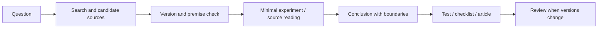
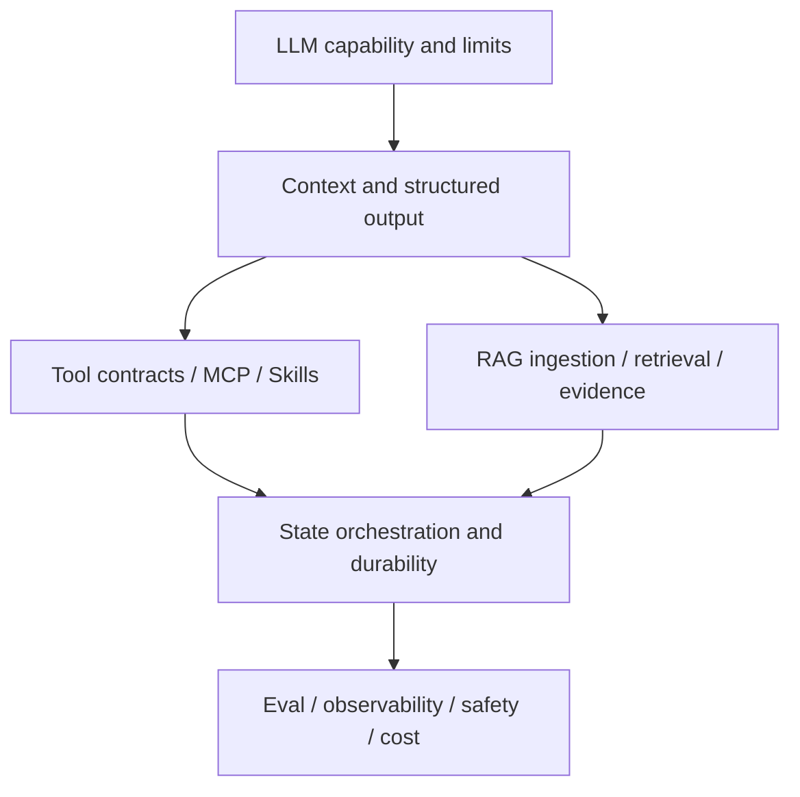

# 工程问题与学习资源索引

收藏链接不是知识管理。资料只有进入“问题 -> 证据 -> 实验 -> 结论 -> 回归”的闭环才有价值。一个高质量知识库应说明结论适用版本、前提、失败边界和验证方法，而不是堆教程、命令和面试话术。

## 证据层级与交叉验证

1. 语言/协议/平台现行规范；
2. 框架与工具当前版本官方文档、迁移与 Changelog；
3. 源码、测试、Issue/设计文档；
4. 可复现论文、技术文章和课程；
5. 搜索/AI 输出只作为线索。

官方文档也有版本、范围和简化。不同资料冲突时先核对版本/运行环境，再读规范/源码并做最小实验。流行程度和搜索排名不是事实权重。



## 一条结论的记录格式

```text
结论：精确、可证伪的一句话
适用：版本、浏览器/运行时、部署/数据前提
不适用：已知反例、历史行为
证据：规范段落、源码/测试、最小实验
工程影响：API、性能、安全、兼容取舍
验证：能在旧错误结论上失败的用例
复审触发：依赖/标准/浏览器变更
```

例如不要记“Vite 启动时间与项目规模无关”，而应记录原生 ESM 使源码按需转换，依赖预构建、插件、文件扫描、类型检查和页面请求仍随项目结构/规模影响；用不同规模和插件配置测量冷/热启动。

## 前端规范入口

| 问题 | 首选来源 | 验证工具 |
| --- | --- | --- |
| HTML 解析/语义 | WHATWG HTML、HTML AAM | WPT、浏览器 DevTools |
| JavaScript 语义 | ECMA-262、TC39 proposals | test262、Node/浏览器 |
| CSS | CSSWG specs/drafts | WPT、DevTools Rendering |
| 可访问性 | WCAG、WAI-ARIA/APG、AAM | axe、Accessibility Tree、键盘 |
| Web API | WHATWG/W3C、MDN（辅助） | WPT、多浏览器 |
| 网络 | HTTP RFC、Fetch、CORS | Network、curl、代理日志 |

MDN 适合入口与兼容说明，规范决定精确语义，WPT/真实浏览器验证实现。Can I Use 说明支持率，不证明项目目标浏览器的边界行为。

框架从 React/Vue/Next/Vite 官方文档、RFC/RFC-like 设计、源码测试和 Changelog学习。博客里关于 Fiber、Vue Scheduler、Next Cache 的结论需标版本，内部实现不是永久公共契约。

## 后端、数据与协议入口

- Node.js Event Loop/Streams/Worker/Abort、NestJS Module/DI/Lifecycle；
- Python asyncio、typing、FastAPI/Starlette/Pydantic；
- Go context、net/http、database/sql、runtime；
- PostgreSQL Transaction/Locking/EXPLAIN/Backup，SQLAlchemy/GORM；
- Redis 数据结构、持久化、缓存/锁边界；
- RFC 9110/9111、TLS、WebSocket、SSE、gRPC/Protobuf；
- OWASP Cheat Sheets/API/LLM Top 10。

数据库优化先查执行计划、锁与数据分布，不从“加缓存/分库分表”开始。分布式结论落到某个操作的一致性/可用性，避免 CAP 口号。库的默认值随版本变化，示例在隔离环境验证。

## AI 与 Agent 的学习地图



模型/SDK以供应商官方 API、模型卡、版本说明为准；协议读公开 Specification；框架（LangGraph 等）读概念、持久化、并发/错误文档和源码测试。Prompt 示例不等于生产架构。

学习 Agent 必须同时覆盖：状态/Checkpoint、Tool Schema/权限/幂等、Memory 删除与隐私、RAG ACL/Evidence、Eval 校准、Trace、deadline/成本/降级。只会调用模型和维护内存 Map 会话，不足以处理生产恢复与多租户。

OpenAI 等快速变化 API 的结论需在写作时核对最新官方文档；博客避免硬编码未来会漂移的默认模型/价格，必要时标更新时间和链接。

## 运维与安全入口

- Docker/OCI/Compose、Nginx、Kubernetes 官方文档；
- GitHub Actions/CI 平台安全、OIDC、环境审批；
- OpenTelemetry、Prometheus、SRE SLI/SLO/错误预算；
- PostgreSQL/对象存储备份恢复；
- SLSA、SBOM、Sigstore、OWASP Supply Chain。

运维知识必须通过候选、故障和恢复演练。备份命令成功不是恢复证据；健康 200 不是业务验证；扫描绿色不是运行配置安全。

## 工具按问题选择

| 问题 | 工具 |
| --- | --- |
| 浏览器协议/性能 | DevTools、WebPageTest、Lighthouse、WPT |
| JS/Node CPU/内存 | Performance/Heap、Node Inspector/Clinic |
| Python | pytest、ruff、mypy、py-spy、asyncio debug |
| Go | test/race/vet、pprof、trace |
| SQL | EXPLAIN ANALYZE、pg_stat、锁/连接指标 |
| 网络 | curl、openssl、tcpdump（受控）、代理日志 |
| 分布式 | OpenTelemetry、结构化业务状态、队列指标 |
| 安全 | OWASP ZAP、依赖/SBOM/Secret 扫描、威胁建模 |

工具输出只是证据。Lighthouse 单次 100 分不证明真实用户性能；Sentry 堆栈不证明根因；AI Code Review 不替代运行测试。

## 最小实验的设计

实验只验证一个结论，固定版本/配置/数据，包含对照组与边界。保存源代码和预期，避免只留截图。时间性能运行多次、预热/冷启动分开、报告环境和分布；并发用可控 barrier/延迟放大。

```ts
it('microtasks run before the next task but do not interrupt current stack', async () => {
  const events: string[] = []
  setTimeout(() => events.push('task'), 0)
  queueMicrotask(() => events.push('microtask'))
  events.push('stack')
  await new Promise(resolve => setTimeout(resolve, 10))
  expect(events).toEqual(['stack', 'microtask', 'task'])
})
```

实验结论限定当前运行时；规范解释为什么，多浏览器/WPT检查兼容。不要从一次本机计时推断渐进复杂度或所有平台。

## 阅读源码的路线

从公共入口/类型 -> 测试 -> 核心数据结构 -> 调度/错误 -> 适配器，而不是从仓库第一文件逐行读。先写问题：“computed 如何失效并触发消费者？”再沿测试和调用查。

Demo 实现必须标简化：mini Vue 若没有 effect stack、依赖 cleanup、scheduler、computed 脏标记/通知和 DOM patch，不应冒充完整原理；mini Fiber 需区分教学结构与 React 当前实现。发现原资料错误，在博客里直接更正并说明边界，不保留“标准答案”。

## 面试资料如何转化为知识文章

将“Q/标准答案/回答技巧”拆成主题：概念模型、工程边界、错误示例、现代实现、验证。重复问题合并；过时技术如 Hystrix/Ribbon、Webpack DLL/HappyPack 只作演进背景；错误结论用规范和实验纠正。

覆盖矩阵逐源文件标记：重写吸收、纠错吸收、重复合并、历史背景、不公开。矩阵放临时目录用于执行，不进入博客。最终文章不声称来自私有项目或暴露项目映射。

## 项目经验的匿名化

从多个系统提炼共同问题：任务生命周期、权限下推、候选切流、组件消费、浏览器上下文隔离。每篇至少综合多个来源的抽象，不做“一项目一文章”。

禁止项目/组织/仓库/业务域名、内部路径、API、表字段、真实数据/指标、Prompt、密钥、截图和源码。示例重新编写为 `ExampleService`、`DocumentRecord`、`tenantId` 等中性命名；指标用明确模拟场景，不模糊真实值。

## 版本复审与知识债务

Frontmatter `updated` 不是自动可信。对易漂移主题设置复审触发：依赖 major、标准状态、浏览器能力、供应商 API、安全公告。CI 检查死链/构建；人工检查语义。

文章保留演进背景但明确“历史方案/现行建议”。删除只有标题/外链的页面；内容被新文吸收后旧稿删除，依赖 Git 历史恢复。高质量少量内容优于大量提纲。

## 学习节奏与产出门槛

每个专题完成：

1. 画出概念/状态模型；
2. 读至少一手规范/官方文档；
3. 做能证伪关键结论的实验；
4. 对照真实工程失败（匿名化）；
5. 写边界、错误和验证；
6. 加自动检查或运行态证据；
7. 定期复审。

文章门槛不只字数：代码、图、表、测试、引用至少提供与深度匹配的技术证据。长文也可能只是重复，门禁和人工抽查并用。

## 验证：结论发布前检查

| 维度 | 问题 |
| --- | --- |
| 版本 | 适用哪个标准/框架/运行时？ |
| 来源 | 是否有一手证据，不只是转述？ |
| 实验 | 能否复现，是否有对照/边界？ |
| 现代性 | 历史方案是否误写成现行结论？ |
| 工程性 | 失败、权限、并发、恢复是否说明？ |
| 匿名化 | 能否反推项目、组织或真实数据？ |
| 可验证 | 是否有测试/检查，而非三道背诵题？ |
| 可维护 | 何时需要复审？ |

```ts
type KnowledgeClaim = {
  claim: string
  appliesTo: string[]
  sources: string[]
  experiment?: string
  counterExamples: string[]
  reviewTriggers: string[]
}
```

把高风险结论结构化，便于文章更新和覆盖审计。

## 常见误区

- 收藏数量被当作学习进度。
- AI/搜索回答直接成为博客结论。
- 官方文档不核对版本和适用前提。
- Demo 简化实现被描述为框架真实完整实现。
- 面试“标准答案”保留错误和过时技术。
- 性能结论来自一次本机计时，没有分布/环境。
- 工程经验公开真实项目映射、路径、字段和指标。
- 文章只写概念和三道知识校验，没有技术证据。
- `updated` 日期变化却未重新验证正文。

## 参考资料

- [WHATWG HTML](https://html.spec.whatwg.org/)：HTML、DOM、事件、导航和 Web API 的现行标准入口。
- [ECMAScript 规范](https://tc39.es/ecma262/)：JavaScript 词法、语法、类型和运行语义。
- [Web Platform Tests](https://web-platform-tests.org/)：浏览器实现与标准一致性的跨浏览器测试。
- [OpenTelemetry Specification](https://opentelemetry.io/docs/specs/otel/)：后端与运维观测的标准入口。
- [OWASP Cheat Sheet Series](https://cheatsheetseries.owasp.org/)：浏览器、API、日志、上传和 Agent 安全的可操作指南。
- [upJiang 的掘金文章](https://juejin.cn/user/862487522314366/posts)：个人实践基线；结论仍需按版本与官方来源复核。
- 个人实验材料已匿名化；本文只抽取通用机制，不建立项目映射。
