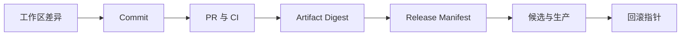

# Git 与变更发布

修复已经在本地通过测试，下一步可能是暂存、提交、推送、开 PR 或部署。这些动作影响范围逐步扩大，不应被一句“继续”自动合并。Git 管理源码历史，部署系统管理运行制品，数据库和外部副作用又有自己的状态。

本篇沿一处修复走完整链路，说明每一步要检查什么，以及为什么 `git revert` 不等于生产数据恢复。

## 先看变更身份链

Commit 标识源码图中的对象，Artifact Digest 标识具体构建产物，Release Manifest 再绑定配置和迁移版本。Tag 和 `latest` 方便阅读，却不一定不可变。

## 步骤一：先保护工作区所有权

开始修改前查看 `git status` 和差异，已有未提交内容可能属于用户或其他任务，不能为“干净”而 reset、checkout 或 stash。只编辑任务需要的文件；格式化后重新检查是否产生无关改动。

暂存区用于精确选择提交内容。提交前分别查看工作区和 cached diff，确认没有 `.env`、截图、日志、临时计划、数据库 dump 或密钥。Git hook 提供快速反馈，CI 才是共享门禁。

## 步骤二：一个提交表达一个意图

修复、无关重构、依赖升级和全仓格式化拆开。提交信息说明为什么改、行为怎样变化。相关测试与修复放在一起，使父提交能构建，也便于 `git bisect` 与独立 revert。

冲突解决不是选择 ours 或 theirs 的文本操作。先理解 base 和两边意图，锁文件与生成代码按最终清单重新生成，再运行测试。Rebase 会改写提交 ID，只适合未共享历史；共享分支谨慎使用 merge 或 revert。

## 步骤三：PR 描述风险和验证

PR 应说明问题、方案、兼容、验证、发布和回滚。机器人绿色不替代权限、数据和产品语义评审。Schema 使用 Expand/Contract，事件和 API 先发布兼容 Reader，再让 Writer 发送新字段。

公共库版本不仅看类型是否编译，还包含运行行为、错误码、DOM/CSS 与数据格式。已发布版本不原地覆盖，修复发布新版本；Changelog 面向消费者写影响和迁移。

## 步骤四：部署同一份已验证制品

CI 锁定依赖并生成制品，候选与生产提升同一 Digest。生产环境不重新构建一份未验证内容。候选通过版本、健康和业务冒烟后切流，旧制品与兼容 Schema 保留作为回滚点。

修改、commit、push 和 deploy 是不同授权。实现请求默认只留下工作区差异；提交、推送和线上发布分别需要明确指令。自动部署是仓库既定行为时，也应由分支事件与门禁控制，不能由本地实现过程私自触发。

## Revert 能恢复什么

| 动作 | 影响 |
| --- | --- |
| `git revert` | 新提交反向应用源码变化 |
| `git reset` | 移动分支或索引，可能丢未保存工作 |
| 部署回滚 | 环境指回旧 Artifact |
| 数据恢复 | 通过迁移、补偿或备份处理数据 |

代码回滚不会撤销已经发送的邮件、支付、对象写入和不兼容 Schema。发布计划必须明确应用回滚、数据前滚/恢复和外部对账。

## 验收链

工作区确认无越权覆盖；提交保持单一意图；CI 从冷缓存构建；制品摘要对应 Commit；候选运行精确制品；切流验证公网业务；回滚演练确认旧制品与 Schema 兼容。任一环节的证据都不能由下一环节的“看起来正常”替代。

下一篇把学习资源整理成同一套证据方法，避免收藏和 AI 输出直接成为技术结论。

## 从一处修复建立变更身份链

开始前先检查工作区，把自己的修改和已有用户修改分开。完成后选择与修复意图一致的文件进入提交，提交信息说明“改变了什么行为”，PR 再补风险、验证、迁移和回滚。`git commit` 保存源码快照，不等于这份代码已经部署。

| 身份 | 回答的问题 |
| --- | --- |
| commit SHA | 哪份源码经过评审 |
| CI run | 哪些检查在什么环境通过 |
| artifact digest | 实际构建出的制品是什么 |
| release/version | 哪份制品被批准发布 |
| deployment record | 何时部署到哪个环境 |
| rollback point | 代理或版本如何恢复 |

构建一次并提升同一制品，避免测试环境与生产环境现场重建出不同内容。数据库迁移与应用版本写明兼容窗口，部署后用真实入口回归。Revert 可以生成一个反向源码提交，却不会自动恢复数据库、对象存储和已经发送的外部副作用。

练习时任选一个小修复，写出变更范围、相关测试、制品身份、部署验证与回滚条件。若当前任务未经授权，不执行提交或推送；Git 管理边界的一部分就是尊重工作区所有权与发布权限。

## 参考资料

- [Git Reference](https://git-scm.com/docs)
- [Pro Git](https://git-scm.com/book/en/v2)
- [Semantic Versioning](https://semver.org/)
- [GitHub Artifact Attestations](https://docs.github.com/en/actions/security-for-github-actions/using-artifact-attestations)
