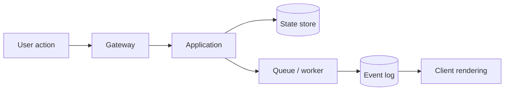
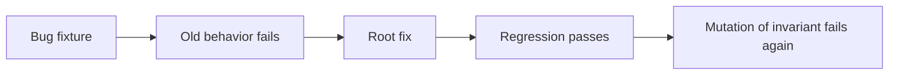

# 系统化调试方法

调试不是随机修改直到现象消失，而是在有限时间内缩小未知空间。可靠流程是：精确定义现象、建立可重复观测、定位首次偏离、提出可证伪假设、设计有区分度的实验、修复首次破坏的不变量，并留下回归与观测门禁。

## 把模糊现象变成可测量差异

“页面很卡”“Agent 答错”“任务偶尔不结束”都无法直接验证。记录：预期、实际、影响对象/范围、首次/最后时间、版本/环境、最小输入、频率和业务影响。

```text
预期：重连后从最后已应用事件继续，最终进入 succeeded
实际：约 3% 重连页面停在 running，但任务表已 succeeded
范围：仅经过某代理版本的 SSE；普通状态查询正确
时间：首次出现在某发布之后
输入：任意超过代理空闲窗口的任务
关联：taskId / streamId / requestId / artifactVersion
```

这个描述把“任务坏了”缩小为“业务状态正确，事件交付/客户端恢复异常”。量化描述决定需要查状态表、事件序列、代理日志和客户端游标，而不是先改 Worker。

## 先保护现场和用户

生产问题的第一目标是限制影响：暂停发布、关闭高风险 Flag、降流/切回已知版本、阻止重复副作用。保护动作要小且可逆，不在压力下同时升级依赖、清缓存、重启全部服务。

保存非敏感现场：版本/Digest、配置摘要、时间窗口、关联 ID、关键状态与指标快照。不要复制真实凭证、用户正文和私有数据库到个人临时目录。需要数据样本时用受控只读查询和匿名最小 Fixture。

## 建立时间线与事实层级



从系统边界向内检查每层输入/输出，寻找**首次偏离**：请求是否到达、身份/范围如何解析、状态何时提交、消息何时投递、事件序号是否连续、客户端何时覆盖本地状态。下游错误可能只是上游坏输入的结果。

证据优先级通常是持久业务状态/协议记录 > 同一关联链路的原始遥测 > 可稳定复现 > 代码推断 > 记忆和猜测。日志也可能有错误时钟、采样和缺字段，不能把一行日志当绝对事实。

## 复现矩阵而不是只做一个 Demo

最小复现保留触发原问题的必要条件。重写一个相似 Demo 但去掉代理、并发或真实版本，可能复现了另一个问题。建立矩阵逐个控制变量：

| 维度 | 取值示例 |
| --- | --- |
| 版本 | 上一稳定 / 当前 / 候选修复 |
| 路径 | 公网代理 / 代理直连 / 应用直连 |
| 数据 | 空/边界/典型/大规模合成 |
| 并发 | 单请求 / 重复 / 乱序 / 取消竞争 |
| 网络 | 正常 / 延迟 / 断连 / 429/503 |
| 权限 | 合法 / 跨范围 / 执行中撤权 |
| 缓存 | miss / hit / 旧版本 / 禁用 |

记录每格结果。只改变一个关键变量，使结果能区分假设。无法稳定复现时先增加相关观测或故障注入，不急于加 `setTimeout`。

## 假设必须可证伪

坏假设：“可能是缓存问题。”好假设：“缓存键缺少 policyVersion，权限撤销后仍命中旧结果；禁用缓存或改变版本后越权结果消失。”

为每个假设写：支持证据、反对证据、区分实验、预期结果、实验风险。优先验证高可能且高区分度、低风险的假设，不是最容易改代码的假设。

```ts
type DebugHypothesis = Readonly<{
  statement: string
  predicts: readonly string[]
  falsifiedBy: readonly string[]
  experiment: string
  risk: 'read-only' | 'isolated-write' | 'production-change'
}>
```

实验结果不符合预测就降低/淘汰该假设，不能为了保住结论不断增加例外。

## 二分定位变化

若有明确好/坏版本，`git bisect` 或制品二分能快速定位首次坏提交，但前提是有稳定自动判定脚本。构建历史版本时使用其锁文件/运行时，不修改提交来“让它能跑”，否则比较失真。

配置、数据和依赖也会变。代码回退仍坏不证明该提交无关；比较 Release Manifest、Schema、Feature Flag、模型/Prompt、浏览器和代理版本。用时间线对齐发布标记与指标变化，而不是只查 Git。

## 浏览器调试：从协议到主线程

- Network：请求 Initiator、Timing、缓存、重定向、SSE 分段、WebSocket Frame；
- Performance：主线程长任务、Style/Layout/Paint、事件处理、网络与渲染关联；
- Memory：Heap snapshot、Allocation、Detached DOM、Listener；
- Sources：异常/条件/日志/DOM/XHR 断点；
- Application：Cookie 属性、Storage、Service Worker、Cache Storage；
- Rendering/Accessibility：层、重绘、焦点和可访问树。

断点比到处插 console 更精确。DOM breakpoint 找未知修改者，XHR/fetch breakpoint 找请求来源，Pause on exceptions 捕获第一次抛出。Performance 先确认瓶颈在脚本、布局、绘制还是网络，再优化。

监控不能只依赖 `beforeunload`，它在崩溃、移动端和后台终止时不可靠。错误/性能数据用即时或 `sendBeacon`/可靠批量策略，仍有丢失预算。

## 后端和分布式调试

统一关联 requestId、traceId、taskId、attemptId、eventId。先查业务状态机和版本，再查 Trace 分解连接池、SQL、外部 API 和队列等待。一个 504 可能是代理 timeout、应用 deadline、数据库锁或客户端提前关闭，状态码只给方向。

SQL 使用 `EXPLAIN (ANALYZE, BUFFERS)` 在隔离/受控查询上确认执行计划；不要在生产对高成本写查询盲跑。查看估计/实际行数、锁等待、连接池 checkout、索引和数据分布。

队列查最老消息、租约、attempt、重试原因和终态，不能只看长度。Worker 重启后任务恢复异常时，检查 fencing token、ACK 时机和副作用记录。

## 竞态主动放大

竞态很少通过读代码直接证明。人工延迟关键边界、CPU/网络节流、同时提交、倒序响应、取消/完成并发、Worker 暂停后恢复，让窗口变大。

```ts
it('does not let an older response overwrite the latest query', async () => {
  const first = deferred<SearchResult>()
  const second = deferred<SearchResult>()
  api.search.mockReturnValueOnce(first.promise).mockReturnValueOnce(second.promise)

  controller.search('old')
  controller.search('new')
  second.resolve(result('new'))
  first.resolve(result('old'))
  await flushPromises()

  expect(controller.currentResult.query).toBe('new')
})
```

修复不是把 timeout 调大，而是加入请求版本/Abort、CAS、幂等或状态机。时间只有在协议明确（deadline、lease、debounce）时才是正确控制变量。

## 缓存调试先写键和有效性

列出缓存键的所有语义：tenant、subject/policy、resource version、locale、query、feature/config。再检查值的 schema/version、TTL、失效来源和读写竞争。禁用缓存能定位问题，但不是最终修复。

缓存命中结果错误时，要证明是错误写入、错误 key、旧失效事件还是序列化兼容。删除全部缓存会销毁证据并制造回源峰值，只在隔离或有容量计划时执行。

## AI/Agent 的分层诊断

将“回答错”拆成：问题理解、范围/ACL、数据解析、召回、重排、Context、工具、Claim、引用验证、模型生成。查看每层结构化产物，而不是只读最终文本。

指定范围无结果却引用其他来源，是权限/回退策略错误；检索候选正确但引用不支撑，是生成/验证错误；旧知识则查 SourceRevision -> Release lag。Prompt Injection 防护不能只搜索关键词，应检查不可信内容是否获得指令权和 Tool 权限。

复现样本匿名化，固定知识 Fixture、权限和版本。修改 Prompt 后跑全量 Eval/安全回归，不能只验证原失败一句话。

## 修复首次破坏的不变量

如果客户端显示 running 是因为断线后没有从持久 Task snapshot 恢复，修复状态恢复协议；不要增加前端“超过一分钟显示完成”的猜测。如果越权来自 SQL 未下推 scope，修 Repository 契约和测试；不要只在 UI 隐藏结果。

修复检查同类入口：列表、详情、搜索、导出、队列、缓存、SSE。局部补丁只覆盖原表述/标题不是根因修复。

## 回归测试要在旧实现上失败

一条好回归测试应：旧代码稳定失败、新代码通过、断言用户/业务结果和关键不变量，而不只断言某 Mock 调用。并发/事务/代理问题需要集成或运行态测试。



Mutation 删除修复条件，确认测试重新失败，防止测试其实没有覆盖根因。

## 验证与收尾清单

| 层 | 验证 |
| --- | --- |
| 原始复现 | 现象不再出现 |
| 相邻边界 | 空/大/重复/取消/权限 |
| 自动化 | 单元、集成、契约、构建 |
| 运行态 | 真实代理/浏览器/Worker |
| 可观测 | 新错误码/指标可诊断，无敏感值 |
| 性能 | 没有用昂贵全表/无限重试换正确 |
| 清理 | 临时日志、Flag、Fixture、截图删除 |

若修复需发布，候选验证和回滚阈值另行执行；本地修复通过不等于线上完成。

## 调试记录模板

```text
现象与影响：
时间线与版本：
可靠复现/概率：
首次偏离边界：
证据（关联 ID，不含敏感正文）：
假设与区分实验：
根因与被破坏不变量：
修复为何覆盖同类问题：
自动/运行态验证：
观测和预防门禁：
临时产物清理：
```

公开复盘只保留通用原理、匿名流程和模拟数据，不披露项目、组织、域名、内部路径、接口、表字段、截图和真实指标。

## 常见误区

- 现象消失就宣布修复，没有证明根因。
- 一次改多个变量，实验无法区分假设。
- 只读最终错误，不找第一次状态偏离。
- 清缓存/重启销毁证据并掩盖问题。
- 用 setTimeout 修竞态，扩大后仍失败。
- 分布式问题只有日志，没有稳定关联和状态事实。
- AI 回答错误只改 Prompt 关键词，未检查检索/权限/引用。
- 回归测试只验证 Mock，不在旧实现上失败。
- 临时 debug 日志/截图/测试账号留在工作区或系统。

## 参考资料

- [Chrome DevTools Performance](https://developer.chrome.com/docs/devtools/performance/)：主线程、渲染、网络和交互的运行证据。
- [Node.js Inspector](https://nodejs.org/api/inspector.html)：CPU、Heap 与调试协议入口。
- [PostgreSQL EXPLAIN](https://www.postgresql.org/docs/current/using-explain.html)：查询计划、估算误差和实际执行分析。
- [OpenTelemetry Trace Specification](https://opentelemetry.io/docs/specs/otel/trace/)：跨边界定位首次状态偏离。
- [Google SRE: Postmortem Culture](https://sre.google/sre-book/postmortem-culture/)：事故时间线、根因、行动项与复盘。
