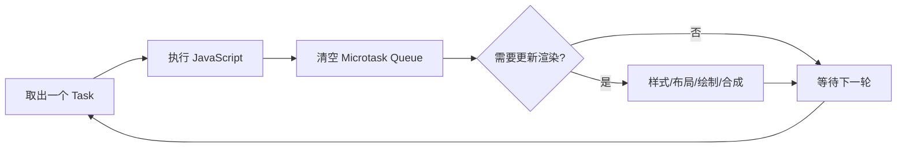

# 浏览器渲染、事件循环与任务调度

浏览器渲染与事件循环，是页面把输入、JavaScript、微任务和视觉更新安排到主线程与渲染阶段的运行机制。它位于 Web API 和页面组件之间：事件循环决定任务何时执行，渲染流水线把 DOM/CSS 状态转换成像素，调度工具则帮助应用把工作放进合适的时间片。交互卡顿要沿这条运行链定位，不能只套用某个框架的组件优化清单。

点击“展开列表”后，数据已经返回，页面却卡住半秒才变化。原因可能不是网络，而是一段长 JavaScript 占住主线程，微任务连续追加，或者循环中反复读取布局又写样式。

本文从一次点击到一帧绘制，串起调用栈、任务、微任务、样式计算、布局、绘制和合成。最后用 DevTools 做一个能复现的卡顿诊断。

## 浏览器主线程在轮流做什么



这是用于理解的简化模型。HTML Standard 定义事件循环和微任务检查点，浏览器还会处理输入、网络、空闲回调和不同线程。重点是：JavaScript 长任务没有结束时，主线程无法及时处理输入和渲染。

## Task 与 Microtask 的执行顺序

点击事件、定时器回调、网络事件等通常安排 Task；Promise reaction 和 `queueMicrotask` 安排 Microtask。当前 Task 结束后，事件循环在进入下一 Task 前执行微任务检查点。

```js
console.log("start")
setTimeout(() => console.log("timer"), 0)
Promise.resolve().then(() => console.log("promise"))
queueMicrotask(() => console.log("microtask"))
console.log("end")
```

逐行看：同步代码先输出 `start` 与 `end`；Promise 和 `queueMicrotask` 进入微任务队列；定时器进入后续 Task。常见输出是 `start, end, promise, microtask, timer`。定时器参数 0 不是立即执行，它只表示达到最小等待后有资格排队。

微任务可以继续创建微任务。如果递归追加没有边界，浏览器会长时间无法进入下一 Task 和渲染。微任务适合完成当前状态的一致收尾，不适合承载大量可分片计算。

## 浏览器渲染流水线

DOM 或 class 变化后，浏览器不一定立刻把每次修改画出来。它会在合适的渲染机会执行：

1. Style：匹配 CSS 选择器，计算元素最终样式。
2. Layout：计算元素几何位置与尺寸。
3. Paint：生成绘制记录，例如文字、背景和边框。
4. Composite：把图层合成为屏幕图像。

不同属性影响阶段不同。修改 width 常会触发布局；修改 transform/opacity 在满足条件时可能只需要合成。但“只触发合成”不是绝对保证，图层提升也占显存，仍要用 DevTools 验证。

## 布局读写与强制同步计算

代码先写样式，再立即读取 `offsetHeight`，浏览器为了返回准确值可能提前完成样式与布局。循环里交替读写，就产生 forced synchronous layout。

```js
const heights = items.map((item) => item.offsetHeight)

items.forEach((item, index) => {
  item.style.transform = `translateY(${heights[index]}px)`
})
```

这段先批量读取，再批量写入，减少读写交错。输入是元素集合，第一阶段得到当前高度快照，第二阶段修改 transform。实际列表定位不能直接把每个元素移动自己的高度；示例只演示批处理读写的职责，不是完整虚拟列表算法。

更复杂页面应让 CSS 布局承担几何关系，避免 JavaScript 逐个计算。必须测量时，在一帧中集中读、再集中写，并检查是否仍产生大范围布局。

## requestAnimationFrame 的调度位置

`requestAnimationFrame` 回调在浏览器准备下一次绘制前运行，适合把视觉状态更新对齐到帧。它不是精确 16.67ms 定时器，屏幕刷新率、后台标签页和主线程工作都会影响调用。

动画每帧用时间差计算位置，不用“每次回调移动 5px”假设固定帧率。长计算仍会卡住 rAF；大任务需要分片、Worker 或算法优化。

React/Vue 等框架的调度器也运行在浏览器任务体系上。React Fiber 能把可中断渲染工作分片，但浏览器 Commit 和 DOM 更新仍需主线程；不能简单说 React 直接依赖 `requestIdleCallback` 完成全部调度。

## 使用 Performance 面板定位长任务

准备一个按钮，点击后同步排序和渲染大量节点。在 Chrome DevTools Performance：

1. 开启录制，点击按钮，等待页面稳定后停止。
2. 在 Main 轨道寻找带红色角标的 Long Task。
3. 展开 Bottom-Up/Call Tree，找耗时函数和来源文件。
4. 查看是否有 Recalculate Style、Layout、Paint，以及它们由哪段 JS 触发。
5. 打开 Screenshots 或 Web Vitals，关联用户看到的停顿。

长任务通常指超过 50ms 的主线程任务，它会阻止输入响应。一次 200ms 任务拆成四个 50ms 仍可能影响体验；真正目标是给浏览器处理高优先级输入和绘制的机会，并缩短总工作。

## 长任务的拆分策略

| 工作 | 处理方式 | 原因 |
| --- | --- | --- |
| 更新下一帧视觉状态 | rAF | 与绘制机会对齐 |
| 当前 Task 后做少量一致性收尾 | Microtask | 在下一 Task 前完成 |
| 大量纯计算 | Web Worker | 离开主线程，需序列化数据 |
| 可分批渲染列表 | 分片/虚拟列表 | 控制单次 DOM 工作 |
| 后台低优先级任务 | Scheduler/idle（有降级） | 浏览器有空再执行 |

Web Worker 不能直接操作 DOM。主线程发送输入，Worker 返回计算结果；大对象复制也有成本，可评估 transferable objects。

## 一次卡顿实验

先实现同步创建大量 DOM 的版本，记录长任务、总节点、Layout 和交互延迟。再改为虚拟列表或分批加入，每批之间让出主线程。比较时固定数据量、浏览器、设备和操作，不只凭肉眼。

若优化后总时间略增但首次可交互和输入响应改善，需要根据产品目标判断；性能不是只追求某一个数字最小。

## 带回项目的排查清单

1. 当前卡顿发生在网络、JavaScript、Style、Layout、Paint 还是 Composite？
2. 是否存在超过 50ms 的 Task，调用栈在哪里？
3. 微任务是否递归追加，导致下一 Task 和绘制饥饿？
4. 是否在循环中交替读写布局？
5. DOM 数量、选择器范围和重绘区域是否过大？
6. 计算能否移到 Worker，渲染能否虚拟化或分片？
7. 优化前后是否固定输入并保留 Performance 记录？
