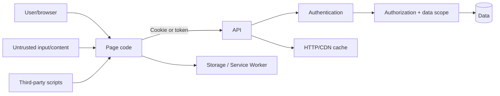

# 浏览器安全边界

浏览器安全不是把 XSS、CSRF、CORS、Cookie 背成几个定义。需要先画信任边界：脚本运行在哪个 Origin、凭证何时自动发送、哪些输入可能变成代码、哪个服务端动作需要授权、响应会被谁缓存，以及攻击者能控制页面中的哪一部分。

同源策略限制浏览器脚本读取跨 Origin 数据，但不是 API 鉴权；CORS 只决定浏览器是否把跨源响应暴露给脚本，不阻止 curl/服务端请求；HttpOnly 阻止 JavaScript 读取 Cookie，却不能阻止 XSS 代表用户发请求。安全机制必须组合，而不是寻找一个万能 Header。

## 威胁模型与请求链



| 边界 | 攻击者可能控制 | 主要防御 |
| --- | --- | --- |
| HTML/DOM 输出 | URL、评论、富文本、第三方数据 | 上下文转义、Sanitizer、CSP |
| 跨站请求 | 外部站点可发请求、浏览器自动带 Cookie | SameSite、CSRF token、Origin、幂等语义 |
| API 资源 | ID、查询、角色声明 | 服务端认证、对象/范围授权、查询下推 |
| 浏览器存储 | 任意同源脚本在 XSS 后可读 | 最小存储、短期凭证、CSP/供应链 |
| 缓存 | key 漏用户/Origin/权限 | private/no-store、Vary、分区与探针 |
| 第三方脚本 | 等同页面脚本权限 | 最小数量、SRI/CSP、沙箱 iframe、治理 |

## Origin、Site 与 CORS

Origin 由 scheme、host、port 组成；Site 主要围绕可注册域和 scheme，用于 SameSite 等策略。`app.example.com` 与 `api.example.com` 跨 Origin，但可能同 Site。这一区别直接影响 Cookie 和 CSRF 判断。

CORS 的预检不是授权。服务端对白名单 Origin 返回：

```http
Access-Control-Allow-Origin: https://app.example.test
Access-Control-Allow-Credentials: true
Vary: Origin
```

带凭证时不能使用 `*`。Origin 必须精确解析比较，不能用 `endsWith('example.test')`，否则 `evil-example.test` 可通过；也要防 `null` Origin 和非法端口。预检成功只代表浏览器允许实际请求，实际接口仍需认证和授权。

CORS 通常不能阻止跨站表单/图片等“简单请求”发送，只阻止攻击者脚本读取响应。因此副作用 API 仍需 CSRF 防护。反之，服务端到服务端调用不受浏览器 CORS 约束。

## Cookie 属性与会话

```http
Set-Cookie: __Host-session=opaque; Path=/; Secure; HttpOnly; SameSite=Lax
```

`Secure` 只经 HTTPS 发送；`HttpOnly` 阻止页面脚本读取；`SameSite` 控制部分跨站发送；`Path/Domain` 影响发送范围，但不是资源授权。`__Host-` 前缀要求 Secure、Path=/ 且无 Domain，减少子域覆盖风险。

前端 JavaScript **不能设置 HttpOnly**，只能由服务端 `Set-Cookie`。如果教程出现 `document.cookie = 'token=...; HttpOnly'`，浏览器不会赋予 HttpOnly 保护。

会话 Cookie 使用随机不透明 ID，服务端存会话状态、过期、设备/风险和撤销。登录后轮换 Session ID 防固定攻击；密码/权限敏感操作要求近期认证；登出在服务端撤销并清 Cookie。不要把 JWT 放 Cookie 就宣称“无状态且不可撤销”，也不要把长期 Token 放 localStorage 简化实现。

## CSRF：自动凭证与副作用

CSRF 成立的关键是浏览器会自动携带目标站点凭证，攻击者诱导用户发出副作用请求。防御组合：

- `SameSite=Lax/Strict` 作为基础，但考虑跨站登录、旧客户端和同站子域攻击；
- 同步 Token 或 double-submit（设计正确时），Token 绑定会话、不可预测；
- 对状态变更校验 `Origin`，必要时 Referer 兜底；
- GET/HEAD 不产生副作用；
- 高风险操作二次确认/认证；
- JSON 自定义 Header 会触发预检，但不能单独作为所有客户端的防御。

```ts
function assertTrustedOrigin(request: Request): void {
  const origin = request.headers.get('origin')
  if (origin === null || !allowedOrigins.has(origin)) {
    throw new ForbiddenError('untrusted origin')
  }
}
```

实际部署要正确处理可信代理和规范 Origin。不要接受客户端自报 Host/Origin 组合。CSRF Token 不能放 URL，避免日志和 Referer 泄露。

POST 不天然比 GET 安全。二者都依赖 TLS、认证、授权与校验；GET 参数更易进入历史/日志且语义应安全幂等，POST body 仍可被代理、服务端日志或恶意脚本读取。

## XSS 要按输出上下文防御

XSS 类型（stored/reflected/DOM）描述进入方式，但修复依赖 sink 上下文。HTML text、attribute、URL、CSS、JavaScript string 的编码规则不同，不能用一个 `escapeHtml` 处理所有。

框架默认把文本插值转义，但以下 escape hatch 仍危险：`innerHTML`、`dangerouslySetInnerHTML`、`v-html`、动态 script URL、字符串事件处理器、`javascript:` URL。富文本使用成熟 Sanitizer 的严格 profile，限制标签、属性和 URL protocol，并在客户端/服务端一致处理。

```ts
function renderRichText(container: HTMLElement, input: string): void {
  const sanitized = DOMPurify.sanitize(input, {
    USE_PROFILES: { html: true },
    FORBID_TAGS: ['style', 'iframe', 'form'],
    FORBID_ATTR: ['style']
  })
  container.innerHTML = sanitized
}
```

配置只是示意，需按产品允许能力审查链接、图片、SVG/MathML 和自定义属性。Sanitize 后不要再用字符串拼接修改 HTML，否则重新引入风险。若内容跨版本保存，Sanitizer 升级后考虑重新清洗或输出时清洗。

## CSP 是纵深防御

严格 CSP 通过 nonce/hash 允许受信脚本，禁用任意 inline/eval，并限制资源 Origin：

```http
Content-Security-Policy:
  default-src 'self';
  script-src 'nonce-{RANDOM}' 'strict-dynamic';
  object-src 'none';
  base-uri 'none';
  frame-ancestors 'none';
  connect-src 'self' https://api.example.test;
  img-src 'self' data:;
  report-to csp-endpoint
```

Nonce 每个响应随机且由服务器注入可信 script，不可固定。`strict-dynamic` 与浏览器兼容策略需验证。CSP 不能修复已有授权缺陷，也不能让不安全 innerHTML 变安全；它降低注入代码成功执行的概率。

先用 Report-Only 收集，但报告含 URL 等数据，需要脱敏和采样。逐步移除 `'unsafe-inline'`/`'unsafe-eval'` 和宽泛第三方域。CSP 配置要在真实 CDN、SSR、Worker、字体和监控链路测试。

Trusted Types 可以要求危险 DOM sink 只接受策略生成的 TrustedHTML 等值，适合大型应用治理 escape hatch；策略不能简单返回输入，否则只是绕过门禁。

## 第三方脚本与供应链

同源加载的第三方脚本获得页面脚本能力，能够读取 DOM、Storage 并代表用户请求。减少 SDK，登记所有者、数据、Origin、加载时机和 kill switch。能放沙箱 iframe 的不放主页面；使用 SRI 固定第三方静态资源时配合 `crossorigin`，但频繁变更 SDK 仍需版本治理。

包管理供应链：锁文件 frozen install，最小 CI Token，审查 install scripts，依赖扫描和 provenance/SBOM；不可信 PR 不接触发布 Secret。CSP 不能防已打进 self Bundle 的恶意依赖。

## localStorage、IndexedDB 与前端加密

localStorage 对任何同源脚本同步可读，不适合长期高价值凭证；它还会阻塞主线程。IndexedDB 适合较大结构化数据，但同样受 XSS 影响。Service Worker Cache 可能跨页面版本和账号保留响应，需用户隔离和清理。

前端用硬编码密钥加密 Storage 不能抵御 XSS，因为攻击脚本可以调用相同解密逻辑或在明文使用时读取。Web Crypto 适合实现协议、端到端加密等有独立密钥边界的场景，不是把密钥和密文一起放浏览器的魔法。

最小化存储、设置过期与版本、退出清理、账号切换分区。敏感数据优先只存在服务器，浏览器持有短期不透明会话。

## 授权与 IDOR 必须在服务端

隐藏按钮、路由守卫和前端角色判断只是 UX，攻击者可直接请求 API。每个对象操作服务端检查 action、resource、scope、状态和策略版本，并把范围下推查询：

```sql
SELECT id, title, status
FROM document_records
WHERE id = :record_id
  AND tenant_id = :tenant_id
  AND visibility_scope = ANY(:allowed_scopes);
```

不能先按 ID 查全局对象再在响应前过滤，缓存/日志/错误已经可能接触越权数据。批量、搜索、导出、文件下载、WebSocket 和异步队列都执行同等授权。

## SSRF 与开放重定向的前端关联

浏览器前端自身受网络边界限制，但若后端提供“抓取 URL”“生成预览”“代理图片”，用户可控 URL 会变 SSRF。服务端解析 URL，限制 scheme/hostname/port，解析 DNS 后阻止私网/metadata，重定向每跳重验，限制响应体和超时。不能只用字符串黑名单。

重定向参数只允许站内相对路径或签名 allowlist，防钓鱼和 OAuth Token 泄露：

```ts
function safeReturnPath(input: string | null): string {
  if (!input?.startsWith('/') || input.startsWith('//')) return '/'
  const url = new URL(input, 'https://app.example.test')
  return url.origin === 'https://app.example.test' ? `${url.pathname}${url.search}` : '/'
}
```

## Clickjacking、窗口与消息

敏感页面使用 CSP `frame-ancestors` 限制被 iframe 嵌入，旧系统可补 X-Frame-Options。不能靠前端 frame-busting 脚本，攻击者可利用 sandbox/CSP/时序绕过。

`window.postMessage` 接收端精确检查 `event.origin` 和必要时 `event.source`，Schema 验证 data；发送时指定目标 Origin，不用 `*`（除非数据公开且协议明确）。Origin 校验不能用 substring。

`window.opener` 可被新窗口用于导航原页面，外链使用 `rel="noopener noreferrer"`（现代浏览器对 `_blank` 有默认防护但显式契约更清楚）。OAuth popup 消息绑定 state、窗口引用和一次性流程。

## 缓存与安全响应头

私有页面/API：

```http
Cache-Control: private, no-store
Content-Type: application/json; charset=utf-8
X-Content-Type-Options: nosniff
Referrer-Policy: strict-origin-when-cross-origin
Permissions-Policy: camera=(), microphone=(), geolocation=()
```

按业务调整。HSTS 只在全站 HTTPS 和子域准备好后逐步启用；`includeSubDomains/preload` 错配会造成不可访问。下载响应设置准确 Content-Type、Content-Disposition，文件名清洗；用户上传内容放隔离 Origin，不能与主应用同源直接执行 HTML/SVG。

缓存 key 必须包含影响公开响应的维度，私有响应不进共享 CDN。跨用户探针是发布门禁：A/B 账号交替请求同一路径，确保 CDN、服务端和 Service Worker 都不串数据。

## 安全日志与错误处理

记录认证失败、授权拒绝、敏感设置变化和异常速率，包含 request ID、主体伪标识、动作、资源类型和结果；不记录密码、Token、Cookie、正文。错误响应对用户稳定，不返回 stack/SQL/内部路径；服务端日志保留 incident ID 关联。

频率限制按账号、IP、设备/行为等多维组合，不能只在前端按钮禁用。验证码和挑战是风险控制，不替代认证与授权。

## 验证

| 场景 | 探针 | 期望 |
| --- | --- | --- |
| XSS | HTML/attribute/URL/SVG payload | 文本安全或被 Sanitizer 拒绝；CSP 报告无执行 |
| CSRF | 跨站 form/fetch、缺 Token、伪 Origin | 副作用拒绝；合法请求通过 |
| CORS | 允许/拒绝 Origin、credentials、预检 | 仅白名单可读，`Vary` 正确 |
| Cookie | 检查 Set-Cookie 与 JS 读取 | Secure/HttpOnly/SameSite/Host 前缀符合；JS 不可读 |
| IDOR | A 请求 B 资源、搜索/导出/文件 | 所有通道拒绝且不泄露存在性/内容 |
| Cache | A/B 轮换、Service Worker、CDN | 私有数据不串用户 |
| postMessage | 伪 Origin/source/schema | 消息被拒绝，无副作用 |
| 供应链 | 构建扫描与不可信 PR | 无 Secret、未知远程脚本和发布权限 |

安全测试包含单元 Schema、集成授权、浏览器 CSP/CSRF/CORS、DAST 和依赖扫描。故意删除授权过滤、放宽 CSP、允许 `*` credentials、把 Token 放 localStorage，确认门禁失败。仅靠静态扫描不能证明业务授权。

## 常见误区

- **前端可以设置 HttpOnly**：只能由服务端 Set-Cookie。
- **POST 比 GET 安全**：方法没有安全等级，安全来自 TLS、认证、授权、校验和日志治理。
- **CORS 能阻止非法 API 调用**：它是浏览器读取策略，不是身份/权限。
- **HttpOnly 修复 XSS**：XSS 仍可代表用户操作和读取页面数据。
- **SameSite 后不需要 CSRF Token/Origin**：兼容、同站子域和业务流程仍需威胁建模。
- **前端加密 Storage 等于安全存储**：密钥同处一个执行环境时无法抵御 XSS。
- **隐藏按钮就是权限控制**：服务端每个资源通道都要授权。
- **反调试能保护代码/密钥**：客户端代码和运行态最终由用户控制，反调试只增加正常用户与维护成本。

## 源码与规范

- [OWASP Cheat Sheet Series](https://cheatsheetseries.owasp.org/)：XSS、CSRF、CORS、Session、CSP、SSRF 与日志边界。
- [Fetch Standard](https://fetch.spec.whatwg.org/)：Origin、CORS、credentials 与请求/响应过滤。
- [HTTP State Management RFC 6265](https://www.rfc-editor.org/rfc/rfc6265.html)：Cookie、Secure、HttpOnly、Domain 与 Path。
- [Content Security Policy Level 3](https://www.w3.org/TR/CSP3/)：CSP 指令、nonce/hash 与策略处理。
- 个人实验材料已匿名化；本文只抽取通用机制，不建立项目映射。
