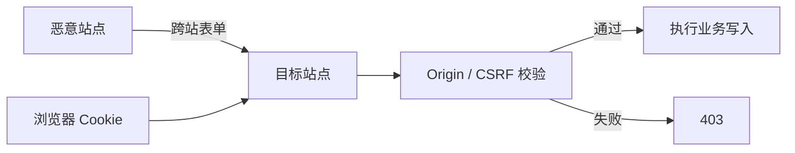

# 浏览器安全边界

用户已登录网站 A，又打开恶意网站 B。B 不能直接读取 A 的响应，却可能让浏览器向 A 发送自动携带 Cookie 的表单请求。这就是为什么“浏览器有同源策略”仍不足以阻止 CSRF。

本篇从这次跨站请求开始，区分同源、CORS、Cookie、CSRF 和 XSS，再用 CSP 与安全输出降低脚本注入风险。安全控制需要服务端与浏览器协作，前端隐藏按钮不构成授权。

## 同源策略保护什么

Origin 由 scheme、host 和 port 组成。同源策略主要限制一个 Origin 的脚本读取另一个 Origin 的数据。跨站导航、表单和部分资源加载仍可能发送，因此“不能读”不等于“不能发”。



CORS 控制浏览器是否把跨源响应交给脚本，不是服务端认证，也不是完整 CSRF 防护。服务端仍要验证身份、动作和对象权限。

## 步骤一：正确设置会话 Cookie

服务端通过 `Set-Cookie` 设置 `Secure`、`HttpOnly` 和合适 `SameSite`。前端 JavaScript 无法设置 HttpOnly。HttpOnly 降低脚本直接读取 Cookie 的风险，却不阻止浏览器自动发送，也不修复页面中的 XSS。

Cookie Domain 与 Path 尽量缩小，敏感操作使用短会话、重新认证和 CSRF 保护。GET 与 POST 不是安全等级区别；GET 应无副作用，敏感数据也不要放进容易进入历史和日志的 URL。

## 步骤二：阻止 CSRF

写请求检查 Origin/Referer，并使用同步 Token 或 double-submit 等合适方案。`SameSite=Lax/Strict` 是重要防线，但跨站业务、子域信任与浏览器行为需要单独评估。

CSRF Token 绑定用户会话且不可被第三方站点读取。服务端用恒定时间比较，失败返回 403，不执行副作用。CORS 允许列表不使用反射任意 Origin 与 Credentials 的组合。

## 步骤三：阻止 XSS

XSS 让攻击者代码在你的 Origin 中执行。默认使用框架文本插值，避免 `innerHTML`；确需展示富文本时使用经过维护的 Sanitizer 和明确允许列表。URL、CSS、HTML 属性等上下文需要不同编码规则，不能用一个 replace 解决所有注入。

下面的示例先把用户内容当作文本。输入即使包含 ``，输出也只是可见字符串，不会解析为节点。

```ts
function renderMessage(container: HTMLElement, message: string) {
  const paragraph = document.createElement('p')
  paragraph.textContent = message
  container.replaceChildren(paragraph)
}
```

`textContent` 使用文本节点表达内容。若业务需要 Markdown/HTML，先定义允许语法、清洗结果，并对链接协议、图片来源和新窗口关系继续验证。

## 步骤四：用 CSP 限制脚本来源

CSP 通过响应头限制脚本、样式、连接、Frame 和其他资源。推荐基于 nonce/hash 的脚本策略，先用 Report-Only 收集违反项，再逐步收紧。`unsafe-inline` 和宽泛 `*` 会明显削弱保护。

Trusted Types 可以在支持环境中约束 DOM XSS sink，但需要迁移第三方库。CSP 是纵深防御，不替代输出编码、依赖治理和服务端授权。

## 存储怎样选择

localStorage 可被同源脚本读取且长期存在，不适合保存长期高价值 Token；IndexedDB 适合结构化离线数据，也仍受同源脚本与 XSS 影响。内存状态生命周期短。无论放哪里，敏感数据都有最小化、过期和删除策略。

| 攻击或失败 | 应有结果 |
| --- | --- |
| 跨站表单携带 Cookie | Origin/CSRF 校验拒绝 |
| 页面文本包含脚本标签 | 作为文本显示 |
| 未授权对象 ID | 服务端返回 403/404 |
| 第三方脚本被篡改 | CSP/SRI 与供应链治理降低风险 |
| Token 出现在 URL | 门禁失败，改用受控凭证通道 |
| XSS 已发生 | HttpOnly 限制 Cookie 读取但系统仍需响应 |

安全测试覆盖正常请求、跨站 Origin、Token 缺失、存储泄露、CSP 报告和对象级越权。自动扫描只能发现部分问题，威胁模型和手工边界测试仍不可少。

## 参考资料

- [MDN Same-origin policy](https://developer.mozilla.org/docs/Web/Security/Same-origin_policy)
- [OWASP CSRF Prevention](https://cheatsheetseries.owasp.org/cheatsheets/Cross-Site_Request_Forgery_Prevention_Cheat_Sheet.html)
- [OWASP XSS Prevention](https://cheatsheetseries.owasp.org/cheatsheets/Cross_Site_Scripting_Prevention_Cheat_Sheet.html)
- [MDN Content Security Policy](https://developer.mozilla.org/docs/Web/HTTP/CSP)
