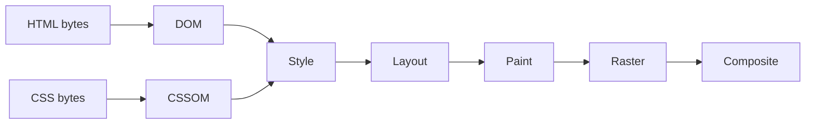

# 从输入 URL 到页面可交互发生了什么

地址栏回车到页面可点击，不是一条“DNS、TCP、HTTP、渲染”的背诵链。浏览器可能命中 Service Worker 或缓存、复用已有连接、跟随重定向，并在 HTML 尚未下载完时并行解析和预加载资源。诊断要把每个阶段对应到可观察证据。

## 导航请求如何进入网络

浏览器解析 URL、应用 HSTS/安全策略，检查导航拦截和缓存。需要网络时解析 DNS，建立 TCP+TLS 或 QUIC，发送带 Cookie、缓存验证器和优先级的请求。连接可能来自池，DNS 也可能来自多层缓存，所以不是每次都出现完整握手。

响应重定向会开启新导航步骤；首字节前的等待包含网络往返、代理和服务端处理。Network Timing 的 Queueing、DNS、Initial connection、SSL、TTFB 要分开看。

```text
Browser process: navigation / security / network
Network: cache -> DNS -> TCP/QUIC -> TLS -> HTTP
Renderer main thread: HTML parse -> DOM/CSSOM -> style -> layout -> paint
Compositor: layer/raster/composite -> pixels
Framework: JS execute -> render -> hydrate/event binding
```

浏览器收到响应后还要根据 MIME、CSP 和下载策略判断它能否交给 Renderer。网络请求成功不等于内容一定可以解析或执行。

## HTML 解析与资源调度

字节经编码解码进入 tokenizer 和 tree builder，增量构建 DOM。预加载扫描器提前发现部分资源。普通同步 script 会暂停 parser，等待脚本下载执行；defer 在文档解析后按序执行，module 默认具有 defer 类行为并受模块图影响，async 谁先下载谁执行。

CSS 不总是阻塞 DOM 解析，却会影响渲染和脚本读取样式；浏览器需要 DOM 与 CSSOM 计算样式。预加载扫描器可以提前发现静态资源，动态拼接 URL、CSS import 和脚本依赖仍可能形成瀑布。实际优先级要从网络时间线验证。

## 从 DOM 与 CSSOM 到合成帧

样式计算确定匹配规则和计算值；Layout 根据格式化上下文计算几何；Paint 生成绘制指令；Raster 把内容栅格化；Compositor 合成图层到屏幕。transform/opacity 常可只触发合成，但图层创建、纹理内存和前提条件仍要测量。



DOM 改动不必每次完整执行所有阶段，浏览器会失效并批量处理。布局树也不等于 DOM 树，`display: none`、伪元素和匿名盒都会改变最终几何；绘制对象与合成层同样不是“一元素一层”。读取布局后立刻写样式、循环重复会迫使同步 Layout，形成 layout thrashing。

## 安全策略在执行前阻断内容

重定向每一跳都可能改变 Origin、凭证和 Referrer。HTTPS 证书、HSTS、Mixed Content、CSP、CORP 与 COEP 会在内容执行前做出决定。页面请求即使返回 `200`，脚本仍可能因为 MIME、CSP 或模块 CORS 被拒绝。排查这类问题要同时检查响应、Console 安全错误和 Initiator，不能只看状态码。

## 从内容可见到页面可交互

DOMContentLoaded 表示文档解析与 defer/module 脚本阶段，不等待所有图片；load 等待更多资源；LCP 衡量主要内容出现；INP 关注交互延迟。SSR 页面可能早已显示 HTML，却仍在下载 JavaScript 和 Hydration，按钮尚未绑定。

框架 Hydration 复用服务端 DOM 并建立组件状态。输出不一致会修复或重建局部，增加成本。真正任务完成要用业务可操作和浏览器指标共同定义。

## 用冷导航定位故障

在无痕或禁用缓存条件记录 Network/Performance，保存重定向、协议、连接、TTFB、解析、长任务、LCP 和交互。第二次启用缓存，对比 memory/disk/304/Service Worker，不把 304 当成“没有网络”。

白屏时依次确认 HTML 是否到达、关键 CSS/JS 是否失败、脚本是否抛错、主线程是否存在长任务、根节点是否完成渲染。每个判断都要落到 Network、Performance 或 Console 中可复核的证据。

## 官方依据

- [HTML Parsing](https://html.spec.whatwg.org/multipage/parsing.html)
- [Navigation Timing](https://www.w3.org/TR/navigation-timing-2/)
- [MDN: Critical rendering path](https://developer.mozilla.org/en-US/docs/Web/Performance/Guides/Critical_rendering_path)
