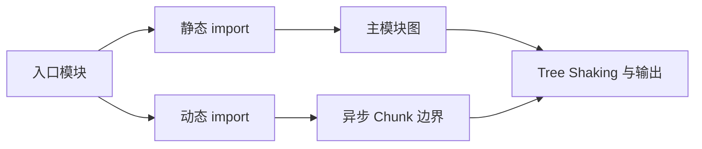

# Rollup、esbuild 与代码分割

首页并不需要图表编辑器，却在首屏下载了整套图表库。把编辑器改成动态导入后，构建产物出现一个独立 Chunk，只有用户进入编辑页才请求它。这就是代码分割最直观的结果。

本篇从这次改动解释模块图、Tree Shaking 和 Chunk。Rollup、esbuild 各有不同设计取舍，项目使用哪一个角色要以当前工具链配置为准。

## 构建器先画模块图



静态 import 在构建时可分析，通常进入同步依赖图；动态 import 创建异步边界。构建器解析、加载和转换模块，再根据入口、共享依赖与配置生成 Chunk。

## 步骤一：先按用户路径分割

路由、重型编辑器、语言包和只在特定操作出现的能力适合按需加载。不要为了追求 Chunk 数量把每个组件都拆开；小 Chunk 过多会增加请求、调度和运行时开销，共享依赖也可能重复。

下面的输入是一个动态导入，预期编辑器代码不进入首页同步 Chunk。加载失败要有用户可见恢复，而不是点击后静默空白。

```ts
export async function openEditor(container: HTMLElement) {
  try {
    const { mountEditor } = await import('./editor/mount-editor')
    await mountEditor(container)
  } catch (error) {
    container.textContent = '编辑器加载失败，请重试。'
    throw error
  }
}
```

动态 import 返回 Promise。网络失败、旧 HTML 引用已清理 Chunk 或发布切换都可能导致加载失败，因此部署要保留旧哈希资源一段时间，并采集 ChunkLoadError。

## 步骤二：理解 Tree Shaking 的前提

Tree Shaking 依赖静态 ESM 语义与副作用判断。未使用导出可以删除，但模块顶层副作用、动态属性访问和不准确的 `sideEffects` 声明会影响结果。把有副作用文件错误标为无副作用，可能让样式注册或初始化在生产消失。

包作者提供清晰 ESM 入口、正确 exports 和副作用声明；消费者用 Bundle 分析验证结果，不从 import 写法猜最终体积。

## 步骤三：Rollup 和 esbuild 的职责

esbuild 使用 Go 实现，擅长高速解析、转换和打包；Rollup 以插件生态、输出控制和库构建见长。Vite 开发阶段常使用 esbuild 处理依赖与部分转换，生产构建使用 Rollup 体系；具体版本可能引入其他构建后端，应以当前官方配置为准。

工具速度、兼容性、插件语义、Source Map 和输出质量需要在同一项目测量。不能从简单基准推断所有大型应用。

## 步骤四：用预算验证分割结果

构建报告检查入口 gzip/Brotli 大小、初始请求数、重复依赖和最大异步 Chunk。浏览器再测实际缓存、网络优先级、解析执行和交互。体积变小不一定让交互更快，若关键代码被拆到串行瀑布，结果可能更慢。

| 失败 | 排查方向 |
| --- | --- |
| 动态 Chunk 仍很大 | 共享依赖与边界位置 |
| 首屏出现串行请求 | preload、入口设计与嵌套 import |
| 生产功能缺失 | sideEffects 与条件导出 |
| Source Map 偏移 | 插件转换是否返回正确映射 |
| 发布后 Chunk 404 | 静态资源保留与 HTML 缓存 |

性能预算接入 CI，但阈值来自产品基线，不套固定 KB。依赖升级时同时比较体积与运行指标，保留可回退版本。

## 参考资料

- [Rollup](https://rollupjs.org/)
- [esbuild](https://esbuild.github.io/)
- [MDN dynamic import](https://developer.mozilla.org/docs/Web/JavaScript/Reference/Operators/import)
- [web.dev Code Splitting](https://web.dev/learn/performance/code-split-javascript)
