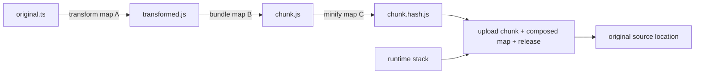
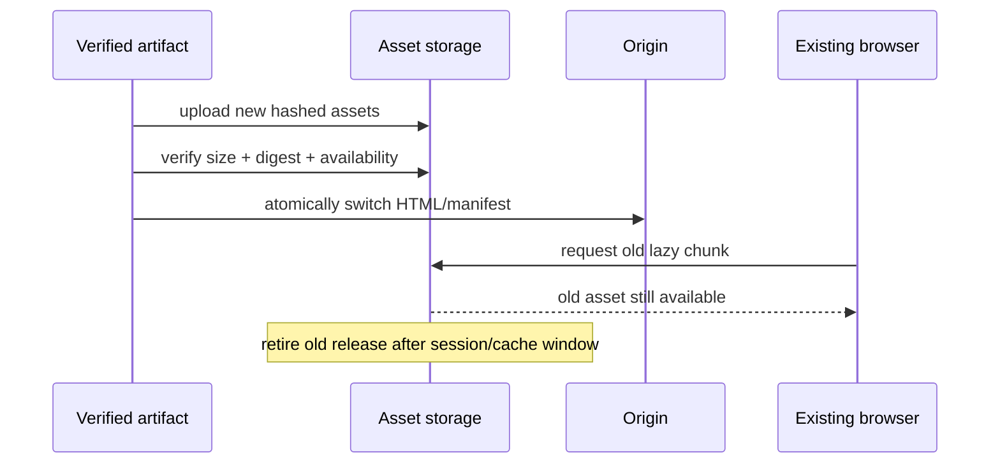

# Rollup、esbuild 与代码分割

构建工具的目标不是把源码压成尽可能少的文件，而是把源码依赖图转换成能被目标运行时正确加载、长期缓存、诊断和回滚的制品图。包越小不一定越快：过度拆分会增加调度和运行时开销，巨型 vendor Chunk 又会让任何依赖变更失效大量缓存。选择 Rollup、esbuild、Webpack 或其他工具，也不能用“谁 Tree Shaking 最好”概括；插件语义、模块格式、副作用声明、目标环境和真实输入才决定结果。

本文围绕 Vite 生产构建常见的 Rollup 与 esbuild 分工，但方法适用于其他构建链：先区分转换、图分析、Chunk 规划、压缩和制品发布，再为每层建立证据。

## 从源模块图到部署制品图

```mermaid
flowchart LR
  E[Entries] --> R[Resolve module identity]
  R --> L[Load sources]
  L --> T[Transform + Source Maps]
  T --> MG[Module graph]
  MG --> TS[Tree Shaking]
  TS --> CG[Chunk graph planning]
  CG --> C[Render chunks]
  C --> M[Minify / CSS / assets]
  M --> H[Content hashes + manifest]
  H --> D[Atomic deployment]
```



每一层的输入输出不同：

| 阶段 | 主要问题 | 典型证据 |
| --- | --- | --- |
| Resolve | 同一个 import 指向哪个模块实例 | resolved id、conditions、dedupe 日志 |
| Transform | TS/JSX/CSS/宏如何变成可分析模块 | code、diagnostic、组合 Source Map |
| Module graph | 哪些模块可静态到达 | importers/imported、动态边界 |
| Tree Shaking | 哪些声明与副作用必须保留 | used exports、side-effect trace |
| Chunk graph | 哪些模块一起下载和失效 | bundle visualizer、route waterfall |
| Render/minify | 目标语法、名称、许可和压缩 | target matrix、产物 diff |
| Deploy | HTML 与哈希资产如何原子对应 | manifest、缓存头、回滚演练 |

只看构建耗时或总 gzip 大小，会把错误优化带进生产。例如把所有共享依赖强制合成一个 Chunk 可能减少文件数量，却让很少访问的编辑器跟首页一起下载，并使每次升级任一依赖都改变整个 vendor 哈希。

## Rollup 与 esbuild 的职责不是简单替代

esbuild 用 Go 实现高性能解析、转换、Bundle 和压缩，在依赖预构建、TS/JSX 转换和许多构建任务中非常有效。Rollup 以模块图、插件钩子、Tree Shaking 和灵活输出见长，常承担 Vite 的生产 Chunk 编排。具体版本可能引入其他后端或替换部分阶段，因此应以锁定工具链的构建日志为准，而不是永久记住一张营销对比表。

两者都能 Bundle，也都能 Tree Shake；差异不是“一个开发、一个生产”的语言定律。需要比较的是：

- 所需插件是否能在对应工具的语义下正确运行；
- 多入口、库格式、CSS、资产和 SSR 输出是否满足；
- Source Map、诊断与可观测性是否足够；
- 构建与增量反馈是否满足团队预算；
- 产物行为和缓存策略是否经过真实浏览器验证。

对构建器的速度声明必须给出输入规模、机器、缓存状态、插件和输出目标。同一工具在纯 TS 转换与包含数百个自定义插件的应用 Bundle 中不是同一个问题。

## Tree Shaking 的前提是静态可分析与副作用诚实

Tree Shaking 从入口追踪导入和导出使用，并删除能够证明不可达且无副作用的代码。它不是“删除所有没调用的函数”，也不保证某工具绝对优于其他工具。

```ts
// math.ts
export function add(left: number, right: number): number {
  return left + right
}

export function multiply(left: number, right: number): number {
  return left * right
}

// entry.ts
import { add } from './math'
console.log(add(2, 3))
```

在原生 ESM、无顶层副作用且分析可追踪时，`multiply` 有机会被移除。以下情况会改变判断：

- CommonJS 动态 `require` 和导出对象修改；
- 顶层注册、Polyfill、样式导入或 getter 等副作用；
- 动态属性访问让工具无法确定使用的成员；
- 转换器提前把 ESM 降成 CommonJS；
- 包的 `sideEffects` 声明错误；
- 插件注入代码但没有标出副作用或模块边界。

`package.json` 中 `sideEffects: false` 是包作者的承诺，不是优化开关。若组件入口导入 CSS 注册主题，错误声明可能让消费者生产构建丢样式。更精确的形式是声明副作用文件模式：

```json
{
  "sideEffects": [
    "**/*.css",
    "./dist/polyfills.js"
  ]
}
```

`/* @__PURE__ */` 只应标注调用结果在未使用时可安全删除。给日志、注册、遥测或影响全局状态的调用乱加 PURE 注释，会让生产行为消失。验证 Tree Shaking 要创建安装后的消费 fixture，只 import 一个组件，再检查产物是否保留所需样式、移除未使用组件且能运行。

## 模块身份决定去重和状态

构建图中的模块不是简单文件名。条件导出、alias、query、symlink 和虚拟 id 都影响身份。同一个库被解析成两个物理实例，会造成 React Hooks invalid call、Context 不共享、单例 Store 分裂和包体积重复。

monorepo 中尤其要检查：

- workspace 依赖是否通过源码或已构建包消费；
- Peer Dependency 是否由宿主提供；
- symlink preserve 策略是否导致同一真实路径出现两个 id；
- 不同包是否锁到不兼容版本；
- SSR externalization 与客户端 Bundle 是否选择相同运行时语义。

Bundle visualizer 看到两个同名包只是线索。继续用 lockfile、resolved id 和运行时对象身份定位，不能直接用 alias 强行合并不兼容版本。

## 代码分割是加载与失效模型

动态 import 创建异步边界：

```ts
export async function openEditor(recordId: string): Promise<void> {
  const { mountEditor } = await import('./editor/mount-editor')
  await mountEditor(recordId)
}
```

这让编辑器代码可以在用户需要时加载，但边界是否有收益取决于访问概率、Chunk 大小、网络、预取时机和交互延迟。如果所有用户进入页面后立即点击编辑，完全延后会把成本从首屏转移到关键交互；可以在浏览器空闲、链接可见或用户意图明显时预取，但要受网络和数据节省偏好约束。

### 路由边界不是唯一边界

常见分割层次包括：

- 页面/路由：避免加载从未访问的功能；
- 重型能力：编辑器、图表、3D、OCR、代码高亮；
- 管理端与普通用户能力：权限和访问概率不同；
- Worker：独立执行环境和图；
- 国际化语言包：按 locale 加载；
- 可选集成：监控、支付、地图等第三方 SDK。

不要把每个小组件都动态 import。每个异步边界增加 Promise、错误状态、加载 UI、预加载决策和测试矩阵。边界应与用户路径、所有权或明显的重型依赖对应。

## 共享 Chunk 的缓存取舍

构建器会抽取被多个入口引用的模块，避免重复。手写 `manualChunks` 能提供控制，但很容易把源码组织误当加载策略。

```ts
function manualChunks(id: string): string | undefined {
  if (!id.includes('/node_modules/')) return undefined
  if (id.includes('/editor-engine/')) return 'editor-engine'
  if (id.includes('/chart-engine/')) return 'chart-engine'
  return undefined
}
```

按每个 npm 包拆 Chunk 可能产生大量小请求和执行依赖；统一 `vendor` 又造成缓存耦合。更可靠的方法是围绕稳定性和使用路径：框架运行时通常高频且相对稳定，重型编辑器只在特定页面使用，业务共享代码随发布频繁变化。然后用制品图验证，而不是假设配置生效。

Chunk 之间的 import 也会传播哈希：A 引用带哈希文件名的 B，B 变化可能使 A 内容改变。运行时 Manifest、哈希策略和构建器实现会影响缓存稳定性。用连续两次只改一个叶子模块的构建做 diff，统计哪些制品无业务原因发生哈希变化。

## 动态导入表达式必须可枚举

```ts
// 构建器通常无法从任意字符串知道所有可能模块。
await import(`./features/${userInput}.ts`)
```

应使用受控映射或工具提供的 glob import：

```ts
const loaders = import.meta.glob<true, string, { mount: () => void }>(
  './features/*.ts',
  { eager: false }
)

async function loadFeature(name: string): Promise<void> {
  const key = `./features/${name}.ts`
  const loader = loaders[key]
  if (!loader) throw new Error('unsupported feature')
  const feature = await loader()
  feature.mount()
}
```

受控集合既让构建器建立图，也防止用户输入变成任意模块路径。权限仍由服务端控制；隐藏或不加载某个前端 Chunk 不是授权。

## Chunk 失败是正常运行态

HTML 被更新而旧页面仍打开、CDN 清理过早、用户离线或发布只上传了部分资产，都会让动态 import 失败。不能对所有失败立即无限刷新：如果制品本身缺失，会形成刷新循环。

```ts
type ChunkRecovery =
  | { kind: 'retry'; attempts: number }
  | { kind: 'refresh-required'; expectedRelease: string }
  | { kind: 'offline' }
  | { kind: 'fatal'; incidentId: string }
```

部署应保留旧哈希资产至少覆盖页面最长会话/缓存窗口，HTML 短缓存或协商验证，哈希资产长缓存 immutable。应用可读取公开 Release，发现 HTML/运行时版本变化后提示用户刷新；离线时进入离线状态；一次受控重试后仍失败则上报脚本 URL 模板、Release 和网络信息，不能上传完整含敏感查询的 URL。

## CSS 分割与顺序

JavaScript Chunk 边界会影响 CSS 抽取。异步页面 CSS 可随页面加载，降低首屏样式体积，但必须避免路由切换时闪烁；共享组件样式抽取会涉及顺序和层叠。CSS Modules 解决局部命名，不解决全局 Token、层叠层与 Reset 顺序。

组件库发布时要决定样式是显式 import、每组件入口自带，还是统一 CSS。这个选择必须与 `sideEffects`、SSR、按需加载和主题策略一致。生产测试需要在干净消费项目中只引入单个组件，验证样式存在且未拉入整库。

CSS 中的 `url()` 资产、字体子集和 source map 也进入制品图。字体预加载的 URL 必须与构建输出一致，不能在 HTML 写死未哈希路径。

## 压缩、目标与语义

Minifier 可以删除不可达代码、折叠常量、缩短名称和压缩语法，但目标设置过新会在旧运行环境语法错误，过旧又增加转换和 Polyfill 成本。浏览器目标应来自产品支持矩阵与真实流量，不是复制 `es2015`。

语法降级不等于 API Polyfill。把 optional chaining 转成旧语法不会自动提供 `Promise`、`URL` 或 `IntersectionObserver`。Polyfill 策略需要按目标与实际用法设计，避免多份全局 Polyfill 和原型污染。

删除 `console` 也不是通用性能优化。粗暴 `drop_console` 可能删除参数求值，改变包含副作用的代码，并让生产诊断失去信号。更可靠的是使用受控 Logger、按级别编译和隐私过滤，保留错误与关键审计。

属性名 mangling 需要极强契约控制。与 JSON、DOM、第三方插件或跨 Chunk 交互的属性不能随意改名。除非有完善保留规则和端到端测试，业务应用通常不值得承担这个风险。

## Source Map 是制品的一部分

每次转换都要输入上一阶段 Map 并输出自己的 Map，最终 Map 与确切 Release 和 Chunk 内容绑定。上传后删除公开 `.map` 不等于不生成；错误平台需要私有保存并设置访问控制、保留期和删除机制。



如果插件返回空或错误 Map，后续合成不会自动修好。发布门禁用一段固定 fixture 经过完整构建，执行并捕获 stack，再通过真实符号化流程断言原文件/行列。Map 中可能包含源码内容和本机绝对路径，隐私扫描必须覆盖私有上传物和日志，而不只公开目录。

## 库构建与应用构建目标不同

应用拥有明确运行环境，可以把依赖打入 Chunk，并围绕页面路径优化。库需要让多个宿主消费，通常外部化 Peer Dependency、发布 ESM 与声明文件，并谨慎决定是否提供 CJS。多格式输出会增加条件导出和双包风险，不应为了“看起来兼容”全部生成。

组件库的 `preserveModules` 可以保留模块粒度，但会暴露更多文件结构并产生很多入口；单 Bundle 又可能削弱按需使用。应从真实消费者的构建结果验证 Tree Shaking 和加载，而不是只看库自身 dist。

库的公共契约还包括：

- `exports` 明确允许的子路径；
- `.d.ts` 与 JavaScript 入口一一对应；
- CSS 与静态资产进入 `files`；
- Node/browser 条件没有指向语义不同的意外实现；
- 开发依赖不出现在运行时 import；
- 包安装脚本与供应链权限最小化。

## 构建缓存必须可证明

缓存把“输入到输出”的函数结果复用，正确性取决于输入闭包完整。源码哈希不够：环境变量、配置、锁文件、插件版本、目标、代码生成输入和外部命令都可能影响输出。

远程缓存还要防止不同分支、平台或权限域互相污染。缓存制品需内容寻址、完整性校验和访问控制，不能让不可信 PR 写入生产可恢复缓存。Secret 不应进入缓存键明文或制品。

验证缓存的方式不是看第二次更快，而是建立变化矩阵：改源码只失效相关任务；改锁文件失效依赖构建；改公开配置失效应用；改无关文档不重构建；同一输入在干净环境产生等价制品。可复现不一定要求压缩字节绝对相同（时间戳/路径需治理），但功能 Manifest 与内容必须可解释。

## 性能预算要覆盖下载、解析和执行

压缩体积只代表网络传输的一部分。JavaScript 到达后还要解压、解析、编译和执行；低端设备上的 200KB 复杂框架代码可能比同体积图片昂贵。预算应包括：

| 预算 | 观察对象 | 常用方法 |
| --- | --- | --- |
| 初始传输 | JS/CSS/字体/首屏图片 | 构建 Manifest、压缩后体积 |
| 请求与依赖深度 | 关键路径 waterfall | 浏览器 Network、WebPageTest |
| 主线程 | parse/evaluate/long task | Performance trace、TBT/INP |
| 路由交互 | 异步 Chunk 到可交互 | 用户路径自动化与 RUM |
| 缓存稳定 | 无关改动导致的哈希变化 | 两次制品 diff |
| 构建反馈 | 冷/热构建和增量 | CI 与开发机基准分位数 |

预算按入口与页面类型设置。后台编辑页和公开阅读页的能力不同，不能共用一个数字；但“后台用户不在意性能”也不是理由，复杂工具更依赖稳定交互。

## 构建产物的原子发布

制品正确仍可能因部署顺序出错。安全模型是先上传所有带哈希资产并验证，再切换 HTML/Manifest 入口；旧资产保留观察窗口。不能先更新 HTML 再慢慢同步 Chunk，也不能发布后立即删除上一版所有哈希文件。



回滚只切入口指针还不够：上一版资产、服务端 API 兼容和数据库迁移都必须仍可用。构建 Manifest 应作为部署验证输入，逐个检查关键资产存在和内容摘要一致。

## 验证与故障演练

构建系统的完整验收可以采用下列矩阵：

| 故障/变更 | 操作 | 期望证据 |
| --- | --- | --- |
| Tree Shaking | 消费包只 import 一个组件 | 未用 JS/CSS 不进入；必需副作用仍存在 |
| 缓存稳定 | 只改一个异步叶子模块 | 首页无关 Chunk 尽量保持哈希 |
| 动态 Chunk 失败 | 让一个 Chunk 返回 404/离线 | 有界恢复、无无限刷新、可定位 Release |
| 重复依赖 | 引入不同路径同版本运行时 | 构建检查识别重复，运行时状态不分裂 |
| Source Map | 生产模式抛固定错误 | 私有符号化定位原始行列，公网无 Map |
| 旧浏览器目标 | 在最低支持环境运行代表路径 | 无语法/API 缺失；Polyfill 不重复 |
| 原子发布 | 保留旧页面后切换新版本 | 旧页面动态 import 继续成功 |
| 供应链 | 不可信 PR 运行构建 | 无生产 Secret、无远程缓存污染权限 |

自动化至少包含：内容/类型检查、单元测试、生产 Build、制品预算、Manifest 完整性、临时消费项目、浏览器关键路径、Source Map fixture 和两次构建 diff。Bundle analyzer 图是诊断材料，不是自动验收本身；把关键入口预算和禁止依赖规则写成机器门禁。

故意把 `sideEffects` 改错、移除一个旧 Chunk、破坏 Map 或让无关依赖进入首页，确认门禁会失败。若测试仍绿，说明它没有覆盖构建系统的真实风险。

## 常见误区

- **Rollup 的 Tree Shaking 永远最好**：结果依赖模块格式、副作用、插件、目标和版本，必须以真实消费产物比较。
- **文件越少性能越好**：HTTP/2/3 改变请求成本，但执行、依赖深度和缓存耦合仍需权衡。
- **每个依赖拆一个 Chunk 缓存最好**：会增加请求与运行时映射，也可能产生深瀑布和版本耦合。
- **总 gzip 小就完成优化**：解析、执行、主线程和关键交互可能更差。
- **`sideEffects: false` 是无风险开关**：它是对所有消费者的语义承诺，错误会删除必要行为。
- **语法转换等于兼容性**：运行时 API、CSS、模块加载和服务端能力需要各自支持策略。
- **哈希文件可以发布后立即清理旧版**：已打开页面仍可能请求旧异步 Chunk。
- **构建成功代表部署成功**：制品完整性、上传顺序、缓存头、入口切换和回滚都要验证。

## 源码与规范

- [Rollup Introduction](https://rollupjs.org/introduction/)：模块图、Tree Shaking、Chunk 和插件的官方入口。
- [esbuild API](https://esbuild.github.io/api/)：Build、Bundle、Splitting、Target 与 Source Map。
- [ECMAScript Modules](https://tc39.es/ecma262/multipage/ecmascript-language-scripts-and-modules.html)：静态 Import/Export 与模块链接语义。
- 个人实验材料已匿名化；本文只抽取通用机制，不建立项目映射。
- 个人实验材料已匿名化；本文只抽取通用机制，不建立项目映射。
