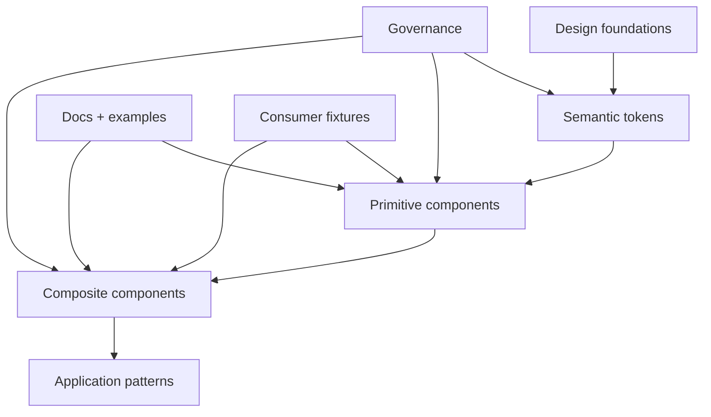
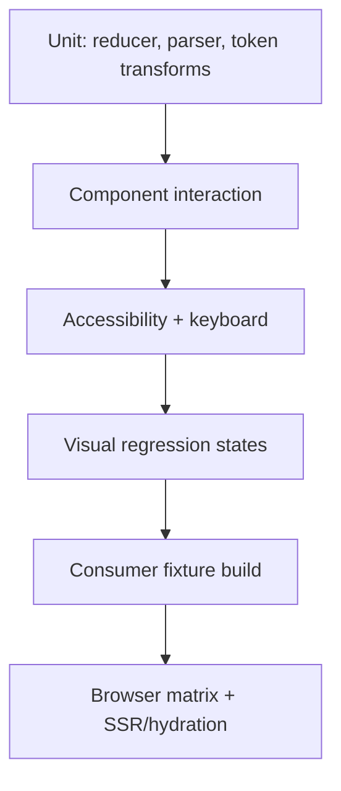

# 组件库与设计系统工程

组件库不是把业务项目中的 Button、Modal 和 Table 移到一个仓库，再配置 npm publish。它是一套跨团队契约：产品语义映射成设计 Token，组件把语义、交互、可访问性和状态组合成公共 API，构建产物让不同消费者可靠安装，版本策略保证演进可预测，文档与测试提供行为证据。

“原子、分子、组织”可以帮助讨论视觉组合，却不能独立决定工程边界。一个组件是否应进入公共库，取决于复用范围、变化原因、语义稳定度、可配置成本和所有权。把单一业务流程抽象成 40 个 Props 的“万能组件”，只会把业务耦合转移到所有消费者。

## 资产分层与所有权



| 层 | 示例 | 稳定契约 | 所有权建议 |
| --- | --- | --- | --- |
| Foundation | 色彩、字号、间距、动效时长 | 命名与单位 | 设计系统团队共同治理 |
| Semantic Token | `color.text.danger`、`space.control.gap` | 意图而非具体颜色 | 跨主题可替换 |
| Primitive | Button、Input、Dialog、Tabs | 语义、键盘、状态、事件 | 组件库维护者 |
| Composite | DatePicker、DataTable、Upload | 数据/交互协议 | 领域专家与库协作 |
| App Pattern | 审批面板、业务筛选器 | 业务流程 | 应用/业务包，不强塞基础库 |

基础组件不应知道组织、订单或特定接口。复杂组件也不必假装“纯展示”：DataTable 的选择、排序、虚拟化和无障碍有真实状态模型，但数据获取、权限和业务写入应由调用者通过明确适配器负责。

## 先写行为契约，再写 Props

Button 的公共契约至少包括：渲染为 button 还是 link、键盘激活、禁用语义、加载期间是否阻止重复操作、焦点是否保留、事件何时触发。`type="primary"` 只描述视觉，不足以定义行为。

```ts
type CommonProps = {
  label: string
  size?: 'small' | 'medium' | 'large'
  tone?: 'neutral' | 'accent' | 'danger'
}

type ActionProps = CommonProps & {
  kind: 'action'
  disabled?: boolean
  pending?: boolean
  onPress: () => void
  href?: never
}

type LinkProps = CommonProps & {
  kind: 'link'
  href: string
  external?: boolean
  onPress?: never
  disabled?: never
}

type ButtonProps = ActionProps | LinkProps
```

联合类型禁止调用者同时传 `href` 与 `onPress`，实现按 `kind` 渲染原生元素。链接不能通过 `div role=button` 模拟；button 未指定 type 时在 form 中默认提交，组件需要明确默认或要求调用者选择。

Props 设计遵循几个约束：

- 用有限状态表达真实互斥，不用多个冲突布尔值；
- 事件命名表达语义，例如 `onValueChange`，不暴露内部 DOM 事件除非契约需要；
- 受控/非受控模式明确，不能运行中静默切换；
- 默认值稳定且文档化，服务端和客户端一致；
- 不透传所有内部实现 Props，以免锁死替换能力；
- escape hatch 有窄边界，如 `className`/slot，而非任意内部节点引用。

## 组合优于配置矩阵

Modal 若拥有 headerText、showHeader、headerActions、customHeader、footerButtons、customFooter 等叠加 Props，会形成巨大状态矩阵。更适合使用带语义的组合槽：

```tsx
<Dialog open={open} onOpenChange={setOpen}>
  <Dialog.Trigger>删除记录</Dialog.Trigger>
  <Dialog.Content aria-describedby="delete-description">
    <Dialog.Title>确认删除</Dialog.Title>
    <Dialog.Description id="delete-description">
      删除后无法从当前版本恢复。
    </Dialog.Description>
    <Dialog.Actions>
      <Dialog.Close>取消</Dialog.Close>
      <Button kind="action" tone="danger" onPress={remove}>删除</Button>
    </Dialog.Actions>
  </Dialog.Content>
</Dialog>
```

Headless primitive 管理焦点、Escape、点击外部、ARIA 关系和状态；样式层提供 Token 和 variants；应用组合内容。组合也有成本：结构必须限制在可访问语义允许范围，不能让任意 children 绕过 Title/Description。可在开发环境给出诊断，并用类型/运行时 Context 校验子组件关系。

## 受控与非受控状态

可编辑组件通常提供 `value/onValueChange` 受控模式，或 `defaultValue` 非受控初值。实现必须在首次 render 决定模式，并在开发时警告切换：

```ts
function useControllableState<T>(options: {
  value?: T
  defaultValue: T
  onChange?: (value: T) => void
}): readonly [T, (next: T) => void] {
  const controlled = options.value !== undefined
  const [internal, setInternal] = useState(options.defaultValue)
  const value = controlled ? options.value! : internal

  const setValue = useCallback((next: T) => {
    if (!controlled) setInternal(next)
    options.onChange?.(next)
  }, [controlled, options.onChange])

  return [value, setValue] as const
}
```

生产实现还要固定 controlled 判断、处理 `undefined` 是否是合法值、避免闭包和并发问题。`defaultValue` 后续变化通常不重置内部状态，文档必须明确；需要重置可通过 key 或显式 API。

## 可访问性是功能，不是附加属性

组件验收不能以“加了 aria-label”结束。使用原生语义优先，ARIA 只补充角色、状态和关系，不改变浏览器行为。常见组件契约：

- Dialog：打开后焦点进入合理位置，焦点限制在模态范围，Escape 关闭，关闭后返回触发器；背景不可交互；Title/Description 关系正确；
- Tabs：tablist/tab/tabpanel 关系，方向键与 Home/End，激活策略明确，焦点与选择可分离；
- Combobox：输入、popup、active descendant、异步状态、IME、读屏公告；
- Menu：只用于命令集合，不把普通导航列表随意改 role=menu；
- Tooltip：不能承载必须点击的内容，键盘焦点可触发，触屏有替代；
- DataTable：表格语义、排序状态、选择标签、虚拟化后的读屏和焦点。

Focus trap 不能只查询一次 focusable 元素；内容动态变化、嵌套 portal、禁用状态和 Shadow DOM 都会影响。优先使用经过验证的无障碍 primitive，而不是每个团队手写。

自动 axe 测试能抓缺标签、对比度和 ARIA 结构，但不能证明键盘顺序、读屏理解和操作意图。代表组件需手动使用键盘和至少一种屏幕阅读器验收。

## Token 从原始值走向语义

直接公开 `blue500`、`spacing8` 会让业务绑定具体视觉。更稳的映射是：

```text
primitive.blue.600 -> semantic.color.action.primary.background
semantic.color.action.primary.background -> component.button.primary.background
```

主题只替换语义映射，组件使用 component/semantic Token。这样深色模式的危险按钮可以选择满足对比度的不同色阶，而不是机械反转。

```css
:root {
  --color-surface: #ffffff;
  --color-text: #17191c;
  --color-action: #1769e0;
  --color-focus: #005fcc;
  --space-control-x: 0.75rem;
  --radius-control: 0.375rem;
}

[data-theme='dark'] {
  --color-surface: #15171a;
  --color-text: #f2f3f5;
  --color-action: #70a5ff;
  --color-focus: #9bc0ff;
}
```

主题切换在首屏脚本/服务端确定，避免 hydration 后闪烁。系统偏好、用户选择和组织主题的优先级要固定；存储值只允许已知主题名。CSS 变量是公开运行时契约，删除/改名也属于破坏性变更。

Token 需要 Schema：名称、类型、单位、描述、废弃状态、明暗主题值和对比度验证。设计工具与代码从单一受审源生成，而不是两边手工同步。不要在运行时从任意 JSON 注入 CSS 值，URL、`content` 等 Token 有注入风险。

## 样式隔离不是把类名加长

CSS Modules、CSS-in-JS、Shadow DOM 和命名空间解决不同问题。组件库要明确：

- Reset 由宿主还是组件提供；
- 层叠层（`@layer`）顺序和覆盖入口；
- CSS specificity 是否允许应用覆盖；
- Portal 内容如何继承主题；
- SSR 如何收集样式并保证 hydration 顺序；
- CSP 是否允许运行时 style 注入；
- 样式是否随组件入口按需加载。

避免 `!important` 和超长选择器形成覆盖军备竞赛。提供 Token 和受控 variants，应用定制走公开类/slot。Shadow DOM 隔离强，但会影响主题、Portal、全局字体、测试和无障碍组合，不是基础库的默认答案。

## 包结构与真正的按需消费

组件库源码可按包或组件组织，但发布面向公共入口：

```json
{
  "name": "@example/ui",
  "type": "module",
  "exports": {
    ".": {
      "types": "./dist/index.d.ts",
      "import": "./dist/index.js"
    },
    "./button": {
      "types": "./dist/button/index.d.ts",
      "import": "./dist/button/index.js"
    },
    "./tokens.css": "./dist/tokens.css"
  },
  "peerDependencies": {
    "react": ">=18 <20",
    "react-dom": ">=18 <20"
  },
  "sideEffects": ["**/*.css"]
}
```

Peer range 必须来自真实兼容测试，不是随意写宽。React 等宿主运行时不能被打进库，避免双实例。声明文件不能引用仓库路径别名。`files`/exports 确保许可证、CSS、字体和声明都发布。

Tree Shaking 通过消费沙箱证明：创建干净应用，只 import Button，构建后断言没有 DatePicker 引擎、图标全集和未用 CSS；同时 Button 样式存在。库自己的 dist 大小不能证明消费者结果。

## 图标与资产治理

图标应以可 Tree Shake 的独立 ESM 导出，避免运行时按字符串从巨大对象查找，后者通常拉入全集。装饰图标 `aria-hidden`；独立图标按钮必须有可访问名称和 tooltip（tooltip 不能是唯一名称）。SVG 使用 `currentColor`、稳定 viewBox，外部来源经过清洗，不能允许任意 SVG 字符串注入。

字体和图片资产要有许可、压缩和缓存策略。组件库不应默认加载大字体或远程资源；宿主控制部署 Origin 与 CSP。Token 文档可展示色板，不把装饰图作为核心依赖。

## 文档必须运行真实发布产物

Storybook/VitePress 等文档站若直接 alias 到源码，可能掩盖 exports、声明、CSS 和 Peer 问题。至少一条部署/测试模式从 pack 后 tarball 安装真实产物。示例不是截图，而是可操作状态矩阵：默认、禁用、加载、错误、长文本、RTL、缩放、深色、高对比、键盘。

文档应自动生成 Props/Token 表，但手写行为、可访问性、受控模式和迁移说明。不要把内部项目名、业务截图或接口用作公开示例；使用中性数据。

## 测试金字塔围绕契约



单元测试覆盖纯状态和工具；组件测试用真实用户事件；视觉回归固定字体、浏览器和数据；消费 fixture 验证包；浏览器矩阵覆盖最低支持版本和 SSR。不要大量快照整个 DOM，它会在无行为变化时产生噪声，却遗漏焦点和键盘。

代表 Dialog 测试至少包含：焦点进入/循环/返回，Escape，背景 inert，嵌套交互，Title 缺失诊断，异步内容，Portal 主题，SSR hydration。DataTable 则测排序、选择、虚拟滚动、键盘、空/错误/加载状态和大数据性能。

## 版本演进与废弃

SemVer 只在公共契约被清楚定义时有用。破坏性变化不只是删 Props：默认值、DOM 结构、CSS Token、焦点顺序、事件时机、包入口和 TypeScript 最低版本变化都可能影响消费者。

变更评审需要区分“类型兼容”和“行为兼容”。把 `onChange(value)` 扩成 `onChange(value, metadata)` 对 JavaScript 调用者通常兼容，但若声明中的回调方差、Mock 或序列化逻辑依赖精确参数，仍可能破坏；把默认按钮从 `type="button"` 改为 `submit` 即使类型完全不变，也会改变表单行为；给 Dialog 增加一个包装 DOM 可能破坏选择器、布局和焦点。发布前保存公开声明、导出表、代表 DOM/可访问性树和视觉状态的基线，根据差异分类为 source、binary/package、behavior、style 或 accessibility contract，再决定版本和迁移方式。

兼容层也要有退出期限。旧 Prop 到新 Prop 的映射只放在组件入口，若二者同时出现应明确报冲突，不能由属性展开顺序随机覆盖。运行时警告按组件和调用位置去重，只在开发环境输出；迁移遥测只统计静态采用或匿名计数，不上传业务 Props。删除前用代表消费仓库的候选包构建证明旧入口已无人依赖，而不是根据维护者印象判断。

发布流程：

1. Changeset 记录变化、影响和迁移；
2. CI 跑所有契约与消费矩阵；
3. 生成不可变候选包并在代表应用安装；
4. 发布 canary/beta 给早期消费者；
5. 正式发布并保留 provenance、SBOM/依赖审计；
6. 监控采用和错误，维护回滚/旧版本支持窗口。

废弃 Props 在开发环境给一次明确警告，文档标 replacement 和删除版本；提供 codemod，但 codemod 运行后仍需类型/浏览器验证。不要同时静默支持两个语义多年，内部复杂度会扩散。

## 治理避免两种极端

没有治理会出现重复组件；审批过重则团队复制源码绕开。引入流程需要轻量 RFC：问题、现有替代、复用证据、API、状态矩阵、a11y、Owner、维护成本和退出策略。基础 primitive 高门槛，应用 pattern 可更快迭代。

记录使用遥测时只统计包版本/组件静态引用等构建期数据，避免运行时收集业务内容。也可以通过依赖图和代码搜索识别采用。无人维护组件进入 deprecated，再根据迁移计划移除。

## 验证与故障演练

| 场景 | 验证 | 通过标准 |
| --- | --- | --- |
| 按需消费 | 临时应用只 import Button | JS/CSS 不包含无关组件，样式完整 |
| 双运行时 | monorepo + npm 消费 | React/Vue 只有一个宿主实例 |
| 无障碍 | 键盘、axe、读屏抽查 | 焦点/名称/状态/关系符合组件模式 |
| 主题 | light/dark/high contrast/portal | Token 完整、无闪烁、对比度达标 |
| SSR | 服务端渲染后 hydrate | 无 mismatch、样式顺序和 id 稳定 |
| 破坏性变化 | API/DOM/CSS 声明 diff | 未声明 breaking change 时门禁失败 |
| 长文本与缩放 | 中文/英文/RTL、200% zoom | 不溢出、不遮挡、操作仍可达 |
| 故障状态 | 异步失败、资源 404、慢加载 | 有稳定错误/重试，不破坏焦点 |

做 mutation 证明门禁有效：移除 Dialog Title，axe/开发诊断应失败；把 Button CSS 从 sideEffects 列表删除，消费 fixture 应失败；引入第二份 React，依赖检查应失败；改变 Token 名称不写迁移，API diff 应阻止发布。

## 常见误区

- **组件越通用越有价值**：配置矩阵超过稳定共性后，复用成本高于复制一个业务组合。
- **有 TypeScript 就有稳定 API**：默认值、焦点、DOM、CSS 和事件时机都属于契约。
- **原子设计就是仓库分层答案**：视觉层级不能替代变化原因和所有权分析。
- **CSS Modules 解决主题和覆盖**：它主要隔离类名，Token、层叠与 Portal 仍需设计。
- **sideEffects false 能自动按需加载**：错误声明会丢样式；真实消费构建才是证据。
- **自动 a11y 测试全部通过就无障碍**：键盘路径、读屏语义和认知体验仍需人工验证。
- **主版本号能随意破坏**：SemVer 允许表达破坏，不代表消费者有迁移预算。

## 源码与规范

- [WAI-ARIA Authoring Practices](https://www.w3.org/WAI/ARIA/apg/)：Dialog、Tabs、Menu 等交互模式和键盘契约。
- [WCAG 2.2](https://www.w3.org/TR/WCAG22/)：对比度、焦点、目标尺寸和可操作性要求。
- [Node.js Package exports](https://nodejs.org/api/packages.html#package-entry-points)：组件包公共入口和条件导出。
- [Vue3 组件库工程化实战](https://juejin.cn/post/7005198648132763684)：我的组件库完整实践。
- 个人实验材料已匿名化；本文只抽取通用机制，不建立项目映射。
