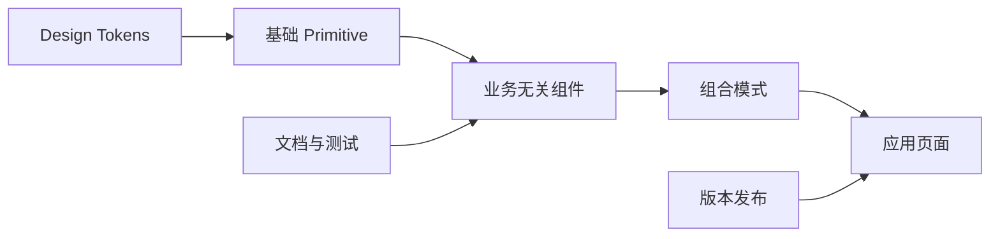

# 组件库与设计系统工程

两个页面都有蓝色按钮，但一个禁用后仍能触发点击，另一个加载时宽度变化。把相似 CSS 复制到各页面不等于设计系统；组件需要统一语义、状态、视觉 Token 和升级契约。

本篇从一个 Button 开始，定义输入、交互、可访问性和视觉状态，再说明主题、文档、消费测试与版本发布。重点是消费者能否稳定使用，不是组件数量。

## 设计系统包含哪些层



Token 表达颜色、字号、间距、边框和动效等受控决策；Primitive 提供布局与交互基础；组件定义公共 API；组合模式说明多个组件如何完成常见任务。页面仍拥有业务数据和流程。

## 步骤一：先写行为契约

Button 需要明确 `type` 默认值、disabled、loading、键盘焦点、图标与文本、事件何时触发。原生 `<button>` 已提供键盘和禁用语义，应优先复用，不用带 click 的 div 重新实现。

下面是最小 React API。输入是原生按钮属性与 loading，输出保持稳定尺寸和可访问状态。加载时阻止重复动作，并用 `aria-busy` 表示当前处理。

```tsx
type ButtonProps = React.ButtonHTMLAttributes<HTMLButtonElement> & {
  loading?: boolean
}

export function Button({
  loading = false,
  disabled,
  children,
  type = 'button',
  ...props
}: ButtonProps) {
  const unavailable = disabled || loading
  return (
    <button
      {...props}
      type={type}
      disabled={unavailable}
      aria-busy={loading || undefined}
      data-loading={loading || undefined}
    >
      <span className="button__label">{children}</span>
    </button>
  )
}
```

组件把原生属性继续传递，业务页面仍负责请求、错误和成功提示。加载图标可以用 CSS 或图标库叠放，预留固定空间，避免文字与宽度跳动。

## 步骤二：Token 表达决策，不表达页面偶然值

使用语义 Token，如 `color-action-primary`、`color-text-danger`，再映射到基础色阶。浅色和深色主题改变语义 Token 值，组件不写死某个蓝色。Token 还记录单位、用途、对比度和弃用关系。

并非所有 CSS 值都要 Token 化。只在需要跨组件一致、主题切换或集中演进时抽取。页面一次性布局尺寸留在页面层。

## 步骤三：文档展示正常与失败状态

组件文档包含基础用法、禁用、加载、长文本、图标、键盘和窄容器。交互示例使用真实事件，不只展示截图。API 文档来自类型与手写语义说明，避免运行代码和文档漂移。

测试分层：单元测试属性与事件，可访问性测试语义和键盘，视觉回归覆盖主题与状态，消费沙箱用打包后的真实包验证安装与类型。只在 Monorepo 源码别名下测试，可能漏掉 exports 和依赖声明。

## 步骤四：把发布当公共契约

组件包明确 ESM/CSS/类型入口、peerDependencies 与 sideEffects。每次发布生成不可变版本和 Changelog。移除 Prop、改变 DOM 结构、CSS 选择器、默认行为或 Token 都可能是破坏性变化，不只看 TypeScript 是否编译。

弃用先在文档和开发警告中出现，提供迁移方式，再在 major 版本移除。Codemod 适合机械迁移，交互语义仍需人工检查。

## 正常结果和失败结果

正常按钮可由键盘触发；disabled/loading 不触发重复请求；长文本换行而不溢出；深色主题保持对比度；打包消费者能导入类型和 CSS。若快照更新掩盖了焦点消失，视觉测试不能替代交互测试。

组件库应从高频稳定模式增长。业务流程高度特定时留在应用层，不把每张页面卡片都包装成“通用组件”。

## 从一个 Button 建立完整组件契约

先列 Button 的使用场景：主要/次要操作、图标按钮、加载、禁用和危险操作。API 说明哪些属性控制语义，哪些只是视觉；原生 `button` 类型、键盘行为、焦点和可访问名称不能被样式层抹掉。

| 状态 | 视觉与行为验收 |
| --- | --- |
| 默认/悬停/按下 | 层级清楚，不造成布局位移 |
| 键盘焦点 | 可见且对深浅主题都有对比 |
| 加载 | 尺寸稳定，避免重复提交，名称可理解 |
| 禁用 | 不触发动作，同时说明为何不可用 |
| 图标按钮 | 固定命中区域，提供可访问名称和提示 |
| 长文本/中文 | 375px 下不溢出或遮挡相邻内容 |

Token 先表达品牌色、文字、间距、圆角、状态和动效决策，再映射到组件。不要把某个页面的 `margin-left: 13px` 直接升级为全局 Token。组件文档展示真实组合和边界状态，视觉回归覆盖深色、缩放、长文本和不同语言。

发布时使用语义化版本与变更说明。删除属性、改变默认语义或 DOM 结构可能是破坏性变化；颜色微调也要经过可访问性与视觉回归。让一个真实业务页面只依赖公开 API 使用 Button，能在升级后通过测试，才说明设计系统契约有效。

## 参考资料

- [WAI-ARIA Authoring Practices](https://www.w3.org/WAI/ARIA/apg/)
- [Design Tokens Community Group](https://www.designtokens.org/)
- [Storybook](https://storybook.js.org/docs)
- [Semantic Versioning](https://semver.org/)
