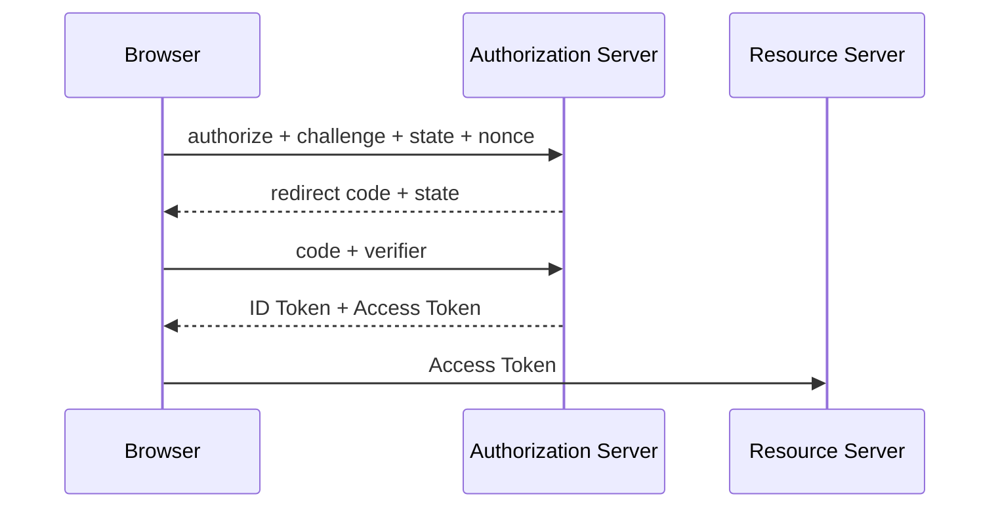

# SSO、OAuth 2.0、OIDC、PKCE 与 Token 生命周期

OAuth 2.0 是委托授权框架，OIDC 在其上增加身份认证层，SSO 描述一次登录访问多个系统的体验，PKCE 为授权码交换增加客户端证明。它们位于浏览器、身份提供商和业务 API 的认证链上，分别处理授权、身份、登录体验和授权码窃取风险。把四者都叫“单点登录协议”，容易把 Access Token 当用户资料，或把 ID Token 发给业务 API。

## Authorization Code + PKCE

SPA 生成高熵 code_verifier，计算 challenge，并保存 state、nonce 与原始导航意图。浏览器跳转授权端；回调收到一次性 code 后先核对 state，再用 code+verifier 换 Token。攻击者只截获 code，没有 verifier 也难以兑换。



state 关联发起与回调并抵御登录 CSRF，nonce 绑定 OIDC ID Token 防重放，PKCE 绑定 code 兑换者。三者职责不同。

## Token 分工与存储

ID Token 面向客户端，声明认证结果和用户身份；Access Token 面向资源服务，scope/audience 决定可访问资源；Refresh Token 用于续期，风险更高。前端不应解析 Token 后自行决定服务端权限，API 必须验证签名、issuer、audience、时间和 scope。

浏览器存储选择取决于架构。内存减少持久暴露但刷新丢失；HttpOnly Secure SameSite Cookie 防 JS 读取但要处理 CSRF；localStorage 暴露给同源 XSS。BFF 可以让浏览器只持会话 Cookie，由服务端管理 Token。

## 刷新、并发与登出

多个请求同时遇到过期，只允许一个 refresh，其他等待同一 Promise；刷新失败统一进入匿名状态，避免无限 401 循环。轮换 Refresh Token 要原子替换并识别重放。

多标签页用 BroadcastChannel 等同步“已登出”事件，但消息不携带 Token。登出包括本地状态、会话 Cookie、授权端会话和可能的撤销，能力取决于部署。

## 验证

测试 state/nonce 错误、code 重放、回调刷新、并发 401、时钟偏差、第三方 Cookie 受限和开放重定向。日志过滤 code、Token 和 verifier。

认证流程需要明确各参与者、每种 Token 的 Audience、PKCE 与 State 的不同职责，以及 SSO 如何复用认证服务会话。

## Authorization Code + PKCE 的状态机

SPA 生成高熵 `code_verifier`，计算 `S256` 得 `code_challenge`，保存 verifier 与一次性 state/nonce 的关联；授权请求只携带 challenge、client_id、redirect_uri、scope 和 state。回调先验证 state，再把 code + verifier 通过 TLS 发送 Token Endpoint。授权服务器验证 challenge 后返回 Access Token，OIDC 场景同时返回并校验 ID Token 的签名、issuer、audience、nonce 和时间。

```text
Browser -> Authorization Server: code_challenge + state + nonce
AS -> Browser: redirect(code, state)
Browser -> Client/Token Endpoint: code + code_verifier
AS -> Client: access_token (+ id_token, refresh_token policy)
Client -> API: Authorization: Bearer access token
```

PKCE 证明“拿到 code 的人是否拥有启动请求的 verifier”，不能阻止 CSRF，因此仍需 state；OIDC nonce 防止 ID Token 被重放到另一登录请求。Access Token 的 audience 是 API，ID Token 是给 Client 的身份声明，不能拿 ID Token 调业务 API。

刷新采用单飞锁、token rotation 和重放检测；浏览器存储选型要按 XSS、CSRF、跨站策略和部署边界评估。HttpOnly Cookie 减少脚本读取却需要 SameSite/CSRF 防护，内存 token 减少持久化但刷新会丢状态；不存在脱离威胁模型的“最安全存储”。

## 官方依据

- [RFC 7636: PKCE](https://www.rfc-editor.org/rfc/rfc7636)
- [OAuth 2.0 Security BCP](https://www.rfc-editor.org/rfc/rfc9700)
- [OpenID Connect Core](https://openid.net/specs/openid-connect-core-1_0.html)

## 迁移复核：SSO、OAuth 2.0、OIDC、PKCE 与 Token 生命周期
把这套机制迁移到真实前端时，先确认它运行在哪一层：浏览器解析与调度、框架渲染、构建工具、网络协议或应用状态。相邻层可以互相影响，却不能用框架术语替代浏览器事实，也不能用一次视觉正确推断生命周期和资源已经正确释放。

验证同时覆盖首次加载、更新、卸载或离开页面、错误恢复和低性能设备。交互组件保留键盘路径、焦点、可访问名称与响应式边界；异步逻辑检查取消、竞态和迟到结果；构建结果检查产物图、缓存和 Source Map。

性能优化先用 Performance、Network、Memory 或框架 Profiler 找到时间和资源归属，再改变代码。示例中的阈值、设备与数据规模只用于解释机制，项目结论需要在目标浏览器和真实产物上复测。
