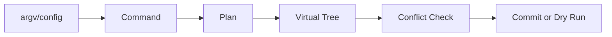

# 前端 CLI、脚手架与插件系统设计

前端 CLI 把命令行参数转换成项目操作，脚手架根据输入生成或更新目录，插件为核心流程增加可发现的步骤。这一层介于开发者意图与文件系统变更之间，把重复工程动作变成可预览、可回滚、可诊断的计划，而不是直接拼接字符串写入项目。

脚手架第一次生成很容易，难的是第二次运行不重复写配置、升级不覆盖用户代码、插件冲突可诊断。可靠 CLI 把参数解析、计划、文件变更和提交分阶段，并支持 dry-run。

## 安装 Node.js 并运行第一个 CLI

Node.js 的官方下载入口是[官方下载页](https://nodejs.org/en/download)。选择维护中的 LTS 版本后，重新打开终端确认 `node` 和 `npm` 来自同一个安装目录。

<figure class="doc-shot">
  
  <figcaption>Node.js 官方下载页。脚手架会执行文件和依赖操作，先固定 Node 主版本，再测试模板的安装脚本。</figcaption>
</figure>

```bash
node --version
npm --version
npm init -y
```

前三条命令只准备运行环境和一个空 Manifest。它们不能证明脚手架的模板、插件和构建产物可用，后面仍要在临时目录执行两次生成并比较 diff。
## 从命令到变更计划

命令层解析 argv、交互输入和配置，转成与终端无关的 Command。规划器读取目标目录和模板，构造虚拟文件树；插件只操作虚拟树和结构化 Manifest；最后统一展示 diff、处理冲突并原子写入。



直接字符串替换 package.json 容易破坏格式和已有字段，应解析结构化数据；修改 TypeScript/JS 入口优先 AST 或明确锚点。找不到锚点就失败并给人工步骤，不能猜位置覆盖。
## 插件契约

插件声明名称、版本兼容、依赖能力和 apply(context)。Context 提供受限文件 API、日志和配置，不暴露随意进程全局。钩子顺序和冲突策略稳定，插件失败时不写半成品。

远程模板需固定版本和校验，不执行不可信 postinstall。Secrets 不进入模板和日志。CLI 更新检查不应阻塞主命令。
## 幂等和升级

重复执行相同命令，第二次计划应为空。新增依赖先检查现有范围，注册路由先检查语义节点。升级需要知道哪些文件由工具拥有、哪些已被用户修改；可用基线哈希做三方合并，冲突时保留用户内容。
## 测试

单测规划函数，fixture 测不同已有目录，快照只保存结构化 diff；集成测试在临时目录运行两次并执行生成项目的 typecheck/build。模拟中断确认原目录不留半写文件。

工程化脚手架还要处理虚拟树、幂等、插件隔离、冲突、升级和供应链。下载模板与替换变量只覆盖首次生成。
## 从参数到磁盘的状态机

一个可靠 CLI 先把命令行解析成不可变 Options，再加载插件并生成虚拟文件树，执行冲突计划，用户确认后才写磁盘。每个文件操作要有 `create/overwrite/skip/merge` 结果，写入采用临时文件 + rename，避免进程中断留下半文件。dry-run 与真实执行共享同一计划生成器，防止预览和实际结果分叉。

```text
argv -> normalized options -> plugin hooks -> virtual files
     -> conflict diff / prompt -> transactional writes
     -> format/lint/typecheck/build -> machine-readable summary
```

插件 API 需要明确执行顺序、可修改的上下文、错误隔离和权限。模板插件不应任意读取用户目录；网络下载、执行脚本和安装依赖要显式开关并记录来源。插件版本升级时，对上下文 schema 做兼容校验，未知字段不能静默改变生成结果。

把“模板基线、上一次生成快照、当前用户文件”作为三方输入。用户未改动的区域可安全应用升级；双方都改动的区域生成 diff 并停止等待选择。仅靠字符串 replace 或覆盖整个文件会摧毁业务改动，AST/codemod 也必须限制节点范围并保留格式化结果。
## 官方依据

- [npm init / create conventions](https://docs.npmjs.com/cli/v10/commands/npm-init)
- [Yeoman Composability](https://yeoman.io/authoring/composability)
- [Node.js fs promises](https://nodejs.org/api/fs.html#promises-api)
