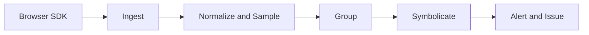

# 前端观测平台：错误、性能、行为与 Release

`app.83ad.js:1:4217` 无法直接定位源码。观测链要在浏览器采集错误和上下文，服务端校验、采样和聚合，再用与 Release 完全匹配的 Source Map 还原堆栈，最终形成可行动告警。

## 采集边界

同步异常来自 error 事件，Promise rejection 来自 unhandledrejection，资源加载错误需要捕获阶段，框架错误通过框架边界接入。Network、Web Vitals 和自定义 Span 补充性能，但不能无上限记录所有请求内容。

事件包含 release、route、environment、浏览器、trace/request ID、规范化 stack 和受控 breadcrumbs。输入、Token、URL query 和响应体先过滤敏感数据。

## 上报与缓冲

SDK 对相同瞬时事件去重，按类型和会话采样，批量上报并限制队列。页面隐藏时可用 sendBeacon 或 keepalive fetch 发送小批量；失败不能无限重试占用用户网络。

服务端对 payload 做 Schema、大小、速率和租户校验。客户端采样率可被篡改，服务端仍要保护入口。

## 分组和 Source Map

错误分组可基于异常类型、规范化 stack frame 和自定义 fingerprint。过粗会把不同根因合并，过细会造成告警风暴。Source Map 与 minified asset、release、dist 必须一一对应，上传成功后可不公开部署 map。



## 告警与闭环

告警按新错误、影响会话、回归和错误预算，而不是每事件通知。Issue 关联首次/最近版本、影响路由和 owner；修复后在候选 release 验证，再观察生产回归。

## 实验

在测试制品故意抛出同步、Promise、资源和框架错误，验证四条入口、采样、breadcrumbs、Source Map 和 release。重复触发检查分组，修改函数位置验证新版本不会错误复用旧 map。

面试追问自建监控时，应覆盖 SDK、协议、采样、聚合、符号化、告警、隐私和成本，不能只写 window.onerror。

## 事件数据的所有权和顺序

SDK 捕获 error、unhandledrejection、resource、navigation、long task 和自定义 breadcrumb，先在浏览器内做去敏、采样和批量队列，再通过 `sendBeacon`/`fetch keepalive` 发送。每条事件带 release、environment、route、session/correlation ID；服务端按事件类型验证 schema、限速、去重并聚合。

```text
capture -> normalize/redact -> sampling -> local queue
  -> transport retry/backoff -> ingest schema -> group/dedup
  -> Source Map symbolication -> issue/metric/alert
```

采样不能只按随机比例丢弃高价值错误；可对新 release、未知 stack、影响支付路径提高保留。重试要有上限和队列容量，离线持久化还要考虑多标签页竞争、敏感数据残留和退出清理。

Source Map 符号化必须绑定 release、文件路径和 artifact hash；相同函数不同版本不能共用 map。RUM 指标要保留 sample、设备和网络维度，避免平均数掩盖 P75/P95 退化。告警关联错误、性能和业务指标，修复后用同一 release 证据关闭。

## 官方依据

- [Sentry JavaScript SDK](https://docs.sentry.io/platforms/javascript/)
- [Source Map specification](https://tc39.es/ecma426/)
- [PerformanceEventTiming](https://developer.mozilla.org/en-US/docs/Web/API/PerformanceEventTiming)
