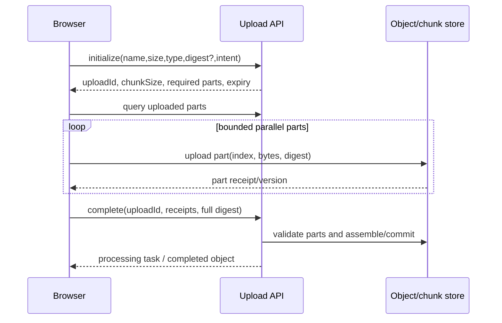
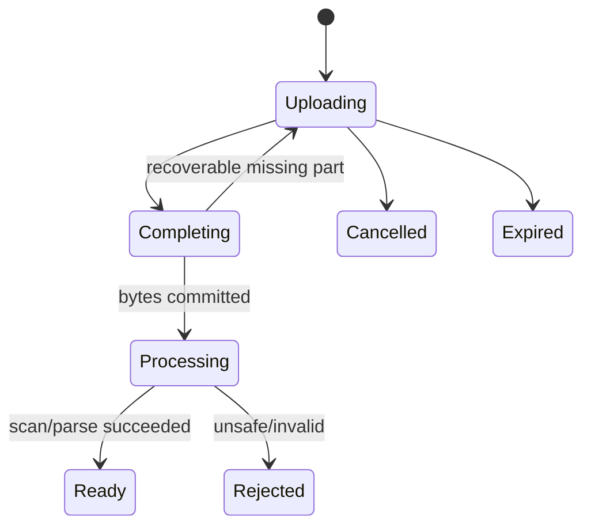

# 大文件校验、分片与断点续传

大文件上传不只是 `Blob.slice + Promise.all`。可靠协议需要服务端分配 uploadId、固定文件元数据和分片计划，每片幂等校验，客户端有界并发/暂停恢复，服务端原子完成并重新验证整体内容。客户端摘要可以识别候选，不是安全信任证明。

## 控制面和数据面



控制面做认证、配额、文件意图、状态、完成与取消；数据面可由应用接收或对象存储 Multipart/预签名直传。大规模优先直传，避免应用服务器转发全部字节，但预签名 URL 短期、单 upload/part、限制方法/大小/类型。

## 初始化固定上传会话

```ts
type InitializeUpload = {
  fileName: string
  size: number
  mediaType: string
  fullDigest?: { algorithm: 'sha-256'; value: string }
  idempotencyKey: string
}

type UploadSession = {
  uploadId: string
  state: 'uploading'
  chunkSize: number
  partCount: number
  expiresAt: string
  maxParallelParts: number
}
```

服务端规范化展示文件名，存储键由 uploadId/objectId 生成，不能用客户端文件名拼路径。校验总大小、part 数、媒体类型/业务配额；真实类型在完成后 sniff/安全扫描。

初始化幂等：同一主体/key/请求摘要复用 session；相同 key 不同文件返回冲突。uploadId 不可猜也仍需每次授权。

## 分片大小由协议协商

太小增加请求/元数据/签名开销；太大让失败重传、内存和移动网络代价高。服务端依据对象存储最小/最大 part、总大小和上限给 chunkSize。客户端不自行发送任意百万分片。

```ts
function createPartPlan(file: File, chunkSize: number) {
  const count = Math.ceil(file.size / chunkSize)
  return Array.from({ length: count }, (_, index) => {
    const start = index * chunkSize
    const end = Math.min(file.size, start + chunkSize)
    return { index, start, end, size: end - start }
  })
}
```

空文件单独协议，不用 `Math.max(1)` 假装有一片零字节；服务端明确是否允许。

## 哈希不要阻塞主线程或一次读全文件

Web Crypto `subtle.digest` 通常要求完整 ArrayBuffer，不适合直接超大文件增量。使用支持流式的成熟 WASM/JS 哈希库放 Web Worker，逐块 `file.slice().arrayBuffer()`，更新进度；或服务端/对象存储最终计算。

```ts
// main thread
hashWorker.postMessage({ type: 'START', file, chunkSize: 4 * 1024 * 1024 })
hashWorker.onmessage = event => updateHashProgress(event.data)
```

File/Blob 在现代浏览器可结构化克隆/共享底层实现，但仍要实测内存。Worker 每次只保留有限 chunk，支持取消。不要用 FileReader 递归同时为多个大文件无限计算，造成 CPU/内存争抢。

MD5 可做非对抗场景快速变化检测，但有碰撞风险；不能仅凭客户端 MD5 实现跨用户“秒传”或信任内容。完整性使用 SHA-256/对象存储校验，服务端在授权范围内查候选并验证元数据/内容所有权。跨用户全局摘要命中会泄露“服务器是否拥有某文件”。

## 分片幂等与完整性

每片身份由 uploadId + partIndex，服务端固定期望 offset/size。重复同内容返回原 receipt；同 index 不同 digest 返回 409，不能静默覆盖。

```ts
type PartReceipt = {
  uploadId: string
  partIndex: number
  size: number
  digest: string
  storageVersion: string
}
```

客户端提供摘要只能帮助早发现传输错误，服务端/存储根据收到字节验证。`Content-MD5`/checksum 能力以对象存储当前文档为准。不要只检查目录中文件数量等于 totalParts：需要每个索引、大小、摘要、无重复/越界。

## 有界并发、暂停与 Abort

```ts
async function uploadParts(
  parts: readonly Part[],
  concurrency: number,
  upload: (part: Part, signal: AbortSignal) => Promise<PartReceipt>,
  signal: AbortSignal
) {
  const results: PartReceipt[] = []
  let cursor = 0
  const workers = Array.from({ length: concurrency }, async () => {
    while (!signal.aborted) {
      const index = cursor++
      if (index >= parts.length) return
      results[index] = await upload(parts[index], signal)
    }
  })
  await Promise.all(workers)
  return results
}
```

真实实现 cursor 在 JS 单线程同步递增可分配唯一 index，但还需错误策略、重试队列和状态同步。并发上限不只看网络：浏览器连接、对象存储限制、内存、CPU 哈希和服务端配额。Network Information 只能作为提示且兼容有限，动态调整以观测吞吐/错误为准。

Pause 中止在途请求并保存已确认 receipt；取消调用服务端 abort，清理 multipart/临时块并进入取消终态。关闭页面前可保存 session 元数据，但 File 对象无法可靠永久保留，恢复时用户重新选择文件并校验 size/lastModified/digest 后继续；File System Access API 兼容/权限需单独处理。

## 重试分类

只重试网络、429、暂时 5xx；401 刷新凭证/重新初始化签名，403/配额/摘要冲突不盲重试。每片指数退避 + jitter，限制次数、总 deadline 和上传过期时间。完整响应丢失时先 query part status，不直接重复写新 index。

应用服务器/对象存储返回 Retry-After 时尊重但限制到 session expiry。多个文件共享全局并发预算，避免每个文件各开 6 路导致 60 个请求。

## 断点续传

查询接口返回服务端已验证 receipts/bitmap 和 session 元数据。客户端交集后只传缺失/不匹配片。不能信 localStorage 记录“已上传”，服务端事实优先。

```ts
const remaining = plan.filter(part => {
  const remote = uploadedParts.get(part.index)
  return !remote || remote.size !== part.size
})
```

若 chunkSize/文件摘要不匹配，拒绝继续并新建 session。session 过期后服务端清理临时数据；客户端显示需要重新开始，不无限保留。

## 完成是幂等状态转换

Complete 请求携带完整 receipt 列表/摘要。服务端原子将 uploading -> completing，另一个并发 complete 返回同一状态/结果。校验全部 part 后对象存储完成 multipart 或流式合并到候选对象，验证大小/整体 checksum，再原子发布 object record。



“字节上传完成”不一定业务 ready。病毒扫描、媒体解析、文档索引异步进行，前端展示 processing 并通过状态/SSE 获取最终结果。不能合并后立刻公开未扫描文件。

本地文件合并写临时候选，再 fsync/校验并原子 rename（同文件系统）；不要直接写最终路径，失败留下半文件。多实例不能依赖某个容器本地 temp，使用共享对象存储或任务路由/稳定存储。

## 前端状态模型与进度

```ts
type UploadState =
  | 'hashing' | 'initializing' | 'uploading' | 'paused'
  | 'recovering' | 'completing' | 'processing'
  | 'ready' | 'failed' | 'cancelled'
```

上传进度按确认字节汇总，在途 XHR/fetch progress 可用于视觉但失败回退；Fetch Upload Progress 支持情况需核对，XHR 仍常用于细粒度上传进度。哈希、上传、服务端处理分阶段，不能 100% 上传就显示处理完成。

UI 批量节流进度更新，取消/暂停按钮跟状态可用；错误显示可行动分类，不显示内部路径/对象 key。多文件使用队列、全局并发和每文件独立状态。

## 安全与资源治理

- 文件名只展示并转义，存储键服务端生成；
- 限制总大小、part/并发、session/主体、速率和过期；
- sniff 实际 MIME，安全扫描/隔离，禁止直接执行/公开；
- 解包另有 zip bomb/path traversal 限制；
- 下载使用授权对象 ID/短期 URL，不公开临时 part；
- 日志不记录文件内容、预签名 URL、真实路径和敏感文件名；
- 跨租户摘要去重不泄露存在性，引用授权独立；
- 临时数据按 session 精确清理，监控 orphan/存储水位。

## 验证矩阵

| 场景 | 通过条件 |
| --- | --- |
| 最后一片小于 chunkSize | offset/size/整体正确 |
| part 重复相同内容 | 返回同 receipt |
| 同 index 不同内容 | 409，不覆盖 |
| 响应丢失 | query 后不重复产生新 part |
| 暂停/重新选文件 | 元数据/摘要匹配才继续 |
| complete 并发两次 | 单一对象/状态 |
| 合并中进程退出 | 候选恢复，无半公开对象 |
| 客户端伪造 hash/MIME | 服务端校验/扫描发现 |
| 跨用户相同摘要 | 不泄露存在性/权限 |
| session 过期/取消 | 临时 parts 最终清理 |

```ts
it('never marks an upload ready when a part digest differs', async () => {
  const session = await fixtures.uploadSession({ partCount: 3 })
  await fixtures.uploadValidParts(session, [0, 1])
  await fixtures.uploadPart(session, 2, { claimedDigest: 'wrong', bytes: validBytes })
  await expect(api.complete(session.uploadId)).rejects.toMatchObject({ code: 'PART_DIGEST_MISMATCH' })
  expect((await api.status(session.uploadId)).state).toBe('uploading')
})
```

浏览器 E2E 用合成文件、网络断开/限速/页面刷新；服务端故障注入 merge/存储 timeout。检查内存不随文件大小线性爆炸、并发有界、临时残留为零。

## 常见误区

- 客户端自由决定任意 chunkSize/part 数。
- 一次读取整个大文件计算 hash，阻塞/耗尽内存。
- MD5 被当作安全内容身份和跨用户秒传授权。
- 检查临时目录文件数量就认为所有分片正确。
- Promise.all 上传所有分片/文件，无全局并发。
- 只保存本地已上传列表，不查询服务端。
- 上传 100% 被当作业务处理完成。
- 合并直接写最终路径，失败留下半文件。
- 文件名拼路径、返回真实存储路径/预签名 URL到日志。
- 取消只 abort 浏览器请求，不清理服务端 multipart。

## 源码与规范

- [File API](https://w3c.github.io/FileAPI/)：Blob、File、slice 和读取语义。
- [Streams Standard](https://streams.spec.whatwg.org/)：ReadableStream、背压与管道。
- [tus Resumable Upload Protocol](https://tus.io/protocols/resumable-upload)：Offset、恢复、Checksum 和终止扩展。
- [OWASP File Upload Cheat Sheet](https://cheatsheetseries.owasp.org/cheatsheets/File_Upload_Cheat_Sheet.html)：文件验证、存储隔离和资源限制。
- 个人实验材料已匿名化；本文只抽取通用机制，不建立项目映射。
